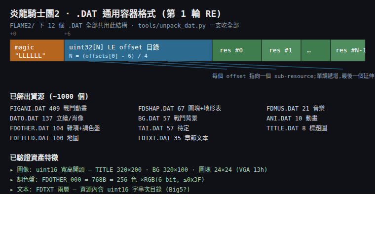
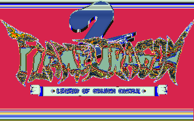
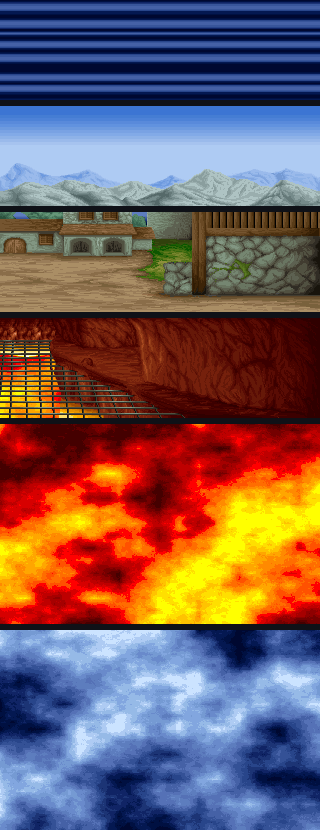
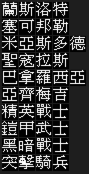
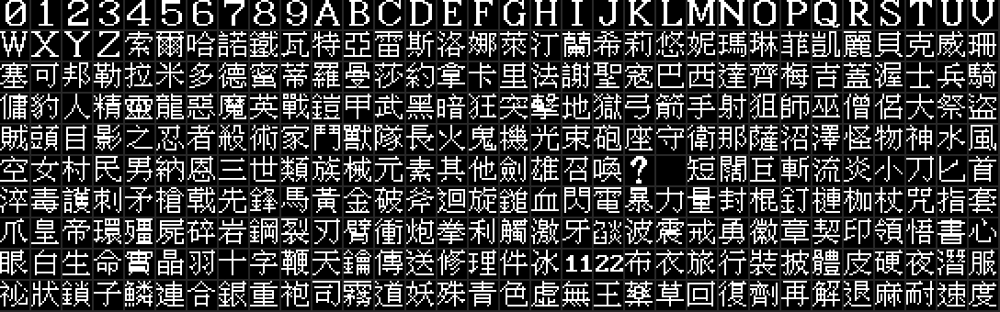
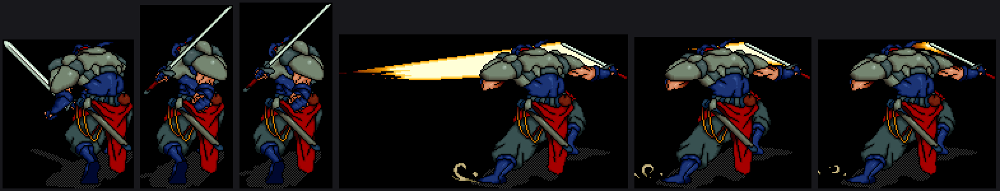
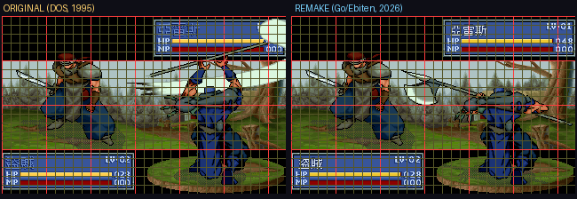
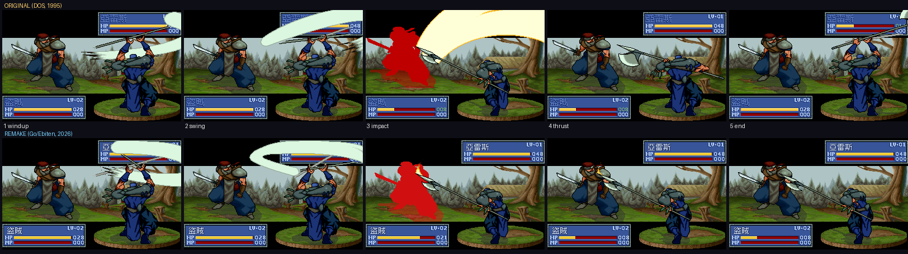
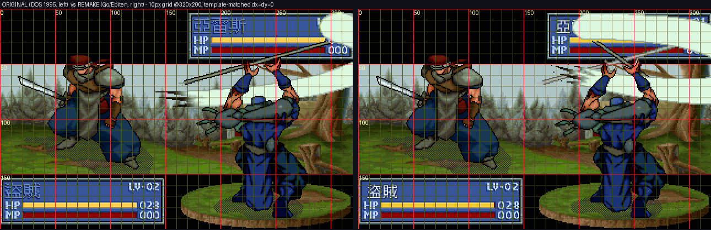

# 炎龍騎士團2 逆向工程與重製 · fd2_re

> 把 1995 年漢堂國際的經典戰棋 RPG《炎龍騎士團2》(Flame Dragon Knight 2) 徹底逆向，
> 用第一性原理還原規則與素材，並以兩套現代技術重製成可在**網頁與手機**上重新遊玩的版本。

這是一個**乾淨重寫**的逆向工程專案：以原版 DOS 程式作為「行為真值 oracle」抽取演算法、
破解原版資料格式，再手寫可公開、可維護、易中文化的引擎。原版程式與素材受著作權保護，
**不包含在本倉庫中**，玩家須自備合法原版。

## 為什麼這個專案值得做

《炎龍騎士團2》是 1990 年代華文單機 SRPG 的代表作之一，但只有 DOS 版、且**沒有 DOSBox debugger 級別的逆向資料**留存。
本專案從零開始，把它的封裝、資產、數值與規則一塊塊還原成公開知識，並重建成跨平台可玩版本。

## 第 1 輪成果：`.DAT` 容器格式全破

漢堂把幾乎所有資產打包成同一種極簡歸檔容器。第 1 輪即破解並驗證此格式，
寫成一支**通吃全部 12 個 `.DAT`** 的解包器，解出約 1000 個資源：



關鍵的已驗證發現：

| 項目 | 發現 |
|---|---|
| 容器 | `LLLLLL` magic + uint32 LE offset 目錄，`N = (offsets[0]-6)/4` |
| 圖像 | uint16 寬高開頭 — 標題 320×200、戰鬥背景 320×100、圖塊 24×24(VGA mode 13h) |
| 調色盤 | `FDOTHER` 第 0 資源 = 768B = 256 色 ×RGB(6-bit) |
| 文本 | `FDTXT` 兩層結構，資源內含 uint16 字串次目錄(中文化核心) |
| 地形 | `FDSHAP@0x2422E` 300 格 ×4B，與青衫攻略 modify2 **交叉吻合** ✓ |

```bash
# 解包任一 .DAT(需自備原版)
python3 tools/unpack_dat.py --list  FLAME2/TITLE.DAT
python3 tools/unpack_dat.py --all   FLAME2/  extracted/
```

## 第 2 輪成果：圖像 / 音樂 / 數值 / 工具考證

**圖像壓縮全破** — 還原出遊戲標題畫面與所有戰鬥背景：





- **RLE 壓縮**破解(`c≥0x80` literal / `c<0x80` run)+ VGA 256 色調色盤 → 約 125 張全幅圖可解。詳見 [`05-image-compression-format.md`](docs/knowledge-base/05-image-compression-format.md)。
- **音樂**確認為 Miles AIL 的 **XMIDI**，寫 `tools/xmi2mid.py` 轉出 15 首標準 MIDI(音符平衡、tempo 保留)。詳見 [`07-music-xmidi-format.md`](docs/knowledge-base/07-music-xmidi-format.md)。
- **EXE 數值表**全部 dump 並對攻略自驗通過(物品 215 / 法術 36 / 敵我單位 68 / 升級成長…)，連攻略原本缺的法術數值編號都還原了。見 [`docs/data/exe_tables/`](docs/data/exe_tables/)。

## 第 3 輪成果：文本與中文字型全破

DOS 原生不顯示中文。當年漢堂的做法是**自帶一套點陣字型 + 用內部索引存文本**。第 3 輪把兩者都還原了：



- **文本格式**：FDTXT 是 uint16 字模索引序列(非 Big5)+ 控制碼 + `0xFFFF` 結尾，共 1016 條字串、約 5.8 萬字。
- **自製字型**：`FDOTHER` 資源 #4 = 1824 個 **16×16 1bpp** 字模；索引 0–35 是數字英文，其後為漢字。
- 把兩者一對映，原版畫面文字即完整還原成可讀繁體中文。詳見 [`08-text-and-font-format.md`](docs/knowledge-base/08-text-and-font-format.md)。



## 戰鬥動畫 codec 全破：2118 幀逐幀還原

全專案最硬的一關。原版自製動畫工具 **AFM（作者 Lo Yuan Tsung, 1993）** 的戰鬥動畫，
用一套 4 模式 sprite RLE 壓縮。經 capstone 反組譯 `FD2.EXE` 的解碼器（`0x4F43D`）、
解出每幀 13-byte 標頭、再以垂直相關分析校正真實寬度，**完整還原**：



`FIGANI.DAT` 共 **264 個動畫、2118 幀全部可解**。工具 `tools/decode_figani.py` 可輸出 PNG 序列或 GIF。
codec 與破解歷程見 [`06-animation-format.md`](docs/knowledge-base/06-animation-format.md)。

### 為台灣留一份技術紀念

逆向過程中，在動畫資料裡找到當年漢堂程式設計師自製工具的署名：

> **AFM — Animation File Manager Version 1.00　Copyright (C) 1993 Lo Yuan Tsung**

我們把破解出的每一項技術都整理成保存品質的文件，記錄 1995 年台灣團隊怎麼做一款 DOS 遊戲：
[開發工具考證](docs/knowledge-base/04-original-toolchain.md)、[圖像壓縮](docs/knowledge-base/05-image-compression-format.md)、[動畫機制](docs/knowledge-base/06-animation-format.md)、[音樂格式](docs/knowledge-base/07-music-xmidi-format.md)。

## 📖 總覽:1995 年怎麼做出這款遊戲

想一次看懂當年的全貌,先讀這篇:[**`15` 1995 年,他們怎麼做出《炎龍騎士團2》**](docs/knowledge-base/15-how-fd2-was-made-1995.md)
——把工具鏈、資料架構、畫面/動畫/音樂/中文/規則/AI 綜合成一支台灣團隊在 DOS 上做戰棋 RPG 的完整紀錄。

## 知識庫總索引

逆向發現逐輪累積在 [`docs/knowledge-base/`](docs/knowledge-base/)，每輪同步更新、錯誤知識即時修正。
`04`–`11` 同時是「1995 年台灣怎麼做遊戲」的技術保存紀錄。

**資產格式**
- [`01` 容器與資產格式](docs/knowledge-base/01-container-and-asset-formats.md) — `.DAT` 容器、圖像/調色盤/地形
- [`05` 圖像 RLE 壓縮](docs/knowledge-base/05-image-compression-format.md) — 壓縮演算法完整規格
- [`06` 動畫機制(AFM)](docs/knowledge-base/06-animation-format.md) — sprite RLE codec、2118 幀逐幀還原
- [`07` 音樂 XMIDI](docs/knowledge-base/07-music-xmidi-format.md) — Miles AIL、轉標準 MIDI
- [`08` 文本與自製中文字型](docs/knowledge-base/08-text-and-font-format.md) — 字模索引 + 16×16 字型

**遊戲邏輯 / 機制**
- [`03` EXE 資料表與資料結構](docs/knowledge-base/03-exe-and-data-structures.md) — 數值表 offset、單位/物品/法術/地圖結構
- [`09` 劇情與對話](docs/knowledge-base/09-story-and-dialogue.md) — 對話結構、說話者、抽取方法
- [`10` Sprite 繪製:敵/我方與狀態](docs/knowledge-base/10-sprite-rendering-camp-and-state.md) — 陣營著色、解碼器變體、面向
- [`11` 戰場 AI:敵人/NPC 行動決策](docs/knowledge-base/11-enemy-ai.md) — 目標評分、移動、地形評估
- [`12` 音樂播放與場景切換](docs/knowledge-base/12-music-playback-and-scene.md) — Miles AIL、XMIDI 序列、換曲流程
- [`13` 戰場選單與行動系統](docs/knowledge-base/13-battle-menu-system.md) — 行動狀態機、選單游標、Get_EasyMagic
- [`14` 文本控制碼與對話框機制](docs/knowledge-base/14-text-control-codes.md) — 開框/頭像/換行/翻頁、文字渲染器
- [`16` 音色合成:SoundFont/MT-32/版本切換](docs/knowledge-base/16-audio-synthesis-soundfont-mt32.md) — 什麼是 SoundFont、MDI 驅動、MT-32 渲染(已實證)
- [`17` 擴充劇本/玩法可行性評估](docs/knowledge-base/17-scenario-expansion-evaluation.md) — 加戰場/對話/商店/新機制怎麼做
- [`18` 字型現代化規劃:UTF-8 + TTF](docs/knowledge-base/18-font-modernization-utf8-ttf-plan.md) — 重製改用 TTF 渲染的計畫
- [`19` 劇本/關卡腳本系統設計](docs/knowledge-base/19-scenario-script-system-design.md) — 可分支節點圖、敗北路線、自創戰場(`docs/data/campaign_sample.json`)
- [`20` 第一性原理:重製可行性確認](docs/knowledge-base/20-first-principles-feasibility.md) ・ [`21` Go/Ebiten 重製架構](docs/knowledge-base/21-go-ebiten-remake-plan.md) ・ [`22` 重製技術驗證](docs/knowledge-base/22-remake-tech-validation.md)

**引擎控制流 / 深度反組譯(第 5–7 輪)**
- [`23` 開機/標題動畫/主選單/劇情自動過場](docs/knowledge-base/23-boot-title-and-scenario-flow.md) — 頂層狀態機(真 main 0x25bf4、`[0x53c03]` 章節驅動)+ 解圖驗證標題立繪捲動與 FLAME DRAGON logo
- [`24` Call-graph 逐步反組譯紀錄](docs/knowledge-base/24-callgraph-analysis-log.md) — 遞迴可達反組譯釘死 cutscene→戰場鏈、`[0x53ecc]` 戰役迴圈狀態機,排除線性 sweep 偽命中
- [`31` 地圖單位 sprite(FDICON Q版小人)](docs/knowledge-base/31-map-unit-sprites-fdicon.md) — 1680×24×24 待機動畫;與 FIGANI 戰鬥全身分工
- [`25` 戰場事件系統](docs/knowledge-base/25-battle-event-system.md) — 三張章節跳表(`0x51b19`/`0x51d71`/`0x51de9`)+ 事件原語;FD2 事件是每章硬編碼 handler(非 byte-code VM)

**參考 / 規劃**
- [`00` 索引與標註慣例](docs/knowledge-base/00-index.md) ・ [`02` 裝備/法術/人物/公式(攻略)](docs/knowledge-base/02-game-data-reference.md)
- [`04` 當年開發工具考證](docs/knowledge-base/04-original-toolchain.md) ・ [`90` 逆向與重製計畫](docs/knowledge-base/90-re-plan.md)
- [`91` Worklist](docs/knowledge-base/91-worklist.md) ・ [`99` 逐輪反思日誌](docs/knowledge-base/99-reflections-log.md)

## 🎮 重製已開工(Go/Ebiten,桌面/Web/手機)

[`remake/`](remake/) 是 Go/Ebiten 重製。**開場動畫 → 主選單 → 全 30 章戰役已一條龍可跑**,
全部對照**原版實機(dosbox)+ 青衫攻略 + 反組譯**還原,不憑空:

- **開場動畫**:33 秒多幕過場(守護者→屠龍→騎馬夜行→標題 logo)由**反組譯出的 AFM 動畫 VM**
  執行期解碼玩家自己的 `ANI.DAT` 播出(見下節);主選單 START/LOAD/CONTINUE。
- **全 30 章戰役**:節點圖驅動(戰鬥/劇情/選擇/商店/結局 + 旗標 + 敗北路線);隊伍**隨劇情招募成長**
  (序章 4 人 → 終章 30 人);**回合增援**按原版事件表登場(反組譯 58-entry 跳表 `0x51b91`)。
- **事件進場**:主角隊從戰場邊緣**行軍進場**;增援各按回合登場 —— 資料來自反組譯 FDFIELD
  `turn_events`(原版事件腳本竟在資料而非 EXE,見 [`25`](docs/knowledge-base/25-battle-event-system.md))。
- **對話系統**:TTF 中文台詞 + DATO 大頭像 + **嘴型開合**(反組譯 `0x16d00` 狀態機,[`14`](docs/knowledge-base/14-text-control-codes.md))+ 全形『』;**全 33 章劇情文本 1452 句**逐句轉錄。
- **戰棋核心**:flood-fill 移動 + **地形移動成本**(反組譯 FDSHAP 地形表)、攻擊結算(青衫公式)、
  評分式敵方 AI、**魔法系統**(AoE / buff / 毒麻封咒)、勝負判定。
- **玩法系統**:radial 指令環、商店(含祕密商店)、存讀檔(F5/F9)、BGM + 音效(反組譯自 FDOTHER)。
- **音源可切換**(F2):**Roland MT-32**(真 ROM 經 munt 渲染)⇄ **Sound Blaster / AdLib FM**
  (遊戲自帶 `SAMPLE.AD` 音色庫經 OPL 渲染)——還原原版 `SETSOUND` 選音效卡的體驗,見下節。

可行性 [`20`](docs/knowledge-base/20-first-principles-feasibility.md)、架構 [`21`](docs/knowledge-base/21-go-ebiten-remake-plan.md)。(WASM 也可編譯。)

### 🎬 開場動畫:一個 1993 年的「繪圖位元組碼 VM」

開場那段「氣勢磅礡」的過場,反組譯後發現不是逐幀點陣圖,而是漢堂自製動畫工具
**AFM(Animation File Manager v1.00,Lo Yuan Tsung 1993)** 的產物——本質是一台
**10-opcode 的增量繪圖虛擬機**:每一幀是一小段位元組碼腳本,對「上一幀殘留的畫面」做
疊加操作(整屏 RLE / 局部貼圖 / 調色盤更新),**不清空重畫**。這是那個年代用小體積驅動
大畫面的經典差分壓縮設計(96 幀的金鎖動畫僅約 1MB,而非 96×64000=6MB 的全幀陣列)。

```
每幀:  [compSize u16][cmdCount u16][保留×2]  後接 cmdCount 條指令
指令:  op 0-3 → 操作 768B 調色盤(填/載入/RLE/局部貼補)
        op 4-9 → 直寫 VGA 0xA0000(填/載入/RLE/單點/區段填/區段貼圖)
```

派發器 `0x36c9e` + 跳表 `0x5276a`;播放器 `0x020421(index, delayMs, skippable)`,
`delayMs` 是真毫秒(開機時 `0x3dc9f` 用 INT21h 量測機器速度做忙等校準)。289 幀
(9 個資源)逐位元組驗證無誤,已**移植成純 Go VM**([`internal/afm`](remake/internal/afm/))在
remake 執行期直接解玩家自備的 `ANI.DAT`——引擎本身不夾帶任何版權畫格。完整格式與位址見
[`39` AFM 動畫 VM](docs/knowledge-base/39-ani-afm-format.md)。

### 🎵 音樂:兩種音源、每首都溯源到呼叫點

原版音樂是 Miles AIL 的 XMIDI 序列,靠音效卡即時合成——**同一首曲子在不同音效卡上是不同聲音**。
本專案把「哪個場景播哪首曲」與「怎麼合成」兩件事都反組譯還原:

- **曲號溯源**:`play_bgm`(`0x25977`)全 32 處呼叫逐一反組譯,把「場景 → 曲號」釘死到呼叫點,
  不靠聽曲風猜:**標題曲**=track 18(boot 鏈唯一呼叫)、**戰鬥曲**=每章查表(`0x51e63`,主戰曲
  穿插特定章)、**城鎮/商店**=track 10。過程推翻了兩個憑印象的舊推定(見 [`12`](docs/knowledge-base/12-music-playback-and-scene.md))。
- **兩種音源、可即時切換(F2)**:
  - **Roland MT-32** —— XMI → MIDI → [munt](https://github.com/munt/munt)(真 Roland ROM 逐週期模擬)。音色圓潤、偏管弦。
  - **Sound Blaster / AdLib(FM)** —— 用遊戲**自帶的** `SAMPLE.AD` FM 音色庫:自寫
    [`gtl2wopl.py`](tools/gtl2wopl.py) 把 Miles AIL 音色庫轉成 WOPL,經 libADLMIDI(Nuked OPL3)渲染。
    這是原版**出廠預設**音效卡、多數玩家記憶中的聲音——量測上頻譜重心是 MT-32 版的 2.6 倍,更亮更有衝擊感。
- 兩套皆**玩家自備原版檔案在本機渲染**(ROM / 音色庫都不隨倉庫散布),引擎只提供管線與切換。

### ✨ 重製的核心增值:可擴展事件系統(不只是複刻)

原版每關事件是**編進 EXE 的 C 函式**(改一個事件就得改程式重編);我們把它反組譯出機制後,在 remake 做成
**開放的資料驅動事件系統** —— `trigger → when → do` 三層 DSL + 文本內嵌 **事件控制碼 `{{verb:args}}`**:

```
索爾:這座城就交給你們了…{{flag:set:city_handed}}
{{branch: "追上去" -> [spawn:hanno@10,4]   "留下防守" -> [spawn_wave:defenders]}}
```

→ 新增事件、分支劇情、自創戰役**只要寫資料,零引擎改動**;原版 30 關用同一套 DSL 忠實重現,同引擎也能跑
玩家自製戰役。完整設計見 [`29` 可擴展事件系統](docs/knowledge-base/29-remake-extensible-event-system.md)。這是 remake 相對原版「擺脫固定 33 路線」的關鍵。

### ⚔️ 戰鬥演出:像素級 1:1 還原(左原版 / 右重製,同步播放)



全螢幕攻擊演出(亞雷斯 vs 盜賊)對照原版逐幀還原。**動畫不是手調的**——反組譯出關鍵機制後,
整段演出由**原版資料驅動**:

- **每幀自帶絕對螢幕座標**:FIGANI 幀標頭 +0/+2 就是該幀的 (x,y)@320×200——旋轉蓄力、劈擊、
  突刺的「走位」全燒在資料裡,引擎每幀照著貼即可([`06`](docs/knowledge-base/06-animation-format.md))。
- **無 runtime 縮放 / 翻轉**:守方小、攻方大、朝向,全是美術畫進素材(blit `0x4e63d` 原生尺寸,[`35`](docs/knowledge-base/35-battle-animation-rendering.md))。
- **狀態欄 = 素材拼裝**:框(FDOTHER#5 LMI1 #22,codec `0x4e916` 破解)+ 數字 cell(#31-40)+
  血條逐欄填充;**框與數字經模板匹配驗證與原版像素全等(err=0)**。
- **命中閃紅 = VGA DAC 色盤操作**(`0x11d40`):重製以全紅剪影交替重現。
- **我方腳下台座 = TAI.DAT 獨立素材**(`0x29164` 載入;我方背影+台座 / 敵方正面的固定視角設計)。

五階段分鏡對照(蓄力 → 大弧 → 劈中 → 突刺 → 收勢):



網格量測驗證(10px 網格;figure / 台座 / 狀態欄以 sprite 模板匹配確認 dx=dy=0):



> 對齊方法論:**不用 debugger**(DOSBox vanilla 無法 dump)——以「已破解的解碼器 + 原版截圖」當
> oracle,用 sprite 模板匹配反推每個元素的精確落點,再回頭從反組譯確認機制(如幀內嵌座標)。

## 重製目標

| 技術棧 | 目標平台 | 狀態 | 參考專案 |
|---|---|---|---|
| **Go / Ebiten** | Web(WASM) / Android | **開發中**(全 30 章可跑) | 《魔法大帝》重製 |
| **SDL2 + C++** | 桌面(Linux/Windows/Mac) | 規劃中 | 精訊《勇者鬥惡龍三》重製 |

兩者共用同一份從原版還原的資料與規則。詳見 [`90-re-plan.md`](docs/knowledge-base/90-re-plan.md)。

## 逆向工具索引

全部在 [`tools/`](tools/),Python(走 docker uv/capstone,不污染系統)或 shell。資產輸出到本機 `extracted/`(不入庫)。

**解包 / 解碼(資產 → PNG/MIDI)**
| 工具 | 用途 |
|---|---|
| `unpack_dat.py` | 解 `.DAT` 的 LLLLLL 容器(`--list` / `--all`) |
| `decode_image.py` | 圖像 RLE 解碼(背景/標題圖) |
| `decode_figani.py` | 戰鬥動畫 sprite RLE(4-mode)逐幀解碼 |
| `decode_sprite.py` / `decode_dato.py` | sprite / DATO 人物頭像解碼 |
| `dump_remap.py` | FDOTHER#3 LMI1 陣營/狀態著色 LUT |
| `font_grid.py` | 自製字型 16×16 字模網格匯出 |

**反組譯(DOS4GW LE)**
| 工具 | 用途 |
|---|---|
| `disasm_le.py` | LE 反組譯(`dis`/`range`/`calls`/`refs`,標 fixup target) |
| `callgraph_le.py` | 遞迴可達 call-graph(`reach`/`callers`/`rpath`/`funcof`/`jtab`)— 釘 caller、解跳表 |
| `le_xref.py` | LE fixup 重定位 + 字串/資料 xref |
| `dump_exe_tables.py` | EXE 數值表 dump(單位/物品/法術/成長) |

**地圖 / 文本 / 音訊**
| 工具 | 用途 |
|---|---|
| `parse_field.py` / `extract_maps.py` / `render_map.py` | FDFIELD 三段解析、全戰場抽取與渲染 |
| `export_engine_assets.py` | 戰場 → 引擎資產(tileset.png + map.json) |
| `decode_text.py` / `encode_text.py` | 文本 glyph↔Unicode 解碼 / 回寫編碼 |
| `decode_story_text.py` / `render_story.py` | 全 35 章劇情解碼成 UTF-8 / 渲染 |
| `xmi2mid.py` / `export_mt32.sh` / `export_music_ogg.sh` | XMIDI→MIDI、MT-32 渲染、預錄 OGG |
| `extract_all.py` | 一鍵重生 `extracted/`(所有素材) |

## 倉庫結構

```
docs/knowledge-base/   逆向知識庫(00–25 逐輪累積 + 90/91/99 計畫)
docs/data/             結構化資料(glyph_map.json、campaign_sample.json…)
docs/figures/          圖解(SVG + PNG)
tools/                 逆向工具(見上「逆向工具索引」)
remake/                Go/Ebiten 重製(引擎碼入庫,資產不入庫)
references/README.md   青衫攻略致謝與連結(原文不轉載)
org_game/              原版本體與素材(.gitignore,不散布)
extracted/             抽取素材(.gitignore,由 tools/extract_all.py 重生)
```

## 致謝與版權

- 遊戲《炎龍騎士團2》著作權屬**漢堂國際**。本專案僅供研究、保存與技術重製，原版資產不散布。
- 攻略知識庫取材自圖文攻略作者**青衫**：<https://chiuinan.github.io/game/game/intro/ch/c31/fd2/>。
  本倉庫不轉載其原文與圖片，僅做結構化數值整理並標註出處。
