# 炎龍騎士團 2 反向工程與重製

本專案以合法原版《炎龍騎士團 2：黃金城傳說》作為行為基準，保存 DOS
程式的資料格式、介面與遊戲機制，並以 Go／Ebiten 建立可編輯、可擴充的
潔淨室重製引擎。《炎龍騎士團 2》是 1990 年代華文單機戰略角色扮演遊戲
（SRPG）的代表作之一；本專案也希望為 1995 年的台灣遊戲留下可重現的技術紀錄。

目前已有多個可操作、可比較的垂直切片，但**尚未達成 30 章原版等價通關**。
原版程式與美術、文字、音樂等受著作權保護的資產不包含在本倉庫中；使用者
必須自備合法原版。

## 目前進度

| 領域 | 已驗證成果 | 主要缺口 |
|---|---|---|
| 資產與格式 | `.DAT`、RLE 圖像、FDTXT／字型、AFM／FIGANI、XMIDI、地圖與部分 EXE 資料表可重現解析 | 部分執行期改寫、合成器與音訊播放尚未完整接入 |
| 反向工程 | 資產格式與多個底層原語已高度閉合；24 個標準戰後節點已全部接入正式執行期，戰鬥規則、敵方 AI、戰間服務、存檔與終局也都有具位址的窄切片 | 目前不能誠實換算成整支 EXE 百分比；已接入不等於已完成一般玩家 E2，完整指令／法術／物品交易與終局仍未閉合，詳見[反組譯覆蓋矩陣](docs/knowledge-base/58-fd2-exe-re-coverage.md) |
| Go／Ebiten 重製 | 地圖、對話與部分戰鬥可操作；城鎮、商店、教會、整備、自有 JSON 存檔及場景 BGM 已有窄切片；戰鬥曲與城鎮曲已有原版表格回歸；正式第30戰勝利路徑現以來源約束 E1 播放 `0x2BCE5` 前綴、原資源角色最終狀態蒙太奇、20 組尾段與 `FDOTHER#59` 終局定格，並可選擇循環回顧隊伍最終狀態 | 尚缺完整原版戰間流程、30 章一般玩家 E2、終局呼叫時 records／globals 連續性、精確音訊時序／原版輸入與跨平台驗收；原版3%外層預算會讀未初始化區域值，已列為非阻擋考古項目 |
| 原版視覺比對 | ch02 城鎮 variant0 六項、variant1 正常五項、variant2 正常五項（後兩者為修改 LOAD 路徑），以及部分商店、讀檔選單已有整幀 RGB 相同證據 | 尚無可靠的全介面百分比；祕密選項、一般玩家城鎮路徑、戰場、整備、教會與其餘章節仍需同狀態比較，詳見[介面證據矩陣](docs/knowledge-base/57-ui-evidence-matrix.md) |

### 距離完整重製還有多遠

> **評估快照：2026-08-25。** 本節依目前正式執行期、介面證據矩陣與一般玩家
> 驗證狀態整理；後續成果應以可重跑證據更新各門檻，不應只因新增反組譯筆記就
> 下修剩餘比例。

以「玩家能從標題正常開始，走完30戰、戰間服務、存讀檔與結局，且三平台可交付」
作為完成定義，目前屬於**中後段整合期，還不是發行候選版**。工程上的保守估計是：
目前約完成 **60–70%**，距離可稱為完整重製仍約有 **30–40% 的產品整合與驗收工作**。
這不是整支
`FD2.EXE` 的反組譯百分比，也不是畫面像素相似率；它只用下列玩家交付門檻估算。
換句話說，現階段已經不是只有技術展示，但也還不是發行候選版；剩餘工作的重心
改為完整戰鬥指令與敵方人工智慧、戰場介面差異、存讀檔窄切片及結局驗收，最後才
進入三平台打包與推廣影片製作。全戰役長程遊玩改由使用者人工進行並回報問題，
不再列為代理程式持續執行的工作項目。

這個估值不是依據已解出的位址數量，而是依據玩家交付門檻。截至本次快照，
最大的風險已不是「完全不知道原版在做什麼」，而是下列已知缺口尚未串成可驗收的完整遊戲：

- 戰場空游標系統選單已接資訊、離開、全軍移動與兩個途中事件。原生「保存目前戰況」會從合法 CONTINUE raw baseline 建立快照；動態增援不誤占 persistent slot，具已證實 constructor／identity 的新 JOIN 會同步完整 persistent raw。巢狀「讀取目前戰況」也會先建立完整私有候選，只在玩家確認後原子替換目前戰場，兩者均達窄 `RUNTIME-E1`；原版同狀態 E2 仍未完成。
- 戰鬥指令、法術、物品與敵方人工智慧已有多條正式 E1；敵方第4號指令現播放#22／#23效果與#85音效並逐Draw發布六段HP。敵方第0–8號也都依原版raw `+6` selector與選定目的格重建目標陣列，不再誤用玩家游標選擇器。敵方指令10–12、玩家與敵方17–22，以及玩家25–27／敵方26–27也都已接回各自索引演出。這些路徑依Draw邊界原子發布MP／HP或raw欄位／RNG／`Acted`，不再同步跳過畫面。`0x20C6F` 已恢復的正常正分物品type 5／13／20／21／24，現在連caller-specific索引演出也分別接回`0x211A4`、`0x1CD17`與`0x1CAC7`；複合指令32–35也已有專用尾段與原子交易。33張地圖的固定非玩家command mask全量稽核顯示，排除mode8後的正常producer都已有indexed owner；戰鬥主線剩餘差距是狀態高階名稱與代表性同狀態逐幀／音訊E2，而不是再猜接沒有產生端的ID。
- 原版終局蒙太奇與20組尾段已可在重製端播放並永久停留；Enter／Space 可選擇循環
  回顧隊伍最終狀態，Enter／Space／Escape 回到同一定格。三筆具原始位址的 BGM cue
  也已由資料接入正式終局；仍缺第30戰一般玩家 E2、原始狀態連續性、精確音訊時序
  與原版輸入證據。
- 戰場排版與動畫仍有玩家可見差異；尚需同狀態原版／重製擷圖。全戰役長程遊玩由使用者人工回報問題，不作為代理程式工作佇列。

相反地，已閉合的資產容器、字型／文字、多個戰後處理器與已有主證據的原語，
不應因為還沒有全程驗收就每輪從頭反組譯。後續只在新原始指令、同狀態執行矛盾或缺少宣稱已有的
writer／consumer 時重開。

| 完成門檻 | 自我評估 | 關閉前仍必須做到 |
|---|---|---|
| 戰鬥規則、玩家指令與敵方人工智慧 | 部分完成 | command 17–23、25–27玩家路徑與4、17–22、26–27敵方路徑已有 E1；敵方第4號使用原版#22／#23／#85與raw selector目標陣列。敵方25缺正常產生端，維持失敗即關閉。command0、23、24及受限class19玩家32–35也已有來源約束的正式交易。物品 type 5–24、狀態倒數與 indexed 到期提示已接；仍須補齊狀態高階名稱、精確音訊及代表性玩家／敵方路徑 |
| 戰場與戰間操作介面 | 部分完成 | 將目前集中在 ch02 的城鎮／商店證據擴到代表性早、中、晚章，補戰場、教會與整備主要路徑 |
| 隊伍持續與存讀檔 | 重製格式可用；原生相容部分完成 | 維持章節邊界與有效原版存檔的窄回歸；長程遊玩問題由使用者人工回報後建立重現案例 |
| 結局與音訊 | 重製端 E1 可達；終局定格與可選隊伍回顧已完成 | 關閉第30戰一般玩家 E2、終局 records／globals 連續性、精確音訊時序與原版輸入；不重現原版未初始化區域值所影響的3%偶發外層，不再重做定格或隊伍循環 |
| Linux／Windows／macOS 發行 | 尚未開始最終驗收 | 核心門檻關閉後才打包、做平台實機測試與推廣影片 |

因此，接下來不再以「多解一個位址」當成進度，而以每條
「原版證據→可編輯資料→正式執行期→介面→存檔→玩家測試」垂直鏈是否關閉來前進。
最新分層現況以[反組譯覆蓋矩陣](docs/knowledge-base/58-fd2-exe-re-coverage.md)為準，
實際優先順序以[有效工作佇列](docs/knowledge-base/91-worklist.md)為準。

工作清單中的完成項代表已驗證的函式、格式或切片，**不是遊戲完成百分比**。
資產解碼完成也不等於玩法、介面或戰役流程已完成。

目前最值得關注的三條垂直切片是：

- 戰役已能驗證多個「戰鬥→戰後→城鎮／整備→存讀檔」邊界；玩家第25戰已
  進一步串到 `town_ch26` 的章節專屬 Shift+F5 祕密商店與返回流程。玩家第23、
  24、29戰的正式戰後路徑均已完成重製端 E1；這些切片仍缺未修改原版的
  一般玩家 E2，不能外推成30章已完整通關。第25戰戰後18句對話另已按原始
  `FFED/FFEF/FFEE/FFFD/FFFE` 控制碼保留精確上／下框、斷行與分頁，並以
  原版 FDOTHER 框、DATO 頭像與16×16字模產生 indexed 穩定頁面，不再依角色
  編號或現代字型寬度猜版面；逐字、嘴型與開關框中間幀仍待補。
- 玩家第21戰的天空之鑰成功分支，已由固定雜湊 `FD2.EXE` 的
  `0x242C9→0x24336` 閉合到正式重製端：六素材配方後依序消費原版
  `FDOTHER #34`、`ANI #0` 與調色盤排程，再經 JOIN24／23 回到 `town_ch22`
  並完成存讀檔。相鄰 ACT63／64與一般玩家 E2 仍待補。
- 敵方人工智慧已有多個原始模式的窄執行期消費，原版一般玩家敵方回合也可重現；
  command 17–23與25–27現已由玩家指令格或物品目的地游標接到正式交易，17–22與26–27的敵方 raw selector 也已接入；
  正確保留 ID17 由 record18 扣 MP 的特殊邊界。玩家路徑另依 `0x1D6C8`
  播放 `FDOTHER #88` 子音效 0 與八個色盤閃爍階段，最後一幀完成繪製前不發布
  交易；command23另完整預建兩次 `0x22253`，依序呈現離場與目的地入場後才扣 MP。
  缺素材、色盤或原始記錄時維持失敗即關閉。仍缺同一 raw 狀態的原版／
  重製配對、效果到期 indexed 訊息／狀態介面及其他命令／法術／物品效果，故目前
  只列為 E1，不列為一般玩家 E2。
- 玩家複合指令32–35已新增受限class19正式indexed演出與交易。四者只接受原版已證實可達的
  BattleFig 4／5／6／7／20，並先在私有raw records完成全部目標後才發布；33清除
  `+0x25..+0x27`並以固定`0x320`回復HP，34依`0x22721→0x22866→0x22997`
  完成三段modifier，35依三次`0x22D1B`完成application。四者均已完成`0x27FC9`
  共用段、各自專用tail、音效與Draw邊界交易；score／EXP、敵方owner與一般玩家E2仍失敗即關閉。
- 戰場空游標系統選單現已接通原版巢狀四格的「戰場資訊」路徑：正式鍵盤操作會
  依原始 cells `36、39/41、42/44、45` 開啟內層選單，資訊畫面使用原版四個
  `FDOTHER #5` panel、兩行章節文字、六個數值欄位及 16 色調色盤循環，完整播放
  12 幀展開與 12 幀收合。巢狀「離開遊戲」也已依原版 FDTXT
  `0x19F/0x1A0/0x19C` 接上確認、停止音樂、約200毫秒等待、完整收合與正常程式
  終止；取消不改戰鬥狀態。「全軍移動」也已接到原版確認框、原始單位篩選、
  依序尋路與逐單位步行動畫。正式資料中兩個 selector1 格子事件也已接通：
  event61 會在行軍途中暫停，完成對話、59 幀演出、道具消耗與 JOIN31 後續行；
  event75 則在對話完成後才發布回合鏈。私有預演會模擬 event61 動態增加的 runtime
  records，新增角色仍接受同一 raw gate；缺少原始記錄、路徑、事件資產或遇到
  未具正式 owner 的事件時，會在關閉選單及改動任何單位前失敗即關閉。這些成果為
  來源約束的 `RUNTIME-E1`。巢狀 SAVE 另已保留四個 chapter slots 與未命名 bytes，
  只在 YES 後寫入明確的 `FD2_NATIVE_SAVE` 可寫複本；取消或來源不一致時原檔不變。
  目前戰況 LOAD 現會在私有 `Game` 完成全部 typed handoff，確認後才原子發布；
  動態增援／JOIN 後的 SAVE 也會區分非我方增援與可由 constructor 證實的新我方入隊，
  同步 persistent raw 而不改寫未知 bytes。兩者已達窄 `RUNTIME-E1`，尚待原版同狀態
  逐幀／音訊 E2。
- 玩家與敵方 mode 11 的 command 13–16 現會消費 FDOTHER #3 的原始 LUT，依 `0x21EB1` 的
  9 張擴張、200 ms 停格、7 張收束與 200 ms 尾停排程播放索引畫面演出；原始
  資產或畫面狀態不完整時不扣 MP、不改 HP。數字佇列及同狀態
  原版逐幀／逐音訊比較仍待完成。
- 戰場操作新增一條未修改原版的一般玩家錨點：由標題 CONTINUE 正常選到悠妮，
  確認原地移動後進入 command 0 目標模式。原版四個時間點證實範圍亮區是動態 LUT
  生命週期；重製也由一般鍵盤路徑抵達相同座標與指令 ID，並移除原版沒有的診斷
  短訊。原版側為窄 `PLAYER-E2`、重製側仍為 deterministic `RUNTIME-E1`；兩側時鐘
  相位未同步，不宣稱逐像素一致。正式游標確認後的 MP／HP／acted 與 modal 清理
  已由 Game 層回歸固定為 `RUNTIME-E1`。正式執行期現會先完整預建原版
  `0x2A6BD→0x29164→0x2B659→0x26152` 的索引場景，再依每次繪製確認逐步發布：
  九段角色滑入、施術者效果與 MP、FDOTHER #18／#20 的28幀／7元素錯開目標效果、
  七段 HP，以及 LUT 尾段；素材或 raw provenance 不完整時維持失敗即關閉，
  不會先扣 MP／HP。這關閉了先前「只有數值、沒有正式 indexed owner」的缺口；
  仍缺 #82 精確取樣率的人耳驗證、未修改原版與重製的同狀態逐幀／逐音訊比較，
  因此不列為一般玩家 E2。
- 正式來源約束 E1 已播放終局前綴、隊員最終狀態與20組原版資源尾段，最後停在
  `FDOTHER#59`；實檔可達的 header-byte1-zero `0x2939D` 配對迴圈已接。仍缺
  `0x2C2A6` 呼叫時 records／globals 連續性、精確音訊／輸入與一般玩家 E2。原版
  3%外層預算在這條非零分支讀取未初始化區域值，不再誤列為可直接移植的重播規則。

`FD2_APPROXIMATE=1` 只為仍未綁定的戰後節點提供可見、可玩的保守路徑，不猜 JOIN、
獎勵或原版分支；正式終局已不依賴此旗標。預設忠實模式對未證實行為仍維持
失敗即關閉。整體缺口與「哪些位址不應再重做」
看[反組譯覆蓋矩陣](docs/knowledge-base/58-fd2-exe-re-coverage.md)，實際下一步看
[工作清單](docs/knowledge-base/91-worklist.md)，畫面狀態看
[介面證據矩陣](docs/knowledge-base/57-ui-evidence-matrix.md)。原版與重製的實測命令、
雜湊及限制見[遊戲測試報告](docs/reports/game-test-2026-08-11.md)。

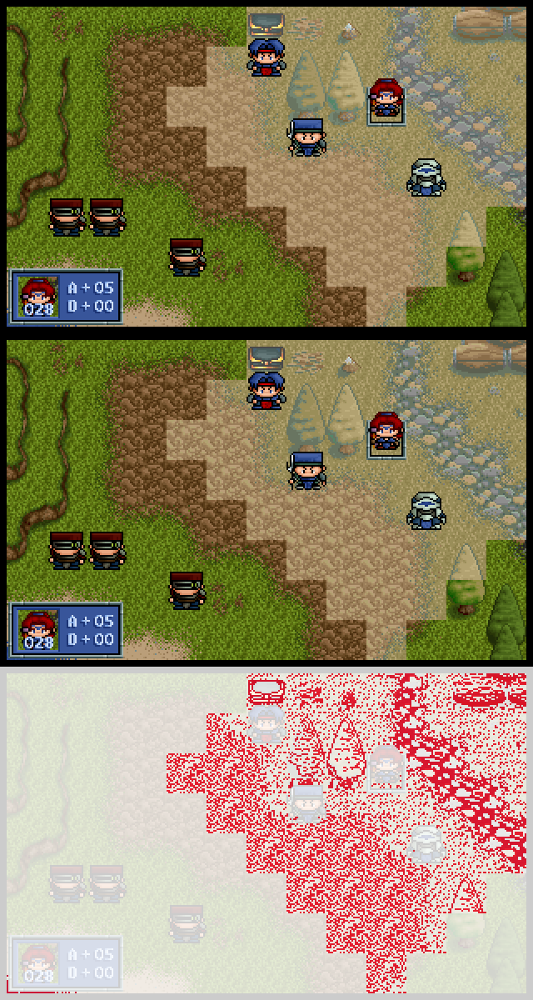

*上、中、下依序為未修改原版約 0.5 秒相位、重製端一般鍵盤路徑，以及絕對差異。
原版 20 相位 LUT 與重製時鐘未鎖在同一相位，因此此圖用來核對操作狀態、排版與
差異範圍，不是逐像素一致宣稱；四相位與雜湊見[擷取紀錄](docs/data/ui-traces/native-command0-target-original-vs-remake-e1.json)。*

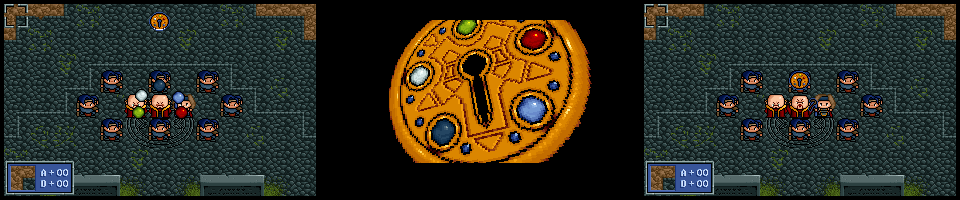

*這是正式第21戰勝利→城鎮→存讀檔整合回歸中，由索引 framebuffer 與當下 DAC
輸出的重製端 E1 三階段畫面；不是原版擷取或逐像素 E2。完整資產雜湊、產生命令與
尚未接入的 ACT63／64限制見[擷取紀錄](docs/data/ui-traces/ch21-sky-key-sequence-remake-e1.json)。*

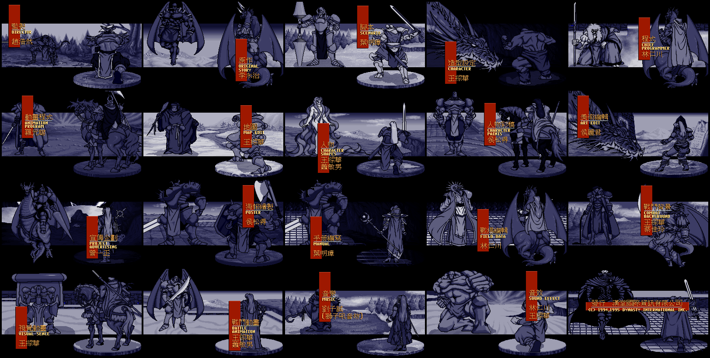

*這是 `MontageTailPlayer` 以玩家自備原版 TAI／BG／FIGANI／FDOTHER 產生的 E1
近似合成總覽；不是原版擷取、逐像素對照或精確 `0x28A6C` 輸出。產生方式、雜湊與
限制見[擷取紀錄](docs/data/ui-traces/ending-tail-20-segments-approximate-remake-e1.json)。*

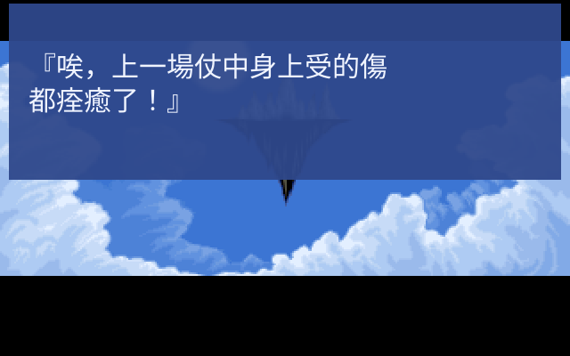

*這是 Docker／Xvfb 的重製端 E1 直接節點擷取；不是第 30 戰一般玩家路徑、音訊播放
或原版逐像素比較。輸入、雜湊與限制見[擷取紀錄](docs/data/ui-traces/ending-prefix-approximate-remake-e1.json)。*

所有文件中的 `FD2.EXE` 位址目前只適用於大小 `357074` 位元組、MD5
`b97caf2239a27a896069d03549d96e1e` 的版本。SHA-256 與相關檔案雜湊見
[`fd2-reference-files.json`](docs/data/fd2-reference-files.json)；版本不同時
必須重新定位，不能直接套用既有位址。

## 專案核心

這不只是素材瀏覽器，也不是把原版流程重新寫死一次。專案同時維護兩條互相
驗證的主線：

- **技術保存**：以原始位元組、IDA Pro 指令、呼叫關係與 DOSBox 實驗記錄
  1995 年原版的資產格式、工具鏈、狀態機、介面、數值與遊戲規則。背景整理
  見 [`15-how-fd2-was-made-1995.md`](docs/knowledge-base/15-how-fd2-was-made-1995.md)。
- **潔淨室重製**：把寫死於 `FD2.EXE` 的對話、事件、戰後流程、城鎮、商店、
  整備與隊伍狀態轉成具型別、可編輯的資料與規則。
- **忠實模式與擴充模式共存**：原版戰役以證據還原；相同引擎日後可載入新
  劇本、分支與戰役，不必修改原版執行檔。
- **證據先於猜測**：未知處理器、存檔欄位或介面語意維持失敗即關閉，不用
  看似合理的替代行為冒充原版。

目前唯一持續整合的實作是 [`remake/`](remake/) 內的 Go／Ebiten 引擎。
架構、資料邊界與完成條件以
[`56-fd2-remake-sdd.md`](docs/knowledge-base/56-fd2-remake-sdd.md) 為準。

### 為台灣留一份技術紀念

> **AFM — Animation File Manager Version 1.00　Copyright (C) 1993 Lo Yuan Tsung**

這行留在原版動畫資料裡的署名，記錄了漢堂程式設計師自製工具的一角。本專案
不只要讓遊戲重新運作，也要把破解出的每一項技術整理成保存品質的文件，記錄
1995 年台灣團隊如何在 DOS 的限制下完成一款大型戰棋角色扮演遊戲：
[`04` 原版工具鏈](docs/knowledge-base/04-original-toolchain.md)、
[`05` 圖像壓縮](docs/knowledge-base/05-image-compression-format.md)、
[`06` 動畫格式](docs/knowledge-base/06-animation-format.md)、
[`07` XMIDI 音樂](docs/knowledge-base/07-music-xmidi-format.md)。

## 1995 年怎麼做出這款遊戲

[`15-how-fd2-was-made-1995.md`](docs/knowledge-base/15-how-fd2-was-made-1995.md)
把原版工具鏈、資料架構、畫面、動畫、音樂、中文、戰鬥規則與敵方人工智慧
（AI）串成一份完整紀錄：一支台灣團隊如何在 DOS、記憶體與音效卡各有限制的
年代，做出《炎龍騎士團 2》。

### DOS 上的中文是怎麼做出來的

DOS 原生不能直接顯示中文。漢堂隨遊戲攜帶點陣字型，文字則以內部字模索引
儲存：`FDTXT` 不是 Big5 文字檔，而是 `uint16` 字模索引序列，共 1016 條字串、
約 5.8 萬字；`FDOTHER` 資源 #4 收錄 1824 個 16×16、1 位元平面（1bpp）字模，
索引 0–35 是數字與英文字母，其後才是漢字。格式、控制碼與解碼證據見
[`08` 文字與字型](docs/knowledge-base/08-text-and-font-format.md)及
[`14` 文字控制碼](docs/knowledge-base/14-text-control-codes.md)。

| 文字／字型解碼研究圖（非重製執行期截圖） | 原版自製字型的解碼字模表 |
|---|---|
|  |  |

### 開場動畫：一個 1993 年的繪圖位元組碼虛擬機

原版開場過場不是逐幀點陣圖。AFM 是一台只有 10 個運算碼的增量繪圖虛擬機：
每幀只保存一小段位元組碼，在前一幀殘留畫面上更新調色盤或 VGA 像素，不清空
整個畫面重畫。96 幀的金鎖動畫因此只需約 1 MB，而不是 96 個 64000 位元組的
完整畫格陣列。

```text
每幀：[compSize u16][cmdCount u16][保留欄位 × 2]，後接 cmdCount 條指令
運算碼 0–3：調色盤操作
運算碼 4–9：VGA 畫面寫入
```

原版派發器位於 `0x36c9e`、跳躍表位於 `0x5276a`；播放器介面為
`0x020421(index, delayMs, skippable)`。`0x3dc9f` 以忙等測速校準動畫延遲；目前
尚未找到它的直接呼叫端，因此不把執行時機提升為已證實。這仍反映當年必須
適應不同電腦速度的做法。重製端的純 Go 解碼器位於
[`remake/internal/afm/`](remake/internal/afm/)，但不夾帶任何受著作權保護的原版
畫格；格式證據見 [`39-ani-afm-format.md`](docs/knowledge-base/39-ani-afm-format.md)。

### 音樂：兩種音源、兩種玩家記憶

同一首 XMIDI 曲目在 Roland MT-32 與 Sound Blaster／AdLib 上會呈現不同音色。
場景曲號不是靠聽曲風猜測，而是從 `play_bgm`（`0x25977`）的 32 處呼叫逐一追查；
這項方法也推翻過兩個早期的曲目推定。Sound Blaster／AdLib 路線使用遊戲自帶的
`SAMPLE.AD` 音色庫，也是原版預設音效卡與許多玩家記憶中的聲音；MT-32 則走
另一套合成路線。兩者都由玩家自備合法原版檔案與所需 ROM 在本機渲染，本倉庫
不散布音色庫或 ROM。詳見
[`12` 音樂播放與場景](docs/knowledge-base/12-music-playback-and-scene.md)及
[`16` 音訊合成](docs/knowledge-base/16-audio-synthesis-soundfont-mt32.md)；
`SAMPLE.AD` 的檔案角色與限制另見
[`36` 音效資料](docs/knowledge-base/36-sfx-audio-data.md)。

## 已建立的主要貢獻

| 貢獻 | 可重現成果 | 深入閱讀 |
|---|---|---|
| 原版資產保存工具鏈 | 統一解包 `.DAT`，解析 RLE 圖像、FDTXT、16×16 中文字型、地圖、XMIDI、AFM 與 FIGANI；產物可由玩家自備原版重生 | [`01` 容器與資產](docs/knowledge-base/01-container-and-asset-formats.md)、[`07` XMIDI](docs/knowledge-base/07-music-xmidi-format.md) |
| 繁體中文文字系統還原 | 將原版字模索引、控制碼、對話框與動態文字整理為資料層中可讀、可編輯的內容，不把它誤認為 Big5 文字檔 | [`08` 文字與字型](docs/knowledge-base/08-text-and-font-format.md)、[`14` 控制碼](docs/knowledge-base/14-text-control-codes.md) |
| 動畫與戰鬥演出解碼 | 建立 AFM 增量繪圖虛擬機及 FIGANI 幀解碼器，保存原始座標、調色盤與時序資料 | [`39` AFM](docs/knowledge-base/39-ani-afm-format.md)、[`35` 戰鬥演出](docs/knowledge-base/35-battle-animation-rendering.md) |
| 遊戲機制反向工程 | 以版本雜湊綁定已閉合的戰鬥規則切片、物品、事件處理器、敵方 AI、章節狀態與戰後路徑；撤回缺少寫入端／消費端的舊斷言 | [`11` 敵方 AI](docs/knowledge-base/11-enemy-ai.md)、[`27` 戰鬥規則](docs/knowledge-base/27-combat-rules-and-validation-checklist.md) |
| 原版介面逐狀態重建 | 城鎮、商店、讀檔及部分戰鬥介面以原版 indexed 資源重建；多個 ch02 狀態已有整幀 RGB 相同對照 | [`57` 介面證據矩陣](docs/knowledge-base/57-ui-evidence-matrix.md) |
| 可編輯戰役與持續隊伍 | 對話、事件、章節節點、商店／教會／整備與持續隊伍逐步脫離硬編碼；序章兩次增援及第一章 turn4／5 增援已接原版12次索引呈現與獨立 ACTING，第8戰已依29..41 slots frontier完成洛娜加入與進城，第10戰亦接上60／61 slots、原版 DAC 淡出／淡入、直接 record patch、JOIN11／6與 `town_ch11`。第16戰 raw `ch15_post` 現以 persistent-first 76 slots、四條 raw 分支、JOIN18 與 `town_ch17` save/load 完成重製端 E1；第20戰現依固定名冊第0筆＋15人整備建立83 slots，正確區分round15的增援／JOIN28與round16略過路徑，兩路都保留JOIN25並進`town_ch21`；第27章 event62→event63 已接敵軍 AI 前兩批增援與全白／恢復演出（均為重製端 E1，尚非 DOSBox E2）。第一章測試現已由正式 `State.Result`→`checkResult`→`confirmBattleResult` 進入 `town_ch02`／整備；未綁定 postbattle 節點另有明確近似模式，流程仍保持戰鬥→戰後→城鎮→整備。原版四槽 envelope 與 metadata 驗證已接入；目前以原生 `FD2.SAV` 為輸入的 typed party→town／preparation 還原屬重製端 `RUNTIME-E1`，且只由合成有效槽 fixture 證實，尚未以未修改原版的有效 `FD2.SAV` 完成一般玩家 LOAD E2。chapter0 current-runtime CONTINUE 已接明確存檔／計時種子的重製端 E1 發布，尚非一般玩家 E2 | [`29` 事件系統](docs/knowledge-base/29-remake-extensible-event-system.md)、[`23` 啟動與存檔流程](docs/knowledge-base/23-boot-title-and-scenario-flow.md) |

這些貢獻各自代表已驗證的子系統，不代表完整 30 章已經可以從頭到尾等價
遊玩。尚未閉合的玩家路徑、原生存檔還原與介面差距仍列在
[`42-re-vs-remake-gap-audit.md`](docs/knowledge-base/42-re-vs-remake-gap-audit.md)
與 [`91-worklist.md`](docs/knowledge-base/91-worklist.md)。

## 可驗證畫面

以下圖片只代表其標示的狀態，不可外推為整套遊戲已完成。

### 城鎮與商店

ch02 城鎮六個選項：上排為原版 DOSBox，下排為重製；每格皆有整幀相同的
對照結果。


ch02 城鎮 variant2 的正常五項：上排原版、下排重製；原版來自明確標示的
修改 LOAD 研究副本，選項0–4各自與指定脈動整幀相同，並非一般玩家戰後路徑。


ch02 城鎮 variant1 的正常五項：上排原版、下排重製；同樣來自明確標示的
修改 LOAD 研究副本，選項0–4各自與實測脈動相位整幀相同，並非一般玩家戰後路徑。
完整雜湊與限制見 [`native_town_variant1_e2.json`](docs/data/native_town_variant1_e2.json)。


ch02 武器店、道具店與秘密商店：上排為原版，下排為重製；這只證明圖中三個
商店主選單狀態。


ch02 武器店賣出角色名冊與索爾物品清單：上排為 route-patched 原版正常商店
輸入，下排為正式重製 owner；兩個同步狀態皆為完整 320×200 RGB 相同。這張圖
本身不包含成功演出與返回名冊；該部分的後續證據見下方專項對照。未修改的
一般玩家戰後路徑仍另行驗收。

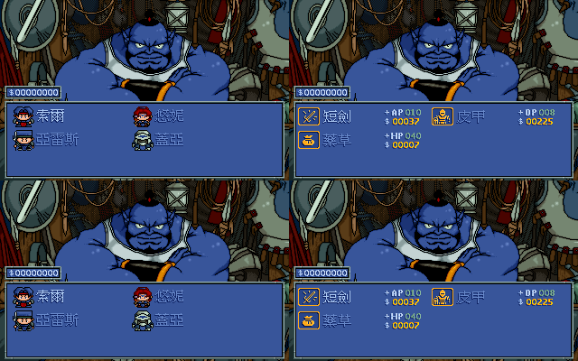

同一路徑再以方向鍵選到悠妮，並取得短劍賣出的 Yes／No 選中狀態；上排原版、
下排重製三組也都為完整 RGB 相同。未修改戰役路徑仍另行驗收。

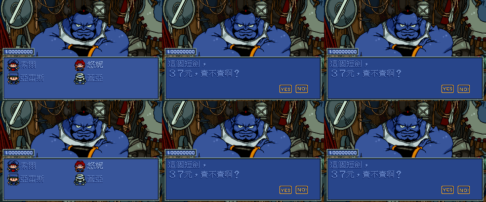

短劍 Yes 後的成功演出、向上金幣滾動與返回索爾名冊：上排為 route-patched
原版正常輸入，下排為正式重製。由左至右是成功影格0–4、金幣11／36與返回名冊
cycle0／1；九組完整320×200 RGB皆相同。重製也會等金幣動畫完成後才發布移除
短劍的背包，不能再直接跳到37元。證據與限制見
[`shop-sell-success-return-ch02-e2.json`](docs/data/ui-traces/shop-sell-success-return-ch02-e2.json)。

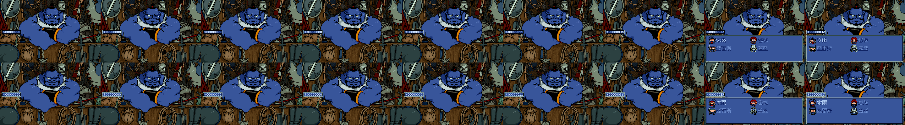

ch02 獨立裝備的角色名冊與索爾物品／狀態面板：左側為 route-patched
原版正常商店輸入，右側為正式重製 owner。可見資料與幾何已對齊，但
角色精靈與面板呈現相位尚未同步，整幀差異為 `AE=1389`／`1433`；這是
誠實的 partial E2 對照，不是逐像素完成宣稱。雜湊與限制見
[`shop-standalone-equip-ch02-e2.json`](docs/data/ui-traces/shop-standalone-equip-ch02-e2.json)。

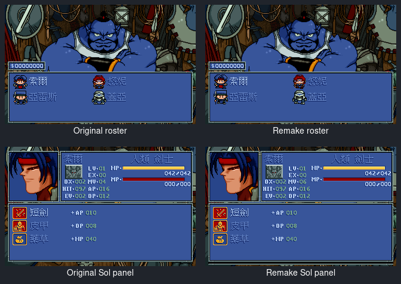

ch02 物品轉移的來源提示／名冊、索爾物品、目的提示／名冊：左側為
route-patched 原版正常商店輸入，右側為正式重製 owner。文字、物品、價格與
幾何一致；五組整幀差異為 `AE=88／1391／2／88／321`，剩餘像素來自翻頁箭頭
或角色小圖動畫相位，因此仍是 partial E2。證據與限制見
[`shop-transfer-ch02-e2.json`](docs/data/ui-traces/shop-transfer-ch02-e2.json)。

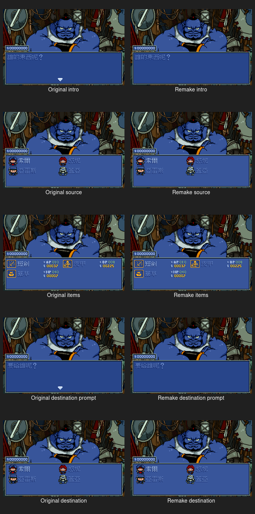

同一路徑再把索爾的短劍交給悠妮：左側原版、右側重製依序顯示目的角色悠妮、
交易後返回提示、索爾只剩皮甲／藥草，以及悠妮新增未裝備短劍。四組整幀差異為
`AE=1391／82／2／286`，剩餘像素屬動畫相位；交易資料與幾何一致。重製端同一
交易也已通過離店、`town_ch02` 與 JSON 冷讀檔。證據與限制見
[`shop-transfer-success-ch02-e2.json`](docs/data/ui-traces/shop-transfer-success-ch02-e2.json)。

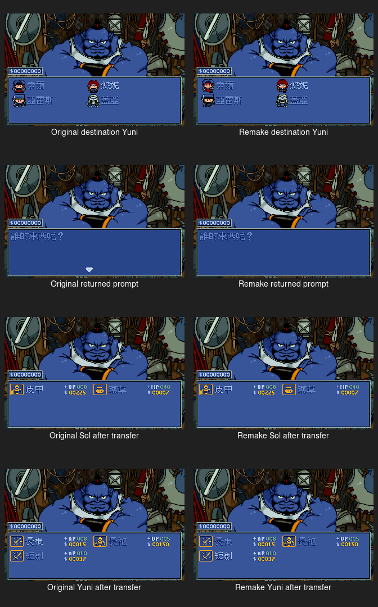

### 讀檔選單

原版與重製的四個空存檔槽畫面已達整幀 RGB 相同；有效槽排版也已有相同結果。
四槽 LOAD 的 checksum、名冊、金幣與城鎮／整備落點已接入正式路徑，但目前
只有合成有效槽的決定性測試；尚缺未修改一般玩家有效槽的成功載入實驗。

| 原版 | 重製 |
|---|---|
|  |  |

### 標題選單

原版與重製端的標題選單同樣以 320×200 內容呈現；重製圖是 Docker／Xvfb
實際執行期擷取。2026-08-23 已移除原版沒有的 F2 常駐音源提示；F2 切換功能
仍保留。開場按鍵也改回逐幕規則：只中斷原版旗標允許略過的當前 AFM 幕，
不再由 ESC 無條件略過整段。此圖僅作介面對照，不代表一般玩家 E2 或完整開場動畫已完成；
chapter0 的 CONTINUE E1 另見下方戰場段落。

| 原版 DOSBox | 重製端執行期 |
|---|---|
|  | 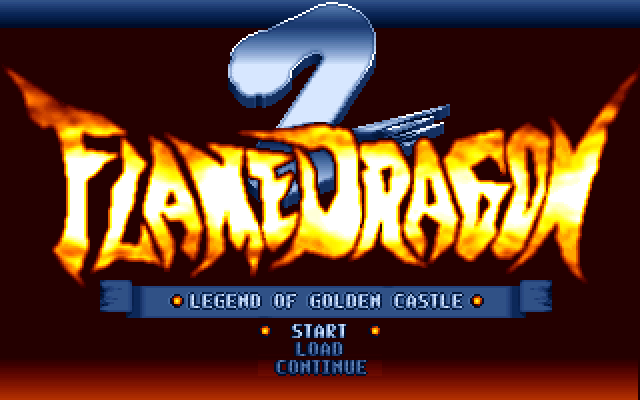 |

### 對話框

重製端已能從可編輯的序章腳本實際跑出對話框執行期（runtime）畫面；下圖是
Docker／Xvfb 產生的 640×400 E1 證據。它證明腳本、肖像、藍框與中文字型已通過
重製端消費端，但不是原版同狀態的一般玩家 E2 等價證明。將重製圖縮放至原版
320×200 後，與原版 DOSBox 對話畫面的平均絕對誤差（AE）為 60414，仍可看出
版面、背景與文字避讓尚未一致。

2026-08-25 新增的第25戰戰後窄切片已不再走這張圖所示的通用 RGBA 對話框：
18句均直接消費原版 `FFFE/FFFD` 頁列、上／下框座標、FDOTHER #5框格、DATO
頭像與 FDOTHER #4 字模，達穩定頁面的 `RUNTIME-E1`。目前沒有把 test-only
空白戰場 baseline 製成宣傳圖，以免誤標成正常玩家擷取；下方舊圖仍保留作其他
尚未原生化 caller 的差距證據。

| 原版 DOSBox | 重製端執行期（E1） |
|---|---|
|  |  |

### 戰場與戰鬥演出

未修改原版已由 Docker 沙箱走到第一戰的一般玩家回合，固定取得第一個我方單位的
戰術指令格、肖像、HP／MP 與能力欄；這是原版玩家回合 E2 錨點，不是重製端對照圖，
也不代表敵方人工智慧回合已驗收。來源雜湊、按鍵時間線與限制見
[`native-player-turn-original.json`](docs/data/ui-traces/native-player-turn-original.json)。

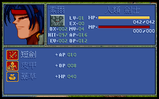

ch01 戰場目前已能由原始地圖、單位、前景與 HUD 資產合成。首頁主要展示同一份
`FD2.SAV`、同一鏡頭／游標／回合的 320×200 比較：左為原版 DOSBox，中為重製端
最近鄰縮小結果，右為差異遮罩。terrain icon 已依 IDA 證實的
`base + stride*5 + 6` 修正；內容區只剩左下畫布邊界的 22 個差異像素，不能外推為
其他章節或完整操作界面已完成。


### 可玩近似戰後提示

明確設定 `FD2_APPROXIMATE=1` 時，尚未有正式原版 handler 的戰後節點會先同步已物化
隊伍，顯示可確認的戰後整理提示，再沿腳本進入城鎮／整備；下圖是 Docker／Xvfb
實際執行期擷取。它是可玩近似模式畫面，不代表原版演出或逐像素等價。

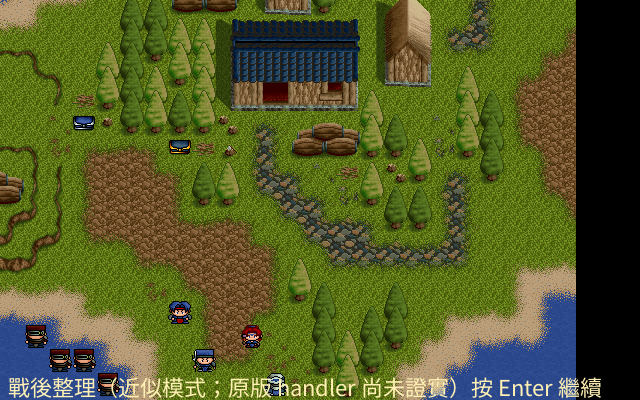

完整尺寸、狀態指紋、影像雜湊與限制見
[`battle-visual-gap-ch01.json`](docs/data/ui-traces/battle-visual-gap-ch01.json)。

另有一張由既有 `story_ch00_handler` 截圖快進器產生的重製端第1戰畫面，僅作
E1 執行期產物展示：[`native-battle-ch01-remake-e1.png`](docs/figures/native-battle-ch01-remake-e1.png)。
它不是一般玩家輸入或原版同狀態 E2 對照；完整限制與雜湊見
[`native-battle-ch01-remake-e1.json`](docs/data/ui-traces/native-battle-ch01-remake-e1.json)。
較早的 [`native-map-ch01-original-video.png`](docs/figures/native-map-ch01-original-video.png)
與正式 handler 截圖
[`native-map-ch01-remake-handler.png`](docs/figures/native-map-ch01-remake-handler.png)
不是同一狀態，仍保留作為歷史流程參考；不能拿它們判定單位、游標或 HUD 的像素差異。

戰鬥動畫解碼與局部位置比較：首頁不再把 2026-07 的舊分鏡
[`battle_restore.gif`](docs/figures/battle_restore.gif) 當成目前執行期畫面；該圖保留在
儲存庫作歷史證據。以下是 2026-08-25 以目前原始碼重新擷取的命中幀：左為原版
影像正規化結果，中為重製端，右為逐 RGB 差異遮罩。IDA證實並接上原版
`0x2939D` 的第一個命中位移相位後，最佳frame76由4436降至1330個差異像素；
同輪再修正會讓原版字模索引整批退回現代字型的JSON註解解析錯誤，降至903個。
最後把早已完成的`0x18C6D` indexed bar／digit核心接到普通攻擊後，全幅只剩519個
差異像素；它們恰為舊三欄比較圖反向裁切時帶入的左邊與底邊，排除該合成邊框的
319×199內容區為`AE=0`、`RMSE=0`。由於原版oracle來自舊比較圖而非新的未修改
DOSBox同狀態擷取，這仍只證明此固定fixture內容一致，不提升為一般玩家E2。

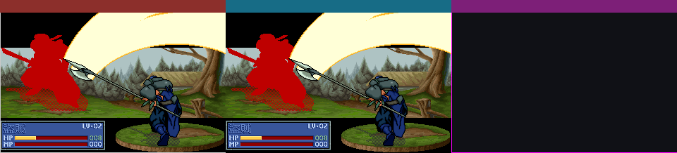

戰鬥狀態欄姓名目前已改接原版 `FDOTHER#4` 16×16 點陣字模；2026-08-25並修正
`unicode_to_glyph.json` 的 `_comment` 使整批索引誤退回現代字型的問題。下圖是
Docker／Xvfb以目前原始碼重新建置的 E1 演出截圖。它只證明姓名字模的消費端，不代表攻擊幀、
傷害／閃紅或整個戰鬥介面已與原版逐像素一致。


針對命中幀的另一項已確認偏差：重製端已移除沒有原始欄位來源支撐的全畫面紅罩，
避免背景、狀態欄與台座一起泛紅；目前只保留原版 impact 參考圖支持的守方紅剪影，
攻方維持原本 FIGANI 幀，仍標示為 E1 近似。下圖是修正後的
Docker／Xvfb 截圖，不是原版同狀態逐像素 E2；原始 DAC 條件與截圖雜湊見
[`battle-impact-no-global-tint.json`](docs/data/ui-traces/battle-impact-no-global-tint.json)。

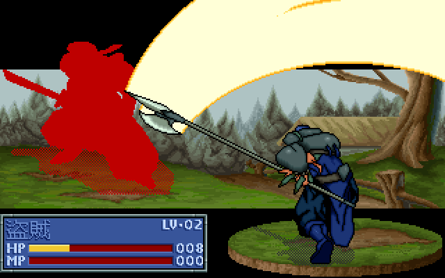

目前 source 的完整原生戰場 frame 也能承接指令環與 command grid；下圖是 Docker／Xvfb
的 E1 執行期畫面，資源缺失時仍會失敗即關閉，不代表原版逐像素等價。

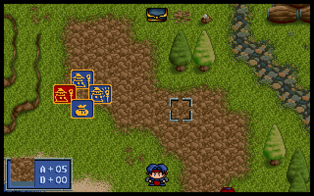

另有一份未修改原版 `FD2.SAV` 的 chapter0 current-runtime E2 錨點：從標題
`CONTINUE` 進入戰場，再按 Enter 開啟 command grid。這是原版操作證據，不是
重製端 parity，也不能外推到第23戰；完整輸入時間線與雜湊見
[`native-continue-current-runtime-e2.json`](docs/data/ui-traces/native-continue-current-runtime-e2.json)。


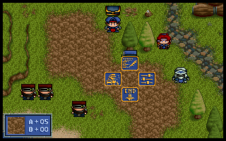

重製端現在也能由同一份 `FD2.SAV` 走標題 Escape／Down／Down／Enter，
在明確提供 `FD2_NATIVE_TITLE_TICK` 後發布 `battle_ch01` current-runtime；
下圖是 Docker／Xvfb 的 E1 執行期畫面。它證明保存的鏡頭、游標、回合與地圖
已交給戰場控制器。這張較早的基準圖仍不證明 Enter 後的四格動作 owner 或原版
status/equipment panel，因此不宣稱逐像素 E2。條件與雜湊見
[`native-continue-current-runtime-remake-e1.json`](docs/data/ui-traces/native-continue-current-runtime-remake-e1.json)。

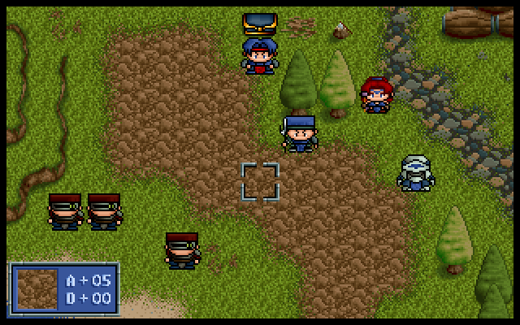

同一份存檔另保存了原版 E2 與重製端普通 X11 輸入的 current-runtime 配對基準：
原版 320×200 放大至 640×400 比較的 AE 為 `164`、RMSE 為 `50.2631`。重製端畫面
仍使用明確的 `FD2_NATIVE_TITLE_TICK=0` 計時夾具，所以這是原版 E2＋重製端 E1
的配對證據，不是逐像素一致；完整限制與雜湊見
[`native-continue-current-runtime-remake-e2.json`](docs/data/ui-traces/native-continue-current-runtime-remake-e2.json)。


2026-08-11 已修正 action overlay 圖塊索引乘數與「只載入前十格」的錯誤；同一普通
X11 `CONTINUE→Return` 路徑現在會在空游標顯示**強推論**對應原版 `0x16f55` 的四個圖塊。下圖
依序是原版、重製與差異遮罩；它清楚顯示畫面仍有差距（AE `8932`），所以只作重製端
E1 的可見／輸入切片。2026-08-20 已沿同一份原版 E2 輸入證據接通 Down→END→YES：
四幀面板關閉後才顯示確認。2026-08-21 又由 IDA 9.4／Capstone 直接證實 direction 3、
`FDTXT_000[0x1A3/0x1A4]`、YES 與 `0xC8` 毫秒延遲；重製端現顯示原文並以十二個
60 Hz 幀近似延遲，再進敵方回合及返回玩家回合。2026-08-22 的密集擷取又證實
接受與取消原文都會逐字出現；正式重製路徑已改為每個普通字形發布一個畫格，完整句
之後才開始等待。其餘三格動作效果仍失敗即關閉，確認畫面也不宣稱原版像素一致。
原始位址、輸入、旁車與雜湊見
[`native-continue-current-command-remake-e1.json`](docs/data/ui-traces/native-continue-current-command-remake-e1.json)。

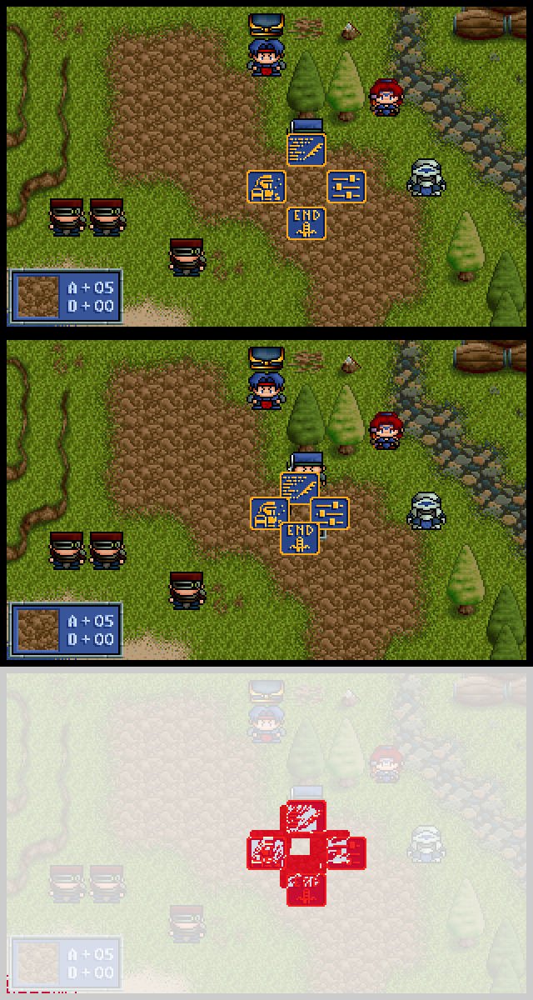

下圖上半是未修改原版一般玩家接受分支，下半是重製端普通鍵盤正式路徑；六格都依
時間順序呈現字數增加。它證明逐字內容順序與路徑可達性，不代表逐像素、逐毫秒或
音訊一致；取消分支與完整限制見
[`END 逐字回覆配對證據`](docs/data/ui-traces/native-end-turn-response-progressive-original-vs-remake-e1.json)。

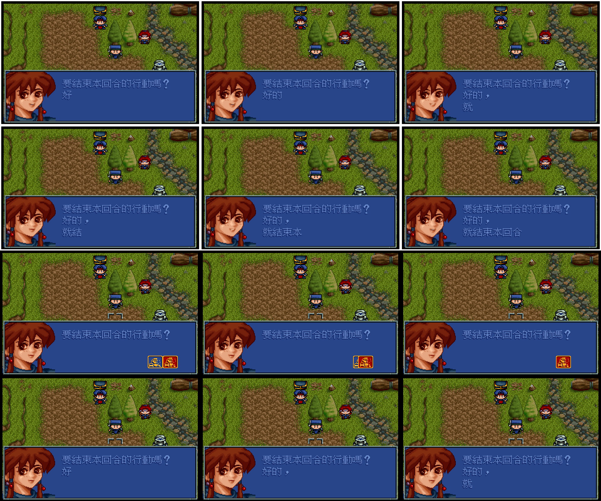

同一份未修改原版 `FD2.SAV` 也已走到「結束目前單位行動嗎？」→「是」，實際看見
`ENEMY PHASE`，並在約 10 秒後看到敵方回合的另一個戰場畫面，約 20 秒後回到玩家
操作狀態。這是一般玩家敵方回合的原版 E2 輸入／畫面錨點，不是重製端對照，也不足以
單獨證明目標選擇、移動評分或命令／法術／物品語意；完整時間線、來源雜湊與限制見
[`native-enemy-turn-original-e2.json`](docs/data/ui-traces/native-enemy-turn-original-e2.json)。

重製端另有受原始來源證據（raw provenance）保護的 mode 0／mode 1／mode 2／mode 3／mode 4／
mode 5／mode 7／mode 8／mode 9／mode 10／mode 11 遊戲層 E1 回歸：mode 0 可依 raw
nearest fallback、mode 1 可依 raw blocked-coordinate 完成 movement-only 路徑，mode 2 可完成物理移動／FIGANI 攻擊，mode 3／9
依 raw `+0x08` 查找完成 movement-only 路徑，mode 4／10 依 raw 目的地完成 movement-only
路徑，mode 5 可提交事件格的 raw state 尾端，mode 7 可完成 raw 目的地移動並提交 `+0x05`，
mode 8 走共同的行動完成分支，`0x14EF0` 已有 raw command route 進入已驗證的
數值執行器；`0x15055` 也會保存並消費 `0x1567E` 勝出候選的完整 raw target list，
使正常正分 item type 5／13／20／21／24 在移動後以同一目標順序完成原子數值交易，
不再借用玩家游標只重算第一目標；type 5／13已接回原版`0x211A4`，type20／24與
type21也分別接回`0x1CD17`與`0x1CAC7`。玩家正常item79／38現在共用後兩個演出
owner，不再於確認時同步跳過畫面；各路徑都在已證實Draw邊界才發布交易。mode 11 可依序消費兩段 command／physical stage；
缺少來源則停止而不標記單位已行動。這些是可驗證的 AI 消費端切片，不是原版 E2 等價性（parity）；
未知命令／法術效果與未修改原版同狀態逐幀配對仍列於 [`11` 敵方 AI](docs/knowledge-base/11-enemy-ai.md)
與 [`91` 工作清單](docs/knowledge-base/91-worklist.md)。

原始路由未建立計畫且未回傳錯誤時，敵方／友軍 NPC 會以可編輯 `SpellBook`／`Spells` 選擇已知的治療、攻擊、輔助或狀態法術，
經 `aiStep → CastArea` 完成移動、數值結算與回合提交；這是重製端的正規化（normalized）近似，不替原版 `0x1598A` 評分、指令格、
特效或音效背書。原始路由一旦回報缺少 provenance 或其他錯誤，仍會在任何行動前失敗即關閉。

| 原版 ENEMY PHASE | 原版敵方回合畫面 | 原版回到玩家回合 |
|---|---|---|
| 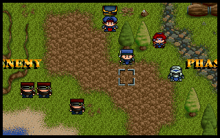 | 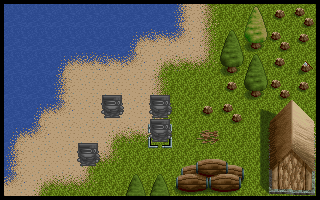 | 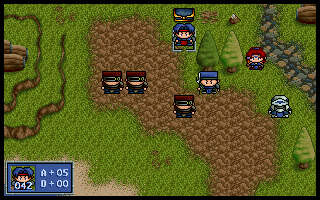 |

完整介面覆蓋、證據等級與其餘比較圖請看
[`57-ui-evidence-matrix.md`](docs/knowledge-base/57-ui-evidence-matrix.md)。

## 快速開始

### 需求

- Docker
- 合法原版遊戲檔案
- 本倉庫不要求在主機安裝 Go、Capstone 或其他分析套件

本專案的分析、轉檔、建置、測試與抓圖一律在 Docker 內執行。可維護的容器
入口與資產匯出步驟見 [`remake/README.md`](remake/README.md) 及
[`tools/docker/`](tools/docker/)。

### 建置與測試

Go／Ebiten 是目前唯一持續整合的重製引擎：

```bash
docker run --rm --network none --memory 3g --cpus 2 --pids-limit 384 \
  --user "$(id -u):$(id -g)" -e HOME=/tmp -e GOCACHE=/tmp/go-cache \
  -e GOMAXPROCS=1 -e GOFLAGS=-p=1 \
  -v "$PWD:/src:ro" -w /src/remake fd2-go-test-local \
  sh -c 'set -eu; trap "pkill -TERM Xvfb 2>/dev/null || true" EXIT INT TERM; \
    timeout 900s xvfb-run -a -s "-screen 0 1280x1024x24" \
    go test ./... -count=1'
```

本機映像檔的建立方式與 Web、Linux、Windows 打包入口請看
[`remake/README.md`](remake/README.md)。資產工具位於 [`tools/`](tools/)；
輸出放在被忽略的 `extracted/`，不應把原版衍生資產提交至 Git。

## 文件導航

### 現況與工程入口

建議先依下列順序閱讀：

1. [`58-fd2-exe-re-coverage.md`](docs/knowledge-base/58-fd2-exe-re-coverage.md)：
   反組譯、可編輯資料、正式執行期與一般玩家驗證的唯一分層現況；也列出哪些
   位址不該再重做。
2. [`56-fd2-remake-sdd.md`](docs/knowledge-base/56-fd2-remake-sdd.md)：
   系統設計、證據分級、原版與重製的責任邊界。
3. [`57-ui-evidence-matrix.md`](docs/knowledge-base/57-ui-evidence-matrix.md)：
   操作介面的原版證據、重製狀態與未閉合項目。
4. [`91-worklist.md`](docs/knowledge-base/91-worklist.md)：
   檔首是目前有效工程佇列；後段是歷史工作記錄，不用勾選數計算完成度。
5. [`00-index.md`](docs/knowledge-base/00-index.md)：
   資產格式、戰鬥、劇情、介面等專題文件索引。
6. [`SESSION-HANDOFF-2026-07-06.md`](docs/knowledge-base/SESSION-HANDOFF-2026-07-06.md)：
   時間序列證據與後續勘誤，不應單獨視為現況真值。

早期設計、歷史反思或專題筆記若與原始位元組、執行期實驗或上述現況文件
衝突，以較新的直接證據與勘誤為準。未知語意不會為了讓流程前進而猜測接入。

### 技術保存專題

知識庫不只是工程工作清單；其中 `04`–`11` 等文件也在保存「1995 年台灣怎麼
做遊戲」的技術紀錄。完整目錄見 [`00-index.md`](docs/knowledge-base/00-index.md)，
以下是依問題分類的入口：

- **原版工具與資產格式**：[`01` 容器與資產](docs/knowledge-base/01-container-and-asset-formats.md)、
  [`04` 原版工具鏈](docs/knowledge-base/04-original-toolchain.md)、
  [`05` 圖像壓縮](docs/knowledge-base/05-image-compression-format.md)、
  [`06` 動畫](docs/knowledge-base/06-animation-format.md)、
  [`07` XMIDI](docs/knowledge-base/07-music-xmidi-format.md)、
  [`08` 文字與字型](docs/knowledge-base/08-text-and-font-format.md)、
  [`39` AFM](docs/knowledge-base/39-ani-afm-format.md)。
- **遊戲邏輯與機制**：[`03` 執行檔與資料結構](docs/knowledge-base/03-exe-and-data-structures.md)、
  [`09` 劇情與對話](docs/knowledge-base/09-story-and-dialogue.md)、
  [`10` 精靈繪製與狀態](docs/knowledge-base/10-sprite-rendering-camp-and-state.md)、
  [`11` 敵方 AI](docs/knowledge-base/11-enemy-ai.md)、
  [`13` 戰鬥選單](docs/knowledge-base/13-battle-menu-system.md)、
  [`14` 文字控制碼](docs/knowledge-base/14-text-control-codes.md)、
  [`27` 戰鬥規則](docs/knowledge-base/27-combat-rules-and-validation-checklist.md)。
- **引擎控制流與介面**：[`23` 啟動、標題與存檔](docs/knowledge-base/23-boot-title-and-scenario-flow.md)、
  [`24` 呼叫圖分析](docs/knowledge-base/24-callgraph-analysis-log.md)、
  [`35` 戰鬥演出](docs/knowledge-base/35-battle-animation-rendering.md)、
  [`50` 過場腳本設計](docs/knowledge-base/50-cutscene-script-system-design.md)。
- **重製設計與驗證**：[`29` 可擴充事件系統](docs/knowledge-base/29-remake-extensible-event-system.md)、
  [`42` 差距稽核](docs/knowledge-base/42-re-vs-remake-gap-audit.md)、
  [`56` 系統設計](docs/knowledge-base/56-fd2-remake-sdd.md)、
  [`57` 介面證據矩陣](docs/knowledge-base/57-ui-evidence-matrix.md)。

## 倉庫結構

```text
docs/knowledge-base/  系統設計、證據、專題研究與工作清單
docs/data/            結構化資料、原版檔案雜湊與可重播追蹤
docs/figures/         經整理的原版／重製比較圖
remake/               Go／Ebiten 重製引擎
tools/                資產解碼、反組譯與驗證工具
org_game/             使用者自備原版；不納入版本控制
extracted/            本機產物；不納入版本控制
```

## 研究與實作原則

- 原版執行檔是行為判定基準；反編譯輸出與攻略只能協助導航。
- 已證實結論必須綁定位址、原始位元組、呼叫者／消費端或同狀態實機比較。
- 寫死在原版中的對話、事件、戰後、城鎮、商店與整備流程，會轉成可編輯資料
  與具型別規則，不保留依賴原版位址的正式執行捷徑。
- 多數戰鬥結束後會進入城鎮、商店或整備，不會直接跳到下一場戰鬥。
- 除錯捷徑、修改存檔或只通過重製端測試，不等於一般玩家路徑已驗證。

協作規則與 Docker、IDA Pro、提交及證據政策見 [`AGENTS.md`](AGENTS.md)。

## 版權與致謝

- 《炎龍騎士團 2》及其原版資產著作權屬漢堂國際。本專案只提供研究紀錄、
  工具與潔淨室重製程式，不散布原版內容。
- 攻略資料參考青衫整理的
  [《炎龍騎士團 2》圖文攻略](https://chiuinan.github.io/game/game/intro/ch/c31/fd2/)；
  攻略只作玩家可見行為與數值旁證，不作二進位介面證據。
