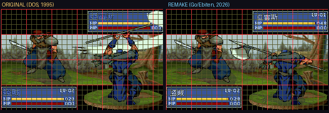

# 炎龍騎士團 2 反向工程與重製

本專案以合法原版《炎龍騎士團 2：黃金城傳說》作為行為基準，保存 DOS
程式的資料格式、介面與遊戲機制，並以 Go／Ebiten 建立可編輯、可擴充的
潔淨室重製引擎。《炎龍騎士團 2》是 1990 年代華文單機戰略角色扮演遊戲
（SRPG）的代表作之一；本專案也希望為 1995 年的台灣遊戲留下可重現的技術紀錄。

目前已有多個可操作、可比較的垂直切片，但**尚未達成 30 章原版等價通關**。
原版程式與美術、文字、音樂等受著作權保護的資產不包含在本倉庫中；使用者
必須自備合法原版。

## 目前進度

| 領域 | 已驗證成果 | 主要缺口 |
|---|---|---|
| 資產與格式 | `.DAT`、RLE 圖像、FDTXT／字型、AFM／FIGANI、XMIDI、地圖與部分 EXE 資料表可重現解析 | 部分執行期改寫、合成器與音訊播放尚未完整接入 |
| 反向工程 | 戰役狀態機、事件處理器、戰鬥規則、敵方 AI、城鎮／商店／教會及存檔邊界已有證據化切片 | 未知處理器、完整敵方回合、逐章戰後流程與原生 CONTINUE 仍採失敗即關閉 |
| Go／Ebiten 重製 | 地圖、對話、部分戰鬥、城鎮、商店、教會、整備及自有存檔可操作 | 尚缺完整 30 章玩家路徑、完整原生存檔相容、結局、音訊與跨平台驗收 |
| 原版視覺比對 | ch02 城鎮 variant0 六項、variant1 正常五項、variant2 正常五項（後兩者為修改 LOAD 路徑），以及部分商店、讀檔選單已有整幀 RGB 相同證據 | 完整操作介面估計約 40–45%；秘密選項、一般玩家城鎮路徑、戰場、整備、教會與其餘章節仍需同狀態比較 |

工作清單中的完成項代表已驗證的函式、格式或切片，**不是遊戲完成百分比**。
資產解碼完成也不等於玩法、介面或戰役流程已完成。

最新可驗證戰役切片：玩家第16戰戰後（raw `ch15_post`）已進入
`town_ch17`；玩家第17戰戰後（raw `ch16_post`）已進入 `town_ch18`；玩家第18戰
戰後（raw `ch17_post`）已進入 `town_ch19`，並驗證 JOIN、持久隊伍與存檔邊界。
玩家第22、23、24、25、29戰仍維持失敗即關閉；
詳細位址、分支與證據等級見[工作清單](docs/knowledge-base/91-worklist.md)、
[介面證據矩陣](docs/knowledge-base/57-ui-evidence-matrix.md)與
[最新交接勘誤](docs/knowledge-base/SESSION-HANDOFF-2026-07-06.md)。

所有文件中的 `FD2.EXE` 位址目前只適用於大小 `357074` 位元組、MD5
`b97caf2239a27a896069d03549d96e1e` 的版本。SHA-256 與相關檔案雜湊見
[`fd2-reference-files.json`](docs/data/fd2-reference-files.json)；版本不同時
必須重新定位，不能直接套用既有位址。

## 專案核心

這不只是素材瀏覽器，也不是把原版流程重新寫死一次。專案同時維護兩條互相
驗證的主線：

- **技術保存**：以原始位元組、IDA Pro 指令、呼叫關係與 DOSBox 實驗記錄
  1995 年原版的資產格式、工具鏈、狀態機、介面、數值與遊戲規則。背景整理
  見 [`15-how-fd2-was-made-1995.md`](docs/knowledge-base/15-how-fd2-was-made-1995.md)。
- **潔淨室重製**：把寫死於 `FD2.EXE` 的對話、事件、戰後流程、城鎮、商店、
  整備與隊伍狀態轉成具型別、可編輯的資料與規則。
- **忠實模式與擴充模式共存**：原版戰役以證據還原；相同引擎日後可載入新
  劇本、分支與戰役，不必修改原版執行檔。
- **證據先於猜測**：未知處理器、存檔欄位或介面語意維持失敗即關閉，不用
  看似合理的替代行為冒充原版。

目前唯一持續整合的實作是 [`remake/`](remake/) 內的 Go／Ebiten 引擎。
架構、資料邊界與完成條件以
[`56-fd2-remake-sdd.md`](docs/knowledge-base/56-fd2-remake-sdd.md) 為準。

### 為台灣留一份技術紀念

> **AFM — Animation File Manager Version 1.00　Copyright (C) 1993 Lo Yuan Tsung**

這行留在原版動畫資料裡的署名，記錄了漢堂程式設計師自製工具的一角。本專案
不只要讓遊戲重新運作，也要把破解出的每一項技術整理成保存品質的文件，記錄
1995 年台灣團隊如何在 DOS 的限制下完成一款大型戰棋角色扮演遊戲：
[`04` 原版工具鏈](docs/knowledge-base/04-original-toolchain.md)、
[`05` 圖像壓縮](docs/knowledge-base/05-image-compression-format.md)、
[`06` 動畫格式](docs/knowledge-base/06-animation-format.md)、
[`07` XMIDI 音樂](docs/knowledge-base/07-music-xmidi-format.md)。

## 1995 年怎麼做出這款遊戲

[`15-how-fd2-was-made-1995.md`](docs/knowledge-base/15-how-fd2-was-made-1995.md)
把原版工具鏈、資料架構、畫面、動畫、音樂、中文、戰鬥規則與敵方人工智慧
（AI）串成一份完整紀錄：一支台灣團隊如何在 DOS、記憶體與音效卡各有限制的
年代，做出《炎龍騎士團 2》。

### DOS 上的中文是怎麼做出來的

DOS 原生不能直接顯示中文。漢堂隨遊戲攜帶點陣字型，文字則以內部字模索引
儲存：`FDTXT` 不是 Big5 文字檔，而是 `uint16` 字模索引序列，共 1016 條字串、
約 5.8 萬字；`FDOTHER` 資源 #4 收錄 1824 個 16×16、1 位元平面（1bpp）字模，
索引 0–35 是數字與英文字母，其後才是漢字。格式、控制碼與解碼證據見
[`08` 文字與字型](docs/knowledge-base/08-text-and-font-format.md)及
[`14` 文字控制碼](docs/knowledge-base/14-text-control-codes.md)。

| 文字／字型解碼研究圖（非重製執行期截圖） | 原版自製字型的解碼字模表 |
|---|---|
|  |  |

### 開場動畫：一個 1993 年的繪圖位元組碼虛擬機

原版開場過場不是逐幀點陣圖。AFM 是一台只有 10 個運算碼的增量繪圖虛擬機：
每幀只保存一小段位元組碼，在前一幀殘留畫面上更新調色盤或 VGA 像素，不清空
整個畫面重畫。96 幀的金鎖動畫因此只需約 1 MB，而不是 96 個 64000 位元組的
完整畫格陣列。

```text
每幀：[compSize u16][cmdCount u16][保留欄位 × 2]，後接 cmdCount 條指令
運算碼 0–3：調色盤操作
運算碼 4–9：VGA 畫面寫入
```

原版派發器位於 `0x36c9e`、跳躍表位於 `0x5276a`；播放器介面為
`0x020421(index, delayMs, skippable)`。`0x3dc9f` 以忙等測速校準動畫延遲；目前
尚未找到它的直接呼叫端，因此不把執行時機提升為已證實。這仍反映當年必須
適應不同電腦速度的做法。重製端的純 Go 解碼器位於
[`remake/internal/afm/`](remake/internal/afm/)，但不夾帶任何受著作權保護的原版
畫格；格式證據見 [`39-ani-afm-format.md`](docs/knowledge-base/39-ani-afm-format.md)。

### 音樂：兩種音源、兩種玩家記憶

同一首 XMIDI 曲目在 Roland MT-32 與 Sound Blaster／AdLib 上會呈現不同音色。
場景曲號不是靠聽曲風猜測，而是從 `play_bgm`（`0x25977`）的 32 處呼叫逐一追查；
這項方法也推翻過兩個早期的曲目推定。Sound Blaster／AdLib 路線使用遊戲自帶的
`SAMPLE.AD` 音色庫，也是原版預設音效卡與許多玩家記憶中的聲音；MT-32 則走
另一套合成路線。兩者都由玩家自備合法原版檔案與所需 ROM 在本機渲染，本倉庫
不散布音色庫或 ROM。詳見
[`12` 音樂播放與場景](docs/knowledge-base/12-music-playback-and-scene.md)及
[`16` 音訊合成](docs/knowledge-base/16-audio-synthesis-soundfont-mt32.md)；
`SAMPLE.AD` 的檔案角色與限制另見
[`36` 音效資料](docs/knowledge-base/36-sfx-audio-data.md)。

## 已建立的主要貢獻

| 貢獻 | 可重現成果 | 深入閱讀 |
|---|---|---|
| 原版資產保存工具鏈 | 統一解包 `.DAT`，解析 RLE 圖像、FDTXT、16×16 中文字型、地圖、XMIDI、AFM 與 FIGANI；產物可由玩家自備原版重生 | [`01` 容器與資產](docs/knowledge-base/01-container-and-asset-formats.md)、[`07` XMIDI](docs/knowledge-base/07-music-xmidi-format.md) |
| 繁體中文文字系統還原 | 將原版字模索引、控制碼、對話框與動態文字整理為資料層中可讀、可編輯的內容，不把它誤認為 Big5 文字檔 | [`08` 文字與字型](docs/knowledge-base/08-text-and-font-format.md)、[`14` 控制碼](docs/knowledge-base/14-text-control-codes.md) |
| 動畫與戰鬥演出解碼 | 建立 AFM 增量繪圖虛擬機及 FIGANI 幀解碼器，保存原始座標、調色盤與時序資料 | [`39` AFM](docs/knowledge-base/39-ani-afm-format.md)、[`35` 戰鬥演出](docs/knowledge-base/35-battle-animation-rendering.md) |
| 遊戲機制反向工程 | 以版本雜湊綁定已閉合的戰鬥規則切片、物品、事件處理器、敵方 AI、章節狀態與戰後路徑；撤回缺少寫入端／消費端的舊斷言 | [`11` 敵方 AI](docs/knowledge-base/11-enemy-ai.md)、[`27` 戰鬥規則](docs/knowledge-base/27-combat-rules-and-validation-checklist.md) |
| 原版介面逐狀態重建 | 城鎮、商店、讀檔及部分戰鬥介面以原版 indexed 資源重建；多個 ch02 狀態已有整幀 RGB 相同對照 | [`57` 介面證據矩陣](docs/knowledge-base/57-ui-evidence-matrix.md) |
| 可編輯戰役與持續隊伍 | 對話、事件、章節節點、商店／教會／整備與持續隊伍逐步脫離硬編碼；序章兩次增援及第一章 turn4／5 增援已接原版12次索引呈現與獨立 ACTING，第8戰已依29..41 slots frontier完成洛娜加入與進城，第10戰亦接上60／61 slots、原版 DAC 淡出／淡入、直接 record patch、JOIN11／6與 `town_ch11`。第16戰 raw `ch15_post` 現以 persistent-first 76 slots、四條 raw 分支、JOIN18 與 `town_ch17` save/load 完成重製端 E1；第20戰現依固定名冊第0筆＋15人整備建立83 slots，正確區分round15的增援／JOIN28與round16略過路徑，兩路都保留JOIN25並進`town_ch21`；第27章 event62→event63 已接敵軍 AI 前兩批增援與全白／恢復演出（均為重製端 E1，尚非 DOSBox E2）。流程仍保持戰鬥→戰後→城鎮→整備；原生 `FD2.SAV` 四槽 LOAD 已能還原到具型別隊伍及城鎮／整備邊界，CONTINUE 目前戰鬥仍未接入 | [`29` 事件系統](docs/knowledge-base/29-remake-extensible-event-system.md)、[`23` 啟動與存檔流程](docs/knowledge-base/23-boot-title-and-scenario-flow.md) |

這些貢獻各自代表已驗證的子系統，不代表完整 30 章已經可以從頭到尾等價
遊玩。尚未閉合的玩家路徑、原生存檔還原與介面差距仍列在
[`42-re-vs-remake-gap-audit.md`](docs/knowledge-base/42-re-vs-remake-gap-audit.md)
與 [`91-worklist.md`](docs/knowledge-base/91-worklist.md)。

## 可驗證畫面

以下圖片只代表其標示的狀態，不可外推為整套遊戲已完成。

### 城鎮與商店

ch02 城鎮六個選項：上排為原版 DOSBox，下排為重製；每格皆有整幀相同的
對照結果。


ch02 城鎮 variant2 的正常五項：上排原版、下排重製；原版來自明確標示的
修改 LOAD 研究副本，選項0–4各自與指定脈動整幀相同，並非一般玩家戰後路徑。


ch02 城鎮 variant1 的正常五項：上排原版、下排重製；同樣來自明確標示的
修改 LOAD 研究副本，選項0–4各自與實測脈動相位整幀相同，並非一般玩家戰後路徑。
完整雜湊與限制見 [`native_town_variant1_e2.json`](docs/data/native_town_variant1_e2.json)。


ch02 武器店、道具店與秘密商店：上排為原版，下排為重製；這只證明圖中三個
商店主選單狀態。


### 讀檔選單

原版與重製的四個空存檔槽畫面已達整幀 RGB 相同；有效槽排版也已有相同結果。
四槽 LOAD 的 checksum、名冊、金幣與城鎮／整備落點已接入正式路徑，但目前
只有合成有效槽的決定性測試；尚缺未修改一般玩家有效槽的成功載入實驗。

| 原版 | 重製 |
|---|---|
|  |  |

### 標題選單

原版與重製端的標題選單同樣以 320×200 內容呈現；重製圖是 Docker／Xvfb
實際執行期擷取，保留目前非原版的音源提示列，僅作介面對照，不代表
CONTINUE 戰場還原或完整開場動畫已完成。

| 原版 DOSBox | 重製端執行期 |
|---|---|
|  |  |

### 對話框

重製端已能從可編輯的序章腳本實際跑出對話框執行期（runtime）畫面；下圖是
Docker／Xvfb 產生的 640×400 E1 證據。它證明腳本、肖像、藍框與中文字型已通過
重製端消費端，但不是原版同狀態的一般玩家 E2 等價證明。將重製圖縮放至原版
320×200 後，與原版 DOSBox 對話畫面的平均絕對誤差（AE）為 60414，仍可看出
版面、背景與文字避讓尚未一致。

| 原版 DOSBox | 重製端執行期（E1） |
|---|---|
|  |  |

### 戰場與戰鬥演出

ch01 戰場目前已能由原始地圖、單位、前景與 HUD 資產合成。下列兩圖仍不是
同狀態 E2：原版參考為 320×200，重製圖為 640×400；重製圖已改用正式
`story_ch00_handler` 的 73 拍快速時鐘保留隊伍／戰場 handoff，不再使用只有一名角色的
直接節點除錯入口，但場上單位、游標、HUD 與像素比例仍可見差異。raw 相機／游標欄位
雖已有 E1 provenance，仍不能代替同狀態逐幀比對。完整尺寸、雜湊與下一個驗收門檻見
[`battle-visual-gap-ch01.json`](docs/data/ui-traces/battle-visual-gap-ch01.json)。

| 原版參考 | 重製切片 |
|---|---|
|  |  |

戰鬥動畫解碼與局部位置比較：



目前 source 的完整原生戰場 frame 也能承接指令環與 command grid；下圖是 Docker／Xvfb
的 E1 執行期畫面，資源缺失時仍會失敗即關閉，不代表原版逐像素等價。


完整介面覆蓋、證據等級與其餘比較圖請看
[`57-ui-evidence-matrix.md`](docs/knowledge-base/57-ui-evidence-matrix.md)。

## 快速開始

### 需求

- Docker
- 合法原版遊戲檔案
- 本倉庫不要求在主機安裝 Go、Capstone 或其他分析套件

本專案的分析、轉檔、建置、測試與抓圖一律在 Docker 內執行。可維護的容器
入口與資產匯出步驟見 [`remake/README.md`](remake/README.md) 及
[`tools/docker/`](tools/docker/)。

### 建置與測試

Go／Ebiten 是目前唯一持續整合的重製引擎：

```bash
docker run --rm --network none --memory 3g --cpus 2 --pids-limit 384 \
  --user "$(id -u):$(id -g)" -e HOME=/tmp -e GOCACHE=/tmp/go-cache \
  -e GOMAXPROCS=1 -e GOFLAGS=-p=1 \
  -v "$PWD:/src:ro" -w /src/remake fd2-go-test-local \
  sh -c 'set -eu; trap "pkill -TERM Xvfb 2>/dev/null || true" EXIT INT TERM; \
    timeout 900s xvfb-run -a -s "-screen 0 1280x1024x24" \
    go test ./... -count=1'
```

本機映像檔的建立方式與 Web、Linux、Windows 打包入口請看
[`remake/README.md`](remake/README.md)。資產工具位於 [`tools/`](tools/)；
輸出放在被忽略的 `extracted/`，不應把原版衍生資產提交至 Git。

## 文件導航

### 現況與工程入口

建議先依下列順序閱讀：

1. [`56-fd2-remake-sdd.md`](docs/knowledge-base/56-fd2-remake-sdd.md)：
   系統設計、證據分級、原版與重製的責任邊界。
2. [`57-ui-evidence-matrix.md`](docs/knowledge-base/57-ui-evidence-matrix.md)：
   操作介面的原版證據、重製狀態與未閉合項目。
3. [`42-re-vs-remake-gap-audit.md`](docs/knowledge-base/42-re-vs-remake-gap-audit.md)：
   從玩家功能檢視原版與重製差距。
4. [`91-worklist.md`](docs/knowledge-base/91-worklist.md)：
   目前工程佇列與驗證狀態。
5. [`00-index.md`](docs/knowledge-base/00-index.md)：
   資產格式、戰鬥、劇情、介面等專題文件索引。
6. [`SESSION-HANDOFF-2026-07-06.md`](docs/knowledge-base/SESSION-HANDOFF-2026-07-06.md)：
   時間序列證據與後續勘誤，不應單獨視為現況真值。

早期設計、歷史反思或專題筆記若與原始位元組、執行期實驗或上述現況文件
衝突，以較新的直接證據與勘誤為準。未知語意不會為了讓流程前進而猜測接入。

### 技術保存專題

知識庫不只是工程工作清單；其中 `04`–`11` 等文件也在保存「1995 年台灣怎麼
做遊戲」的技術紀錄。完整目錄見 [`00-index.md`](docs/knowledge-base/00-index.md)，
以下是依問題分類的入口：

- **原版工具與資產格式**：[`01` 容器與資產](docs/knowledge-base/01-container-and-asset-formats.md)、
  [`04` 原版工具鏈](docs/knowledge-base/04-original-toolchain.md)、
  [`05` 圖像壓縮](docs/knowledge-base/05-image-compression-format.md)、
  [`06` 動畫](docs/knowledge-base/06-animation-format.md)、
  [`07` XMIDI](docs/knowledge-base/07-music-xmidi-format.md)、
  [`08` 文字與字型](docs/knowledge-base/08-text-and-font-format.md)、
  [`39` AFM](docs/knowledge-base/39-ani-afm-format.md)。
- **遊戲邏輯與機制**：[`03` 執行檔與資料結構](docs/knowledge-base/03-exe-and-data-structures.md)、
  [`09` 劇情與對話](docs/knowledge-base/09-story-and-dialogue.md)、
  [`10` 精靈繪製與狀態](docs/knowledge-base/10-sprite-rendering-camp-and-state.md)、
  [`11` 敵方 AI](docs/knowledge-base/11-enemy-ai.md)、
  [`13` 戰鬥選單](docs/knowledge-base/13-battle-menu-system.md)、
  [`14` 文字控制碼](docs/knowledge-base/14-text-control-codes.md)、
  [`27` 戰鬥規則](docs/knowledge-base/27-combat-rules-and-validation-checklist.md)。
- **引擎控制流與介面**：[`23` 啟動、標題與存檔](docs/knowledge-base/23-boot-title-and-scenario-flow.md)、
  [`24` 呼叫圖分析](docs/knowledge-base/24-callgraph-analysis-log.md)、
  [`35` 戰鬥演出](docs/knowledge-base/35-battle-animation-rendering.md)、
  [`50` 過場腳本設計](docs/knowledge-base/50-cutscene-script-system-design.md)。
- **重製設計與驗證**：[`29` 可擴充事件系統](docs/knowledge-base/29-remake-extensible-event-system.md)、
  [`42` 差距稽核](docs/knowledge-base/42-re-vs-remake-gap-audit.md)、
  [`56` 系統設計](docs/knowledge-base/56-fd2-remake-sdd.md)、
  [`57` 介面證據矩陣](docs/knowledge-base/57-ui-evidence-matrix.md)。

## 倉庫結構

```text
docs/knowledge-base/  系統設計、證據、專題研究與工作清單
docs/data/            結構化資料、原版檔案雜湊與可重播追蹤
docs/figures/         經整理的原版／重製比較圖
remake/               Go／Ebiten 重製引擎
tools/                資產解碼、反組譯與驗證工具
org_game/             使用者自備原版；不納入版本控制
extracted/            本機產物；不納入版本控制
```

## 研究與實作原則

- 原版執行檔是行為判定基準；反編譯輸出與攻略只能協助導航。
- 已證實結論必須綁定位址、原始位元組、呼叫者／消費端或同狀態實機比較。
- 寫死在原版中的對話、事件、戰後、城鎮、商店與整備流程，會轉成可編輯資料
  與具型別規則，不保留依賴原版位址的正式執行捷徑。
- 多數戰鬥結束後會進入城鎮、商店或整備，不會直接跳到下一場戰鬥。
- 除錯捷徑、修改存檔或只通過重製端測試，不等於一般玩家路徑已驗證。

協作規則與 Docker、IDA Pro、提交及證據政策見 [`AGENTS.md`](AGENTS.md)。

## 版權與致謝

- 《炎龍騎士團 2》及其原版資產著作權屬漢堂國際。本專案只提供研究紀錄、
  工具與潔淨室重製程式，不散布原版內容。
- 攻略資料參考青衫整理的
  [《炎龍騎士團 2》圖文攻略](https://chiuinan.github.io/game/game/intro/ch/c31/fd2/)；
  攻略只作玩家可見行為與數值旁證，不作二進位介面證據。
