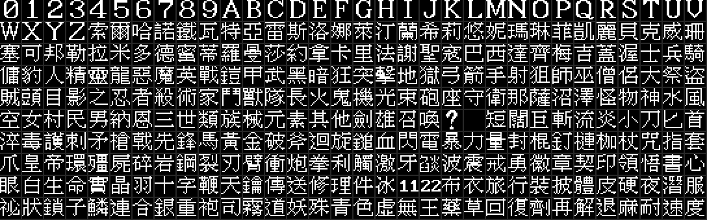
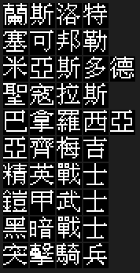
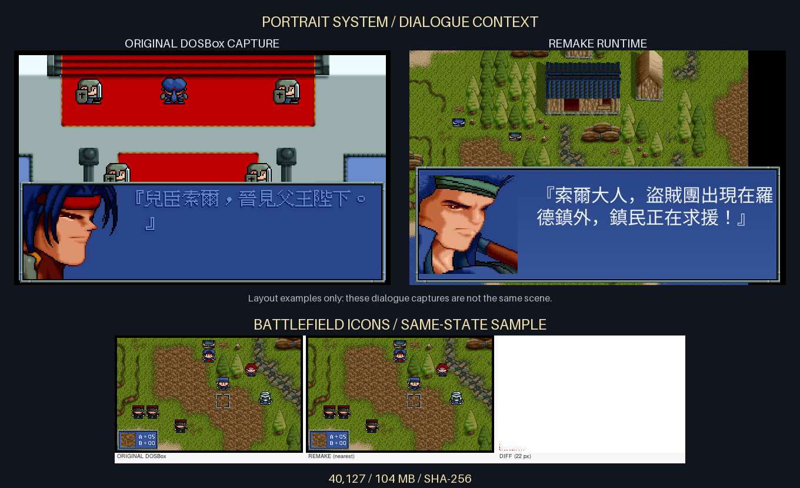
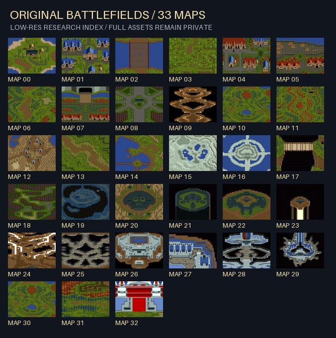
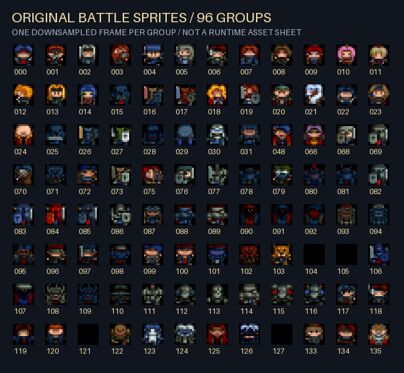
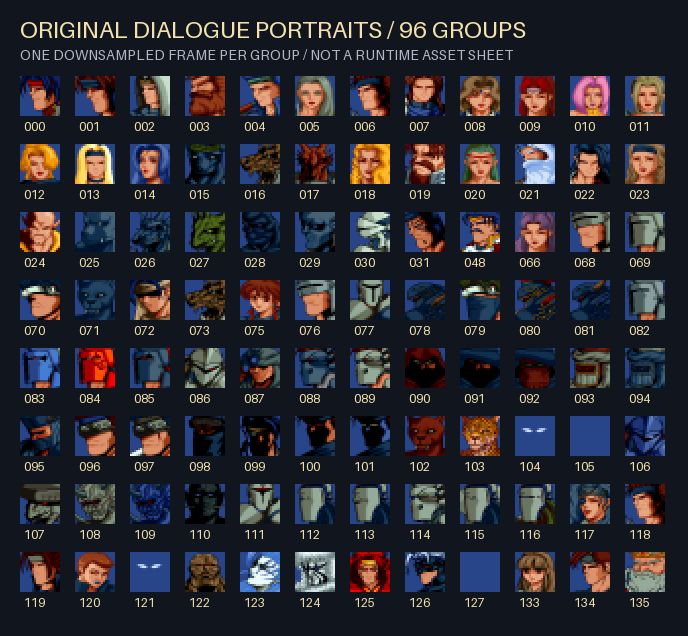
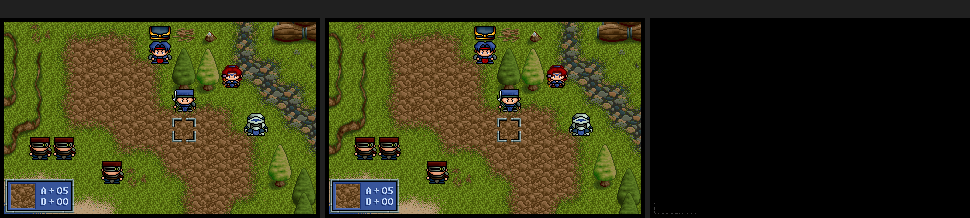
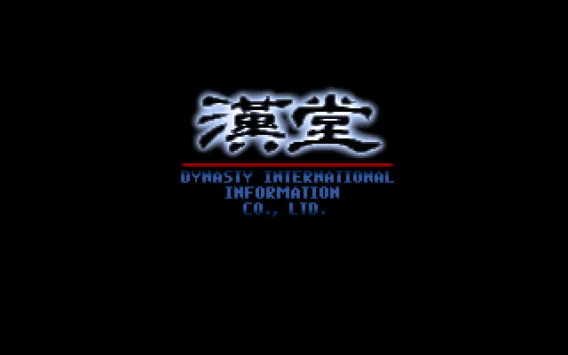
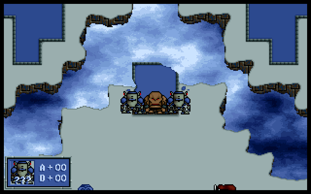
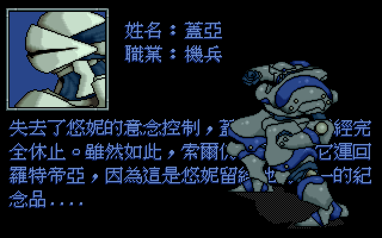

# 炎龍騎士團 2 反向工程與重製

## 引言

本專案以合法原版《炎龍騎士團 2：黃金城傳說》作為行為基準，保存它在 DOS
年代的資料格式、介面、音訊與遊戲機制，並以 Go／Ebiten 建立可編輯、可擴充的
潔淨室重製引擎。

我們要做的是重現經典，而不是把玩家困在永無止境的考古工作裡。原版戰役仍是
忠實模式的基準；對話、事件、戰鬥、城鎮、商店、教會、整備、隊伍與存檔則逐步
脫離寫死程式，成為日後能延伸新戰役的資料與規則。

原版程式及美術、文字、音樂等受著作權保護的資產不包含在本倉庫中。玩家必須
自備合法原版；本專案不代表原開發商或權利人。

## 遊戲介紹

《炎龍騎士團 2》是 1990 年代華文單機戰略角色扮演遊戲（SRPG）的代表作之一。
玩家在格狀戰場上指揮各具職業、裝備與法術的角色，並在戰鬥之間經歷劇情、城鎮、
商店、教會、轉職、整備及持續成長的隊伍。

它真正難以取代的地方，不只是三十場戰役，而是戰場、人物、音樂與戰間生活共同
形成的節奏。多數戰鬥結束後並非直接跳到下一戰；補給、交易、復活、轉職、存檔與
部署同樣是戰役的一部分。重製因此不能只還原戰鬥公式，也必須保留這條玩家路徑。

## 開發歷史

### 為台灣留一份技術紀念

逆向動畫資料時，我們在原版檔案裡找到一段幾乎被時間掩埋的署名：

> AFM — Animation File Manager Version 1.00<br>
> Copyright (C) 1993 Lo Yuan Tsung

這套由漢堂程式設計師自製的動畫工具，比遊戲發售早兩年。原始碼與說明書如今都
已不可得，但它設計的資料仍在遊戲裡運作。本專案把破解出的技術整理成可重現文件，
不只為了重製，也為了記錄 1995 年台灣團隊如何在 DOS 的限制下完成一款大型戰棋
角色扮演遊戲。

完整總覽：
[`1995 年怎麼做出《炎龍騎士團 2》`](docs/knowledge-base/15-how-fd2-was-made-1995.md)

### DOS 上的中文

DOS 本身不會替遊戲顯示中文。原版自帶點陣字型，文本也不是 Big5 字串：
`FDTXT.DAT` 保存的是 `uint16` 字模索引序列，共 1016 條字串、約 5.8 萬字；
`FDOTHER.DAT` 資源 #4 則包含 1824 個 16×16、1bpp 字模。索引 0–35 是數字與
英文字母，其後才是漢字。

| 字模解碼研究圖 | 對話解碼研究圖 |
|---|---|
|  |  |

以上兩圖是原版資料解碼研究產物，不是重製執行期畫面。格式與控制碼詳見
[`文本與字型格式`](docs/knowledge-base/08-text-and-font-format.md)。

### 開場動畫是一台繪圖位元組虛擬機

原版開場不是把每一幀都存成完整點陣圖。AFM 使用 10 個運算碼描述增量繪圖，
每幀只對上一幀留下的畫面補畫、複製或修改局部區域。96 幀的金鎖動畫因此約為
1 MB，而不是 96 份完整 320×200 畫面。

```text
影格：duration + payload_size + bytecode
指令：opcode + 參數；部分指令引用前一幀或外部圖塊
```

原版派發器位於 `0x36C9E`，跳表位於 `0x5276A`；播放器
`0x020421(index, delayMs, skippable)` 管理播放與略過，`0x3DC9F` 以開機測速忙等
校準舊硬體。重製端保留這套增量語意，但不夾帶任何原版畫格。完整證據見
[`ANI／AFM 格式`](docs/knowledge-base/39-ani-afm-format.md)。

### 同一首音樂，兩種玩家記憶

原版同時支援 Roland MT-32 與 Sound Blaster／AdLib。後者使用遊戲自帶的
`SAMPLE.AD` 音色庫，也是當年多數玩家聽見的預設聲音；MT-32 則有不同的樂器、
包絡與空間感。因此「原版音樂」不是唯一一套固定波形。

曲號不是靠聽感猜測，而是從 `play_bgm`（`0x25977`）的 32 處呼叫逐一追查，過程中
也推翻過舊曲目對應。兩條音源都只由玩家自備原版檔案在本機渲染，音色庫與 ROM
不隨倉庫散布。詳見 [`音樂播放與場景`](docs/knowledge-base/12-music-playback-and-scene.md)
及 [`音訊合成`](docs/knowledge-base/16-audio-synthesis-soundfont-mt32.md)。

## 歷史考證

本專案將格式、工具、呼叫關係與玩家可見結果一併保存，並為每個結論標示
「已證實、強推論、假說或未知」。原始位址、位元組與雜湊始終保留；語意名稱只作
導覽，不取代證據。

主要考證入口：

- [原版工具鏈](docs/knowledge-base/04-original-toolchain.md)、[圖像壓縮](docs/knowledge-base/05-image-compression-format.md)、[動畫格式](docs/knowledge-base/06-animation-format.md)、[XMIDI 音樂](docs/knowledge-base/07-music-xmidi-format.md)
- [文本與字型](docs/knowledge-base/08-text-and-font-format.md)、[劇情與對話](docs/knowledge-base/09-story-and-dialogue.md)、[角色與職業名稱](docs/knowledge-base/45-class-name-mapping.md)、[戰鬥規則](docs/knowledge-base/27-combat-rules-and-validation-checklist.md)、[敵方人工智慧](docs/knowledge-base/11-enemy-ai.md)
- [開機、標題與存檔](docs/knowledge-base/23-boot-title-and-scenario-flow.md)、[可擴展事件系統](docs/knowledge-base/29-remake-extensible-event-system.md)、[劇情腳本系統](docs/knowledge-base/19-scenario-script-system-design.md)
- [反組譯覆蓋矩陣](docs/knowledge-base/58-fd2-exe-re-coverage.md)與[知識庫總索引](docs/knowledge-base/00-index.md)

這些文件同時是「1995 年台灣怎麼做遊戲」的技術保存紀錄，不只是工程工作清單。

## 重要發現

- 原版使用自製 `.DAT` archive、RLE 圖像、索引色盤、XMIDI、AFM 與 FIGANI 等
  多套專用格式，而不是一組現成引擎資源。
- 對話文字、人物動作與大量戰役流程曾寫死在 `FD2.EXE`；重製將它們轉成可編輯
  腳本與具型別規則。
- 敵方人工智慧不是單一「找最近的人」規則。原版先依模式建立候選、評分與目標
  陣列，再由指令或物品消費端執行；重製保留已證實資料流，未知分支不猜接。
- 原版戰後流程包含城鎮、商店、教會、整備與秘密商店等節點；它們是戰役的一部分，
  不能以直接切到下一戰替代。
- 最終演出不是單一影片，而是文字閘門、角色蒙太奇、20 組尾段、定格與隊伍最終
  狀態共同形成的序列。重製端目前會停在經典終局畫面，並可循環回顧隊伍；這是
  來源約束的 `RUNTIME-E1`，未修改原版同狀態 `PLAYER-E2` 仍待抽驗。

### 原版美術與目前重製畫面總覽



*這張素材總攬圖由已審查的執行期截圖組成；本機完整分離包現有 40,127 個實體檔案、
約 104 MB，並以清冊逐檔驗證。完整原版衍生素材只保存於私人庫，不在公開 README
提供可重組原作的逐檔 atlas。上排用不同場景展示原版 DOS 對話與目前重製執行期的
人物肖像系統，只比較呈現
方式，不是同狀態忠實度證據；下排則是第一戰同一存檔、鏡頭與回合的原版／重製
戰場圖示抽樣。重製畫面仍使用玩家自備原版資料所分離的美術；現代重繪人物肖像、
戰場圖示與介面主題已進入風格樣張階段，但尚未替換正式遊戲素材，因此不把原版
分離素材或未定案樣張誤稱為新素材。*

| 33 張原版戰場低解析索引 |
|---|
|  |

| 96 組戰場角色代表幀 | 96 組對話頭像代表幀 |
|---|---|
|  |  |

*三張總覽由玩家自備原版的本機分離素材產生：戰場圖依 `map.json` 重組完整地圖，
角色動畫與頭像則每組只取一個代表幀。公開版本經降解析並壓平，只供辨識研究覆蓋，
不是可供遊戲回填的素材表；完整解析素材、全部動畫幀及可重組清冊只留在私人素材庫
與標示 `public_distribution: false` 的本機完整版。*



*同一存檔、鏡頭與回合的戰場比較；此圖只證明標示狀態，不外推全戰役。*



*重製正常啟動路徑的執行期畫面；美術來自玩家自備原版資料。*

## 重製技術創新

- **可編輯戰役資料**：以 `trigger → when → do` 事件模型與具型別 handler，將原本
  寫死的對話、增援、入隊、戰後與終局流程轉成可審查資料。
- **索引色原生呈現**：保留 DOS 時代的色盤、LUT、RLE、逐幀發布與畫面恢復語意，
  再由現代引擎跨平台顯示，避免先轉成一般 RGBA 動畫後遺失原始行為。
- **原子式失敗即關閉**：複雜法術、物品、AI 與存讀檔先在私有狀態預檢；缺少來源
  或資產時不發布半套交易，避免玩家存檔被猜測性實作污染。
- **持續隊伍與原始存檔橋接**：保留加入順序、裝備、指令、HP／MP、增援與部署
  邊界，使戰場、城鎮、整備與終局能共享同一支隊伍。
- **證據驅動的畫面比較**：把輸入序列、狀態、資產雜湊、畫面差分及證據等級綁在
  一起；不以單張看似相近的截圖宣稱整套介面完成。
- **可延續的潔淨室引擎**：原版戰役是第一個正式資料包；長期目標是讓新戰役能沿用
  同一套戰鬥、事件、城鎮與存檔能力，而不必修改原版 executable。

工程架構移至 [`docs/ENGINEERING.md`](docs/ENGINEERING.md)；第一輪重製門檻、目前
進度與剩餘工作移至 [`docs/REMAKE-STATUS.md`](docs/REMAKE-STATUS.md)。

## Remake 里程碑

**v0.1.1 操作與呈現修正版**提供 Linux、Windows 與 macOS 引擎封包，修正第一關
隊伍進場時基與全戰役共用的戰場功能選單錨點；完整變更見
[`v0.1.1 發行說明`](docs/releases/v0.1.1.md)。v0.1.0 的
[推廣片](https://github.com/wicanr2/fd2_re/releases/tag/v0.1.0)仍保留第一關與四語切換紀錄。公開封包不含原版
素材；玩家必須自備合法的《炎龍騎士團 2》資料。推廣片實際走正式標題、第一關與
F4 四語切換，錄製契約與驗收收據見
[`v0.1.0 推廣片規格`](docs/promo-v0.1.0-spec.md)。

第一輪重製的 60／60 個分層代表性抽樣已符合正式路徑資格；這是 95% 信心的
第一輪里程碑，不代表 DOS 逐像素、逐音訊或逐週期一比一。詳細分級與限制以進度頁為準。

- **資產保存**：主要容器、圖像、字型、文字、動畫、地圖與音樂格式已有可重生工具。
- **可操作垂直切片**：標題、讀檔、戰場、玩家指令、敵方回合、城鎮、商店、教會、
  整備、存讀檔與多個戰後節點已接入正式 runtime（多數為 `RUNTIME-E1`）。
- **戰役後段**：第29／30戰、最終整備、終局文字、角色蒙太奇、20段尾段、定格與
  隊伍回顧已有連續重製端路徑；一般玩家同狀態 `PLAYER-E2` 尚未全部抽驗。
- **跨平台候選**：Linux AppImage、Windows ZIP、macOS universal DMG／tar.gz 已能
  建立並通過封包自我檢查，並隨 v0.1.0 公開；Windows／macOS 實體操作仍待驗收。
- **第一輪完成**：戰役／戰間、戰鬥／AI、介面、存檔／持續隊伍、終局／平台五層
  共60格已達最低配額且零完整性錯誤；後續以玩家回報與發行驗收為主。

里程碑的即時證據、分數與抽樣矩陣不在首頁重複維護，請看
[`FD2 第一輪重製進度`](docs/REMAKE-STATUS.md)。



*此圖由正式標題 `LOAD` 的普通鍵盤路徑產生；使用固定雜湊第三方存檔與 dummy
音訊裝置，因此證明重製流程可達，不代表從第一戰完整通關或精確音訊 E2。*



*此圖由正式標題 `LOAD`、普通 Return／Space 與玩家自備原始資產產生；屬
`RUNTIME-E1`，不冒稱未修改 DOS 長程通關或精確硬體音訊。*

## 致謝

感謝漢堂國際資訊與《炎龍騎士團 2》原開發團隊，留下這部至今仍值得研究與遊玩的
作品；也特別記錄 AFM 工具署名者 **Lo Yuan Tsung**，讓三十多年後的人仍能從資料
理解當年的工程設計。

感謝保存實體遊戲、測試存檔、攻略、錄影與硬體聲音的玩家社群。攻略與影片只作
玩家可見行為旁證，不取代原始位元組、合法執行期實驗或同狀態比較。

本專案中的原創程式與文件由各貢獻者完成；原版名稱、程式及資產權利仍屬其權利人。

## 授權與商業使用

本倉庫中由專案貢獻者創作的程式碼與文件，依
[PolyForm Noncommercial 1.0.0](LICENSE) 授權：可在授權條款允許的非商業目的下
使用、修改及散布。任何商業用途均不在這份非商業授權範圍內，必須事先與
[儲存庫擁有者](https://github.com/wicanr2)另行取得書面商業授權。

此授權不涵蓋、也不重新授權原版《炎龍騎士團 2》的名稱、程式、美術、文字、
音樂、音效或其他資產；這些內容不隨本倉庫散布，權利仍屬其各自權利人。
