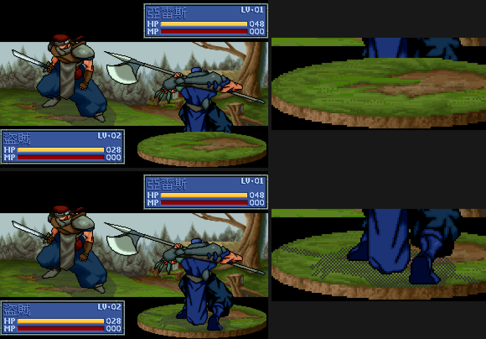

# 103 — 我方被攻擊時腳步被台座遮住（2026-09-09）

第 6 項前半的具體症狀：亞雷斯被攻擊時，腳步被圓盤地板遮住。

## 為什麼只有被攻擊時會發生

台座（`TAI.DAT` 菱形素材，doc [35](35-battle-animation-rendering.md) §3.3）
固定畫在右側 slice，而左右不是由當回合誰攻誰守決定的——**FIGANI 幀標頭內嵌的
絕對螢幕座標按陣營分邊**，同一個單位不論攻守都留在自己那一側。分離素材包的
實測值（`figani.LoadSeparatedResource` 解出的 `Frame.X`，與
`assets/figani/meta.json` 一致）：

| 資源 | 角色／用途 | 幀內嵌 x（@320） |
|---|---|---|
| 12 / 13 | 亞雷斯 待機／攻擊 | 89–178 |
| 0 / 1、3 / 4、9 / 10 | 我方其他職業 待機／攻擊 | 85–206 |
| 288 / 289 | 盜賊 待機／攻擊 | 6–28 |

台座左上固定在 (165,157)@320，所以會壓到台座的**永遠是我方那張圖**。

`drawBattleScene` 先前把三個圖層固定畫成「守方 figure → 台座 → 攻方 figure」。
我方攻擊時我方是攻方，畫在台座之後，腳看得到；敵方攻擊我方時我方變成守方，
畫在台座之前，腳就被蓋住。

## 原版是兩個方向都踩在台座上

原版收據
[fd2-physical-attack-presentation-20260909.json](../data/ui-traces/fd2-physical-attack-presentation-20260909.json)
拍的正是**敵方攻擊我方**那一段（`CONTINUE` 後每回合把游標推到地圖角落再
END／YES，推進兩個敵方回合到接戰）。三張畫面裡我方索爾都在右邊、背影、踩在
台座上、腳沒有被蓋住；敵方盜賊在左邊、正面、沒有台座。面板也是按陣營分：
右上索爾（我方）、左下盜賊（敵方）。

這與 doc 35 §3.2.5 已記的「台座跟隨我方 slice，不是當回合攻／守」一致，
那一節同時把用攻方／守方描述左右正名為誤框架。

## 修正

`remake/cmd/fd2/battle_scene_layers.go` 用一條規則決定順序：**台座緊接在我方
figure 之前**。

| 情境 | 順序 |
|---|---|
| 我方攻擊（`atkOwn`） | 守方 figure → 台座 → 攻方 figure |
| 我方被攻擊 | 攻方 figure → 台座 → 守方 figure |

`drawBattleScene` 依這個順序逐層 blit。守方的 FIGANI 幀在開始畫任何一層之前
先解析完：排程解不出來時整幀都不畫，否則順序一換，敵方攻擊方向會漏出「只有
台座與攻方」的半成品畫面。回歸 `TestBattleSceneDrawsPedestalRightBeforeOwnFigure`
兩個方向都釘。

左欄是修正前／後整幀，右欄是台座區域 ×2 放大。

## 量測

擷取條件與收據見
[fd2-battle-pedestal-zorder-20260909.json](../data/ui-traces/fd2-battle-pedestal-zorder-20260909.json)。

- 敵方攻擊我方方向：修正前後 `frame_00` 差 **7564** 像素（共 256000），
  差異全部落在台座與我方腳下。
- 我方攻擊方向：序列中的 `frame_77` 與 2026-08-25 存檔的
  [`battle-impact-no-global-tint.png`](../figures/battle-impact-no-global-tint.png)
  **逐位元組相同**（sha256 `0bb49251…`）。這個方向的順序沒有被改動。

## 擷取夾具

`FD2_SHOT_ATTACK` 的預設方向是亞雷斯打盜賊；加上
`FD2_SHOT_ATTACK_INCOMING` 換成盜賊打亞雷斯，攻守單位、名字與 HP／LV 一起
對調。只翻 `atkOwn` 而不換單位會拍出「面板寫我方在守、圖還是亞雷斯在攻」的
樣本，驗不到受擊側。

## 尚未涵蓋

- 原版演出的逐幀分鏡與時序，以及與重製端逐張對照。本輪只對照版面與遮擋關係。
- 台座 idx 由 `byte[unit+6]` 決定的完整規則。
- 亞雷斯／盜賊以外角色的 slice 座標全庫盤點。本輪抽驗六筆資源。
