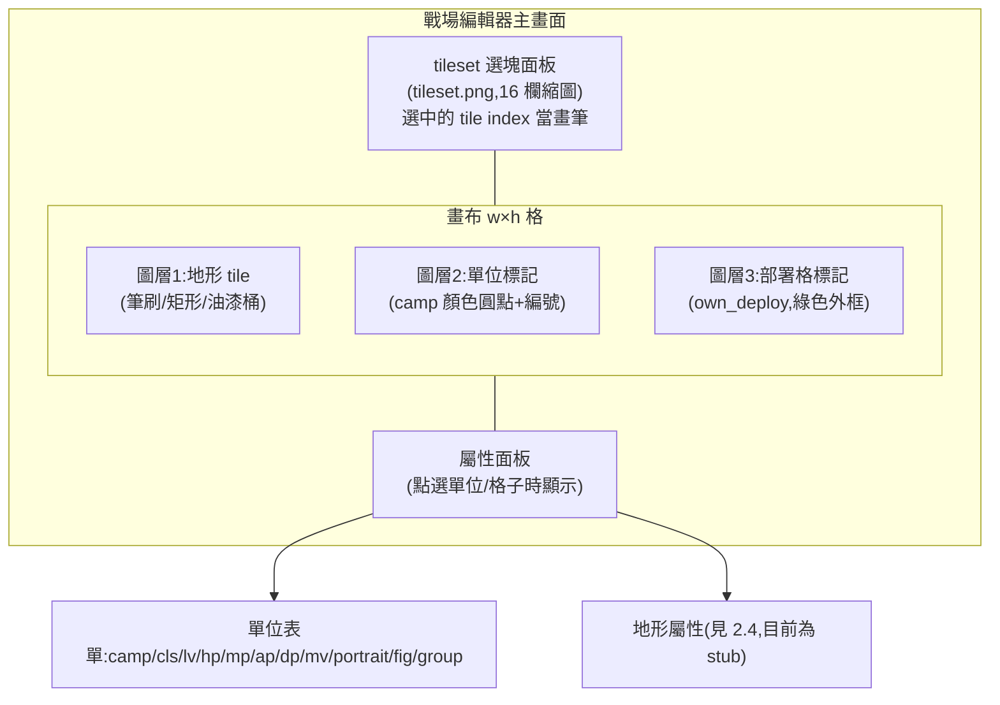
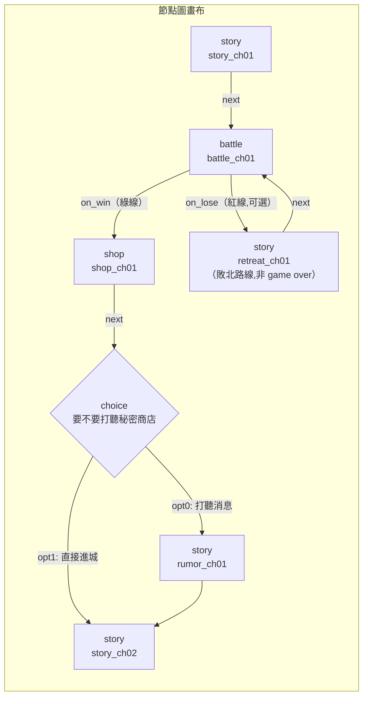
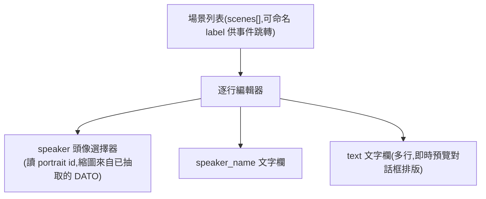

# 38 — 戰場編輯器 + 劇情編輯器設計

> 目標:讓玩家/創作者不用碰 Go 原始碼,就能拓展自創戰場與劇情,擺脫原版固定 30 關(呼應 `17` 擴充可行性評估的結論)。
> 本篇只做設計規劃,不動任何程式碼或資產。承接:`19`(campaign 節點圖)、`29`(事件 DSL)、`21`(引擎架構)、`17`(擴充可行性)。
> 依據:`remake/internal/campaign/campaign.go`(Node schema)、`remake/internal/battle/event.go`(Scenario/Event schema)、
> `remake/internal/battle/model.go`(Unit schema)、`tools/gen_campaign.py`(既有自動生成管線)。

## 1. 設計原則

1. **編輯器產物 = 引擎現有 JSON 格式,零引擎改動即可玩**。編輯器不定義新 schema,只是「填 `campaign.go`/`event.go`/
   `model.go` 既有欄位」的圖形介面。存檔就是 `map.json` / `mapN_units.json` / `campaign.json` / `chNN.json`(scenario)/
   `story/chNN.json`,跟 `gen_campaign.py` 產出的檔案一模一樣,`ScenarioRunner` 分不出是生成的還是手畫的。
2. **原版 30 關資料可當模板複製改作**。`remake/assets/scenarios/ch01.json`~`ch30.json`、`assets/maps/map0`~`map32` 都是
   合法起點——編輯器提供「複製現有章節另存新 id」而非要求從空白畫布開始,降低創作門檻。
3. **deep-module 思維:編輯器的複雜度不外漏到引擎**。引擎(`internal/battle`、`internal/campaign`)只認得穩定的 JSON
   契約,完全不知道資料是 `gen_campaign.py` 生成還是編輯器存的還是手改的。編輯器內部的節點圖佈局演算法、tile 筆刷邏輯、
   表單驗證——這些複雜度全部關在編輯器自己的程式裡,一行都不進 `remake/internal/`。
4. **只暴露程式碼實際支援的詞彙,不暴露文件的願景詞彙**。`29` 文件描述的事件 DSL(`branch`/`spawn_march`/`hp_below`/
   `call` 等)是**設計願景**,但 `event.go` 目前只刻了一小部分(見 §3.3 對照表)。編輯器的下拉選單必須以 Go 程式碼
   的 `Registry` 為準——選單列出「引擎現在能執行的」,不能列出「文件說未來會做的」,否則存出來的事件引擎讀了也不會動,
   使用者會誤以為自己做錯。擴大 DSL 詞彙是**引擎工作**(在 `event.go` 加 case),編輯器只是先跟上、不超前。

## 2. 戰場編輯器(Battle/Map Editor)

### 2.1 輸出檔案與欄位對照

| 編輯器操作 | 寫入檔案 | 欄位(`map.go`/現行 JSON schema) |
|---|---|---|
| 地圖尺寸、tileset 選擇 | `map.json` | `w`, `h`, `tileW`(=24), `tileH`(=24), `cols`(=16,tileset.png 每列格數) |
| tile 繪製(筆刷/矩形/填充) | `map.json` | `tiles[]`(長度 `w*h`,tile index,左上到右下 row-major) |
| 單位擺放(陣營/數值/波次) | `mapN_units.json` | `units[]`:`camp`(own/ally/enemy)、`cls`/`cls_name`、`lv`、`hp`/`mp`/`ap`/`dp`/`mv`、
  `portrait`、`fig`(sprite 組,通常=角色 id)、`group`(出場波次,255=保留槽位不出場)、`x`/`y` |
| 部署格 | `mapN_units.json` | `own_deploy[]`:`{x,y}` 陣列,`scenario`(見劇情編輯器)的 `deploy_cells` 優先取這裡 |

### 2.2 UI 佈局(示意)



- 三個圖層可各自顯示/隱藏,但存檔時 tile 與單位是分開寫入 `map.json`/`mapN_units.json`(對齊現行檔案分離)。
- 單位擺放用「點格子 → 開表單」而非拖拉精靈圖(M1 sprite 尚未按地圖全覆蓋,表單先行,縮圖預覽為加分項)。
- `group` 欄位需要一個「波次總覽」側欄(依 group 分組列出單位數),因為 `group` 同時決定「初始是否在場」
  (`initial_groups`,見劇情編輯器)與「哪一波增援放誰」——這是戰場編輯器與劇情編輯器**共用同一份 group 編號**的關鍵欄位,
  兩個編輯器必須用同一個 group 對照表,不能各編各的。

### 2.3 地形屬性:誠實標注目前是 stub

`remake/internal/battle/move.go` 現在的 `MoveCost` 是**全平地成本 1**,程式碼註解明寫「地形成本留待接入地形屬性後加權」——
換句話說,**引擎目前完全不讀地形屬性**,不管 tile index 畫的是草地還是水塘,移動成本都一樣。

編輯器設計上分兩步走,避免做出「畫了但沒用」的假功能:
- **v1**:不做地形屬性編輯 UI。tile 只是視覺層,`tiles[]` 陣列只影響畫面,不影響玩法。
- **之後**(依賴引擎先做):等 `move.go` 真正接了「tile index → 地形類型 → 移動成本」的對照表,編輯器才加「地形屬性」
  面板(多半是唯讀查表:選中 tile index 顯示對照表當時算出的成本,而非讓使用者逐格填數字——地形成本應該綁在
  tileset 素材本身的元資料,不是逐地圖填)。

### 2.4 圖塊繪製工具

| 工具 | 行為 |
|---|---|
| 筆刷 | 單擊/拖曳塗選中的 tile index |
| 矩形 | 拖出矩形範圍,鬆開後整片填入選中 tile |
| 填充(油漆桶) | 點一格,把相連同 tile index 的區域全換掉(flood-fill,同 `nearestFree` 的環狀搜尋概念,但用連通域) |
| 橡皮擦 | 還原成地圖預設空地 tile(需 tileset 附一個「預設空地 index」的慣例,或讓使用者指定) |

## 3. 劇情編輯器(Story/Campaign Editor)

### 3.1 campaign 節點圖

| 編輯器操作 | 寫入欄位(`campaign.go` `Node`) |
|---|---|
| 新增節點 | 選 `Type`:story / battle / choice / event / shop / ending |
| 拖線轉場 | story/event/shop → `Next`;battle → `OnWin`/`OnLose`(拖兩條不同顏色的線);choice → `Options[].To` |
| 旗標管理 | 節點上設 `SetFlags map[string]bool`;choice 選項的 `Options[].If` 可勾選「需要某旗標為真才顯示」 |
| 敗北路線 | `battle` 節點的 `OnLose` 預設空(=game over),編輯器提供「連到另一個節點」取代 game over,UI 上用醒目的
  紅色轉場線區分(呼應 `19` 的核心賣點:敗北不一定是死路) |



- 節點卡片上直接顯示該節點的關鍵資訊(story 顯示第一句對白、battle 顯示 map/scenario 檔名、shop 顯示品項數),
  不用點開才知道內容——這是「填表」而非「盲改 JSON」體驗的關鍵。
- **battle 節點**的 `Map`/`Units`/`Scenario` 三個欄位是檔案路徑,編輯器用下拉選單列出 `assets/maps/*` 與
  `assets/scenarios/*` 現有檔案,並提供「用戰場編輯器開啟/新建」的捷徑按鈕——把兩個編輯器串起來,不是各自孤立的工具。

### 3.2 對白編輯(story json)

對映 `remake/assets/story/chNN.json` 現行格式:`{chapter, title, source_dat, location, scenes[].label / scenes[].lines[].speaker / speaker_name / text}`。



- `speaker: -1` 是旁白(無頭像),編輯器要把它當一個明確選項而非「找不到頭像時的錯誤狀態」。
- 對話文字沒有原版 1824 字模的限制(`17` 已定論:重製用完整 TTF),編輯器可以是純文字輸入,不用擔心缺字。

### 3.3 戰場事件(trigger/when/do 表單)

**這是最需要「只暴露程式碼實際支援」的一塊。** 下表左欄 = 表單下拉選單的完整內容(不多不少),右欄 = 對應
`event.go` 現況:

| 表單欄位 | 目前 `event.go` 支援的選項(v1 編輯器只能選這些) | doc `29` 願景但**尚未實作**(不放進 v1 選單) |
|---|---|---|
| `trigger` | `on_battle_start` / `on_turn_end` / `on_unit_death` | `on_turn_start` / `on_unit_move` / `on_tile_enter` / `on_dialogue_line` / `on_item_used` / `on_shop_enter` / `on_chapter_clear` |
| `when` | `turn`(int,0=不限) / `unit_dead`(角色名) | `unit_alive` / `roster_has` / `hp_below` / `flag` / `and`/`or`/`not` 條件樹 / `unit_in_region` 等 |
| `do`(action type) | `spawn_party` / `spawn_group`(含 `groups`/`camp`/`act_immediately`) / `dialogue`(`speaker`/`text`) / `set_flag` / `set_ai`(`unit`/`mode`) | `spawn_march` / `show_scene` / `give_item` / `recruit` / `move_unit` / `transform` / `play_music` / `branch` / `call` / `win`/`lose` |

- 表單本身**動態讀取一份「能力清單」**(建議由編輯器維護一份小 JSON,手動同步 `event.go` 的 `Registry` 內容;
  長期可以在 Go 端加一個 `--dump-registry` 除錯指令直接吐出清單,避免兩邊手動同步漂移)。
- 右欄詞彙不是「編輯器做不到」,是「**引擎還沒做**」——這些要先在 `event.go` 加 case、`When`/`Action` struct
  加欄位,編輯器才能開放對應選項。把這份對照表放進設計文件,是為了讓「擴大 DSL」的優先順序清楚地落在引擎待辦,
  不會被誤解成編輯器的技術債。
- 已實作的 `spawn_party`/`spawn_group` 兩個動作,在表單上要能直接引用戰場編輯器畫的 `group` 編號(見 §2.2),
  下拉選單列出該地圖現有的 group 清單,而不是要使用者記數字。

### 3.4 商店品項

對映 `campaign.go` 的 `Good{ID, Name, Price}`,`Node.Goods`/`Node.Secret`/`Node.SecretIf`:

- 一般商品表格編輯(新增/刪除列,ID 對應 `docs/data/exe_tables/item.json` 或衍生創作自訂 ID)。
- 祕密商店:勾選「此節點有祕密商店」→ 出現 `Secret[]` 品項表 + `SecretIf` 旗標下拉(選一個已定義的旗標名)。
  這是原版就有的機制(`e09c68c` 已在引擎接好),編輯器只是把它填表化。

## 4. 技術選型評估

| 維度 | (a) 引擎內建編輯模式(Ebiten,F2 進入) | (b) 獨立網頁編輯器(單檔 HTML/JS) | (c) 第三方工具管線(Tiled → 轉換器) |
|---|---|---|---|
| 開發量 | 高:immediate-mode UI 缺表單/樹狀圖/節點圖元件庫,筆刷、屬性面板、node graph 全要手刻 | 中:canvas tile 繪製、SVG/DOM node graph、原生表單元件都是成熟的 web 開發套路 | 低(僅地圖部分):Tiled 本身就是成熟地圖編輯器;但劇情/事件/商店完全沒有對應功能,仍要另刻一個劇情編輯器,實際總量不比 (b) 少 |
| 跨平台 | 好(哪裡跑遊戲哪裡就能編輯),但手機觸控做複雜表單/節點圖體驗差 | 好,瀏覽器到處有;桌面/手機都能開,行動裝置上做複雜編輯體驗依然吃力,但至少不必額外裝東西 | 差:Tiled 是桌面軟體,手機端完全用不上;多一層「先在桌面用 Tiled、再匯出」的斷點 |
| 素材授權 | 引擎本來就要求玩家自備原版產出 `assets/`,tileset.png 已在本機檔案系統 → 天然合規 | 頁面本身開源(不含 tileset.png),tileset.png 用本機路徑載入(`file://` 或本機 localhost fetch),不上傳到任何伺服器 → 合規,且與「素材本機保留不上 GitHub」鐵則(見 memory)一致 | Tiled 讀本機 tileset.png 一樣合規;但轉換器輸出的 `.tmx`/`.tmj` 若被誤上傳到 repo 當範例,要注意別夾帶真實素材路徑或截圖 |
| 使用者體驗(deep-module 角度) | 差:editor UI 程式碼會混進 `internal/render`、`internal/input`,讓原本乾淨的遊戲渲染/輸入層背負編輯器複雜度,違反「編輯器複雜度不外漏到引擎」原則 | 好:編輯器是完全獨立的程式(不同語言、不同 repo 目錄),`remake/internal/` 一行都不用改,天然滿足 deep-module | 中:Tiled 部分乾淨(外部工具,不進 repo);但轉換器 + 劇情編輯器仍要維護,整體不比 (b) 乾淨 |
| 資料一致性風險 | 低(同一份 Go struct,不會有 schema 漂移) | 中:編輯器是另一套語言(JS),要手動維護 schema 同步(§3.3 已指出用能力清單 JSON 緩解) | 中高:多一層 Tiled schema → 轉換器 → 引擎 schema 的映射,對應細節(tileset columns、tileW 等)容易在轉換器裡出錯且不易一眼看出 |

**建議:選 (b) 獨立網頁編輯器,作為單檔 HTML/JS 應用**,理由:
- 對「戰場 tile 繪製 + 節點圖 + 表單」這組需求,web 平台(canvas + DOM + SVG)本來就是最省力的工具箱,比 Ebiten
  immediate-mode UI 省下大量重造輪子的成本。
- 完全不進 `remake/internal/`,乾淨滿足 deep-module 與「引擎不為任何一關寫死分支」的既有設計原則(`29` §8)。
- 唯一要補的基礎設施是**一個小的本機讀寫橋**——瀏覽器沙盒預設不能寫本機檔案,需要下面兩種之一:
  - Chrome 的 File System Access API(`showDirectoryPicker`),讓使用者手動授權 `remake/assets/` 目錄,零額外程式;
  - 或一個極簡本機小 server(Go 或 Python 都行,不拘)只做「讀寫 `assets/` 白名單路徑」的 HTTP API,換取更好的
    跨瀏覽器相容性。**v1 建議先用 File System Access API**(零額外依賴、零安裝步驟),相容性不足時才退回小 server。
- (c) Tiled 不是「不能用」,而是「現在不必」——劇情編輯器沒有對應的第三方工具,做出來的整合面積也就只剩地圖那一塊,
  投報比不如 (b) 一次把兩個編輯器用同一套技術做完。**列為 roadmap 後期的可選擴充**(見 §5 Phase 3 之後):如果
  tile 繪製需求變複雜(多圖層地形、物件層、動畫 tile),再評估「匯入 Tiled 匯出的 `.tmj`」當一種替代輸入來源,
  而非取代自製戰場編輯器。

## 5. MVP 切片與 roadmap

| 階段 | 範圍 | 驗收標準 |
|---|---|---|
| **Phase 1(MVP)** | 戰場編輯器:tile 繪製(筆刷/矩形/填充)+ 單位擺放(表單)+ 部署格標記。輸出 `map.json` + `mapN_units.json`。 | 用編輯器從空白畫一張新地圖(或複製 `map0` 改作),存檔後,既有引擎(`go run ./cmd/fd2` 或現有測試 harness)能直接載入該地圖並顯示——**不需要任何額外轉換步驟**。 |
| **Phase 2** | 劇情編輯器第一部分:對白編輯(story json,speaker 頭像選擇)+ 戰場事件表單(§3.3 能力清單範圍內)+ 商店品項編輯。 | 用編輯器把 Phase 1 做的地圖,配上一段開場對白 + 一條 `on_turn_end` 增援事件 + 一個商店節點,手動串成一個 `campaign.json` 片段(先不要求節點圖 UI,允許直接編輯 `Next`/`OnWin` 欄位的文字下拉),能在引擎裡完整玩過一輪「story → battle(觸發增援)→ shop」。 |
| **Phase 3** | campaign 節點圖(拖線轉場、旗標管理、敗北路線、choice 分支可視化)。 | 用編輯器做出一個**非原版線性**的 campaign:至少含一條 `battle.OnLose` 敗北路線(接到重打或替代節點,不是 game over)、一個 `choice` 分支(`Options[].If` 依旗標過濾),整包在引擎裡跑通首尾。 |

三階段順序理由:Phase 1 最快證明「編輯器產物零轉換即可玩」這條設計原則成立(整份規劃的地基);Phase 2 把「填表產生
可玩內容」的體驗擴大到劇情/事件,但先不處理最複雜的圖形化節點連線;Phase 3 才做工程量最大、也是使用者感受
「擺脫固定 30 關」最直接的節點圖 UI。

## 6. 與 `gen_campaign.py` 生成管線的關係

`tools/gen_campaign.py` 與編輯器是**互補、不互斥**的兩條路:

- **`gen_campaign.py` 負責保真度**:一次性(或 RE 進度更新後可重跑)從已反組譯的原版資料(`doc28` 目標表、
  `docs/data/shops.json`、`assets/maps/*`)自動算出忠實還原原版 30 章的 `campaign_full.json` + `chNN.json` scenario stub。
  它的價值在「跟原版資料對得上」,精確度取決於 RE 進度(目前 `initial_groups`「全開」是已知的近似,見 `gen_campaign.py`
  檔頭「RE 撞牆記錄」)。
- **編輯器負責創造性擴充**:人工在 `gen_campaign.py` 產出的檔案上加分支、新戰場、新商店,或直接複製一個 `chNN.json`
  當模板另存新章節。編輯器**能載入既有 campaign.json 當起點繼續編輯**,不是只能從空白開始——這樣使用者可以「先跑
  一次 `gen_campaign.py` 拿到原版 30 章基底,再用編輯器疊加自創內容」,兩邊共用同一份 schema,不衝突。
- 分工的另一層意義:`gen_campaign.py` 的近似值/RE 撞牆記錄(例如回合增援 group 分配)只影響「自動生成」路徑;
  使用者若想要更精確的原版重現,可以在編輯器裡手動核對青衫攻略後修正,不需要等 RE 進度追上才能玩到位。

## 7. worklist 建議條目(可直接貼進 `91-worklist.md`)

```markdown
- [ ] **戰場編輯器 MVP**:網頁單檔 HTML/JS,tile 繪製(筆刷/矩形/填充,讀 tileset.png)+ 單位擺放表單 + 部署格標記;
      File System Access API 讀寫 `remake/assets/maps/`;輸出 `map.json`+`mapN_units.json`,驗收=引擎零轉換直接載入
- [ ] **劇情編輯器:對白 + 事件表單**:story json 逐行編輯(speaker 頭像選擇器)+ 戰場事件表單
      (下拉選單=`event.go` 現行能力清單,見 `38` §3.3,不超前引擎實作);商店品項表格編輯(含祕密商店 SecretIf)
- [ ] **編輯器能力清單同步機制**:Go 端加 `--dump-registry` 除錯指令,吐出 `event.go` 目前支援的
      trigger/when/action 清單 JSON,編輯器讀這份清單動態產生表單選項,避免手動同步漂移
- [ ] **campaign 節點圖編輯器**:拖線轉場(`Next`/`OnWin`/`OnLose`/`Options[].To`)、旗標管理、敗北路線可視化
      (紅線區分 `OnLose`)、choice 分支;可載入既有 `campaign.json`(含 `gen_campaign.py` 產物)繼續編輯,非從零開始
- [ ] **地形屬性接線**(引擎待辦,編輯器依賴):`move.go` MoveCost 目前全平地成本 1;待接入
      tile index → 地形類型 → 移動成本對照表後,編輯器才加地形屬性面板(唯讀查表,不逐格手填)
```

## 風險/注意

- **schema 漂移**:編輯器(JS)與引擎(Go)是兩套語言各自維護同一份 JSON 契約,§3.3 的能力清單同步機制是防線,
  但長期應該考慮從 Go struct 自動產生 JSON Schema 給編輯器端做表單驗證,而不是永遠手動對照。
- **「填表」與「盲改 JSON」的邊界**:任何欄位如果編輯器選單沒覆蓋到(例如未來新增的 `Node` 欄位),使用者退回手改
  JSON 仍要能用——編輯器不該是唯一寫入路徑,存檔格式本身要保持人類可讀可手改(現行 JSON 已滿足)。
- **保全原味**:編輯器做出的地圖/劇本是衍生創作,不隨編輯器散布原版素材(`tileset.png`/頭像等仍要求玩家自備原版
  抽取);編輯器本身(HTML/JS 程式碼)可公開,不含任何原版資產。
