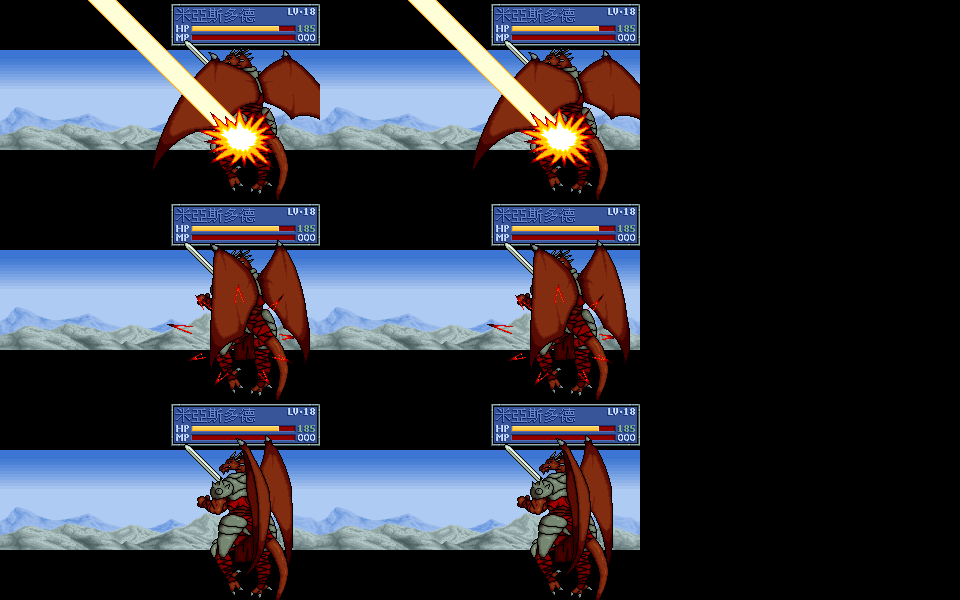

# 58 — `FD2.EXE` 反組譯覆蓋與重製閉合矩陣

## 2026-10-05 本輪目前狀態

| 項目 | 分層狀態 | 最近驗證與入口 |
|---|---|---|
| 第12章故事、走行與逐格游標 | 有限 CONFORMED／RUNTIME-E1 | 目前程式基準4c6da8dd；[mode3主證據](../data/ida/fd2_terrain_mode3_review_20261001.json)保留原版、正式Game及完整存檔回歸。 |
| #52最後地形像素 | 原版配置器未知，工具政策限制 | 本輪#167勘誤；原17點16點一致，3152仍1px；不是111阻擋。 |
| #167收據配置器政策 | CONFORMED，工具範圍 | 來源雙hash、三項近堆測試與完整metadata驗證；詳見本頁最新勘誤。 |
| #166原生物理演出 | 單次MISS有限CONFORMED／RUNTIME-E1 | 正常玩家、一般AI與mode11消費逐揮與counter排程；有限收據見本頁最新節及[主契約](../data/ida/fd2_physical_background_selection_20261004.json)。其他原版影格與work續接仍待驗收，[Issue](https://github.com/wicanr2/fd2_re/issues/166)保持開啟。 |
| 正式章驗收 | 保持現行台帳 | [111](../goal/111-goal-original-parity-campaign-20260915.md)及真實遠端worklist；本輪未增加PLAYER-E2。 |

> 2026-09-15 起，全戰役原版一致依 [111](../goal/111-goal-original-parity-campaign-20260915.md) 由代理程式以 dosgolem 逐章推進；v.1.0.19 完整包與當時修正／未通過項目仍以 [94](94-ch01-town-parity-20260908.md) 為準。

2026-09-14 ch21／ch22 動態增援來源（`RE-CLOSED`）：固定雜湊 `FD2.EXE`
已由 IDA Pro 9.4 逐筆閉合 event47／49。`0x51B91` 的 raw slots
`0x51C4D`／`0x51C55` 分別指向 `0x35112`／`0x351E9`；兩個 handler 均以
`mov eax,[0x53BEF] → sar/sub/sar → push eax → call 0x10B4E` 計算有號
向零截斷的回合數除以二。主證據同時保存 `0x1A85A` 間接 dispatcher、
回合欄位全部直接讀寫集合與 `0x10B4E` 的 FDFIELD group consumer，沒有用
直接 xref 取代間接呼叫鏈。第21章回合2／4／6／8得到 groups1／2／3／4，
第22章回合3／7得到 groups1／3，六筆與版本化 FDFIELD 擷取資料全數一致；
攻略只作玩家可見情境旁證。完整原始位址、bytes、推論等級與6/6 coverage見
[`fd2_reinforcement_eax_sources.json`](../data/ida/fd2_reinforcement_eax_sources.json)。
此項只閉合增援來源公式，不提升兩章整體一般玩家 `PLAYER-E2`。

2026-09-14 戰鬥對白輸入（`RE-CLOSED`／`RUNTIME-E1`）：dosgolem 三臂在第一關
第 3 回合事件分派呼叫鏈 `0x342AB`，以及第二關回合起手呼叫鏈 `0x32D6B`，分別
固定空鍵盤等待點後只替換 `Esc`／`Enter`／無輸入。兩個案例的 `Esc` 與 `Enter`
都各消耗一次 BIOS 鍵盤讀取，後續四個控制邊界逐項相同；無輸入不增加讀取計數，
並在 EIP／畫面分流。正式戰鬥事件與起手對白已共用 typed 推進 gate；完整計畫、
runner commit、EXE 雜湊、畫面與狀態雜湊見
[`battle-dialogue-esc-vs-enter.json`](../data/ui-traces/battle-dialogue-esc-vs-enter.json)。
第二關案例的起始存檔祖先使用鎖 HP 修改路徑，只支持窄輸入語意；不宣稱整段一般
玩家 `PLAYER-E2` 或其他選單也接受 `Esc`。

2026-09-11 死亡效果與升級上限（`RE-CLOSED`／`RUNTIME-E1`）：`0x1B6B7` 收集、`0x1AA1D`
分派的四種型態都已接進重製端；型態 2 用到的 23 個全域事件處理器（`0x51B91` 表）
由 `tools/extract_native_death_events.py` 逐指令轉寫並做覆蓋檢查，型態 3 是章節戰場
文字庫（FDTXT 資源 `[0x53C03]+1`）的一句。升級上限、30 級歸零與升級不補目前 HP 依
`0x1E292`／`0x1E529`／`0x1B750` 實作。2026-09-13 已移除第 27 關故事檔唯一重複登記的
台詞，FDTXT_027 與可編輯故事成為 68:68 順序映射；事件 64 的 `2:64` 程式及延後生成
群組 3／4／5 已通過資料覆蓋與正式執行期聚焦測試，達 `DATA-READY`／`RUNTIME-E1`，
未提升為一般玩家路徑 `PLAYER-E2`。
同日另以 IDA 9.4 閉合 `0x1AA56..0x1AB77`：死亡掉落物品滿欄時，原版不是轉交
隊友，而是詢問是否丟棄擊殺者自己的一件舊物品；YES 走
`0x1B932→0x1B722→0x1B8E7→0x1BB8C`，NO／Escape 以 FDTXT `0x1B2` 顯示含
獎勵物品名的放棄訊息。正式 indexed 提示、八格選擇器、原子交易與逐 Draw 生命週期
已達 `RUNTIME-E1`；主證據與 CONFORMED 規格見
[110](110-death-effects-and-level-cap-20260911.md)。

2026-09-13 狀態致死分派（`RE-CLOSED`／`RUNTIME-E1`）：IDA 9.4 證實
`sub_1A866` 的 `+0x25` writer 先做 `HP=max(0,HP-MaxHP/10)`，接著無條件呼叫
`sub_1DB65`，由後者把所有 HP 0 記錄的整個 `+5` 覆寫為 1。這條 phase 沒有
killer ABI，也不呼叫行動專屬的 `0x1B6B7→0x1AA1D`；所以不發物品／金錢、型態 2
事件或型態 3 台詞，也不會延遲借用下一位行動者。重製端已依同一 writer 順序完成
raw／typed 原子 transaction；FDTXT `0x1E7`、狀態 phase 死亡動畫、逐幀／音訊與
一般玩家 `PLAYER-E2` 仍未提升。主證據見
[`fd2_status_death_ida.txt`](../data/ida/fd2_status_death_ida.txt) 與 [110 §8](110-death-effects-and-level-cap-20260911.md)。

2026-09-11 第一關整段（`RUNTIME-E1`）：重製端自己從標題 START 走完序章、第一關與戰後過場，
進入羅德鎮；固定種子跑兩次逐位元相同。序章 19 次呼叫／97 句、第 1 回合 12 筆 runtime、
戰場事件（回合, 字串）、戰後 13 句、進城節點／金幣 1000／隊伍順序／未升級者 MaxHP
全部對上既有原版證據。途中修正地形成本表錯位、移動確認游標、三個戰場判準、死亡獎勵
資料、map28／31／32 遺失的種族職業欄位與 `+7` 成長列；主紀錄見 [108](108-terrain-cost-and-move-confirm-20260911.md) 與
[109](109-title-to-town-journey-20260911.md)。戰術是測試啟發式，不升 `PLAYER-E2`，
也不宣稱雙側同狀態逐幀一致。

2026-09-08 援軍對話窄重開：v.1.0.15 普通路徑有對話狀態卻沒有對話框；
`event_id_groups.json` 只列首關事件的登場，缺少對話／演出 consumer。
重開 `sub_341DB`、`sub_342B5`、`sub_3431D`、`sub_34377` 的該段來源與呼叫順序，
不重做已閉合 JOIN／登場建構器；證據與規格集中於 [94](94-ch01-town-parity-20260908.md)。

2026-09-08 最新長鏈切片：普通物理 EXP 的 `sub_29F72` 來源／整數除法與
`sub_1E292` byte 寫回已補最小充分證據，見
[原始位址／bytes 匯出](../data/ida/fd2_physical_exp_20260908.json)及 [94](94-ch01-town-parity-20260908.md)。
v.1.0.14 已由普通 START 越過首次攻擊阻塞，列 RUNTIME-E1，未宣稱完整雙側通關。
援軍 JOIN 缺口沿用已閉合 `sub_112A5` 建構器，修正正式逐動作來源接線；
不重解該函式，不把測試用戰果設定提升為 PLAYER-E2。dosgolem 平台補件與最新
實跑停點同由 94 記錄，原版黑底已排除為 remake 缺陷。

2026-09-08 延長對拍：v.1.0.13 已修鏡頭終點交接、跨頁保留前文、翻頁箭頭
與捲動矩形，實際 START 前38頁完成；dosgolem 原版收據延伸至65頁。
省略號字模碰撞與剩餘背景差異仍未關閉，全段一致未提升。
唯一目前結果與各頁未遮罩收據見 [93](93-dialogue-cause-20260908.md)。

2026-09-08 捲動窄重開：dosgolem 第 004 頁與重製後頁矛盾，現有
`0x16E24` 摘要缺少它聲稱已具備的複製矩形，符合 consumer 證據缺漏條件。
IDA 9.4 補出原函式，固定 208-byte 列寬、72 列、五次上移 3 像素再 4 像素；
不得用控制碼允許字數推測複製寬度。原位址與 bytes 見
`../data/ida/fd2_dialogue_scroll_20260908.json`，審查與驗收集中於 `93`。

2026-09-08 窄重開：正常 START 第二句與 dosgolem／DOSBox 同時矛盾，且
舊逐字頭像敘述缺少 `0x164A2 → 0x164E8` consumer，符合執行結果矛盾與
主證據缺漏條件。`0x165D6 → 0x12CEA` 開框前聚焦、`0x1652A` 逐字頭像
輪替已查明；v.1.0.10 已補接並通過正常 START 兩句抽樣與完整開場回歸，
標為 RE-CLOSED／RUNTIME-E1，局部規格 CONFORMED；不重做五階段框還原。
[最小指令證據](../data/ida/fd2_dialogue_cause_20260908.json)與
[目前狀態](93-dialogue-cause-20260908.md)保留原始位址及勘誤原因。

> **第一輪停止條件（2026-08-27）**：完整反編譯不是第一輪 remake 的交付門檻。
> 已有最小充分證據並形成正式玩家可見消費端的位址不重做；剩餘 unknown 只有在
> 會造成95%代表性抽樣失敗、破壞核心資料或違反失敗即關閉時才成為阻擋。原版
> oracle 未知、逐週期硬體差異及無正常producer的分支留作證據限制或可選考古，
> 不得僅因覆蓋率不足重開。抽樣完成定義見[`REMAKE-STATUS.md`](../REMAKE-STATUS.md)。
> **2026-08-28 交付閘門**：Docker 清冊檢查為60／60、五層最低配額全達成、
> `first_round_complete=true`、0 integrity errors。這關閉第一輪代表性抽樣，
> 不改寫下方原版 RE 證據分級，也不把未知函式或未達 E2 的畫面升格為已證實。

> 更新基準：2026-08-27 工作樹。這是判斷「還要不要反組譯」與「重製還缺哪一層」
> 的唯一現況入口；它不取代位址證據、系統設計、介面矩陣或歷史交接。
>
> 原版基準：`FD2.EXE`，357074 位元組，MD5
> `b97caf2239a27a896069d03549d96e1e`，SHA-256
> `222b7d067ad4450eb9c5f6e6bce1797d54bb050417ba39ced6067f8039f28c4f`。
> 雜湊不同時，本頁所有位址都只能當特徵線索，不能直接沿用。

## 一、先說結論

2026-09-07 開場至第一關操作複核見
[`92-opening-ch01-input-audit.md`](92-opening-ch01-input-audit.md)。正常 AppImage
選角色縮小視野、缺資訊框與系統圖示位移差異構成新的執行期反證；只重開
`0x1741c/0x176b4/0x179d5` 的動畫／停留消費端與 `0x18890` 玩家移動呈現。
舊圖塊索引、地形核心、AI 路徑與對話解碼證據保留，不因本次對拍重新考古。
同輪另發現 START 原生身分被舊姓名勝敗判斷漏認，導致滿血索爾在第一輪 END
後誤判敗退；已按來源實體目錄修正並移除測試人工補姓名。這是執行期接線
反證，不重開 `0x205b4` 未命名數值的原版結論。局部回歸通過只列
`RUNTIME-E1`，完整操作一致性與 dosgolem 正式收據仍未關閉。
同輪實際戰況面板斜線破圖再直接推翻舊 `0x1b41d` caller 的 codec 接線：
四次 `sub_16886` 呼叫應消費既有 `0x4e63d` 四模式 Frame，而非高位 run。
`fd2_nested_system_menu_ida.txt` 保留歷史並追加勘誤，新原始呼叫收據為
`../data/ida/fd2_system_info_codec_20260907.json`。只修 #5 entries 133–136，
完整私人包清冊重生與驗證通過；source resource 覆蓋不變，只更新 manifest 雜湊。

> **第29戰產品裁決（2026-08-26）：** 依專案採用的玩家可見 **99% 相似門檻**，
> 第29戰已列為 **remake 已完成**：正式 `CONTINUE` 入口、76-slot 戰況、玩家／敵方
> 回合交接、戰果、raw ch28 post、持續隊伍、19人整備／冷讀檔與第30戰接縫均已有
> `RUNTIME-E1`，並有未修改原版的單次回合候選錨點。第三方存檔缺少「第29戰勝利
> 當下由原版 writer 建槽」的完整來源，以及逐幀／精確音訊 `PLAYER-E2`，只保留為
> **證據限制與可選 polish**，不再阻擋 remake，也不得據此重開已閉合 RE。

目前**不能誠實宣稱整支 `FD2.EXE` 已完成多少百分比**，也不能用文件數、測試數或
匯出器的 `unknown_ops` 數量代替。原因如下：

1. 現已有 IDA Pro 9.4 重生的 1,305 筆函式清冊；Watcom FLIRT 與受版控
   runtime 註記合計分出175筆 runtime，受版控語意索引分出61筆產品函式，
   其餘1,069筆仍未
   分類；尚未排完 DOS/4GW、Miles AIL 與所有一般函式庫，因此仍沒有可信的
   「重製相關函式」分母。清冊見
   [`fd2_function_inventory.json`](../data/ida/fd2_function_inventory.json)。
2. 目前反組譯以玩家可見功能為目標，並不需要逐一重寫編譯器函式庫或驅動程式。
   「整支 EXE 每個函式都命名」不是重製完成條件。
3. `chapter_beats` 現將呼叫拆成已分級 `native_call`、已知 callee 但未閉合
   caller/runtime 的 `unresolved_native_call`，以及真正 `unknown`；任何單一計數
   都不能直接視為重製完成度。
4. 原版語意已解、可編輯資料已建、正式執行期已消費、未修改一般玩家路徑已驗證，
   是四個不同閘門。過去最常見的誤判，就是把第一個閘門完成寫成整個功能完成。

### 1,073 筆未知函式的交付影響

2026-08-27 已由授權 IDA Pro 9.4 從固定雜湊原檔重新分析。第一次重生基準為
`1,305 = 37 product + 170 runtime + 1,098 unknown`、語意註記38筆；同日再將
全專案 Markdown／文字證據與1,098個 unknown 範圍交叉比對，發現508個函式起點
曾被精確提及、524個函式範圍內至少有一筆位址足跡。這只證明專案曾留下線索，
不是語意證明；raw 匯出、呼叫位址或歷史猜測都不能單獨解除 unknown。

本輪只選 caller、consumer、raw writer／控制流與受版控證據均已閉合的十筆窄
語意回填，其中九筆是產品函式，`0x375B2` 是轉跳至 `0x3DCCD` 的 delay thunk。
授權 IDA Pro 9.4 由固定雜湊原檔再次從零匯出後，現行清冊為
`1,305 = 46 product + 171 runtime + 1,088 unknown`，語意註記48筆。新增分類
保留 `sub_...`／`j___delay` 原名、線性位址、直接 caller 與證據等級；未達此門檻
的其餘足跡仍維持 unknown。`1,089` 是舊數字次序誤寫，不是另一版清冊；
`1,104` 則是更早語意索引尚未重生前的歷史數字。

使用者要求先判讀「研究過但尚未登錄」後，現已加入可重跑的
[`fd2_unknown_footprints.json`](../data/ida/fd2_unknown_footprints.json)與產生器
`tools/audit_fd2_unknown_footprints.py`。在前批十筆移出 unknown 後的1,088筆中，
498筆有精確起點足跡、514筆有 range 足跡；其中337筆同時命中現況知識文件與
直接證據產物。人工複核第一批337筆後，再接受十二筆窄產品語意：FDFIELD record
materializer、FDICON cache、玩家戰場 controller、兩個 AIL sample wrappers、
戰後戰間 gate、兩個 raw/event constructors、輸入清理、程序 RNG 與上下框 portrait
blitters。授權 IDA 9.4 再次從固定雜湊原檔重生後，現況為
`1,305 = 58 product + 171 runtime + 1,076 unknown`、語意註記60筆；剩餘足跡為
486個精確起點、502個 range，第一優先人工審查降為325筆。

`0x36CD7` 起初因高命中而證據產物未閉合被保守保留；後續應使用者追問，以 IDA
直接核對其16-byte body、唯一下一層與失敗 consumer，現已證實
`0x36CD7→0x36CEA→0x36D07` 是 Watcom stack-demand／overflow-check runtime：
比較 prospective ESP、process stack lower limit 與 SS selector，失敗時輸出
`Stack Overflow!` 並以1退出。它不是舊文件所稱的逐頁 guard-page probe，也沒有
遊戲 side effect。三段回填後當時為
`1,305 = 58 product + 174 runtime + 1,073 unknown`、語意註記63筆；541個
prologue call sites 可從產品原語統計排除，但 caller 後續真正 frame 與產品 calls
仍須分析。通用 pattern 見[`59-watcom-stack-runtime-patterns.md`](59-watcom-stack-runtime-patterns.md)。

這也說明目前可以打包驗證而不必先命名整支 EXE：封包驗證檢查的是受版控資產、
可編輯資料、正式 Go／Ebiten 執行期、存讀檔與代表性玩家垂直切片能否形成自洽
產物；它不會執行原版 EXE，也不會自動證明未分類 helper 的語意。只要某個玩家
切片所依賴的原版資料、規則、介面與狀態邊界已有證據及失敗即關閉行為，該切片
便能建置與抽驗。反之，能產生三平台封包只證明交付物完整性，不能提升其餘
1,069筆 unknown，也不能取代未修改原版同狀態的 `PLAYER-E2`。

同日再依工具鏈指紋分流最高 fan-in 候選：`sub_3EEDA` 雖有160個直接 code xrefs，
本體只回傳 `dword_52BE6`；該全域由 Miles IRQ 8 timer 初始化 owner 清零，於中斷
handler 進入／離開時加減，AIL shutdown 等 caller 以非零結果避開背景中斷內的
診斷／檔案操作。故窄語意「回傳 Miles AIL timer IRQ 背景中斷巢狀狀態」已閉合，
精確 API 名稱 `AIL_background` 仍只列強推論。現況為
`1,305 = 58 product + 175 runtime + 1,072 unknown`、語意註記64筆；這是回填
handler 三筆 callee 前的歷史狀態，證據見
[`fd2_ail_background_3eeda_ida.txt`](../data/ida/fd2_ail_background_3eeda_ida.txt)。
這個案例建立後續固定順序：先考證 compiler／linker／extender／middleware，再以
writer／consumer 分類高 fan-in helper，不用 unknown 總數驅動無限 RE。

`unknown` 只表示目前沒有受版控證據足以分類，不能批次改名成 DOS、PIT、DAC、
驅動或遊戲邏輯。第一輪重製採下列交付分類，而不是繼續追求命名率：

- 已定位為 DOS BIOS、DOS/4GW、PIT、DAC、DMA、Miles AIL 或硬體忙等的時序，依
  公開規格與成熟模擬器契約實作可重現近似；只保存遊戲選用的 cue、參數、順序與
  播放完成閘門，不把逐週期一致列為阻擋。
- 只影響裝飾性抖動、嘴型、粒子、終局未初始化殘留或其他不改變玩法結果的亂數，
  可使用隔離且可重現的重製端亂數；不得冒稱原版 RNG parity，也不阻擋第一輪。
- 命中、傷害、暴擊、成長、AI 目標／同分裁決、法術／物品效果與掉落等會改變
  玩家結果的亂數仍是玩法契約，不能因為同樣叫 RNG 就略過；抽樣矛盾時才局部追查
  writer、consumer 與狀態提交邊界。
- 其餘未知函式預設為「尚未分類、非交付阻擋」。只有正常玩家抽樣顯示它會改變
  玩家結果、破壞資料，或使失敗即關閉無法維持時，才升級成局部 RE 工作。

以重製需要的玩家可見子系統來看，**資產格式與許多底層原語的反組譯覆蓋已高；
戰役處理器、敵方人工智慧、指令／法術／物品與終局仍是部分閉合；正式執行期與
一般玩家第二級證據（E2）明顯落後於靜態反組譯。** 因此後續預設不再全面重做
反組譯，而是只補下表中明確缺少的欄位。

## 二、完成度的固定語言

每個主題都分開記錄五個欄位，不再使用單一 `[x]` 表示「完成」。

| 欄位 | 問題 | 可標示的狀態 |
|---|---|---|
| 原版證據 | 位址、呼叫者、寫入端、消費端與控制流是否閉合？ | 閉合／部分／未知／不適用 |
| 可編輯資料 | 原版硬編碼是否已轉成具型別 JSON、腳本或規則？ | 就緒／部分／缺少／不適用 |
| 正式執行期 | 正式 campaign／battle／UI 路徑是否真的消費？ | E1／部分／未接／失敗即關閉 |
| 玩家驗證 | 未修改原版與重製是否在同狀態、正常輸入路徑驗證？ | E2／部分／缺少／不適用 |
| 下一個缺口 | 下一步屬於反組譯、實作、動態原版、視覺或發行？ | 必須明列一類 |

本頁的「閉合」只適用於該格描述的問題，不可外推到整個子系統。E0／E1／E2 的
詳細證據規則仍以 [`56` 系統設計規格](56-fd2-remake-sdd.md)為準。

## 三、目前覆蓋矩陣

| 子系統 | 原版證據 | 可編輯資料 | 正式執行期 | 玩家驗證 | 目前裁決與下一步 |
|---|---|---|---|---|---|
| 檔案版本、容器與主要資產格式 | 閉合 | 部分 | 部分 E1 | 部分 | `.DAT`、圖像、FDTXT／字型、AFM／FIGANI、XMIDI、地圖與多張 EXE 表已有雜湊與重生工具，不應重解容器格式。2026-08-29 清冊現為39,825筆（38,801 exported、1,005 intentionally raw、19 blocked）；manifest v2另把1,005個raw resource分為901 standardized、11 confirmed-empty、0 blocked、93 unknown，摘要見[`fd2-source-resource-coverage-summary.json`](../data/fd2-source-resource-coverage-summary.json)。unknown只是尚缺標準輸出關聯，不自動等於decoder或玩家功能缺口。除既有FIGANI、FDOTHER動畫、BG／TAI、FDTXT／字型、頭像與33張地圖外，FDICON已分離1,680張三層sprite；FDSHAP全33銀行另分離8,256張indexed frame、8,256張source mask、8,256張remap mask及33份controls metadata，全部與固定原檔逐層一致。ANI#0..#8亦完整分離為289張indexed frame、289份六位元DAC snapshot及9份metadata，#9空尾項不輸出假動畫；標題、第20戰與結局的production ANI archive caller已歸零。正式FDTXT、FDICON、FDSHAP、`figani.DecodeResource`與TAI direct archive production caller亦歸零；這只證明不再直接讀archive。普通玩家與敵方物理攻擊現已在任何方向、RNG、HP、EXP或acted狀態修改前，由同一分離FIGANI provider原子補載完整attack／idle pair；缺pair零狀態修改，主證據見[`fd2_physical_attack_separated_provider_20260829.txt`](../data/ida/fd2_physical_attack_separated_provider_20260829.txt)。戰場與第23戰重載在沒有FDSHAP archive時通過。FDFIELD#69現由受控runtime catalog回連`map23/map.json`並逐byte重建；終局selector30的FDFIELD#90..92亦由單一具型別JSON逐byte重建。天空之鑰FDOTHER#34完整101格、終局前綴FDOTHER#54完整111格、FDOTHER#56..#60及其FDOTHER#5對話格、商店FDOTHER#12／#29／#63的113筆素材、城鎮FDOTHER#10／#11／#61／#62的11筆素材、標題發行商FDOTHER#74／#76的4筆素材、標題捲動／主選單／靜態幕的46筆素材、LOAD四槽FDOTHER#13 entry16、教會／轉職FDOTHER#14的21筆mixed-codec素材、整備FDOTHER#1的20張range overlay，以及完整#2 action-cell bank／補齊的#5 dialogue grid／panel均已分離。戰場初始化另已將#1 range overlay、#3完整23×256 LUT、#5 HUD與138-entry LMI1、#6完整230-entry LMI1、#9完整12-entry增援演出及map 28／29的#55表面改成嚴格分離loader；一般地圖與map 28／29在原版FDOTHER不可讀時通過。#1與#6的292份既有標準檔現亦由manifest精確記錄；標題FDOTHER#77四筆選單音效、#78一筆ANI #1 companion音效與FDOTHER#102短暫調色盤均由正式標題路徑消費。#79兩幀raw pending-code呈現只達`DATA-READY`，尚未接入正式`Game`；前三者的正式consumer不再回讀archive資源。production runtime仍有其他`.DAT`、其他FDFIELD selector與UI用途未全量閉合，故整體仍是部分。契約與完整數字見[`60`](60-editor-separated-assets-spec.md)。 |

> **2026-09-14 素材 unknown consumer review：**
> [`asset-consumer-review.json`](../data/asset-consumer-review.json) 已逐筆綁定原 manifest
> 的 93 筆 raw 身分：79 筆 FDFIELD 有正式玩家資料投影與 consumer、5 筆 FDMUS 是
> `20 0d 0a` 非播放哨兵、9 筆 FDOTHER 目前沒有登記玩家 consumer。新版
> [`asset-disposition-summary.json`](../data/asset-disposition-summary.json) 因而保留
> `manifest_unknown_total=93`，但 `reviewed_unknown_total=93`、`unknown_remaining=0`。
> 這不把局部投影升格成完整標準輸出；新 caller 或 raw 身分變更會失敗即關閉並重開切片。

> **2026-08-29 一般物理攻擊 consumer 勘誤：** 上表保留了本批開始時發現的缺口；
> 現況已依[`fd2_physical_attack_separated_provider_20260829.txt`](../data/ida/fd2_physical_attack_separated_provider_20260829.txt)
> 讓普通玩家與敵方在方向／亂數／HP之前共用分離FIGANI provider。完整attack／idle
> pair成功後才提交，缺pair零交易，故本子項達`RUNTIME-E1`；整體素材／runtime仍為部分。

> **2026-08-29 event61 資產追加：** FDOTHER #45 的59幀累積演出已輸出
> indexed PNG／binary mask 與 strict metadata；event61 演出 owner 及全軍移動
> preflight 均改用 separated loader，resource45 的 production archive caller 歸零。
> 本批不改上表「整體仍是部分」的裁決。

> **2026-08-29 chapter-23 staging 資產追加：** FDOTHER #42 已輸出為
> 312×192 `indexed_surface`、binary mask與raw-entry identity；ch23 post loop與
> ch22 auxiliary reload均改用strict separated loader，對應archive caller歸零。
> loop／DAC／BIOS tick與一般玩家E2的原有證據等級不變。

> **2026-08-29 戰場資訊素材追加：** `sub_1B1E7` 消費的 FDOTHER #5 entries
> `0x85..0x88` 已加入共用 mixed-codec bank，四筆幾何與 indexed pixels 對固定
> 原版一致；正式資訊畫面 loader 不再讀取或檢查 `FDOTHER.DAT`。十二段展開／收合
> 與巢狀選單聚焦回歸通過；BIOS input、DAC pulse及 `PLAYER-E2` 等級不變。
> **2026-09-07 勘誤：**上述「對固定原版一致」當時沿用了錯誤高位 run 解碼器，
> 不代表原版畫面；現已改為四模式 Frame／mask 並有實際 AppImage 補證，見 `92`。
>
> 本輪中立輸入窄補正：[`fd2_player_neutral_input_20260907.json`](../data/ida/fd2_player_neutral_input_20260907.json)
> 保存 `0x53AE9` 初始化／回合歸零／循環寫入，以及 `0x12D7B`、`0x17AED`
> 的既有控制流程；`0x117E7` 主證據仍是本輪 opening input 匯出。
> 已審查語意與 READY 消費契約見 `92`「中立輸入與回合聚焦補正」，不重解 renderer。
>
> 第一關普通物品寶箱另由實際操作反證重開 UI 接線：
> [`fd2_treasure_input_20260907.json`](../data/ida/fd2_treasure_input_20260907.json)
> 保存 `0x190AC` 已知入口的問句、FFFC 名稱、YES／NO 與取得後確認；
> 僅補有空格物品寶箱，滿欄交換與其他寶物分支未提升。READY 規格見 `92`。

> **2026-08-29 共用物品／狀態面板追加：** `0x17EEF／0x17FC0` 所需的
> FDOTHER #5 raw `1..17`、opaque `20..22`、bar／digit／icon entries已由同一
> strict bank供應；物品初次開啟、成功後重建、教會狀態與戰場短狀態欄四個
> production caller均移除 `nativeFDOTHERPath()`。完整面板與短狀態欄對固定原版
> 逐 indexed pixel一致，三個原版 archive環境變數清空時正式回歸通過。

> **2026-08-26 晚期四槽 LOAD 勘誤：** 同一固定雜湊 `fd2last.sav` 現已由重製
> 正式 selector 還原 slot 0 的29人、60金幣與 raw metadata，並進
> `preparation_ch30`。聚焦回歸先證明舊 `raw+1` 映射會誤進
> `preparation_ch29`；原始 `0x526B9` 表保持不變，玩家可見例外改由具證據來源的
> 可編輯覆寫保存。後續同檔已由正式標題事件擁有者走完 LOAD、19次自動前進選取、
> 最終確認與 ch29 pre，20名部署者由 persistent records 物化後抵達 `battle_ch30`；
> authored scenario 漏列 identity 3 不再造成 mismatch。此批達 `RUNTIME-E1`，第三方
> 來源仍不升完整 `PLAYER-E2`。同一正式長鏈現又由 END／YES 進入未刪減的第30戰
> 敵軍回合並交還玩家控制；測試揭露 persistent record 的 raw `+0x34/+0x35/+0x36`
> 曾在 typed party 邊界遺失，現已從固定槽保留到 AI scorer。沒有新增或猜測高階語意。
>
> **2026-08-28 標題 FDOTHER 資料來源更新：** #69..#73／#101、#7 sub0..6／#8、
> #100／#99及#75／#76已成為45筆標準分離素材；正式捲動、轉場、主選單與兩張
> 靜態幕不再讀取`FDOTHER.DAT`或舊`assets/title/*.png`。14張影格與三份新DAC均與
> 固定archive oracle一致，缺pack在發布標題狀態前失敗。ANI.DAT #0..#8亦已完成分離與正式consumer遷移。
> 2026-08-29共用FDOTHER #0 DAC的18條戰鬥、地圖、LOAD與class／church正式owner亦已
> 統一改讀`palette/fdother_000.json`；768 bytes與256色RGBA均和固定archive一致，production
> `ReadResource(...,0)`歸零。這不代表同一功能使用的其他FDOTHER動畫、音效或UI資源已分離。
> 同日第一批command 0..8／敵方9使用的FDOTHER #82..#90八個巢狀音效bank亦完成
> `DATA-READY`／`RUNTIME-E1`：22筆raw PCM以雜湊保留provenance、OGG採11025 Hz
> hardware-spec approximation，正式`ReadNestedResource`與舊#82..#90 WAV引用歸零。
> 缺原始FDOTHER時玩家command 0、command 6、敵方command 9及其餘代表演出均通過；
> 該批當時尚未外推UI #31、物理攻擊動態bank、#80／#91..95或精確音訊E2。
> 後續同日已再關閉UI共用#31：14-entry container中#0..#12轉為13筆OGG、#13空尾不
> 輸出，正式`loadSFX`不再讀`sfx_*.wav`。缺原始FDOTHER時標題、ch28 post、AI mode 5與
> 真實播放抽測通過；11025 Hz仍只屬hardware-spec approximation，未擴張為人耳E2。
> 後續FDOTHER #80亦已達`DATA-READY`／`RUNTIME-E1`：17-entry container的16筆非空
> sample已轉為分離OGG，空尾不輸出；固定selector consumer沿用既存IDA主證據。正式
> `battle_80_*.wav`引用歸零，commands 9／10–12／17–23／25–27／32–35與AI item共享同一
> strict bank；缺件仍在交易前拒絕。這不外推#91..95、動態`index2`或精確音訊E2。
> 後續同日#91..95亦達`DATA-READY`／`RUNTIME-E1`：11筆非空PCM保留原selector轉為
> OGG，commands32–35與`0x32999`增援正式consumer改讀分離bank，舊WAV引用歸零。
> #91..94各自selector0只有PCM形狀與sound-bank歸屬，明標強推論且不接播放；本批
> 不外推其高階cue名稱、一般物理攻擊動態`index2`或精確音訊E2。
> 同日command24固定FDOTHER #53亦完成分離：四筆非空PCM保留原selector轉OGG，正式
> owner只消費已證實3／2，0／1明標強推論且不播放；舊#53 WAV引用歸零。這不建立
> 一般物理攻擊`index2`對照。
> 同日command29固定FDOTHER #50亦完成分離：五筆非空PCM轉OGG，正式owner只消費
> selector1／4；0／2／3明標強推論且不播放。舊動態`battle_50_*.wav`正式路徑歸零，
> 不外推一般物理攻擊`index2`。

| 開機、標題、LOAD、CONTINUE、存檔 | 部分 | 部分 | E1 | 原版錨點部分 E2 | 穩定標題選單由目前原始碼重新擷取後，320×200與原版 oracle 達整幀 `AE=0/64000`。`sub_1F894` 的535→0、每列30ms、`450/330/210/110/25/10`插播與返回同一捲動視窗已由 IDA 9.4 canonical 證據 [`fd2_title_scroll_schedule_ida.txt`](../data/ida/fd2_title_scroll_schedule_ida.txt) `RE-CLOSED`，正式 runtime 也已改成同一交錯排程。2026-08-27再由相同canonical caller接入AFM 3前的`FDOTHER #74 + #76`漢堂發行商畫面：8＋103＋8幀近似，runtime第60幀與indexed oracle達640×400 `AE=0/256000`，新增後仍自然抵達AE0選單。舊DOSBox `frame_000`不是發行商標誌，故本幕只到`RUNTIME-E1`。先前誤稱wipe／logo揭示的後段現由IDA直接指令閉合為兩次`sub_286BD`索引色盤內插，正式runtime依半開區間0..254播放紅幕→真實ANI #1→近白標題；相近原版淡入影格MAE為0.077／255，高於99%玩家可見門檻。剩餘標題缺口限於精確音訊與原版runtime E2。四槽 envelope、checksum、名冊與部分戰間落點已接；標題 selector 的正式確認 owner 現以 checksum-valid 合成槽完整還原 `town_ch02`、typed/raw party、gold、chapter、HUD gate並清除舊 battle state，竄改 envelope 原子留在選槽。current-runtime CONTINUE 與巢狀 SAVE／LOAD 已有正式 E1：LOAD 先完成私有候選 handoff，YES 後才原子替換；SAVE 保留四槽與未命名 bytes，非我方增援不占 persistent slot，具 constructor／identity 證據的新我方 JOIN 追加完整 raw record。重製 JSON LOAD 現另在發布前驗證 JOIN 順序、membership、部署與 materialized roster 的拓撲一致性；錯誤存檔不會部分改寫現行遊戲。新 `Game` 冷讀 `preparation_ch30` 後可保留完整加入順序並繼續終局。外部2003年第30戰候選已由未修改原版普通 `CONTINUE` 進場，重製亦以同檔還原33筆場上單位與31人持續隊伍；fixed-hash `fd2004` 候選也由普通 CONTINUE 進玩家第29戰並完成一輪控制權交接。另有 checksum-valid `fd2021` raw chapter `0x1c` 槽由未修改原版普通 LOAD 連續走過 save-NO、19人整備、戰前劇情至可操作第30戰。三者均非本專案從頭產生，只列候選E2。第29戰勝利當下由原版 writer 建槽的完整來源、delete／overwrite及跨章同狀態差分只列證據限制，不再阻擋99%相似門檻；長程遊玩改由使用者人工回報，不列代理工作項目。 |
| 對話、頭像與過場原語 | 部分偏高 | ch00_pre 97句、ch00_post 13句、ch01_pre 20句、ch05_post 19句、ch06_post 12句、ch07_post 8句、ch09_post 35句、ch12_post 12句、ch15_post 23句、ch16_post 26句、ch17_post 21句、ch19_post 29句、ch20_post 30句、ch21_post 11句、ch22_post 56句、ch23_post 11句、ch24_post 18句、ch25_post 41句與ch27_post 5句原生版面就緒 | 部分 E1 | 部分 | 十九個已接切片均由原始控制碼建成具型別頁面。136組DATO頭像已重生為544張indexed PNG；resource26四幀與archive逐indexed-pixel一致，archive不可讀仍通過。同一分離loader已接故事對話、暫態、group march、整備、教會轉職主介面、商店、物品／狀態面板、終局preview與montage；production直接DATO archive caller由10處降至0處。第21戰後六組分支呼叫保存30句逐句版面；成功臂正式消費26句、ACT63／64、天空之鑰動畫、同步、`town_ch22`與存讀檔。第26戰後兩分支分別消費18／33句並進`town_ch27`；第28戰後五句則進`preparation_ch29`。第24戰後兩個呼叫端以正式輸入播放11句並保持86-slot跨場景長鏈。只重開E2、其他archive家族consumer或其他呼叫端綁定，不重做已閉合renderer。 |
| 30 個 raw chapter 的戰前／戰後處理器 | 部分 | 60 份 handler script；部分 binding | 部分 E1 | 缺完整 E2 | 舊83個 raw unknown 已重生為93個已證實窄呼叫、0 unresolved、0 unknown；數量增加是補登既有 callee 後的分類展開，不是新增呼叫位置。玩家第29戰 raw ch28 post 現已以綁定的視圖／HUD、`0x35BBA→0x1DB65`、group9、`0x22253`、`0x24B4D`、`0x35E5A`、隊伍同步與 `preparation_ch30` 存讀檔達成 E1；最終戰前 raw ch29 pre 亦已綁定 `LOADCH`、21句對話與七次 `0x33F78` 原生 staging。未證實高階圖像／樣本名稱與一般玩家 E2 仍保留。 |
| 可編輯戰役與持續隊伍 | 部分 | 121 個 story／cutscene 節點；9 個 scripted、57 個 handler-bound、55 個 fallback | 部分 E1 | 缺完整 E2 | 24 個 postbattle 節點目前全部 active；admission blocked 為0。玩家第29戰正常 `story_ch29→battle_ch29` 入口現物化76-slot frontier與已證實視圖／HUD，戰果確認後播放 raw ch28 post、追加group9、同步持續隊伍，再進`preparation_ch30`並通過存讀檔。正式連續回歸現由全新 `Game` 冷讀該整備存檔，再走19人選擇、`story_ch30` 的21句對話／七次 staging，並以 ch29_pre 最後 focus 物化 `battle_ch30` view／HUD；party→group0 的 handler rows 經 raw origin 扣除後補 groups1–3，所有33筆皆具 indexed selector／presentation。回歸再消費完整 END→YES 介面、敵方回合、勝利、終局文字閘門與角色蒙太奇。最終戰部署成員保留戰後更新，未部署成員保留冷讀狀態，終局回顧依完整 JOIN 時序涵蓋全隊。外部固定雜湊候選於未修改原版第29、30戰各自完成單次 `CONTINUE→END→YES→ENEMY PHASE→玩家控制`；重製也以同一第29戰候選從正式標題事件完成 END／YES、實際敵軍行動與回合交還，保留76筆 runtime／31人 persistent。晚期有效槽另由普通 LOAD 走過19人整備與戰前劇情至第30戰控制權。這些仍受第三方來源與停用音訊限制，也尚未證明原版第29戰勝利、writer建槽至第30戰的同一連續程序。 |
| 戰鬥資料、移動、公式、勝敗與成長 | 部分偏高 | 部分就緒 | E1 | 部分 | 多項公式與地形資料已有具型別實作；ch21／ch22 六筆動態增援已由 IDA 9.4 閉合 event47／49 的跳表、回合 writer／reader、EAX 除二資料流與 group consumer，見 [`fd2_reinforcement_eax_sources.json`](../data/ida/fd2_reinforcement_eax_sources.json)。命中／閃避來源、部分經驗交易、其他回合事件與原版逐狀態驗證仍不完整。需要針對缺欄位補 producer／consumer，不重解已閉合的 AP−DP 或這六筆增援公式。 |
| 玩家指令、法術、物品與交易 | 部分 | 部分 | 部分 E1／部分失敗即關閉 | 缺完整 E2 | command mask、若干 ID、MP／物品交易與 selector 邊界已解；物品第一階段 raw target field 及 drawable selector 1..5 現由正式 `0x11CAC` 索引畫面消費，缺原生 HUD／LUT／range sprite 時不再顯示綠／青／橘色猜測後備層。未修改第一戰存檔另以正常輸入證實四名我方皆滿 HP 時，item 192 草藥確認後至少4.3秒仍留在物品面板；type 5 現只在已證實候選中存在 `HP < MaxHP` 時發布 target modal，形成窄原版 `PLAYER-E2`／重製 `RUNTIME-E1`。這不包含受傷狀態原版 target modal、其他 item type、indexed item effect、disabled target 外觀、原版取消鍵或 global selector 6 owner。共用 `0x117E7` 在 `0x12C0D==-1` 時進 `0x16F55`。direction3→END 現以原版 DATO #75、FDOTHER #5/#2、FDTXT `0x1A3/0x1A4/0x19C` 跑完6＋4展開、YES／NO、4＋5收合、接受／取消逐字形回覆、來源復原與十二個60 Hz畫格近似，只有YES才進`0x1A30B`；普通鍵盤正式路徑與原版密集擷取已形成動態配對，精確時序／音訊仍未閉合。缺任一資產時在命令框關閉前拒絕。command 13–16 的 `0x21EB1→0x22046` 16張 FDOTHER #3 LUT 演出已轉成 typed schedule，玩家與敵方 mode 11 正式入口均先演出再交易；AI 依 `0x15311` 在移動後重建 raw target array。command 17–19 的 raw modifier transaction已由玩家與敵方mode 11正式消費；ID17依原版由record18扣MP。玩家command 17–22與25–27均依`0x1D6C8`先播放#80 selector0與八個commandColor／black DAC phases，再進各自handler的effect／mask／結果尾段；交易只在handler專屬Draw邊界發布。20／21才清`+0x25/+0x26`並借record10 restore，22／26／27才經class／RNG gate寫各自raw marker，25只清final target的raw `+5 bit7`且全成功時沒有空數字段。command 24 的正常 selector32 路徑現依資源98的15幀 raw schedule，在frame4發布MP並播放FDOTHER #53 sub3，在frame10發布單一完整傷害並播放sub2，最後一幀才標記行動完成；兩標記間依raw terrain control選BG，播放`0x29C90`兩段各10次的640-stride viewport滑動。`0x2A289→0x18C6D`的entry22框、HP／MP bar、數字與raw姓名亦已接進actor／target indexed base，轉場不再重疊RGBA雙panel。缺原始FIGANI、BG、terrain control、target idle、palette、panel cells／font／text、sample或raw selector即零交易。升級學習端亦已修正為`unit+7→growth byte10 learn_idx→command_learn`，不再誤用portrait直接查表。`sub_2B659` actor base、扣MP後source snapshot與`sub_2B9A1` target idle reset已接；`sub_29164`九段雙分支角色／TAI滑入與DAC減算已接。共用短音效層現保留每個疊播 player 至自然結束、每幀回收並於程式退出關閉，避免既有 raw cue 在 `Play()` 後立即失去生命週期；這只關閉現代引擎播放可靠性，精確音訊與一般玩家E2仍缺，故只列partial。AI不套用玩家palette owner。缺baseline／DAC／table／sample／records／target／MP／RNG時交易不發生。ID33／34／35現只對具raw class19及selector4／5／6／7／20的玩家來源開放：record33／34／35分別做52／28／36 MP gate，但已證實來源均不在此分支扣款；33在私有records清`+0x25..+0x27`後以固定`0x320`走`0x211A4`回復，34依`0x22721→0x22866→0x22997`完成三段，35依`0x22D1B`以command26／22／27及`+0x25/+0x27/+0x26`完成三段。三者都先在私有records完成全部stage，正式command grid→target confirm回歸已通過。ID33／34／35均已另接`0x27FC9`正式indexed owner；ID34／35依三段mask／數字段邊界逐段發布並可整批回復。score／EXP、AI／其他visual group仍失敗即關閉。其他未知 command、狀態高階名稱、精確 DOS tick／音訊與完整 E2 仍未閉合；phase-expiry caller 與其 FDTXT／DATO／redraw／recalc 消費順序已由 [`fd2_transient_expiry_presentation_ida.txt`](../data/ida/fd2_transient_expiry_presentation_ida.txt) RE-CLOSED，selector 1→0／2 的倒數、歸零重算與 raw 同步已達 `RUNTIME-E1`，indexed 到期訊息已達 `RUNTIME-E1`；status colors／entries `0x37..0x39` 已由正式角色面板消費；精確 tick／音訊、高階名稱與一般玩家 E2 仍待。 |
| 指令28／29／31校正 | 閉合caller分歧；28／31正常取得來源未見 | command29資產與typed schedule就緒 | 28／31校正後數值E1；29玩家indexed owner E1 | 29缺E2；28／31非阻擋 | `0x276EC`已固定三支renderer／分母分歧。command29已由正式玩家confirm消費selector34／resource104並逐target原子發布。另以IDA固定command-mask OR writer只有level-up direct caller；固定learn table與32筆player defaults都不授予28／31，故「一般玩家無已證實取得來源」列強推論，不猜selector、不把它們當交付阻擋，也不冒稱死碼。主證據見[`fd2_command28_29_31_presentation_ida.txt`](../data/ida/fd2_command28_29_31_presentation_ida.txt)與[`fd2_command28_31_reachability_ida.txt`](../data/ida/fd2_command28_31_reachability_ida.txt)。 |
| 敵方人工智慧 | 底層控制流部分偏高；高階交易部分 | mode／候選／fallback 已資料化 | 正常 producer 的 E1 consumer 已接 | 只有原版敵方回合邊界 E2 | `0x13FD4`、`0x14EF0`、mode 5／11 等既有函式邊界與窄 owner 不應反覆重解。command 9 現以 `0x15311` producer target 走raw-side-zero indexed owner；10–12走`funcs_1541F`的60幀owner；17–22及26–27也已由同跳表進各自wrapper內建的effect／mask／numeric tail，並在Draw邊界原子發布raw-selector target transaction。`0x15055` 現保存並原子消費 `0x1567E` winner 的完整 raw target list；正常正分 type 5／13／20／21／24 的數值交易與caller-specific indexed演出均達 E1，不再借用玩家游標重算。type 5／13走`0x211A4`，type 20／24走`0x1CD17`，type 21走`0x1CAC7`四組toggle；三家都在各自Draw邊界後原子發布，保留音效、來源消耗差異與完整回復。2026-08-26末關動態診斷抓出三個重製consumer缺陷：物理helper現持有完整item table；`0x15311`保持actor原地並只保存effect destination，只有`0x1548E`消費`0x14B78`移動路徑；BattleFig 126／56所需FIGANI 379／168則由玩家唯讀archive嚴格按需解碼，兩筆全數驗證後才原子發布。雜湊鎖定的第三方末關候選現已在同一未修改原版程序以普通鍵盤完成`CONTINUE→END→YES→ENEMY PHASE`、敵方實際演出，並由後續Return開啟索爾狀態面板，直接證實玩家操作權恢復；這取代「兩次證據不能合併」的舊限制，但仍只屬第三方存檔候選E2且沒有音訊證據。mode 2 的 `0x14237` 無候選現由 `0x13C0F→0x13FD4` 正式 owner 消費：accepted gate第三個Draw後才加HP，拒絕gate零修改進共用收尾，缺資產仍零交易。敵方25缺正常AI producer而維持失敗即關閉。下一步只剩精確tick／音訊、同一raw狀態配對與一般玩家效果，不再重解已閉合owner。詳見 [`11`](11-enemy-ai.md)。 |
| 戰場 HUD、指令格、輸入與戰鬥演出 | 部分 | 部分 | 部分 E1 | 少量畫面 E2／多數缺少 | 有 native frame、command overlay、姓名字模、命中色盤與部分 FIGANI consumer。2026-08-22 已以同一未修改存檔由標題正常操作至悠妮 command 0 目標模式：原版四相位動態 LUT 為窄 `PLAYER-E2`，重製普通 X11 路徑達同座標／ID modal 為 `RUNTIME-E1`；時鐘相位未同步，故不是逐像素 parity。command 0 現由正式 Game confirm 接入 `0x2A6BD→0x29164→0x2B659→0x26152` 的完整預建與逐 Draw 發布：九段滑入、施術者效果、28 幀／7 元素錯開目標效果、七段 HP 與 LUT 尾段均達 indexed `RUNTIME-E1`，缺素材或 raw provenance 時在 MP／HP 前失敗即關閉。command 6 已有正式玩家與敵方 owner 的部分 `RUNTIME-E1` 接線；#154 非零側負列仍拒收，#161 的 LUT15、target actor／packed shader／pose 與持續 base 已接入，11 張正式 component 全圖 indexed／RGB 相同，第7張按#154拒收，完整正式演出未閉合。#162 向零取整已修正；12 張同源全圖相同仍屬隔離原型。#87 單幀多呼叫混音仍只近似。兩者仍缺原版／重製同狀態逐幀、逐音訊 E2。整體操作狀態機、圖示可用性、其他 commands、相同戰況及演出時序仍未完成。完成度只由 [`57` 介面矩陣](57-ui-evidence-matrix.md)判定。 |

> **2026-08-26 第30戰重製人工智慧補證：** 同一固定晚期槽已由正式 LOAD、19人
> 整備、END／YES 進入未刪減敵軍回合，至少一名敵軍完成正式計畫後，完整回合交回
> `PLAYER PHASE`。首輪失敗揭露 persistent raw `+0x34/+0x35/+0x36` 在 typed party
> 邊界遺失；現已直接從槽記錄保留至 AI scorer，不替三欄附加未證實高階名稱。
> 此批為 `RUNTIME-E1`，第三方來源與停用音訊仍不升完整 `PLAYER-E2`。

> **2026-08-26 晚期整備同狀態勘誤：** 固定 `fd2last.sav` 現有只在截圖模式
> 啟用的正式 LOAD 擷取入口；它先由 `confirmTitleLoadSlot(0)` 還原29人／60金幣，
> 再走既有記錄提示 owner 進 `preparation_ch30`，不手工建立名冊或 campaign cursor。
> 舊截圖入口在擷取前仍推進圖像相位，所9255／3763／9255不是有效的
> 三相位比較；「灰階角色 selector／RLE／調色盤差異」斷言已被28格相位0
> 逐格 `AE=0` 否定。IDA 另證實兩組數字使用 FDOTHER #5 entries 31..40
> 與42..51；凍結相位並接通第二套字形後，固定初始狀態達
> `AE=0/64000`。本批仍只是重製 `RUNTIME-E1`，不外推完整整備E2。主紀錄見
> [`native-load-ch29-preparation-original-remake-e1.json`](../data/ui-traces/native-load-ch29-preparation-original-remake-e1.json)。

2026-08-26 晚期戰場勘誤：舊第30戰重製候選圖未提供玩家自備
`FDOTHER.DAT`，因此原生資產組拒絕載入並走PNG fallback；其洋紅地形與構圖不能
再當作`0x11CAC` renderer缺陷。補齊既有`FD2_ORIGINAL_FDOTHER`契約後，普通X11
鍵盤由標題`CONTINUE`抵達`battle_ch30`／round12／camera `(16,16)`／cursor
`(21,20)`，正式indexed六階段輸出19筆active、18筆camera-admitted與8281個
unit-stage寫入像素，foreground／HUD覆蓋該批像素均為0。這關閉舊PNG fallback與
unit覆蓋假說。後續合法IDA Pro 9.4閉合`0x10652→0x11EEE→0x4EB90`：raw chapter
28／29會先以`FDOTHER #55`和16-byte列偏移表建立312×192底面，再覆蓋會保留目的像素
的terrain tiles。正式runtime已接此typed底面並維持原子失敗；同狀態16相位比較的
最佳raw phase 10先由`AE=16281/64000`降至`AE=3242/64000`。後續又閉合
`0x11CAC(0)→0x4DFCC`的BIOS兩tick gate與DAC `0xE0..0xEF`滑動表；正式runtime接通後，
同一typed狀態的合法aux phase10／palette phase0達`AE=0/64000`。第三方存檔、固定
title tick與精確音訊仍只到`RUNTIME-E1`／候選E2；主紀錄見
[`native-battle-ch30-original-candidate.json`](../data/ui-traces/native-battle-ch30-original-candidate.json)。

2026-08-26 正常玩家接續勘誤：原版caller只要求確認`CONTINUE`當下的signed
16-bit timer seed；重製正式標題現由跨平台18.2065Hz單調時鐘近似器自行提供，
`FD2_NATIVE_TITLE_TICK`只保留為決定性測試覆寫。未設定環境變數的早期實檔與外部
第30戰候選都已通過正式title publication回歸。既有畫面擷取本身仍使用固定tick，
所以其證據分級不變；但「玩家必須設定timer環境變數」已不再是runtime阻擋。
同日Docker／Xvfb正式GUI再完整播放開場，不設定`FD2_NOCUT`或timer覆寫，只送普通
`Down、Down、Return`，於frame7202抵達相同第30戰狀態；圖與旁車已加入主紀錄。
再送一次`Return`的獨立重播於frame6300消費opening confirm並開啟共用indexed空游標
操作面板，證明正式GUI已把戰場操作權交給玩家，而非只停在載入完成狀態。

2026-08-24 補證：`0x525AF` 是 command 0..9 的 HP 分段除數表；typed
傷害計畫已不再把 command0 的七段套給全部 ID。command6 使用五段，並通過
決定性發布／越界拒絕回歸；其 12 張 target compositor 已由下述正式 Game owner
消費，這個舊的「尚未接 owner」狀態已失效。

同日續補：command6 的 7 張前導 orbit、12 張 target、7 張尾段 orbit 已全部
轉成具型別 layer／sequence 與 indexed compositor，包含 side 分流及前五個
marker 才發布 HP 的契約。正式 Game owner 與正常玩家／敵方 producer 現已接入；
逐呼叫音訊時序及一般玩家原版配對仍未閉合。

同日 `sub_2BA22` 唯一 caller／八參數 ABI／九幀相鄰目標水平過場亦由
IDA／Capstone 閉合並完成 typed sequence/compositor。控制流勘誤同時固定：
前導是 mode1→actor→mode2，尾段是 mode7→actor/target→mode8；舊有依 call
位址排序的相反說法已撤回。正式 owner 現不再缺多目標畫面資料，但仍須一次
預建 common prelude／actor phase、音訊與所有目標後才能提升 `RUNTIME-E1`；
下段所述工作已滿足這項門檻。

command6 handler-owned 全批次預建器現已實作並以兩目標 fixture 驗證
`7 + 12×target + 9×boundary + 7` 的形狀、每目標五個 HP stage，以及 malformed
晚期輸入零 partial output。正式 Game owner 現將 common `0x29164/0x2B659`、
#87 sub0..3、所有 final targets 與玩家／敵方 continuation 一次預檢後接入；
MP、五段 HP、`Acted` 與 RNG 均在對應 Draw 邊界發布，失敗時整批回復，達 indexed
`RUNTIME-E1`。目前 #87 mode5 的多次 raw 呼叫以每呈現畫格一次播放近似，未宣稱
逐呼叫混音、精確取樣率或一般玩家 `PLAYER-E2`。

**2026-08-25 第 8 號指令補證（`RE-CLOSED`／`DATA-READY`）**：IDA Pro 9.4
與 Capstone 已固定 `sub_274B0` 的精確邊界 `0x274B0..0x275D6`；緊接的
`sub_275D6` 是另一函式，不得混入。mode 0 以 `0,-2,...,-30` 初始化 16 個
`dword`，故舊索引 `0x540BA..0x540C9` 已更正為 `0x540BA..0x540F9`；mode 2／5
皆會消費 `0x52539` 的 16 個 frame base、在遞增前 counter 0／4 呼叫音訊
sub1／sub2，並在遞增後 counter 4 回傳數值標記。FDOTHER #28／#30 均有精確
32 幀，#90 提供共同 actor sub0 與 handler sub1／sub2。typed planner 已保存
3／34／2 frame 單一 target 契約及 16 個 HP stage；entry 不回收 counter，故
多目標在 caller 補證前失敗即關閉。正式 Game owner 現已由玩家確認與敵方
mode 11 共用，完整預建 common／actor／handler／tail，並逐 Draw 發布 MP、16 段
HP、`Acted` 與 RNG；失敗整批回復，達 indexed `RUNTIME-E1`。一般玩家 E2 尚未接，
不能外推為完整原版一致。主證據見
[`fd2_command8_presentation_ida.txt`](../data/ida/fd2_command8_presentation_ida.txt)。

**2026-08-25 第 9 號雙路徑補證（雙方 `RUNTIME-E1`）**：
IDA Pro 9.4 與 Capstone 固定玩家 `0x214AD→0x1C4CC/0x1DF58` 與敵方
`0x15311→0x2A6BD→0x275D6` 是不同 compositor。玩家 typed 規格保存 #6
87..113、raw sample selector14／15、單一 target、#5 命中／未命中 descriptors
與22張結果；`sub_1D4CB` 已證實載入 #80，selector14／15 亦有實檔子樣本。敵方 entry 保存 mode
20／60／20、toggle、counter1..61、#90 sub0..2、#44恰31幀、27個raw marker與
前20個HP stage，以及11／8張 actor slide。`0x525B9` 只複製九筆，故敵方
raw side非零 ID9 讀未初始化 padding；正式 owner 僅接受 raw side0。

敵方 mode11 現使用窄 `PlanNativeAICommandDamageSingleTarget` 消費 `0x15311`
已選定的 producer target，不再錯套玩家陣營 target-code geometry。所有119張
handler frame、common actor／tail 與原始資產先完整預建，才逐 Draw 發布 MP、
20段HP、`Acted`與RNG；錯誤整筆回復。其後重核 `[0x53B13]` writer，證實
`sub_1D4CB` 載入 FDOTHER #80；玩家正式 map owner 現依序執行 #80 selector0、
八段色盤、#6 的27張效果、selector14／15、原子 MP／HP、#5 的22張結果與
500ms hold，完成後才標記行動。一般玩家／敵方同狀態E2仍待。主證據見
[`fd2_command9_player_ai_presentation_ida.txt`](../data/ida/fd2_command9_player_ai_presentation_ida.txt)。
| 城鎮、祕密商店、商店、教會與整備 | 部分偏高 | 部分就緒 | 多個正式 E1 consumer | ch02 若干狀態 E2；其餘部分 | 個別 menu、購買、賣出、轉移、復活、轉職與整備已有窄切片；ch02 賣出已由正常商店輸入走完角色／物品／Yes-No、成功、向上金幣滾動及返回名冊，九組 route-patched 原版／正式重製畫面皆整幀 AE=0。獨立裝備 service2 另由正常商店輸入取得名冊與索爾面板，但動畫相位未同步，整幀仍為 AE=1389／1433；正式交易現先在私有 unit 完成 raw 裝備、重算與 panel 重建，最後才發布，深層 renderer 失敗不再污染 roster／能力／既有 panel，達 `RUNTIME-E1`。service3 物品轉移除五個選擇狀態外，現也由正常商店輸入完成索爾短劍→悠妮，返回 loop 後原版索爾只剩皮甲／藥草、悠妮追加未裝備短劍；四個成功交易畫面 AE=1391／82／2／286。可見內容與幾何一致，剩餘差異是角色、翻頁箭頭或選取脈動相位，故仍列 route-patched partial E2。重製同一跨角色交易又穿越 `town_ch02` JSON 冷讀檔，保存雙方 compact/raw 背包、裝備、能力、金幣與隊伍順序。service3現由單一具型別輸入consumer承接Ebiten鍵盤；正式menu Right×3後逐Draw走完empty、full、目的取消與self-transfer，full／cancel保持角色與金幣原子不變，自我轉移仍依raw remove→append／重算，達production-input `RUNTIME-E1`。裝備收件者以六名具完整 raw provenance 的 typed party，從正式 menu→purchase→Yes 進三列面板，走過 scroll、滿欄／無合適角色原子返回與成功裝備／扣款，亦達 `RUNTIME-E1`。正式`church_ch02`主選單固定`selection=0,pulse=2,gold=1000`後，640×400 runtime最近鄰縮回320×200與現行原始資源oracle達`AE=0/64000`；舊oracle的320點差異已確認為過時圖片並替換，這仍只提升`RUNTIME-E1`而非DOSBox E2。教會轉職與其他商店 mutation 也能返回 town，再穿越重製 JSON 存讀檔。第25戰後的 `town_ch26` 祕密商店 E1 亦已接通。這些不等於未修改一般玩家戰間 E2；其餘章節入口、原版存檔、recipient scroll／no-recipient／full、service2 原版 mutation／restore畫面，以及 transfer empty／full、self／destination-cancel 與 church caller 的**未修改原版同狀態 E2**仍缺；重製正式 consumer 不再列為缺口。 |
| 音樂與音效 | 格式閉合；owner／時序部分 | FM／MT-32 兩套15首OGG catalog已就緒；其餘音效部分就緒 | 部分 E1 | 逐音訊 E2 缺少 | XMIDI、兩類音源與部分曲目／樣本 owner 已知。`music_catalog.json` 現綁定 `FDMUS.DAT` identity、固定15個resource index及30份FM／MT-32 OGG的bytes、SHA-256、Vorbis聲道／取樣率／sample count／時長；正式loader整批驗證後才解析曲目，未分級`assets/music/`靜默fallback已移除。FM與MT-32各兩首已在無聲Docker實際解碼、建立、切換及停止播放器；未知曲目保持既有BGM狀態。現有render provenance仍不完整，整檔循環只屬E1近似；這不證明人耳輸出、無縫loop、裝置延遲或三平台音訊。重點仍是精確播放時機、效果同步與真機播放，不需要重解XMIDI格式。 |
| 終局與結局 | 部分偏高 | 來源約束排程已資料化 | E1；第27戰missing與正式 `battle_ch30→ending` 已接各自原版文字臂，最終戰另接終端定格／隊伍回顧 | 缺一般玩家終局 E2 | `0x250CC`缺天空之鑰臂的`0x2545D→0x2BCE5`已由正式inventory gate進chapter26來源約束前綴，消費`FDTXT_027` index17..20，不再只顯示通用結語。`sub_2C39B`的caller頭像現與FDTXT逐句speaker分離：chapter29 index2..7直接保存`FFEC..FFEF`控制碼、operand與頁面，runtime不再把整個block錯畫成同一個caller頭像；chapter26無內嵌speaker的四句才沿用caller arg0。正式runtime已把typed speaker／editable text接入19×5 indexed owner，包含開框、逐字、嘴型、輸入等待、收框與source restore；只保留精確時序及一般玩家E2。`0x2BCE5`前綴現以分離#54完整111格載入，對話格亦只讀分離#5；正式preview已無FDOTHER archive path。`0x2C548`角色蒙太奇、20段尾段與FDOTHER #59定格則已由最終戰campaign以分離素材與持續raw roster消費；資產或provenance不足時整批失敗即關閉。定格預設永久停留；Enter／Space可進入重製端明示的隊伍最終狀態循環，Enter／Space／Escape返回同一原版定格。成功路徑已移除來源等級與按鍵說明等現代疊圖，只在除錯HUD顯示。`Game.Update`及第29戰後冷讀長鏈回歸現共用單一終局輸入owner：raw-change略過、定格進回顧、Escape返回均不再直接改旗標；原版scan code仍維持未知。全新 `Game` 由最終整備冷讀檔到永久定格／回顧的有界回歸，已逐人核對 JOIN 順序與 persistent raw `+6/+7/+8/+0x20`，關閉重製端連續性；它仍不是未修改原版的完整動態 oracle。20段實際80個FIGANI已證實全部header byte1=0；runtime現逐raw `+6` inner present、`+7 bit0`層序、`+4`位移／palette33與最後effect終止、base scheduler執行兩次交叉配對。`0x2939D`的3%外層預算已閉合到未初始化`var_4C→var_44→record+0x40` consumer；它不是穩定終局重播契約，正式重製不模擬且不再列交付阻擋。尚缺原版 caller `0x2C2A6` 當下完整動態狀態、精確音訊時序與一般玩家原版owner／E2，不是重解整個`0x28A6C`。 |
| DOS/4GW、Watcom runtime、Miles 驅動與一般函式庫 | 第一輪分類 | 不適用 | 只在行為外露時處理 | 不適用 | IDA 清冊1305函式中170筆由 Watcom FLIRT 標成 runtime；其餘未分類不能都算產品程式。後續只擴充分級索引，不把函式庫未命名算成 remake 缺口。 |
| 三平台打包與推廣片 | 不適用 | `RELEASE-v0.1.1` | Linux／Windows／macOS 公開附件已發布 | 缺 Windows／macOS 實體玩家驗收、簽章／公證與完整四語文本 | 這不是反組譯問題。v0.1.1 已發布 AppImage、Windows ZIP、macOS universal DMG／tar.gz 與 `SHA256SUMS`；公開包不含原版素材。使用原版音樂的開場／晉見／第一關對拍片只留本機，不加入 GitHub Release。 |

**2026-08-26 service2 正式輸入補證**：獨立裝備現由 typed consumer 從 service
selection 2 走完角色名冊、原版 item scan code、相容／不相容交易、空背包、panel
收合、同角色名冊重開與返回 menu。交易與 panel 仍維持候選一次發布；原版
mutation／restore 同狀態 E2 未提升。

**2026-08-26 教會入口補證**：`0x3072F` 四項服務不再只有分散 callee 回歸；
正式鍵盤與測試現共用 typed menu consumer，並把服務發布延後至四段關框及
source restore 之後。raw index 0 的名冊、狀態、指令面板與返回名冊也已沿同一
typed consumer 完整往返。此項為 `RUNTIME-E1`，church caller 同狀態 E2 仍缺。
同一教會 input owner 又已覆蓋共用 `0x2F8EA` 的 source／item／destination／full，
以正式狀態驗證跨角色成功、自我轉移、取消與滿欄零交易。
raw index 2 復活亦已沿 typed input 覆蓋候選→確認→成功／不足金／取消→empty／menu，
成功交易才啟動既有 track 21→indexed timeline→track 14 owner。
raw index 3 轉職也已沿 typed input 覆蓋候選、唯一 target 確認、取消、缺表拒絕與
成功完整 persistent unit 發布；四項教會服務至此均有正式 input owner。

**2026-08-25 ID32 現況勘誤**：上表長列保留了本批開始時「ID32失敗即關閉」的
歷史快照文字；現況由[`fd2_command32_transaction_ida.txt`](../data/ida/fd2_command32_transaction_ida.txt)、
[`fd2_command32_35_presentation_ida.txt`](../data/ida/fd2_command32_35_presentation_ida.txt)
與[`fd2_command32_tail_presentation_ida.txt`](../data/ida/fd2_command32_tail_presentation_ida.txt)
取代。ID32已由正式grid→confirm接到受限class19玩家indexed owner及原子交易，達
`RUNTIME-E1`；仍失敗即關閉的是score／EXP、AI、其他visual group與一般玩家E2。

**2026-08-25 transient名稱與敵方mode2現況勘誤**：FDTXT_000 #481..486已直接
固定 `+0x22..+0x27` 的攻擊力／防禦力／速度增加效果、毒性、痲痺與封咒到期文字；
玩家可見分類不再未知，高階enum或圖示名稱不是runtime阻擋。mode2的`0x14237`
無候選亦已正式接入`0x13C0F→0x13FD4`；accepted gate第三個Draw後才加HP，拒絕gate
零修改完成單位，缺presentation仍零交易。上方玩家指令列末尾較早的「狀態高階名稱
仍未閉合」由本段取代；剩餘只屬精確音訊／時序與一般玩家E2。

**2026-08-25 ID33 現況勘誤**：上表長列的「三者只關閉state transaction」同樣是
歷史快照。ID33現已由正式grid→confirm接到#66／#92共用段與`0x211A4`專用尾段，
達受限class19玩家`RUNTIME-E1`；ID34／35亦已接三段正式owner。主證據與重開
條件見本頁`0x211A4..0x21206`列。

**2026-08-23 敵方物理提交補強（17–19尾段句已於2026-08-25勘誤）**：mode 2與mode 11 `0x1548E`正式入口現先預檢
攻方attack FIGANI、守方idle FIGANI與descriptor delay，全部可建立排程後才消耗
RNG並發布HP／死亡獎勵；缺素材維持零交易。另確認敵方17–19由`0x15311`直接進
effect table，原版不經玩家專用`0x1D6C8` palette owner，故不把玩家八相位演出
誤接到AI。後續raw跳表補證另證實三個wrapper仍消費各自的handler內建尾段，不能
據此維持state-only；以後文2026-08-25勘誤為準。

**2026-08-25 敵方17–19尾段勘誤**：`0x1541F`的loaded table `0x51D01`
indices17／18／19分別是`0x226EA／0x2282F／0x22960`；三個wrapper會進已閉合的
`0x22721／0x22866／0x22997` effect／mask／numeric tail。敵方不使用玩家
`0x1D6C8`八相位palette，但正式owner必須呈現對應單段尾段並在mask／結果hold邊界
發布交易；主證據為[`fd2_command34_tail_presentation_ida.txt`](../data/ida/fd2_command34_tail_presentation_ida.txt)。

**2026-08-25 敵方20–22尾段勘誤**：同一loaded table indices20／21／22已由
IDA Pro 9.4與raw bytes閉合為`0x22A85／0x22BC6／0x22BE1`；wrapper分別進
`0x22AF6` clear/restore或`0x22D1B` application，三者都消費`0x1C4CC`效果、
`0x1C2DA`遮罩、結果queue與`0x1DF58`數字段。正式敵方owner現以raw selector
重建target array、原生16-bit RNG私下預算；mask完成後才發布MP／HP／marker／RNG，
22張數字段與500 ms尾停後才發布`Acted`。ID20原始資產端到端與取消回復聚焦
回歸已通過，達`RUNTIME-E1`。後續同批已讓玩家20–22以confirmed-cursor target
plan保留`0x1D6C8`八相位palette，再串同一handler tail；原始資產ID20測試固定
完整Draw／發布／完成邊界，玩家與敵方皆達`RUNTIME-E1`。主證據為
[`fd2_command20_22_player_ai_presentation_ida.txt`](../data/ida/fd2_command20_22_player_ai_presentation_ida.txt)。

**2026-08-25 指令25–27尾段補證（`RE-CLOSED`／`DATA-READY`）**：raw
`funcs_1541F` entries25／26／27已閉合為`0x22C04／0x22CBF／0x22E41`，同時由
敵方`0x1541F`與玩家`0x1D479`間接消費。25具#6 `0xBF`起13幀、sample5、mask
`0xC0`；只在raw `+5 bit7`未設時加入failure queue，全成功時不呼叫數字段。
26／27各具#6 `0x8A`起9幀／sample3與`0x9E`起12幀／sample2，兩者走
`0x22D1B`的effect／mask／成功或失敗queue／numeric tail。玩家25–27及敵方26／27
的正式owner現均已依mask Draw邊界原子發布，25全成功時省略空數字段，達
`RUNTIME-E1`；敵方25缺正常AI scoring producer，維持失敗即關閉。玩家25與敵方26
原始資產端到端回歸已通過。主證據為
[`fd2_command25_27_player_ai_presentation_ida.txt`](../data/ida/fd2_command25_27_player_ai_presentation_ida.txt)。

**2026-08-23 敵方 command0 演出接線**：`0x15311`在ID `<10`且
`Raw53AF9==0`時進`0x2A6BD`；正式敵方ID0已改用既有完整
`0x2A6BD→0x26152` presenter，不再直接發布state-only傷害。預建失敗時MP、HP、
RNG與`Acted`均不變；完成後才交給敵方continuation與死亡獎勵。ID1–8的
`funcs_2AC25`不能外推ID0專屬演出。ID1現已閉合`0x262EF`的八槽位移、
mode4→target→mode5順序與FDOTHER #19/#21 30-frame資源，並有純indexed
compositor及原始資產回歸。2026-08-24直接指令再勘誤：mode3回傳31，八個
numeric marker分布於step `8..22`的偶數步，八個sample1 marker分布於step
`4..18`的偶數步；舊「九張、無直接sample call」已撤回。它只到
`DATA-READY`。同日後續正式owner已一次預建common actor、每目標31張／八HP
marker、每boundary九張及四張common tail，並接入玩家與敵方producer；MP、HP、
RNG、`Acted`依Draw邊界發布且可整批回復，提升為indexed `RUNTIME-E1`。仍缺
#82取樣率人耳確認及正常未修改玩家／敵方同狀態逐幀、逐音訊`PLAYER-E2`。

ID2的`0x26528`亦已修正為自身state `0x53F7E..0x53F80`、#26/#27
18-frame FIGANI與#83 samples1／2／3；`0x52460/0x52490/0x5249C`實為ID3
資料，舊ID2關聯已撤回。`0x2673F`現由直接指令閉合為單一frame/repeat、原位
effect draw與descriptor-delay推進；29張front、每target12張／六HP marker、
每boundary九張及10張tail皆已轉成typed state／compositor primitive，並以原始
#26/#27資產驗證不越界；正式Game owner現已一次預建29張front、各target
12張、相鄰target九張、10張handler tail與共同四張tail，並接入玩家與敵方
continuation。MP、六段HP、`Acted`、RNG只在Draw確認後發布，失敗整批回復，
達indexed `RUNTIME-E1`；未修改原版同狀態逐幀／音訊仍缺，不宣稱E2。

ID3的`0x26795..0x269D3`已由IDA Pro 9.4、Capstone與原始資產重新閉合。
舊「12個RNG-rotated slots」及JSON `uses_rng=true`／raw side零位移已被直接指令
推翻：mode0確定性初始化12個staggered counter與position，沒有呼叫RNG helper；
raw side零值將`0x52460`的12個X全部加20。`0x52490／0x5249C`分別是vertical-row
及frame-base表；#39／#43均為33幀效果，#84 sub0屬common actor、sub1／sub2
屬handler。mode0／3／6的2／40／20預算、toggle雙張、state範圍、sample條件與
每target 14個raw marker／前13段HP均已保存。typed planner／compositor已原子
預建2張front、每target40張、每boundary9張及20張tail，原始資產回歸通過。
正式Game owner現一次預建common前導／actor、完整handler及共同4張LUT tail；
玩家確認與敵方mode 11共用逐Draw發布／整批回復，提升為indexed `RUNTIME-E1`。
同handle同畫格的raw sample疊音與未修改原版一般玩家逐幀／音訊仍不宣稱E2；主證據見
[`fd2_command3_presentation_ida.txt`](../data/ida/fd2_command3_presentation_ida.txt)。

ID4的`0x269D3..0x26BFC`已由IDA Pro 9.4、Capstone與原始資產閉合：正常敵方
評分器可產生ID4，`0x15311→0x2A6BD→funcs_2AC25[4]`是正式消費鏈；六槽
counter／position／`(rng%2)*7` phase、2／12／8預算、六段HP gate、十個offset、
raw side零值+143、#22／#23十四張效果及#85 sub0／sub1均為`RE-CLOSED`／
`DATA-READY`。正式敵方owner現以raw `+6` selector從選定目的格重建目標陣列，
一次預建2張front、每target12張、每boundary9張、8張handler tail與共同4張tail；
逐Draw發布MP／六段HP，完成後才發布`Acted`與數值RNG，執行失敗整批回復，達
indexed `RUNTIME-E1`。同畫格多次sample1目前合併播放，列為混音近似。
玩家producer仍未知，不猜接；未修改敵方同狀態逐幀／音訊E2另列。主證據見
[`fd2_command4_enemy_presentation_ida.txt`](../data/ida/fd2_command4_enemy_presentation_ida.txt)。
本批另把相同raw-selector target-array契約接回全部敵方ID0..8 presenter；先前
共用玩家confirmed-cursor admission會在實檔`TargetCode=0`下拒絕敵方攻擊目標，
該消費端錯誤已撤回。各ID既有entry證據與畫面排程不因此重開。

ID5的`0x26BFD`已由IDA Pro 9.4完整直接指令、Capstone及原始資產交叉閉合：
mode0／3／6回傳1／12／8；六個counter、十位置循環、六條RNG phase、stop gate、
`0x524D0`水平offset、raw side零值`+143`、#24／#25十二張delay0效果、#86
sub0／sub1與六個直接sample marker均已保存；sub0屬common actor，兩個handler
callee都以sample index1消費sub1。舊JSON把channel3誤寫成counter3，
並漏掉mode2／8與`0x25A96`，現已訂正。typed planner保存跨target與九張boundary
持續state，第一target九個raw marker中只讓前六個發布HP；indexed compositor
保存actor／target／effect層序，工具也不再把合法delay0 frame丟棄，達
`RE-CLOSED`／`DATA-READY`。正式Game owner現已一次預建common前導／actor、
1張front、每target 12張、每boundary 9張、8張handler tail與共同4張LUT tail，
並接入玩家確認及敵方mode 11；MP、六段HP、`Acted`與數值RNG依Draw發布且可整批
回復，提升為indexed `RUNTIME-E1`。
原版process-wide RNG與既有整批damage plan的跨target交錯列為明示近似，不猜測
改寫數值順序。主證據見
[`fd2_command5_presentation_ida.txt`](../data/ida/fd2_command5_presentation_ida.txt)。

ID7的`0x272B8..0x274B0`已由IDA Pro 9.4、Capstone與原始資產閉合：mode0／3／6
回傳2／32／16；四組初始化但只render前三組，toggle令每個counter畫面重複兩張，
state跨target與九張boundary持續。`0x52511`十個offset、raw side零值`+130`、
#37／#38五張效果、#88 sub0 actor／sub1 handler、三種draw mode的六個直接sample
marker，以及第一target七個raw marker／前五段HP均已保存。舊JSON只列mode5的
兩個sample marker，現已補齊mode2／8。typed planner／compositor現由正式
Game owner消費，一次預建common前導／actor、2張front、每target 32張、每boundary
9張、16張handler tail及共同4張LUT tail；玩家確認與敵方mode 11共用逐Draw發布
及整批回復交易，完整Go回歸通過，提升為indexed `RUNTIME-E1`。未修改原版一般
玩家逐幀／音訊比較及外層numeric-marker shake仍是E2缺口；主證據見
[`fd2_command7_presentation_ida.txt`](../data/ida/fd2_command7_presentation_ida.txt)。

ID6的`0x26E39`已由完整直接指令與原始資產交叉驗證：五個local table值、
mode0／3／6回傳7／12／7、#32/#33十幀FIGANI及#87 samples1／2／3均已成
strict typed schedule與實檔回歸，達`DATA-READY`。一次子代理探針曾誤解為
六槽／mode0回傳2；Capstone完整body顯示那是錯誤函式資料流，尚未進版控且已
撤回。`0x3C885/0x3C898`另由直接`fcos/fsin`閉合五點座標純函式；mode4／5完整圖層、外層交易及正常敵方回合
現亦以兩張typed target draw plan與indexed compositor閉合，包含side分支、
十二張mode3 budget、counter numeric marker、frame4負值替代及frame5..9
secondary effect。外層actor/tail、
交易marker及正常敵方回合仍未閉合，因此正式AI繼續使用既有state-only數值
路徑，不冒稱演出E1。

另經AI mode交叉核對，map13 index0雖有command30 bit，但raw mode低四位為8，
`0x13A9A`直接走`0x1317D`，不進`0x14EF0/0x1598A/0x15311`。因此它不是敵方
command30 producer，也不構成缺少AI executor的交付阻擋。

## 四、目前可重生的數字，以及不能怎麼解讀

2026-08-27 以唯讀原版、一次性無網路Docker與合法IDA Pro 9.4重生現有稽核：

- IDA Pro 9.4 對固定雜湊 `FD2.EXE` 辨識1,305個函式；受版控語意索引有67筆，
  其中61筆屬產品程式、6筆屬 runtime。匯出器讓語意索引覆蓋同一函式分類，
  因此沒有重複計數；重生清冊為產品61、runtime175、未知1,069。
- 60份 raw handler script 原有83個 `unknown` call site、23個 target。重生後為
  93個 `native_call`（26個 target），`unresolved_native_call` 與真正
  `unknown` 都為0。`0x2189A`、`0x24BDE`、`0x24D22` 是已有直接證據卻漏登
  語意索引的產品函式；`0x22253`、`0x2BCE5` 則依上游 caller 與正式失敗即關閉
  adapter 升為已分類呼叫。每筆
  具名呼叫皆保存原始位址／PUSH 順序、推論等級與證據檔；編譯器仍逐 caller
  驗證並失敗即關閉，故這是**工具債清除**，不是玩法完成率。
- `campaign_full.json`：121 個 story／cutscene 節點；9 個 scripted、57 個
  handler-bound、55 個 fallback。fallback 可能是撤退、傳聞或尚未接線故事，不能全部
  視為同一種缺口。
- postbattle audit：24 個節點，24 active、0 blocked；mapping gap 為0，
  且已無未分類 native semantics。active 也只表示 admission gate 可通過，不代表
  該章一般玩家 E2 或逐像素一致。

上述數字只能用來定位工作，**禁止相加或換算成遊戲完成百分比**。
重算時只更新本節與上方矩陣；README、SDD、介面矩陣與工作清單只連回本頁，不再
各自保存一份會漂移的「目前總數」。舊日期條目若保留當時數字，必須明寫為歷史快照。

## 五、已知位址的「不要重做」索引

2026-10-01 玩家寶箱與 HUD（#44／#43，`RE-CLOSED`）：既有
[`fd2_treasure_input_20260907.json`](../data/ida/fd2_treasure_input_20260907.json)
已保存玩家 `0x190AC` 全部直接指令，不重做問答。IDA Pro 9.4 以既有資料庫的
容器內複本補核 `0x12263`／`0x12E38`／`0x1ACF3` 的 caller 與讀寫端；輸入仍是
357074 bytes、MD5 `b97caf2239a27a896069d03549d96e1e`、SHA-256
`222b7d067ad4450eb9c5f6e6bce1797d54bb050417ba39ced6067f8039f28c4f`，位址均為 IDA LE linear。
玩家物品成功 `0x1924B` 設 `[0x53AD5+event]=1`，關框 `0x19263` 後
`0x19268` 呼叫 `0x12263`；金錢 `0x194E8` 入帳後在 `0x194F3` 設事件並跳同一更新端。
玩家普通物品／金錢分支沒有 mode 5 的 `+0x31..+0x33` 死亡獎勵寫入。
HUD 在 `0x1AD9D` 呼叫 `0x12E38`，後者 `0x12E5C` 讀 `[0x53A51]`，
`0x12E67..0x12E76` 取得可變 tile word 的低十位；`0x1ADA5..0x1ADAF` 用它選圖示描述子。
故 HUD 與開箱圖塊必須共用可變緩衝，並非初始可編輯地圖。
正式分級匯出由 `tools/ida_opening_input_probe.py`（`PROBE_ADDRESSES=0x190ac 0x12263 0x12e38 0x1acf3`）
自動合併 `fd2_semantic_index.json`，入口見
[`fd2_player_chest_hud_20261001.json`](../data/ida/fd2_player_chest_hud_20261001.json)。
索引的 `entries` 保留函式起點；`instruction_entries` 保存此次六個指令位址。
`tools/fd2_semantic_index.py` 完整驗證兩者，函式清冊只取前者，probe 以
`include_instructions=True` 自動合併兩者，不把指令算成新增函式或改寫原始名稱。
此段只記錄 RE 結論；執行期與第十二章對拍的最新分級見本檔末段「第十二章分層結論」。

2026-10-01 第十二章事件（`RE-CLOSED`）：同一固定雜湊 `FD2.EXE`、IDA Pro 9.4、
IDA LE linear，證據見
[`fd2_ch12_events_20261001.json`](../data/ida/fd2_ch12_events_20261001.json)。
回合事件 35 `sub_34C76` 的完整順序是 `0x34C84→0x135DD(12,5)`、
`0x34C8C` 設 placement gate 1、`0x34C95→0x10B4E(2)`、`0x34C9D` 清 gate、
`0x34CA6→0x1366A(42)`、`0x34CAE` 尾跳已閉合 `sub_134E4` 重設姿態。
尾跳是已知 helper 的呼叫，不把 helper 內部重新列為事件轉寫範圍。
group 3／4 並非缺觸發：既有死亡事件 37（map11 單位 1 的 `type 2/value 37`）
在 `0x34D12`／`0x34D45` 分別登場，並播放 ACTING 43／44；
`native_death_events.json` 與 `ch12.json` 已有完整動作，這一輪只核對出處，不重解。
它們不因 `force-enemy-clear` 就保證跑到死亡獎勵分派，動態抽樣仍需如實記錄。
事件 36 `sub_34CB3` 在第 5 回合的友軍 phase 執行：`0x34CBD` 取 `[0x53A45]`、
`0x34CC2` 加 `0x460`（記錄 14）、`0x34CC7` 將該記錄 `+0x34` 整 byte 寫為 `0x83`。
這是 raw 模式寫入，不從高位或低 nibble 猜測角色行為名稱。

2026-10-01 第十二章敗北條件勘誤（`RE-CLOSED`）：`26`／`battle_events.json` 已列
raw chapter 11 的 `sub_2073D`，本輪先前未將它接進劇本。IDA 9.4 核對
`0x20747→0x205BE` 後，`0x2074C..0x20758` 查記錄 14 的 `+5 bit0`，非零時
`0x2075A` 寫 `[0x53ECC]=1`。原版 sample-r2 第 5 回合換手中，記錄 14（友軍）
在 `(17,27)` HP 歸零，隨後返回標題；索爾仍 HP 420。這不是原版執行器能力缺口，
也不是全隊倒下。沿用既有原生結果規則接線；友軍存活與取箱的最後章收據見本檔末段「第十二章分層結論」。

下表指定目前主證據與可重開條件。舊交接、SDD 附錄或 exporter 仍寫 `unknown`，都不能
單獨成為重做理由。

| 位址／家族 | 現有主證據 | 已閉合範圍 | 仍可做的工作 |
|---|---|---|---|
| `0x1AA56..0x1AB77`、`0x1B932`、`0x1B722`、`0x1B8E7`、`0x1BB8C`（死亡物品滿欄） | [`fd2_death_reward_full_inventory_ida.txt`](../data/ida/fd2_death_reward_full_inventory_ida.txt)、[`110`](110-death-effects-and-level-cap-20260911.md) | `RE-CLOSED`／`RUNTIME-E1`：FDTXT `0x1B1/0x1B2`、YES／NO／Escape、擊殺者 raw 八格 selector、方向鍵、選中舊物左移及新獎勵尾端插入已由正式阻塞 UI 與原子 writer 消費；直接指令否定隊友轉交 | 只補未修改原版同狀態逐幀／音訊與一般玩家 E2；不再因 issue 舊標題重做隊友 recipient 分支，也不重解上述 selector／writer |
| `0x15F84`、`0x16B43`、`0x16C57`、`0x16559` | [`29`](29-remake-extensible-event-system.md)、[`fd2_story_dialogue_layout_ida.txt`](../data/ida/fd2_story_dialogue_layout_ida.txt)、各 handler 直接指令、[`storybg-dialogue-original-vs-remake-e1.json`](../data/ui-traces/storybg-dialogue-original-vs-remake-e1.json) | 基本 renderer、四種故事開框碼、`FFFE/FFFD`、`sub_165AC`五階段opening、逐raw glyph寫入、`sub_16C57→sub_16559`等待期嘴型、`sub_16B43`五張snapshot restore／可選游標尾段已`RE-CLOSED`。多rune Unicode映射另以`glyph_pages`保留一個raw word一個16px token，避免13格`ASR-07`被誤算16格；資料模型與compositor測試已通過。2026-09-14 王座廳第一句另由dosgolem normal START與重製正式runtime鎖成同狀態`RUNTIME-E1`：21筆角色、鏡頭、焦點與對白來源一致，對白overlay及三側viewport border逐像素一致；原版兩個穩定boundary乘重製三個sprite相位的六張差異遮罩雜湊相同，排除動畫時點錯配；Enter後兩側都移至國王焦點。全畫面仍有482個上半部人物sprite差異像素，且重製擷取使用決定性鉤子，故不升`PLAYER-E2` | 只開其他 caller-specific binding、upper／right／控制碼場景與E2；不重解基本函式角色、opening、逐字、嘴型或closing順序，也不以第一句外推全戰役 |
| `0x1366A` | [`50`](50-cutscene-script-system-design.md)、`chapter_beats` | acting 呼叫原語 | 個別資源、場景時序與畫面；不重解原語本身 |
| `0x11DF2` | [`fd2_11df2_palette_disasm.txt`](../data/fd2_11df2_palette_disasm.txt) | palette range/delta helper | caller 時序與畫面；應回填 exporter |
| `0x1F882`、`0x25052` | [`91`](91-worklist.md) 對應直接指令證據 | 兩種不同 palette ramp | runtime renderer／caller E2；不再稱 vsync |
| `0x13FD4` | [`fd2_ai_13fd4_full_ida_20260810.txt`](../data/ida/fd2_ai_13fd4_full_ida_20260810.txt) | raw gate、回復與窄 presentation owner | 同狀態交易／逐幀逐音訊 E2；不重解函式邊界 |
| `0x14EF0` | [`fd2_ai_14ef0_dispatch_ida.txt`](../data/ida/fd2_ai_14ef0_dispatch_ida.txt) | producer 順序與尾端 dispatch | 未知 command／效果／完整 transaction；不重解既有 dispatch |
| `0x14237` | [`fd2_ai_physical_score_ida.txt`](../data/ida/fd2_ai_physical_score_ida.txt) | 物理候選評分窄切片 | 完整 planner、target transaction 與 E2 |
| `0x15311`／`0x1548E` | [`fd2_ai_mode11_full_ida_20260810.txt`](../data/ida/fd2_ai_mode11_full_ida_20260810.txt) | mode 11 兩段 owner／順序 | 未知 command、完整演出與 E2 |
| `__CHP 0x377A4..0x377C3`與`0x26FF1／0x2703F` | [指令6主契約followup162](../data/ida/fd2_ch24_command6_work_bounds_20261004.json) | 向零取整及原版五通道位移已閉合；不重新假設nearest-even，#156 mode3搬移維持 | 新輸入hash／原始指令或同狀態反證；其他caller未一併閉合 |
| `0x28A6C→0x2939D` 命中位移 | [`fd2_battle_impact_displacement_ida.txt`](../data/ida/fd2_battle_impact_displacement_ida.txt) | `RE-CLOSED`／`DATA-READY`：`0x5255F／0x52577` 是六相位水平／垂直位移，不是idle fallback；`0x29F72`未命名輸出、palette33、相位5→0、raw `+6`正負方向與`0x2935B` consumer已閉合 | 只把位移接入既有E1剪影分支並逐幀比較；原始輸出高階名稱、DAC trigger、完整音訊與一般玩家E2仍未知，不重解整個renderer |
| `0x28A6C→0x2939D→0x29F72` 反擊與物理傷害 | [`fd2_physical_counterattack_ida.txt`](../data/ida/fd2_physical_counterattack_ida.txt)、[`106`](106-physical-attack-counterattack-20260910.md)、[反擊收據](../data/ui-traces/fd2-counterattack-20260910.json) | `RE-CLOSED`：物理攻擊走 `sub_28A6C` 而**不是** `sub_2A6BD`（`-eip-watch` 實測整段 `0x2A6BD`／`0x1C75E`／`0x1C81F`／`0x26152` 進入次數皆為 0）；反擊＝守方存活 ∧ `sub_1F0DC`＝1（守方 `+38`＝0、曼哈頓距離＝1、守方已裝備第 0 類且 record `+11`＝1）∧ `dword_540FF`＝0，第二次 `sub_2939D` 把攻守對調；`sub_29F72` 的地形修正→武器分支→命中→暴擊減半→`9*(AP−DP)/10` 加 `rand%(傷害/9)` 已逐步閉合，HP 在演出中逐格寫回 | `dword_540FF` 的 writer 與語意；`byte_5239B`、`dword_51A12`／`dword_51A2A` 三張表尚未抽成受版控資料；武器 record `+9`／`+10`／`+11` 只解出用到的四個分支；守方 `+38` 語意；重製端接線與兩側 HP 對拍見工作清單 `remake-attack-missing-counterattack` |
| `0x2939D` 終局3%外層預算 | [`fd2_ch29_tail_nonzero_renderer_ida.txt`](../data/ida/fd2_ch29_tail_nonzero_renderer_ida.txt) | `RE-CLOSED`／`NON-BLOCKING`：`0x2946A..0x29480` 只增加外層預算；終局非零分支跳過 `var_4C` 初始化，卻由 `0x29742→0x2975A→0x29B4C` 讀寫並決定第二輪；第二次配對另於 `0x29B27` 提前返回 | 不把未初始化堆疊（stack）／HP 寫入固化成重製規則；只有新動態追蹤（trace）證明穩定玩家可見契約時才重開 |
| `0x2A289→0x18C6D` 狀態欄 | [`fd2_battle_status_panel_ida.txt`](../data/ida/fd2_battle_status_panel_ida.txt) | `RE-CLOSED`／`DATA-READY`／`RUNTIME-E1`：entry22框、23..30 bar cells、31..52／93 digits與FDOTHER#4姓名均已接；普通攻擊不再另畫RGBA bar | 固定命中fixture排除oracle合成邊框後內容區AE=0；仍缺新的未修改一般玩家同狀態E2，不重解既有consumer |
| `0x16F55`、`0x1728C`、`0x117E7`、`0x4E8E1` | [`fd2_system_overlay_options_ida.txt`](../data/ida/fd2_system_overlay_options_ida.txt)、[`fd2_end_turn_command13_owner_ida.txt`](../data/ida/fd2_end_turn_command13_owner_ida.txt)、[`empty cursor owner`](../data/ida/fd2_117e7_empty_cursor_system_overlay_ida.txt)、[`END確認框`](../data/ida/fd2_end_turn_confirmation_ui_ida.txt)、[問句同狀態比較](../data/ui-traces/native-end-turn-confirmation-original-vs-remake-e1.json)、[逐字回覆動態配對](../data/ui-traces/native-end-turn-response-progressive-original-vs-remake-e1.json) | `0x12C0D==-1` 空游標 owner；direction2設定、direction3 END及direction1全軍移動均已接正式E1；END另有DATO #75／FDOTHER #5/#2、FDTXT `0x1A3/0x1A4/0x19C`與`0x1A30B`生命週期；`0x4E8E1`由右往左寫入且`0x9017`是右端錨點 | 精確 DOS tick／音訊及收合逐幀同相位、selector0巢狀current-runtime存讀檔、逐章重製PLAYER-E2；正式資料的selector1 event61／75已接通，其他未具owner的90-entry分派仍失敗即關閉；亦不重解設定writer／consumer、END分支與renderer |
| `0x19DF7`、`0x1B1E7`、`0x16FF4` | [`fd2_nested_system_menu_ida.txt`](../data/ida/fd2_nested_system_menu_ida.txt)、[`fd2_system_exit_and_group_march_ida.txt`](../data/ida/fd2_system_exit_and_group_march_ida.txt) | `RE-CLOSED`、`DATA-READY`、`RUNTIME-E1`：nested資訊／存檔／讀檔／離場四分派及四個正式 owner 已接。selector2 LOAD 使用 FDTXT `0x19D/0x19E/0x19C`，在私有 `Game` 完成 current-runtime typed handoff，YES 回覆生命週期後才原子替換；selector1 SAVE 從完整 raw baseline 複製未知 bytes，並只接受有 provenance 的 live／新 JOIN 欄位。外層 selector1 全軍移動使用既有 `0x51B91` 表；event61／75 在途中完成各自已證實事件後續行，未知事件在發布前整批拒絕 | 尚缺未修改同狀態逐幀／tick／音訊 E2；長程存讀檔由使用者人工回報問題。正式資料只有 event61／75 兩筆 selector1 rule；不得外推成90-entry全完成，也不得重解四分派、資訊 schedule、selector3目的地或 `0x51B91` 表身 |
| `0x21AD9`／`0x21B18`（command 13–16 wrapper 家族） | [`fd2_end_turn_command13_owner_ida.txt`](../data/ida/fd2_end_turn_command13_owner_ida.txt) | 四個 command literal、wrapper 參數、共同 indexed presentation owner、玩家／AI callers及正式 E1 | 補同狀態逐幀逐音訊 E2；不重解 wrapper |
| `0x21EB1`／`0x22046`（command 13–16 LUT 演出） | [`fd2_command13_21eb1_presentation_ida.txt`](../data/ida/fd2_command13_21eb1_presentation_ida.txt) | FDOTHER #3 LUT provenance、16張排程、visible-cursor中心、兩段200 ms、sample index11、compositor consumer及玩家／敵方 E1 | 補同狀態逐幀／逐音訊 E2；不重解 loop |
| `0x1C4CC`／`0x1C2DA`／`0x1E0DB`／`0x1DF58`（command 13–16 後段） | [`fd2_command_numeric_tail_ida.txt`](../data/ida/fd2_command_numeric_tail_ida.txt) | FDOTHER #6七幀、五組snapshot→mask、`0x4DDD7` write mask、transaction後redraw、FDOTHER #5 queue／22-frame reader與玩家／敵方 E1 | 補同狀態逐幀／逐音訊 E2；不重解函式 |
| `0x20C6F→0x1C4CC→0x1CD17→0x1E0DB/0x1E1DC→0x1DF58`（AI item type 20／24） | [`fd2_ai_item_damage_1cd17_owner.txt`](../data/ida/fd2_ai_item_damage_1cd17_owner.txt) | `RE-CLOSED`／`DATA-READY`／`RUNTIME-E1`：command 0／2／3使用#6 `0x31..0x38`、#80 sample6、十張`0x52006[commandID]=0x20` blend、命中bias `0x5E`／失敗glyph `74 75 76 76`及22張結果；正常item79原始資產入口在第18個Draw後才原子發布HP／death bit／RNG，來源物品保留，尾停後才`Acted` | type21另走`0x1CAC7`不得借接；本列只缺同狀態逐幀／逐音訊與一般玩家E2，不重解上述函式 |
| `0x20C6F→0x2111A→0x1C4CC→0x1CAC7→0x1E0DB/0x1E1DC→0x1DF58`（AI item type 21） | [`fd2_ai_item_type21_1cac7_owner.txt`](../data/ida/fd2_ai_item_type21_1cac7_owner.txt) | `RE-CLOSED`／`DATA-READY`／`RUNTIME-E1`：正常item29／38／51／99只選command6／1／7／6；command1使用#6 `0x31..0x38`與sample6，6／7使用`0x40..0x49`與sample9；共用`0x4A→0x4B`四組90 ms toggle、命中／失敗queue與22張結果。原始item38正常入口在第16個Draw後發布HP／death bit／RNG，來源保留，尾停後才`Acted` | 只缺同狀態逐幀／逐音訊與一般玩家E2；不得借一般command21的`0x22BC6`，不重解`0x1CAC7` |
| `0x1D4CB`／`0x1D6C8`（玩家 command sound writer／palette owner） | [`fd2_command_sound_handle_53b13_ida.txt`](../data/ida/fd2_command_sound_handle_53b13_ida.txt)、[`fd2_command_modifier_palette_ida.txt`](../data/ida/fd2_command_modifier_palette_ida.txt) | `sub_1D4CB` 以常數0x50載入FDOTHER #80至`[0x53B13]`；`0x1D6C8`唯一caller為`0x1CFF0`，消費#80 selector0、三張36-byte DAC table與四輪color／black；17–23與25–27玩家正式E1均先演出後交易，23並串接兩次`0x22253`離場／入場。ch24 `0x33979` 對同全域的#88覆寫是另一個局部owner | 只補command23同狀態camera／逐幀、精確tick與逐音訊E2；phase-expiry與status panel已由後列主證據關閉；不重解palette loop或`0x22253` callee |
| `0x22C04..0x22E5C`（commands25–27 handler tails） | [`fd2_command25_27_player_ai_presentation_ida.txt`](../data/ida/fd2_command25_27_player_ai_presentation_ida.txt) | `RE-CLOSED`／`DATA-READY`／`RUNTIME-E1`：跳表 entries、玩家／敵方間接 consumer、25 failure-only queue、26／27 application queue、三列 raw effect／sample／mask schedule，以及玩家25–27／敵方26–27的逐 Draw owner與回復均已閉合 | 敵方25沒有正常 AI producer時維持失敗即關閉；其餘只補同狀態逐幀／音訊 E2，不重解 handler 或正式 owner |
| `0x1F558`／`0x21527..0x21AD9`（玩家／敵方 commands10–12） | [`fd2_command10_12_presentation_ida.txt`](../data/ida/fd2_command10_12_presentation_ida.txt) | `RE-CLOSED`／`DATA-READY`／`RUNTIME-E1`：三wrapper、ID11／12的#80 selector2與`0x2189A`實參、共用三張取樣表、四surface×60張、#80 selector13八個marker及numeric tail順序已閉合；typed fixed-point compositor與正式玩家owner已接；敵方`0x15311→funcs_1541F`現亦使用同一逐Draw owner及MP／HP／RNG／acted原子rollback | 不重解`0x2189A/0x219AD`；一般玩家同狀態逐幀／逐音訊E2另列 |
| `0x27FC9..0x286BD`（玩家 commands32–35 共用演出） | [`fd2_command32_35_presentation_ida.txt`](../data/ida/fd2_command32_35_presentation_ida.txt)、[`fd2_command34_tail_presentation_ida.txt`](../data/ida/fd2_command34_tail_presentation_ida.txt)、[`fd2_command35_tail_presentation_ida.txt`](../data/ida/fd2_command35_tail_presentation_ida.txt) | `RE-CLOSED`／`DATA-READY`／受限class19玩家`RUNTIME-E1`：唯一caller、#65..68效果、#91..94按ID音效、兩段滑入、main／11張可選tail、raw RGB插值、steady restore及四條command-specific tail已閉合。四個正式owner逐Draw消費共用段、0..40 map ramp及專用tail；ID34／35另逐段發布三個writer，中途失敗回復raw／HP／RNG／indexed buffers | IDs32–35一般玩家同狀態逐幀／逐音訊E2另列；score／EXP、AI與其他visual group仍失敗即關閉，不重做正式玩家owner |
| `0x2111A..0x211A4`／`0x1CAC7..0x1CD17`（ID32 command-specific tail） | [`fd2_command32_tail_presentation_ida.txt`](../data/ida/fd2_command32_tail_presentation_ida.txt) | `RE-CLOSED`／`DATA-READY`／`RUNTIME-E1`：ID32 #6 `0x40..0x49`、#80 sample9、`0x4A/0x4B`四組90 ms切換、傷害後queue分流、bias `0x5E`與22張數字段均由正式玩家owner消費；HP／RNG只在切換後發布，尾停後才發布`Acted`。非靜音原始資產端到端及晚期rollback回歸已通過 | 精確同狀態逐幀／逐音訊與一般玩家E2另列；不重解tail函式 |
| `0x211A4..0x21206`（ID33 command-specific tail） | [`fd2_command33_tail_presentation_ida.txt`](../data/ida/fd2_command33_tail_presentation_ida.txt) | `RE-CLOSED`／`DATA-READY`／`RUNTIME-E1`：函式硬編碼command13，正式玩家owner依序消費#66／#92共用段、#6 `0x39..0x3F`、#80 sample12／1、五組raw mask `0xC0`、`0x1C916(...,0x320)`、bias `0x69`及22張結果；不包含`0x21EB1`。mask後才發布HP／raw／RNG，尾停後才發布`Acted`，晚期錯誤可回復 | 精確逐幀／逐音訊、score／EXP、敵方owner與一般玩家E2另列；不重解tail函式 |
| `0x1A866→0x1DB65`／`0x1B750`（transient phase 與到期呈現） | [`fd2_status_death_ida.txt`](../data/ida/fd2_status_death_ida.txt)、[`fd2_transient_expiry_presentation_ida.txt`](../data/ida/fd2_transient_expiry_presentation_ida.txt) | `RE-CLOSED`／`RUNTIME-E1`：selector `1/0/2` 三個 caller；`+0x25` 先扣 `floor(MaxHP/10)`、全記錄 HP 0 後由 `sub_1DB65` 整 byte 寫 `+5=1`，再由存活者做 raw `+0x22..+0x27` 倒數／歸零；狀態致死無 killer、無 `0x1B6B7→0x1AA1D` 分派。到期端的重畫、DATO、FDTXT `0x1E1..0x1E6`、present／input、delay10、關閉與 derived recalc 順序亦已閉合 | 正式 raw／typed phase transaction 與 indexed 到期 UI 已接；FDTXT `0x1E7` 扣血回覆已接（`0x1A8D4` `[0x51A83]=0`→`0x12D7B` 聚焦該記錄→`[0x51A83]=1`→`0x1956B`→`0x15F84`→`0x1E5C0(10)`→`0x196CB`，到期提示同樣先 `0x1A9AA` 聚焦，第十章對拍收據見 56 §第十章）；只補狀態 phase 的 `sub_1DB65` 動畫、精確 tick／音訊、狀態高階名稱與一般玩家 E2；status colors／icons另由 `0x17FC0` 關閉，不重解已證實的 writer、caller 或無分派結論 |
| `0x17FC0`（角色 status colors／icons） | [`fd2_status_panel_transient_indicators_ida.txt`](../data/ida/fd2_status_panel_transient_indicators_ida.txt) | `RE-CLOSED`／`RUNTIME-E1`：`+0x22..+0x24` 切換 digit base `0x2A/0x77`；`+0x25..+0x27` 非零時消費 FDOTHER #5 entries `0x37..0x39`；typed plan、indexed renderer、church status 正式 owner 與原始資產 regression 均已接 | 只補高階名稱、精確 tick／音訊與一般玩家 E2；不另造六個圖示、不重解函式 |
| `0x24618` | chapter-specific IDA 證據；例如 [`ch22`](../data/ida/fd2_ch22_pre_ida.txt)、[`ch27/28`](../data/ida/fd2_ch27_ch28_pre_owner_ida.txt) | indexed transition 核心與部分 caller payload | 新 caller 必須另證參數／view；不得把已知 callee 當全新未知 |
| `0x22253` | [`fd2_ch29_terminal_body_ida.txt`](../data/ida/fd2_ch29_terminal_body_ida.txt)、[`fd2_ch28_post_ida.txt`](../data/ida/fd2_ch28_post_ida.txt) | 共用11＋6＋10、18／24-row bridge、五參數 ABI；battle-state Ebiten presenter已由raw ch28 post及command23兩次離場／入場正式路徑消費，均達`RUNTIME-E1` | 其他 caller-specific focus／story-array adapter與同狀態E2；command23只補camera／逐幀驗收；callee及已閉合caller payload不重解 |
| `0x11CAC` 重繪呼叫點／`0x1ACF3`→`0x1AD2A` HUD anchor／閘 A `[0x51AAB]`、閘 B `[0x51AAC]`、`[0x51A83]` 參照（#40） | [`fd2_redraw_callers_hud_gates_ida.txt`](../data/ida/fd2_redraw_callers_hud_gates_ida.txt)（IDA Pro 9.4，`tools/ida_export_redraw_callers.py`，輸入 sha256 `222b7d06…`） | `RE-CLOSED`（呼叫點與寫入端清單）／`RUNTIME-E1`（對照見 56 §#40）：`0x11CAC` 83 個直接呼叫；`0x1ACF3` 除 `0x11D0A` 外只被選單 `0x174DF`／`0x1793F`／`0x18C2C` 呼叫；閘 B 寫入端只在 `0x13565`、`0x16F55`、`0x25BF4`、`0x25EBB`；`0x12CEA` 在 `0x12D01` 無條件重繪一次再逐步交給 `0x11B48`／`0x11B9B`／`0x11BFA`／`0x11C59`（捲鏡頭或 `[0x51A83]!=0` 才重繪）；`0x1A79F` 在回合開頭聚焦前寫 `[0x51A83]=1` | 攻擊演出收尾（`0x1CFF0` 的 `0x1D3FF`、`0x1548E` 的 `0x15510`／`0x1563B`／`0x1565C`）、`0x1DB65` 的 `0x1DEAE`、升級與訊息關框 `0x19742` 各自對應到哪個重製端工作仍未逐點證明；要接時補呼叫順序與當時可見游標的收據，不重做清單 |
| `0x13A9F` mode 5 事件分支與 `0x15DF3`／`0x12E38`／`0x12263` | 本列（Docker Capstone 5.0.3，`0x13C19..0x13D29`、`0x15DF3..0x15E6D`、`0x12E38..0x12EA9`、`0x12263..0x12DB`） | `RE-CLOSED`／`RUNTIME-E1`：`0x12E38(x,y,out)` 寫 out[0..1]＝圖塊字 `&0x3FF`、out[2..3]＝格子第二 byte 的低 5 bit（事件 id）、out[4..7]＝`[0x53A69]+4*tile` 的四個控制 byte。`0x15DF3(事件 id, out)` 由左上逐列找第一個「事件 id 相同且**控制列第 0 個 byte** `&0x60==0x20`」的格子，找不到回 −1。mode 5 先 `0x14EF0`，再 `[0x51A83]=0`、`0x12D7B` 聚焦自己；`[0x53AD5][+0x3D]` 非零（`0x13C42`）或 `0x15DF3` 回 −1（`0x13C59`）都跳 `0x13B05`（mode 0 的 `0x14121`／`0x13E9C` 尾段），不是失敗。走完 `0x14B78` 後比記錄 x／y 與事件格（`0x13C9E`／`0x13CAE`），**走到了才**跑事件尾段；沒走成（`0x14B78` 回 0）先 `0x13FD4`。事件尾段的獎勵列是 `[0x53A55]+0x53+3*id` 的 type／value（`0x13CCE`／`0x13CD6`），type 0 給物品、1 給金錢、≥2 不給；`0x12263` 以同樣的控制列第 0 byte 判準，對 `[0x53AD5]` 已設的事件把圖塊字加一並清掉格子事件 byte（事件 id 0 也算） | 重製端的 `NativeChestControls` 從城鎮進戰場時由地圖 `chests`（同一段 FDFIELD bytes）建立；撿到的獎勵列同時寫進具型別的 `DeathEffect`／`DeathReward`（掉落的消費端），繪圖端改讀同一份可變緩衝（`State.NativeMapDrawTiles`）才會出現打開的箱子；第十一章收據 `parity-ch11.json` 已覆蓋事件 0～7，只在新反證下重開 |
| `0x3332B` 第十章開場（`0x33346..0x33362`）寫 record 50／51 `+0x26=100` | 本檔同列（Docker Capstone 5.0.3，`FD2.EXE` sha256 `222b7d06…`，檔案偏移＝線性位址＋`0xE00`）；消費端見 [`106`](106-physical-attack-counterattack-20260910.md) | `RE-CLOSED`／`RUNTIME-E1`：`[0x53A45]+0xFA0`／`+0xFF0` 的 `+0x26` 寫 100。第十章 r2 checkpoint 40 起兩筆 `+0x26` 為 100、每回合 selector 1 掃描減 1，友軍迴圈 `0x1D80B` 因而跳過兩筆（只跑增援 53..60）。重製端為 `ch09_pre` 處理器的 `direct_record_patch`（來源 `0x33346`），在 LOADCH 之後寫劇情演員陣列、由戰場接手帶入 | 只在新反證下重開 |
| `0x13A9F` mode 0／3／4／7／9／10 沒走成時的聚焦與 `0x13FD4` | 本檔同列（Docker Capstone 5.0.3，`0x13A9F..0x13E9C` 與 `0x13FD4..0x14121`） | `RE-CLOSED`／`RUNTIME-E1`：mode 3 `0x13BA5`、mode 4／10 `0x13BEC`、mode 7 `0x13D39`、mode 9 `0x13DCD`、mode 0 `0x13F86` 都在 `0x14B78` 之前無條件 `0x12D7B` 聚焦自己；`0x14B78` 回 0（沒走）就 `0x13FD4`（其內 HP 滿或 `+0x25`／`+0x26` 非零直接返回，否則再 `0x14021` 聚焦）。mode 4／7／10 聚焦前寫 `[0x51A83]=0`。第十章 r2 每回合 record 12／13（mode 4，已在目的地）各聚焦一次，鏡頭 X 因此由 10 變 11 | 只在新反證下重開 |
| `0x10652`／`0x11EEE` raw chapter 9／24／25 輔助底面（FDOTHER #15） | [`fd2_chapter_aux_graphics_10652_ida.txt`](../data/fd2_chapter_aux_graphics_10652_ida.txt)、[`fd2_ch29_aux_terrain_surface_ida.txt`](../data/ida/fd2_ch29_aux_terrain_surface_ida.txt) | `RE-CLOSED`／`RUNTIME-E1`：chapter 9／24／25 載入 #15（raw 64004 bytes，md5 `977a1ae5…`），與 28／29 的 #55 走同一條 `0x11EEE`→`0x4EB90` 鋪底。重製端以 `fdother.NativeChapterAuxSurfaceFor` 依章節選資源，分離素材 `surfaces/FDOTHER_015`。相位計數 `[0x539FC]` 已由 dosgolem oracle 視圖 `aux_phase` 輸出，重播端取 `(aux_phase-1)&15` | 24／25 章尚未對拍；只在新反證下重開 |
| `0x15055` 道具路由不移動 | [`fd2_ai_15055_item_target_list_ida.txt`](../data/ida/fd2_ai_15055_item_target_list_ida.txt)；本列另以 Docker Capstone 列出函式內全部 call（沒有 `0x14B78`） | `RE-CLOSED`／`RUNTIME-E1`：`0x150BA` 聚焦自己、`0x1515B` 直接 `0x12CEA` 到 winner 效果格，原地用物品。第十章 r4 seq 3614 record 54 在 (10,28) 對 (9,28) 用物品 194 | 只在新反證下重開 |
| `0x112A5` JOIN 建構的物品旗標與暫態 | 本列（Docker Capstone，`0x112A5..0x1143E`） | `RE-CLOSED`／`RUNTIME-E1`：`0x11383..0x1138B` 四格物品非 0xFF 旗標寫 0、空格寫 0x80；`0x113C9` `0x375C0(+0x22,0,6)`。第十章酒店存檔 id 11 `+0x0E` 與原版逐 byte 相同 | 只在新反證下重開 |
| `0x34BE2`／`0x34C1E`／`0x34C6C`（第十章事件 32／33／34）與 `0x20707`（第十章勝敗） | [`26`](26-per-chapter-event-handlers.md) 第 9 列；轉寫 `tools/extract_native_death_events.py` | `RE-CLOSED`／`DATA-READY`／`RUNTIME-E1`：事件 32 登場 group 1＋text 1、33 寫 records 12／13 `+0x34=0`＋text 2、34 共用對白 text 3；`0x20707` records 50／51 `+5 bit0` → 敗。事件 32 已由第十章章收據（`parity-ch10.json`）覆蓋 | 事件 33／34 尚未在對拍中觸發 |
| `0x33F78`（最終戰前 staging wrapper） | [`fd2_ch29_staging_wrapper_ida.txt`](../data/ida/fd2_ch29_staging_wrapper_ida.txt) | `RE-CLOSED`／`DATA-READY`／`RUNTIME-E1`：三參數 ABI 固定為 `slot,x,y`；wrapper 先執行 `0x12CEA(x,y)`，再執行 `0x22253(slot,x,y,x,y)`。七個 ch29 pre caller 已由正式 `story_ch30` binding 消費，story slot 只在既有 bridge 邊界發布 | 只補正常第29戰戰後→整備→最終戰前的一般玩家 E2、精確時序與音訊；不得重回已被直接指令否定的 `0x12CEA(slot,x)`，亦不重解 `0x22253` |
| `0x1088D`／`0x33DBA`／`0x35C79`／`0x35C32`／`0x35D60`／`0x35EE6`／`0x2548C`（map28） | [`fd2_map28_runtime_topology_ida.txt`](../data/ida/fd2_map28_runtime_topology_ida.txt)、[`fd2_ch28_post_ida.txt`](../data/ida/fd2_ch28_post_ida.txt) | 玩家第29戰入口20筆持續隊伍＋group8(56)=76；event75／74／76／79均已成為可編輯資料及正式 `RUNTIME-E1`。post前沿安全集合76／78／80／82／84／87、`0x35BBA→0x1DB65`原資源 presenter、group9＋`0x25535`、ch28 post binding、隊伍同步與 `preparation_ch30` 存讀檔均已達 `RUNTIME-E1`。groups2/3無已證實producer | 補未修改一般玩家逐幀／音訊 E2；高階圖像／sample語意仍unknown；event75／74／76／79僅在新反證下重開，event82只有新producer證據才可重開 |
| `0x24B14` | ch26 post 直接證據與 [`91`](91-worklist.md) | 天空之鑰 inventory gate | 兩臂視覺／效果；不重解搜尋條件 |
| `0x2415B`、`0x24182`、`0x2424B`、`0x24286`、`0x242C1`、`0x24308`、`0x2425F`、`0x2429A`、`0x24336` | [`fd2_ch20_sky_key_sequence_ida.txt`](../data/ida/fd2_ch20_sky_key_sequence_ida.txt) | 玩家第21戰戰後26-slot layout、六組分支呼叫共30句原生對話、ACT63／64與天空之鑰固定演出；正式成功臂消費26句與完整演出，材料不足臂消費14句且不執行演出／授予鑰匙；兩臂均進城鎮／存讀檔 | 只補未修改原版同狀態 E2與第一個動態調色盤相位；不重解函式本體、對話呼叫組、layout或ACT resources |
| `0x24E80..0x25052`、`0x24F43`、`0x24F7E`、`0x24FC4`、`0x24FFF`、`0x2503A` | [`fd2_post26_28_dispatch_ida.txt`](../data/fd2_post26_28_dispatch_ida.txt)、[`fd2_ch25_post_native_dialogue_ida.txt`](../data/ida/fd2_ch25_post_native_dialogue_ida.txt)、[`ch25-post-native-dialogue-e1.json`](../data/ui-traces/ch25-post-native-dialogue-e1.json) | `RE-CLOSED`／`DATA-READY`／`RUNTIME-E1`：玩家第26戰戰後由`event_state[12]`選`5/6`與`8/9`，共同`7/10/11`；七個tuple共41句原始control／operand已綁定固定版`FDTXT.DAT`第26項。正常57-slot正式勝利路徑分別只消費18或33句，再走ACTING77–80、同步隊伍、chapter26、`town_ch27`與全新`Game`冷讀。舊唯一70-slot斷言已撤回：正常重製入口為16部署者＋group0 41筆＝57，原函式只讀動態count | 70只保留完整資料形狀相容；不重解`sub_24E80`，未修改同狀態逐幀／音訊另列E2 |
| `0x25464..0x2548C`、`0x231DF..0x231F8`、`0x231E5` | [`fd2_post26_28_dispatch_ida.txt`](../data/fd2_post26_28_dispatch_ida.txt)、[`fd2_ch27_post_native_dialogue_ida.txt`](../data/ida/fd2_ch27_post_native_dialogue_ida.txt)、[`ch27-post-native-dialogue-e1.json`](../data/ui-traces/ch27-post-native-dialogue-e1.json) | `RE-CLOSED`／`DATA-READY`／`RUNTIME-E1`：玩家第28戰戰後入口跳往真實共享尾端；`0x231E5#7`唯一消費`FDTXT_028`五句`FFEE`原生對話，再sync與chapter28。正常`story_ch28`讀入map27全60筆來源，但只有groups1..7共44筆與20部署者形成64-slot戰況；group255的16筆保留在source roster。正式勝利、五句具型別輸入、`preparation_ch29`與全新`Game`冷讀均通過；舊80-slot斷言已撤回 | 五句說話者螢幕座標未由handler保存，99%模式保留五階段收框／背景還原但省略無來源額外滑動；未修改同狀態逐幀／音訊另列E2，低位址及共享尾端不重解 |
| `0x24C1E`／`0x24D22`／`0x11EEE` case 23 | [`fd2_ch23_post_ida.txt`](../data/ida/fd2_ch23_post_ida.txt) | raw ch23／玩家第24戰的 stage 2..14 先寫後畫、`[0x46c] != [0x539f8]` tick gate、312×192 row rotation、#42 staging、零 transient offset、indexed copy ABI 與正式 E1 adapter | 補未修改一般玩家同狀態逐幀／時序 E2；不得重開入口 latch 或把移動中 offset 外推到 handler |
| `0x24754`／`0x247B4`／`0x1088D`／`0x15F84`／`0x2189A`／`0x219AD`／`0x24B4D`／`0x10652`／`0x4DBFC`（raw ch22 post） | [`fd2_ch22_post_ida.txt`](../data/ida/fd2_ch22_post_ida.txt)、[`fd2_ch22_post_dialogue_binding.txt`](../data/ida/fd2_ch22_post_dialogue_binding.txt) | layout已閉合為table slots0..16＋special slot17、camera(14,14)；原始容量為16個persistent slots＋70個map22 rows；#137同狀態反證已訂正開場為42筆，剩餘44筆pending，不能把86筆局部post fixture當正常開場前沿。舊70-slot說法仍撤回。三實參 unit/radius/step、FDOTHER #3 LUT0..9 與 `0x2189A` typed E1；FDFIELD #69、FDSHAP #46/#47 由 `0x11EEE` 直接消費；`0x24B4D` 的13×9 staging→steady draw→兩列交替30×20ms typed E1 已通過30幀與缺第九列零修改回歸；chapter23 `0x10652` 另建 FDOTHER #42／59904-byte staging，三次ACT73經`0x1366A→0x11CAC→0x11EEE`消費；完整四位元組raw grid已在State保存。十個`0x15F84` caller現把FDTXT_023 index8..17正確展開為56句，不再誤用整檔89句；四種raw control各自保存13／15／14／14 glyph上限。正式可達分支以具型別輸入完成35句後才沿原位置同步隊伍，再由記錄提示存檔、全新`Game`冷讀、15人選取、取消重選及最終肯定進`story_ch24`，達連續`RUNTIME-E1` | event52增援時序、高階畫面名稱、互斥分支的未修改原版動態路徑與一般玩家 E2仍另列；不重解已閉合 helper |
| `0x135DD`、`0x20421`、`0x4DFCC` | 同上及既有 palette／AFM 證據 | `0x24336` 使用的鏡頭移動、全螢幕 AFM 與高色階相位循環窄角色 | 新 caller 另證參數與時序；不可把 `0x20421` 誤稱音訊或把 `0x4DFCC` 推成一般調色盤 API |
| `0x2BCE5` | [`fd2_ch29_terminal_body_ida.txt`](../data/ida/fd2_ch29_terminal_body_ida.txt)、[`montage tail`](../data/ida/fd2_ch29_post_montage_tail_ida.txt) | `RE-CLOSED`／`DATA-READY`／`RUNTIME-E1`：終局前綴、角色蒙太奇、20段尾段、定格與隊伍回顧已由正式`battle_ch30→ending`消費 | 只補一般玩家原版owner／E2與精確音訊；不重解已閉合前綴、尾段或重製handoff |
| `0x2C39B`／`0x1956B` | [`fd2_ending_dialogue_owner_ida.txt`](../data/ida/fd2_ending_dialogue_owner_ida.txt) | `RE-CLOSED`／`DATA-READY`／`RUNTIME-E1`：19×5框caller、initial DATO portrait與FDTXT逐句speaker／pages已分層；正式ending逐Draw owner消費19×5 base、`0x1974C`六段opening、四列逐glyph、right-edge DATO mouth overlay與`0x2D31B`五段closing＋source restore，完成後才resume timeline。兩個chapter26文字閘門與chapter29五block原始資產預建均有回歸 | 只補精確時序及一般玩家E2；不得再把block `portrait_id`套給全部台詞，也不得借用ch24三列validator或一般RGBA對話框 |
| `0x28A6C` | [`35`](35-battle-animation-rendering.md)、[`montage tail`](../data/ida/fd2_ch29_post_montage_tail_ida.txt) | 共用雙 runtime-record renderer；直接 caller 含戰鬥、事件與終局 | 重製端冷讀 persistent raw 到定格／回顧已閉合；只補原版 `0x2C2A6` call-time 完整動態狀態、精確輸出與輸入，不得再稱終局專屬 callee |
| `0x1F1CC`／`0x1F30A`／`0x4E809`／`0x17AA9`／`0x11D40`（回合橫幅呈現鏈） | [`105`](105-phase-banner-timing-20260910.md)、[`fd2_phase_banner_presentation_disasm.txt`](../data/fd2_phase_banner_presentation_disasm.txt)、[`fd2-phase-banner-timing-20260910.json`](../data/ui-traces/fd2-phase-banner-timing-20260910.json) | `RE-CLOSED`／`RUNTIME-E1`：`sub_1A30B` 兩處入口（敵方 `0x1A525`＋`delay(20ms)`、玩家 `0x1A5CF`＋`delay(150ms)`）；`sub_1F1CC` 進場 16 步、`sub_1F30A` 退場 17 步，合為既有收據的 1..17..1 曲線；`sub_4E809` 是馬賽克核心（(4,4) 起 312×192、方塊左上角取樣、每列 `add edi,8`）；`sub_17AA9(n)` 輪詢 BIOS tick `0000:046C`，橫幅每步固定一個 tick ＝ 54.925 毫秒；畫面來自進場 `memcpy(0xA0000, 0xFA00)` 的整幀快照，整段 `0x11CAC`／`0x11EB0` 差值為 0；`sub_11D40(0x10, 0xFF, 邊長 − 1)` 對 DAC 減暗，索引 0x00..0x0F 不動。重製端節奏、中段停留、凍結快照、DAC 暗化四項已接 | 只補字樣資源 `[0x53A81]` id `0x50`／`0x52` 的擷取與字模比對、`sub_1F42D` 的 7＋5 步滑入滑出接線、玩家回合橫幅的執行期收據，以及實機每步毫秒；不重解 `sub_4E809` 本體或馬賽克曲線 |

只有四種情況可重開「已閉合範圍」：原版雜湊不同、原始指令或跳表直接反證、執行期
同狀態結果矛盾，或現有證據缺少它聲稱已具有的 writer／consumer。單純找不到舊筆記、
舊文件仍寫未知、IDA 自訂名稱不同、或 exporter 沒更新，都不是重開理由。

## 六、後續工作必須先分類

### 真正需要局部反組譯

- 依玩家可見 blocker 擴充既有 IDA 清冊的產品／runtime／driver 分類；不為了提高
  百分比替剩餘1,073筆未知函式猜名稱。
- postbattle admission 已無 blocked 節點；只在 E2 實驗出現指令／執行結果矛盾時，
  才重開對應 caller，不因舊 worklist 重讀已閉合 callee。
- 只有代表性抽樣揭露且會改變玩家結果的 command／spell／item 或高階效果缺口；
  沒有正常 producer 的指令不為提高覆蓋率而重開。
- `0x28A6C` 只在原版 `0x2C2A6` call-site 動態狀態與重製結果矛盾時重開；
  `0x2C2A6` 是 `sub_28A6C` 內的呼叫位置，不是另一個待解函式；
  `0x2BCE5` 的正式重製 owner／handoff 已接，剩餘是一般玩家原版 E2與精確音訊。
- global event table 58..89、event82 producer或其他 handler，只有在正常玩家抽樣實際
  到達並形成 blocker 時才局部重開。

### 不需要再反組譯，應轉實作或工具修正

- 維護 `native_call`／`unresolved_native_call`／`unknown` 三態與分級證據；目前
  60份 handler 匯出為93筆已分類呼叫、0筆 unresolved、0筆 unknown。caller 的
  E2與精確時序仍留在 scope，但不得再因此重解已閉合 helper。
- `0x14237`、`0x14EF0`、`0x15311`、`0x1548E`、`0x22253`、`0x2BCE5` 均已有
  caller／consumer 主證據；除非出現本檔定義的直接反證，不得由舊待辦重新開啟。
- 把已知資料接進正式 UI、campaign、save、audio consumer，補原子失敗與 regression。
- 依 [`57`](57-ui-evidence-matrix.md)完成戰場、指令、城鎮、教會、整備的輸入狀態機與畫面。
- 讓完整戰役保留戰後城鎮／商店／整備，不用直接跳下一戰的測試捷徑。

### 需要原版動態驗證，而不是更多靜態反組譯

- 同一 raw save／章節／回合下的原版與重製敵方回合配對。
- 玩家第29戰現有 fixed-hash 第三方存檔的未修改執行檔／普通 CONTINUE／指令環
  候選錨點；仍缺從該戰勝利連續走過 raw ch28 post、整備／存讀檔至第30戰的完整
  provenance E2。其餘章節祕密商店、有效槽 LOAD 與跨章 save/load 仍待抽驗；
  postbattle admission 已無 blocked 節點。
- 第30戰勝利、結局動畫、終端輸入與定格的一般玩家路徑。
- 戰場 HUD、command grid、法術／物品與命中演出的同狀態影像／音訊時序。

## 七、文件責任與更新規則

- 本頁只回答整體覆蓋、主證據與下一個缺欄位。
- [`56`](56-fd2-remake-sdd.md)只保存系統契約、證據規則與精確資料／執行期設計。
- [`57`](57-ui-evidence-matrix.md)是 UI 與玩家可見差距的唯一狀態表。
- [`91`](91-worklist.md) 由 [`fd2-worklist.json`](../data/fd2-worklist.json) 產生；舊勾選在 [`91-worklist-history.md`](91-worklist-history.md)，是當時快照不是待辦。
- [`SESSION-HANDOFF`](SESSION-HANDOFF-2026-07-06.md)只保存時間序列與勘誤，不能決定現況。
- `docs/data/ida/` 與 `docs/data/fd2_*` 是位址主證據；`chapter_beats`、binding 與測試是
  產物或消費端，不得冒充原始二進位證據。

關閉一項工作時，先更新本頁相應欄位與 canonical evidence，再更新專題文件、UI 矩陣
或工作佇列。若只新增一份散文筆記、卻沒有更新本頁，該工作不得被視為新的完成進度。
## 八、2026-08-25：`0x15055` 完整 target-list consumer（RE-CLOSED）

IDA Pro 9.4 已閉合 `sub_15055 (0x15055..0x15311)` 的 item winner 消費資料流：
它以 `[0x53C37/0x53C3B]` 重跑 `0x14818/0x149F8`，並把完整 target count／list
傳給 `0x20C6F`，不是只消費第一個 target。主證據見
[`fd2_ai_15055_item_target_list_ida.txt`](../data/ida/fd2_ai_15055_item_target_list_ida.txt)。
重開條件限於不同輸入雜湊、上述 call arguments 的原始指令反證，或同狀態執行
結果顯示 target list 順序不同；不可因 runtime 尚缺演出而重做此 RE。

## 九、2026-08-25：AI item type 5／13 `0x211A4` indexed owner

[`fd2_ai_item_restore_presentation_owner.txt`](../data/ida/fd2_ai_item_restore_presentation_owner.txt)
已把`0x15055→0x20C6F→0x211A4` caller鏈與既有尾段證據合併為非破壞性正式規格。
runtime現在只重用`0x211A4`固定command13尾段，不帶入指令33的`0x27FC9`／#66／#92
前導；完整預建7張effect、五組mask、post-state map、22張數字段及音效後才啟動。
HP／inventory／RNG在mask Draw後原子發布，尾停後才發布Acted；晚期取消會回復交易與
indexed buffers。原始資產端到端、未Draw不發布、晚期回復及缺資產失敗即關閉均達
`RUNTIME-E1`。type20／24的`0x1CD17`已由下一節接通；本家族下一步只補type21的
`0x1CAC7`，不重解
`0x211A4`。

## 十、2026-08-25：AI item type 20／24 `0x1CD17` indexed owner

[`fd2_ai_item_damage_1cd17_owner.txt`](../data/ida/fd2_ai_item_damage_1cd17_owner.txt)
以IDA Pro 9.4固定`0x20C6F` caller、command 0／2／3表項、`0x1CD17`十幀及
`0x4DC34`像素consumer。重要勘誤是`0x4DC34`第四參數來自
`0x52006[commandID]`，不是target record index；本切片三個command皆為raw `0x20`。
runtime先在detached transaction預建#6 `0x31..0x38`、十張blend、post-state map及
命中／失敗22張結果，最後blend Draw後才發布HP／death bit／RNG；type24 item79
原始資產正常AI入口證實來源不消耗、尾停後才發布`Acted`。缺素材、selector、raw
狀態或重入均零交易，晚期取消沿共同owner回復完整records／RNG／indexed buffers，
達`RUNTIME-E1`。type21的`0x1CAC7`保持獨立失敗即關閉，不由本排程泛化。

## 十一、2026-08-25：AI item type 21 `0x1CAC7` indexed owner

[`fd2_ai_item_type21_1cac7_owner.txt`](../data/ida/fd2_ai_item_type21_1cac7_owner.txt)
把既有`0x2111A／0x1CAC7／0x1CB94`主證據與正常item→command mapping合成
caller-specific契約，不重解已閉合callee。typed schedule只接受command1／6／7，
依raw表選8張sample6或10張sample9 effect，再以共用framebuffer核心預建
`0x4A→0x4B`四組toggle及22張命中／失敗結果。原始item38正常AI入口證實最後
toggle Draw後才原子發布HP／death bit／RNG，來源物品與MP保持不變，尾停後才
`Acted`；缺素材、selector、raw狀態或重入均零交易並可完整回復，達`RUNTIME-E1`。
至此正常正分type5／13／20／21／24的數值與caller-specific indexed演出均已接通；
後續只做代表性E2或新正常producer，不再以「缺物品演出」重開這三個tail。

## 十二、2026-08-25：玩家 item type 20／21／24 共用 `0x20C6F` indexed owner

上述兩份 canonical owner 的玩家 caller 補證確認 `0x1BE45→sub_20C6F` 與敵方入口
共用完整 raw target list 及 caller-specific indexed tail；`sub_1BBDC` 只在 callee
完整返回後才經 `sub_13512` 設 actor raw `+5` bit7。正式玩家確認入口因此已移除
同步直接改 HP／RNG／`Acted` 的捷徑，改由共同 detached transaction 預建並播放：
type20／24 在最後 `0x1CD17` blend Draw 後、type21 在最後 `0x1CAC7` toggle Draw 後
發布 HP／death bit／RNG，結果尾停後才發布 raw bit7 與 `Acted`。原始 item79／38
正常玩家路徑與既有敵方路徑皆通過；缺 indexed context 時保留目標模式、HP、RNG、
inventory 與 action，達 `RUNTIME-E1`。未修改原版同狀態逐幀／音訊仍是
`PLAYER-E2`，不因此重開兩個已閉合 renderer。

## 十三、2026-08-25：固定非玩家 command producer 覆蓋閉合

[`fd2_nonplayer_command_producer_coverage_20260825.txt`](../data/ida/fd2_nonplayer_command_producer_coverage_20260825.txt)
把固定雜湊 FDFIELD 的 33 圖、1887 筆 roster command mask 與既有
`0x13A9F→0x14EF0→0x1598A→0x15311` IDA 控制流程合併重算。排除不進 scorer 的
mode8 後，正常非玩家 producer 只有 ID0–7、9–18、20–22、26、27，全部已有
caller-specific indexed owner；ID8／19雖無固定初始bit，仍保留已閉合owner。
唯一ID30位於map13 index0 mode8，不構成command30 producer。正式AI admission
因此只接受ID0–22與26／27，並移除ID24／28／29／31借玩家derived-strike helper
同步改HP的捷徑；資產全量覆蓋與拒絕零mutation回歸均通過，達`RUNTIME-E1`。
這關閉「仍有正常敵方command producer缺owner」的舊待辦；剩餘戰鬥阻擋是狀態
高階名稱與代表性同狀態`PLAYER-E2`，不是再猜接靜態mask中不存在的ID。

## 十四、2026-08-28：FDTXT lossless token 與 FDOTHER#4 字型分離

本項不重開已閉合的offset table、`0x15F84`或控制碼語意。固定hash的35筆FDTXT已由
既有parser機械匯出：#0..#33為typed glyph/control JSON，#34零長度保持blocked；
`FDTXT_031`的46條逐word與原始resource相同。`FDOTHER#4`的1,824個16×16 1-bit glyph
亦由PNG atlas逐bit重建一致。UTF-8只是可編輯投影，runtime以lossless tokens為準並拒絕
兩者不一致，故不把未證實FFxx高階名稱寫入資料契約。

LOAD、職業／教會共用資產、戰場姓名、party montage與終局phase0已改讀分離
FDTXT#0/#31及字型，達`DATA-READY`／局部`RUNTIME-E1`。共用道具／轉移面板仍直接消費archive，
所以不得宣稱FDTXT production caller歸零；下一步只遷移這些已知consumer，不重做
文字格式RE。

### 2026-08-28 共用道具／狀態panel接線勘誤

上一段的共用道具／轉移缺口已由後續同日切片關閉。`FDOTHER#5`只准入具caller證據的
58筆entry，按opaque high-run、raw opaque與four-mode frame三種codec分離輸出；全部
逐pixel／mask一致。共用loader同時取得分離FDTXT#0與FDOTHER#4，已接玩家／敵方指令、
教會、商店、整備及道具panel。正式玩家路徑不再呼叫FDTXT archive reader；保留的raw
adapter只供source oracle。此項達`RUNTIME-E1`，其餘80筆FDOTHER#5 entry仍須按consumer
另立切片，不可泛化。

### 2026-08-28 FDICON.B24 全銀行分離

不重開`0x11019`／`0x127e0`已閉合selector ABI。固定hash檔案header為24×24、1,680張；
每張four-mode資料分離成indexed frame、source-write mask與destination-remap mask，合計
5,041檔並逐張三層一致。戰場`loadNativeMapAssets`正式改讀strict separated bank，旁側
archive刻意缺FDICON.B24仍載入成功；整備、職業／教會、城鎮與終局tail baseline亦改接
同一strict bank，正式產品程式的FDICON archive caller歸零，達`RUNTIME-E1`。匯入器與
名稱明確的source-oracle adapter仍保留。不以本項宣稱FDFIELD／FDSHAP或整張戰場畫面E2。

## 十五、2026-08-29：標題 FDOTHER #77 音效庫（RE-CLOSED）

[`fd2_title_fdother77_sound_bank_ida.txt`](../data/ida/fd2_title_fdother77_sound_bank_ida.txt)
以合法 IDA Pro 9.4 固定 `sub_1F894` 的 #77 載入、六個 selector／停止 callsite，
以及 `sub_25A96`／`sub_25B45` 對巢狀 offset table 的消費。重要勘誤是載入 call
起點為 `0x1F8DE`，不是舊筆記的 `0x1F8DB`；resource 也確有四筆非空 sample 加
一筆零長度尾哨兵，不需要無尾容器特例。selector 2 由 H／P 移動分支直接消費，
selector 1 由確認分支消費；0／3 的 caller 已證實但高階演出名稱仍未知。
本項已完成完整分離與標題選單窄 runtime 接線，達 `DATA-READY／RUNTIME-E1`；
不授權猜接 selector 0／3，也不宣稱完整開場音訊 E2。後續 #102 調色盤切片完成後，
該時點清冊為39,818筆；後續 #78 切片已由第十七節取代此統計。

## 十六、2026-08-29：標題 FDOTHER #102 調色盤切換（RE-CLOSED）

[`fd2_title_fdother102_palette_pulse_ida.txt`](../data/ida/fd2_title_fdother102_palette_pulse_ida.txt)
以合法 IDA Pro 9.4 證實 `sub_1F894` 的14筆捲動列事件表、#77/0同事件 caller、
`0x1FBD9`載入#102、`sub_11D40(0,255,0)`完整DAC consumer及11列後載回#101。
#102是768-byte六位元DAC，只改#101的18個色號；正式匯入器、嚴格loader與標題
runtime現用同一indexed捲動面切換兩份palette。固定原檔逐byte oracle、缺包拒絕與
14組邊界測試通過，達`DATA-READY／RUNTIME-E1`；未替色號或#77/0音效猜高階名稱，
也不宣稱逐DOS DAC時間E2。

## 十七、2026-08-29：ANI #1／FDOTHER #78 companion 音效（RE-CLOSED）

[`fd2_ani1_fdother78_sound_ida.txt`](../data/ida/fd2_ani1_fdother78_sound_ida.txt)
以合法 IDA Pro 9.4 證實 `sub_20421` 只在 ANI index 1 載入 FDOTHER #78，第一幀以
selector 0 呼叫 `sub_25A96`，自然結束與略過共用 selector `-1` 停止及釋放。#78 是
一筆非空 PCM 加 0-byte 尾哨兵的音效庫，不是白色泛光來源；舊文件已勘誤。正式
分離 OGG、嚴格 loader、第一幀啟動與結束／略過專用 voice 已接，達
`DATA-READY／RUNTIME-E1`。該時點清冊為39,820筆；後續 #79 切片已由第十八節
取代此統計。音效高階名稱、11025 Hz以外的DOS硬體時序與
人耳E2仍不猜測。

## 十八、2026-08-29：raw pending code 1／FDOTHER #79（RE-CLOSED／DATA-READY）

[`fd2_pending_code1_fdother79_ida.txt`](../data/ida/fd2_pending_code1_fdother79_ida.txt)
以合法 IDA Pro 9.4 固定 `0x25DE5→sub_22E5C` 的唯一 caller、停止BGM、palette前置、
320×200清除、#79 selectors 0／1、`sub_2935B`座標、65×2ms淡入、9／36 tick與釋放順序。
#79已分離為兩組indexed PNG／binary mask，嚴格loader及typed raw schedule已建立；
固定原檔逐幀oracle與缺包拒絕通過，達`DATA-READY`。清冊現為39,825筆
（38,801 exported、1,005 intentionally raw、19 blocked）；resource ledger為901
standardized、11 confirmed-empty、0 blocked、93 unknown，其中FDOTHER unknown為9。

正式Game尚未消費raw pending code，因此本切片不提升為`RUNTIME-E1`，也不把#79命名為
世界地圖、中場或增援畫面。只有一般玩家pending-code producer／consumer接縫閉合後才可接線。

## 十九、2026-08-29：正式 binary 的原版 archive locator 邊界（RUNTIME-E1）

全量 caller 稽核確認 `remake/cmd/fd2` 正式 `Game` 路徑使用分離 loader；仍直接呼叫
`ReadResource`／`DecodeResource` 的 town、preparation、item panel、title 與 ending helper
均只由 source-oracle、匯入器或等價測試消費。`nativeFDOTHERPath`、`nativeDATOPath`及
`FD2_ORIGINAL_FDOTHER`／`FD2_ORIGINAL_DATO` locator 已移入 `_test.go`，正式 binary 不再
編入 `assets/original/*.DAT` 回退入口。

Docker 內重跑第21、26、28章三條會使用原版 oracle 的戰後／對話測試均通過；另建置正式
`cmd/fd2` binary並確認不含上述兩個環境變數字串。這只關閉正式 binary 的 locator 邊界；
source-oracle仍保留原版 archive adapter作獨立比較，不把它們誤列為 runtime缺口。

## 二十、2026-08-30：第一關空游標選單錨點（RUNTIME-E1）

本切片沒有重開已閉合的 `0x1741c`／FDOTHER #2 反組譯；既有已證實契約已足以
裁決重製端缺陷。非原生畫面路徑在 `u=nil` 時曾回傳 `(0,0)`，與游標來源契約
直接矛盾；正式 runtime 現改以目前游標格計算後備錨點，並保留原生畫面與選取
單位兩條既有路徑。證據與 READY 規格見
[`ch01-promo-menu-correction-20260830.json`](../data/ui-traces/ch01-promo-menu-correction-20260830.json)
及 [`promo-ch01-dosbox-compare-spec.md`](../../docs/promo-ch01-dosbox-compare-spec.md)。
此項只提升重製 `RUNTIME-E1`，不改第一關部署資料，也不把相近狀態影片提升為 E2。

## 二十一、2026-08-30：共用錨點與 ch00 ACTING(0) 消費（RUNTIME-E1）

本項沒有重開 `0x1741C` 或 `0x1366A`；既有證據已足以建立正式消費端。共用
action overlay 以早／中／晚三組地圖視圖鎖定章節無關的游標錨點。`ch00_pre`
則逐拍消費 resource 0，四個 runtime slot 同步向上六格，並以約 18.2065 Hz 的
硬體規格近似驅動七拍格線動作。Docker 唯讀掛載完整分離素材後，錨點、逐格
移動、139-update 時基與完整 ch00 handler 五項測試均通過。動態同段影片仍只列
READY，不能由 runtime 測試提升為原版 E2。權威收據見
[`action-overlay-and-ch01-march-20260830.json`](../data/ui-traces/action-overlay-and-ch01-march-20260830.json)。
# 2026-09-08 補充：首關普通攻擊 EXP 邊界

本輪普通 START 的實跑直接反證「攻擊後可繼續移動」：小數 EXP 使原生記錄
拒絕建構。只重開 EXP writer／consumer，不重解已閉合的學習或傷害呈現。
`sub_29F72`／`sub_1ECC7` 整數 EXP → `sub_117E7` 上限99 →
`sub_1E292` byte 寫回的主證據與 READY 規格見
[94：首關至城鎮對拍](94-ch01-town-parity-20260908.md)。
本列為 RE-CLOSED／READY，尚未表示新版 AppImage 通關或 PLAYER-E2。

### 2026-09-14 城鎮 selector 與早中晚收據

`0x1088D`／`0x11019`／`0x2CF71` 的 IDA 9.4 直接指令已閉合城鎮游標的
selector-cache 首槽資料流；正式重製端改以首位 persistent party 的
`MapSelectorKey` 選擇三個 cycle。早／中／晚原版交易、成功酒店寫槽與祕密商店
收據集中於[`town-shop-early-mid-late-e2.json`](../data/ui-traces/town-shop-early-mid-late-e2.json)，
2026-09-15 三章設施擴充測試於 Docker 全過，狀態 `passed`（issue #13 關閉）；
外部存檔建立歷程限制與 dosgolem 分支未推送限制均保留在收據內。
111 第四章章工作單元的整章收據見
[`parity-ch04.json`](../data/ui-traces/parity-ch04.json)（remake-r14／原版側 r13，四個 gate 全過：
酒店存檔整檔 sha256 與原版相同，55 個畫面比較點全在 640 px 預算內、38 點逐像素相同，其餘是
56 §五章回顧分類過的指令環開啟中途，狀態 `passed`）；
本輪閉合的原版語意（反擊經驗 `0x1566A`、`0x1E529` 成長擲骰、`0x1A30B` 回復、
`0x1DB65` 死亡標記、`0x14B78` 四段目的地、三遍敵方掃描、`turn_events` selector
byte、`0x18F6A` 玩家攻擊射程標記、`0x18A72` 移動後指令閘、`0x1A3A2` 橫幅前視窗搬運、
敵方回合 `0x12D7B`／`0x12CEA` 游標協定、`0x1A477` 回復標記與 `0x13536` 清除、酒店
`0x2FC85` 資源 13／DATO `0x81`／存檔槽 `0x30550`／文字 `0x249`、`0x294`）記在
[56 §第四章章工作單元](56-fd2-remake-sdd.md#第四章章工作單元敵方回合與經驗鏈2026-09-15)。
第五章的整章收據見 [`parity-ch05.json`](../data/ui-traces/parity-ch05.json)（remake-r10／原版側
r5，四個 gate 全過：58 個畫面比較點全在預算內、40 點逐像素相同，其餘見 56 §五章回顧、酒店存檔
整檔 sha256 相同，狀態 `passed`）；
本輪閉合的原版語意（全域事件表 `0x51B91` 的回合事件處理器 `0x345EA`／`0x3462E`／`0x34696`／
`0x346C8`／`0x34565` 整筆轉寫、`0x1A30B` 友軍 AI 在橫幅之前與 selector 0 事件在橫幅之後的
順序、default handler `0x205b4` 只掃已登場記錄的勝負判定、`0x11506` 照抄 `+2` FDICON
快取槽與 `+3` 朝向）記在
[56 §第五章章工作單元](56-fd2-remake-sdd.md#第五章章工作單元回合事件處理器與敵方回合順序2026-09-16)。
第六章的整章收據見 [`parity-ch06.json`](../data/ui-traces/parity-ch06.json)（remake-r10／原版側
r4、dosgolem `50a3b47`，四個 gate 全過：58 個畫面比較點全在預算內、39 點逐像素相同，其餘見
56 §五章回顧、酒店存檔整檔 sha256 相同，狀態 `passed`）；本輪閉合的原版語意（selector 2 回合事件處理器 `0x347B1`／`0x347D9`／`0x34819`
與守衛 `0x3453E(8)`、佈陣格依槽位、HUD anchor `0x1AD2A` 的兩個閘與游標重繪條件、ACTING 對
未登場記錄是 no-op、`0x1A866` 對敵方 +0x22..+0x27 的每回合遞減與指令 17 在 `0x15B77` 的
「`+0x22==0` 才加 3 分」、指令 0／4 命中／傷害與 `0x2AF40` 抖動／`0x269D3` 六槽相位共用同一條
`0x4E893` 序列且未命中走 `0x2AF61` 不抖動、dosgolem 補 `add/sub/xor al, imm8`）記在
[56 §第六章章工作單元](56-fd2-remake-sdd.md#第六章章工作單元selector-2-回合事件記錄-8-守衛與戰後-spawn2026-09-16)。
第七章的整章收據見 [`parity-ch07.json`](../data/ui-traces/parity-ch07.json)（remake-r8／原版側
sample-r6、dosgolem `f57c23d`，四個 gate 全過：228 個畫面比較點全在預算內、酒店存檔整檔 sha256
相同、`ai_order` 分岔 0，狀態 `passed`；抽樣截圖 `docs/figures/parity-ch07-samples-p1..p5.png`）；
本輪閉合的原版語意（selector 0 格子事件每一步 `0x13175→0x13A44` 記、行動收尾 `0x1198A`／
`0x1D855` 才分派、event 25 `0x34924` 與 event 26 `0x3499B` 整筆轉寫、`0x1AA1D` 型態 0／1 的同步
訊息與型態 1 在 `0x196CB` 關框後才 `add [0x53BF3]`、`0x1C916` 回復量的一步 `0x4E893`、`0x14121`
只在 `0x14B78` 真的走了才回 1 而 mode 0 的 `0x13B0F` 接著走 `0x13E9C`、`0x134E4` 在每個行動收尾
把全部記錄 `+3` 歸零、`0x1E529` 直接改記錄 `+0x42`／`+0x46`、`sub_112A5` 只寫特定欄位而其餘
byte 是 `0x10010` 整槽還原的殘值、`0x1A30B` 裡 `sub_1A866(0)` 在橫幅與 selector 0 事件之後、
玩家收尾 `0x11985 0x13565` 自動換手在 `0x1198A` 分派之前且 AI 迴圈每筆記錄開頭 `0x1D853`／
`0x1D8F8` 都把 `[0x51A8F]` 寫回 0xff、selector 1 格子事件由 handler 收尾格 `0x18B0C`／`0x18B66`
呼叫 `0x13A44(x, y, 1)` 記進同一個 `[0x51A8F]`、
dosgolem 補 `0A`／`32` 的 SIB 記憶體形式）記在
[56 §第七章章工作單元](56-fd2-remake-sdd.md#第七章章工作單元格子事件分派掉落訊息與-step_into2026-09-16)。
城鎮進戰場的過場（`0x2D190..0x2D275` 十步縮放＋DAC 暗化、`0x1F544` 64 步淡入）由探針幀與
`0x11D40` 呼叫序列閉合為 RE-CLOSED，但**不在重製端路徑上**：正式重製端從城鎮出發直接進戰場，
兩段動畫都還沒接（`BLOCKED`，issue 見 91 worklist）；章收據的 departure_prompt／battle_start
兩端都在這段之外，不受影響。
第八章的整章收據見 [`parity-ch08.json`](../data/ui-traces/parity-ch08.json)（114 強化槽 AP+200／
DP+0／DX+60，remake-c3e／原版側 sample-c3、dosgolem `f57c23d`，四個 gate 全過：179 個畫面比較點全在
預算內、127 點逐像素相同、酒店存檔整檔 sha256 相同、`ai_order` 分岔 0，狀態 `passed`；第 6 回合擊倒
騎士，死亡程式 29 `0x34A3C` 與第 15 回合 event 28 `0x34A0E` 都有原版 eip-trace 與畫面收據；抽樣截圖
`docs/figures/parity-ch08-samples-p1..p3.png`；未強化槽的舊收據改名為
`parity-ch08-unboosted-r1.json`）；
本輪閉合的原版語意（event 27 `0x349D9` 整筆轉寫：`0x135DD(8,2)`→`delay(100)`→
`0x10B4E([0x53BEF])`→`delay(100)`；event 28 `0x34A0E` 是 slots 10..27 `+0x34 &= 0x80`；`0x1598A`
施法落點以 `0x159A5 push 0`→`0x4E555` 取成本列 0 交給 `0x4E040`，不是行動者移動成本列；mode 0／1 的
`0x13E9C`／`0x14121` 回 0 時經 `0x13C06` 呼叫 `0x13FD4` 回復 MaxHP/5，`0x13E9C` 在沒有目標或目標在
原格時不聚焦直接回 0；攻擊射程只從 ID < 0x80 的已裝備物品取）記在
[56 §第八章章工作單元](56-fd2-remake-sdd.md#第八章章工作單元施法落點成本列被圍住的回復與-fdfield-我方射程2026-09-17)；
強化收據閉合的（`0x1548E` 聚焦自己 `0x154AD` 在 `0x14B78` 移動之前、走完只聚焦目標 `0x154DE`；
死亡程式對白疊在移除屍體、行動者尚未設 `+5` bit7 的重繪底圖上；FDTXT 原始字模 584 兩點「．」與正規表
347 不同，對白版面帶 `glyph_ids`）記在
[56 §114 強化槽與第八章強化收據](56-fd2-remake-sdd.md#114-強化槽與第八章強化收據2026-09-17)。
第九章的整章收據見 [`parity-ch09.json`](../data/ui-traces/parity-ch09.json)（114 強化槽，remake-r2／原版側
sample-r1、dosgolem `f57c23d`，四個 gate 全過：286 個畫面比較點全在預算內、203 點逐像素相同、酒店存檔
整檔 sha256 相同、`ai_order` 分岔 0、戰末 47 筆記錄相同，狀態 `passed`；抽樣截圖
`docs/figures/parity-ch09-samples-p1..p4.png`）；本輪閉合的原版語意（事件 30 `0x34A7A` Boss 倒戈與休眠
控制列啟用、事件 31 `0x34B5D` 登場戰場狀態表索引 16 那一群再加 1 與四段鏡頭巡視、map 8 開場只登場
group 0、`0x1A30B` 的 `0x1A7AB` 回合開頭聚焦時閘 B 仍是 0，由 `0x17277`／`0x135D4` 返回後寫回）記在
[56 §第九章章工作單元](56-fd2-remake-sdd.md#第九章章工作單元boss-倒戈休眠回合事件列與回合開頭聚焦的閘-b2026-09-17)。

### 2026-10-01 勘誤：敵方物理經驗累計跨行動保留（#48）

RE-CLOSED：固定輸入身分與 IDA 9.4 原始名稱、指令、全域交叉參照見
[fd2_shared_physical_exp_20261001.json](../data/ida/fd2_shared_physical_exp_20261001.json)。
0x1546A 的清零屬於 sub_15311 效果分支收尾；sub_1548E 物理分支沒有這個重設。
0x1566A 對被打記錄呼叫 0x1E292，即使沒有反擊也會消費累計。
0x1E2C9..0x1E2F8 的零經驗、死亡與滿級早退跳過 0x1E51A 清零；
0x2A209..0x2A27A 只由我方揮擊覆寫累計，敵方揮擊不會把它清零。
以上為直接指令已證實；上一段滿級反擊是這次 15 經驗的具體來源仍是強推論，
原版收據沒有直接匯出該全域值。

原版 sample-r3 的 3067→3068（記錄 31 隔四格未命中）讓記錄 10 經驗 52→67，
3115→3116 升到 27 級、攻防 382／154；重製仍為 26 級、376／148，後續同一
RNG word 22986 傷害 27 對 33。這是新同狀態反證，足以重開 106 的
「沒有反擊就不發經驗」舊斷言；保留原證據與原表，不重解傷害公式。
正式共用累計接線與第十二章完整 gate 結果見本檔末段「第十二章分層結論」。

第十二章戰後槽數勘誤（2026-10-01，RE-CLOSED）：原版 sample-r5 seq 60 為 25 筆（14 我方＋group 1 的 11 筆），事件 35 與死亡事件 37 後，seq 3853／3854／3873 均為 45 筆（再追加 group 2 的 8 筆、group 3／4 各 6 筆）。舊 ch11_post binding 固定 60 筆含編輯資料佔位列，無法接手此原生路徑；保留舊 60 筆相容輸入，另明示接受已由 dosgolem a9bcd62／固定 FD2.EXE 雜湊證實的 45 筆。0x237D5 的 layout、ACTING 45 與 JOIN17 沿用既閉合 writer／consumer，不重解或改動單位索引。

第十二章存檔反證（2026-10-01，RE-CLOSED）：主證據 [fd2_ch12_post_persistence_20261001.json](../data/ida/fd2_ch12_post_persistence_20261001.json) 保留固定 FD2.EXE 身分、IDA Pro 9.4 線性位址、原指令與原始配置表。sub_11506 在 identity 匹配整筆複製後，0x11586 清 +0x22..0x27 六 bytes、0x1158E 將 +5 &= 1，active 回填 MaxHP、所有筆回填 MaxMP。舊 runtime 只清相容狀態，遺留 raw acted 與毒剩餘回合；sample-r5／remake-r2 存檔原生槽0+5、槽10+25 的直接反證足以重開消費端。另 0x2382B 的三張14-byte表為 slots0..13，槽2=(9,4,2)；特殊槽14=(10,2,0)，camera=(4,0)。舊 binding 錯把特殊位置寫在槽2，已由直接參數及 0x233C6 writer 否定。ACTING45 與原版解碼一致，不改演出資源。

死亡事件延遲與行動灰化（2026-10-01，RE-CLOSED／RUNTIME 待核）：sample-r5 seq3109 原版記錄10 +5=0，seq3116 才為128；重製 remake-r3 的死亡事件等待畫面差860 px。已閉合 0x18890→0x1AA1D 先執行死亡效果，0x13512 才設bit7（既有 native_death_program_runtime／native_death_reward_message 實作與 110 行動尾端證據）。舊 helper 只在開程式那一幀暫清bit7，200ms delay 期間重繪又帶回灰化。修正正式 Game 物理結算在外層 owner 完成前保留既有bit7，由已存在 finishSuccessfulUnitAction 寫入；不更改純 battle 結算與經驗規則。

同輪實作勘誤：remake-r4 將 bit7 保留套到所有 Game 物理行動，改變 AI 行動結算，行為 gate 反證後續 HP 偏離；此版本不採用。修正限定 actor==玩家選取單位且非 aiBusy，保留 AI 原有標記；同一 sample-r5 重跑，不挑選亂數結果。

同輪尾端接手勘誤：remake-r5 只限定玩家結算保留 bit7 仍失敗，因正式攻擊流程在尾端前已清 g.sel，finishSuccessfulUnitAction 原僅以 actor==g.sel 判定玩家，未發布bit7。舊提前結算寫入掩蓋此缺口。尾端改以既有選取身分或非 aiBusy 的 raw +6==2 識別玩家，依原版 0x13512 發布bit7；敵方物理入口標記維持原有行為。

影像成因勘誤：原版 seq3109 的 raw +5 尚未設置屬已證實；但「860像素來自灰化」只是初始假說，remake-r6 修正 bit7 後仍差860，放大原圖／重製圖可見兩侧灰階相同，差異全落在兩個 FDICON 待機相位。對話開框時凍結底圖，重播器先枚舉待機相位，卻在死亡對白分支輸出固定快照，全部候選使用同一框外底圖。依既有升級對白方式保留完整上／下框、嘴型、箭頭與頭像，框外使用同輪原生 renderer 的已枚舉整幀；不抄原版像素或增加門檻。主實驗 sample-r5 seq3109／remake-r6 remake-0219-p1，原版影像 SHA 與同狀態比較見 parity-ch12 正式收據；純相位比較仍待整章驗收。

第十二章分層結論（2026-10-01）：本輪四份IDA主證據已 RE-CLOSED，具型別事件／劇本／binding 為 DATA-READY，正式接線與最後全套回歸為 RUNTIME-E1；章收據 PLAYER-E2 依111例外。原版 sample-r5（dosgolem a9bcd62、固定 FD2.EXE SHA-256、tracked dirty0）與 remake-r8 完整重播通過：286 原版動作、289 重製檢查點、287 行為比較點、275 畫面點，176 點0px、最大215px；所有計畫節點齊全，酒店存檔整檔 SHA-256 6e8823cae90191bcf7813841a5e9a514f119a717be3a24762231c8a6de8af821 相同。 主證據入口為[章收據](../data/ui-traces/parity-ch12.json)及[抽樣索引](../data/ui-traces/parity-ch12-samples.json)，限制以[逐章台帳](../data/parity-campaign-progress.json)第12章為準。RE未知（特定保留15經驗的動態來源）與可選UI修飾不改寫為已證實；敗北完整路徑#47仍未完成。

### 第十二章敗北返回標題：有限外層閉合（2026-10-01，Issue #47）

可重跑工具入口：[verify_defeat_parity.py](../../tools/verify_defeat_parity.py)，以
`--original`、`--remake`、`--plan`、`--slot-manifest`、`--output` 指定同輪收據；
影像工具為既有 `fd2-assets-local:20260829-sfx`（Pillow 11.3.0）。玩家動作重播沿用
`TestChapterParityReplay`，敗北尾端在 [native_defeat_parity_test.go](../../remake/cmd/fd2/native_defeat_parity_test.go)。

主證據 [fd2_pending_code1_return_title_20261001.json](../data/ida/fd2_pending_code1_return_title_20261001.json)
為 RE-CLOSED；保留固定 FD2.EXE 身分、IDA Pro 9.4 LE 線性位址、原始名稱／bytes／xref
及逐項分級。既有 #79 呈現體與標題排程不重開；新切片補足 main 的 caller／返回 consumer：
EDI=0、ESI=1 使 0x25E91 回 0x25DB1，再呼叫完整 0x1F894。
0x16F04 是非零 EDI 的清理尾端，舊「敗北回標題經 0x16F04」不成立。

本輪現況與正式[敗北收據](../data/ui-traces/ch12-defeat-return-title.json)由同槽正常重播驗證；原版以 dosgolem 重生，不以舊 sample-r2 或靜態證據替代。
第十二章敗北不再適用自訂撤退再戰；READY 契約入口為 [56 §5.2.1](56-fd2-remake-sdd.md#521-第十二章敗北返回標題契約)。

Issue #55 選取清零 consumer（2026-10-01，RE-CLOSED）：同一份
[有限 IDA 主證據](../data/ida/fd2_pending_code1_return_title_20261001.json)
新增原樣 0x118B3..0x11925 與分級 claim。0x118EE 的 writer 已在 #48 匯出，
本次補的是正式 Game.confirm 的 consumer 缺口：返回單位索引即清累計，空地返回 -1
不清；不是等到真的物理攻擊才清零。重製敗北重播的第五回合讓 Ally 槽14誤承接15、
從 Exp255 升兩級，為強推論的具體分歧成因；新同狀態重跑才能驗證。物理／成長公式
不重開，114 建構槽不得提升成傷害／自然存活忠實度聲明。規格見56 §5.2.2。

### 2026-10-01：#55／#56 物理候選 caller 勘誤

RE-CLOSED／READY：新增 [IDA 主證據](../data/ida/fd2_ai_physical_target_terrain_20261001.json)與[受版控匯出器](../../tools/ida_probe_ai_physical_terrain.py)，規格見56 §5.2.3。
0x14545..0x1454E 讀 target +0/+1，不是 actor 候選落點；原生 resolver 誤用目的地，讓第十二章第五回合敵兵由(17,26)改選(18,27)。兩側 RNG 起訖相同卻讀不同地形，不重開已閉合傷害公式。先前選取清零確實修掉多餘升級，但修後重播仍剩11HP，所以不是唯一成因；保留 r1／r2／r3 失敗紀錄。
0x1458F 的 <=2 跳到0x14479，只把 priority 變0，仍繼續比較；舊§5的「<=2拒絕」由本段及56 §5.2.3取代。0x14248／0x1427E 比較初值0/0，priority0負分／零分仍不被選中。執行期與玩家層待同槽驗證，不先標 CONFORMED。

### 2026-10-01：第十二章敗北有限垂直鏈驗收

RE-CLOSED／DATA-READY／RUNTIME-E1／PLAYER-E2（依114建構槽限制）：[正式敗北收據](../data/ui-traces/ch12-defeat-return-title.json)以乾淨的dosgolem a9bcd621重生。正常LOAD槽0、整備及五回合章內鍵盤操作讓槽14倒下；無週期鎖HP、無清敵／直接注入敗北。原版兩張320×200畫面與重製色盤索引、PNG SHA-256完全相同，兩張各0差異像素；固定停留9／36 BIOS ticks，之後完整標題owner正常交出menu。存檔SHA-256不變，START入口另以正式menu的E1抽測確認重開章0，不沿用敗北隊伍。
#54官方語系來源、#55選取清零與target地形座標、#56低分priority均完成正式消費端；規格 §5.2.1–5.2.3的有限範圍列CONFORMED。完整標題逐幀、音訊人耳與硬體wall-clock仍未由本收據聲明。初始原版RNG word=22661、Go seed=4，各AI／攻擊／成長決策點以原版收據同步受控word，未挑結果。
重跑：以tools/dosgolem_oracle.sh、docs/data/parity-plans/ch12-defeat.jsonl及原始建構槽運行；FD2_ORACLE_EIP_TRACE=0x22E5C,0x22EC5,0x22EE6,0x25DFB,0x1F894,0x13A9F,0x1E54A，FD2_ORACLE_FRAME_EIP=0x17AA9，frame window=7366659100..7369342580、stride=0、cap=200，steps上限12000000000。重製側在維護的Go容器／Xvfb設定FD2_PARITY_CHAPTER=12、FD2_PARITY_SLOT指向同一FD2.SAV、FD2_PARITY_ORACLE_RUN指向原版run、FD2_PARITY_OUT指向新輸出，執行go test ./cmd/fd2 -run ^TestChapterParityReplay$ -count=1。判定器[verify_defeat_parity.py](../../tools/verify_defeat_parity.py)在fd2-assets-local:20260829-sfx內執行（entrypoint為python3）；參數--original／--remake／--plan／--slot-manifest／--output對應收據輸入。不能用其他畫面補代。
同日另以現行程式重跑勝利sample-r5→victory-after-defeat-r1，四項驗收全數通過；影像門檻沿用[既有第十二章收據](../data/ui-traces/parity-ch12.json)，未擴張至未驗證畫面。統計由python3 tools/audit_story_script_coverage.py重生：120個story/cutscene、9個script、57個handler-bound、54個fallback，其中自訂retreat29；這是刪除retreat_ch12後的資料形狀，不代表其餘29章敗北完成。

本批驗證：Go整體19個有測試套件全部通過；原版控制端73項單元測試通過。最終nil guard修正後，正式敗北重播r6及敗北／START／缺件／選取測試全數通過，campaign及字串審查另以現行檔案重跑通過。所有本批容器已退出；工作目錄無root-owned檔案或同名.md空目錄。

## 2026-10-01：建槽 JOIN 殘值與戰後複製分層（#23）

目前狀態：原版 JOIN 殘值契約 RE-CLOSED；正式執行期已在第七章驗證；
建槽工具本輪接回相同的 MaterializePersistentRecordOn，屬工具 RUNTIME-E1。
來源仍是固定 FD2.EXE／IDA Pro 9.4 線性位址，canonical
[JOIN writer](../data/fd2_join_constructor_word42_ida.txt)、
[名冊欄位勘誤](../data/fd2_persistent_roster_ida.txt)、
[章槽 LOAD reader](../data/fd2_native_chapter_slot_restore_ida.txt)；
規格與驗證命令在 [56 建槽勘誤](56-fd2-remake-sdd.md#建槽工具-join-殘值勘誤2026-10-01-23)。
新 [工具驗證收據](../data/fd2_join_residual_builder_20261001.json)保留來源與輸出 SHA-256，
四種殘值／原有成員／鄰槽／存檔往返測試及三套件回歸通過。

前輪狀態（由下文新收據取代）：#23 因建槽未投影戰後複製而受阻，並非 constructor unknown。
ch01-cleared 槽0第5筆空格 item 是 3f/06；新工具保留它們，ch02-cleared
identity8 卻是 ff/ff。較早「該格是零、整筆覆寫相同」已被直接存檔反證。
ch01_post 的 0x230D9 JOIN 後還有 0x230E1→0x11506，不能把最終 ff/ff
當作建構器固定值。後續切片僅追第二章該場上記錄寫入與整筆複製；
不重開已閉合的 0x112A5，不猜填 ff。原版最終正對照仍有兩 byte 差異，沒有新增 PLAYER-E2。
現存章槽／manifest 的舊文案保留為歷史，既有章收據與交付版本未變。

本題後續有界蒐證入口：[第二章 JOIN 複製控制計畫](../data/parity-plans/ch02-join-copyback.jsonl)，
由 `tools/dosgolem_oracle.sh` 執行；[IDA 寫入／複製探針](../../tools/ida_probe_join_copyback.py)
沿唯讀 `.i64` 的關係匯出直接指令，沒有註記的位址均標未知。
此處「第一章」指基底已通關第一章；`ch01_post` 本身是 raw index1、玩家第二章戰後，
後續收據與規格一律按此區分。

後續 RE-CLOSED：[場上建構與戰後複製證據](../data/ida/fd2_join_copyback_20261001.json)
由 IDA Pro 9.4 的既有 `.i64` 直接指令及 fresh dosgolem original-r1 交叉驗證。
`0x10F44/0x10F48` 的迴圈索引4／5，把 map1 FDFIELD 第22筆 b11/b12 的 ff
寫到場上記錄（dosgolem 執行期線性記憶體）`0x16E94C+0x17/+0x19`；`0x11576` 再把同一記錄整筆複製到
持續名冊第5筆。這是玩家第二章戰後新登場角色，並未先打過仗；`0x11506`
只按 raw +8 配對（identity0另有原始特例），不能把「打過仗／Own」當成這個 reader 的通用條件。
原版 original-r1 的清場注入如實記錄，只證明 bytes 與存檔資料流，不新增 PLAYER-E2。

驗收工具入口：[verify_join_copyback.py](../../tools/verify_join_copyback.py)，讀取上述控制計畫的
原版 trace／節點／存檔與建槽 manifest；缺 writer、copy 或同步順序時不能只靠 ff/ff 通過。

### #23 有限驗收完成：第二章物品尾格（2026-10-01）

目前狀態表：RE-CLOSED／DATA-READY／工具及正式消費端 RUNTIME-E1；
56 尾格投影契約為 CONFORMED。沒有新增 PLAYER-E2、完整記錄或整檔一致聲明。
[九項驗收收據](../data/fd2_join_copyback_verification_20261001.json)記錄原版 writer、
同一來源指標的 0x50-byte copy、JOIN／sync 順序、正常酒店存檔、來源雜湊及建槽結果。
原版與建槽 identity8 的 +0x16..+0x19 同為 80ff80ff；
前輪只保留 JOIN 殘值的收據仍保留，不能當作現況。

正式 Game 的 JOIN 不改寫場上來源；sync_party 按 raw +8 複製物品，
BuildNativeChapterSlot 保存同步結果。新增
[正式消費端回歸](../../remake/cmd/fd2/beatrunner_test.go)
TestPostSpawnJoinTailSurvivesRuntimeSyncAndNativeSave，覆蓋殘值3f/06到ff/ff的先後邊界，
並修正存檔層「參戰／Own才同步」舊註解。
[建槽回歸](../../remake/cmd/fd2-chapter-slot/post_join_item_tail_test.go)
另覆蓋可編輯非ff物品、JOIN先後、raw身分不符、既有成員／其他byte不變及缺件拒絕；
[驗收反例測試](../../tools/test_verify_join_copyback.py)10項通過。

重跑入口：在 fd2-go-test-local:20260909 容器，remake 目錄執行
go test ./cmd/fd2-chapter-slot ./internal/campaign ./internal/battle ./internal/fdsave；
正式Game回歸須有界Xvfb，執行 go test ./cmd/fd2 -run
'TestPostSpawnJoinTailSurvivesRuntimeSyncAndNativeSave|TestBeatJoin|TestSyncParty|TestChapter1PostRuntimeContext' -count=1。
驗收器參數為 --original（oracle輸出目錄）、--state（覆蓋層）、--builder（建槽輸出目錄）、
--base（原始第一章通關FD2.SAV）與 --output（JSON收據）。
原版由 tools/dosgolem_oracle.sh、上述受版控控制計畫、唯讀原始素材及基底槽重生；
本切片 FD2_ORACLE_EIP_TRACE=0x230D9,0x230E1,0x10F44,0x10F48,0x11555,0x11576，
明示允許 force_enemy_clear，步數上限12000000000。
建槽使用 -target 2 -seed 2，成長步數0。兩側亂數條件及限制在收據，
不宣稱跨實作骰序一致。

#23 遠端回讀已為 CLOSED；工作清單快照依主機 gh 重新產生，剩餘未完成項以遠端 Issue 為準。

## 2026-10-01：#53 取寶提示底圖蒐證

[IDA主證據](../data/ida/fd2_treasure_background_20261001.json)及
[受版控探針](../../tools/ida_probe_treasure_background.py)補足待機caller與開框VGA保存。
1956B的195B0..195DE保存現成64000-byte VGA，沒有重新組合游標；
18D8C先關行動環、待機後190AC、最後13512提交。17643恢復72×72背景，
但18F0E仍會11CAC(0)，不得只由close末端推論全程禁游標。
sample-r5 seq3820的raw selector仍為1，畫面沒有白框，故不能修改正式selector來讓差異消失。
目前狀態表：RE-CLOSED／DATA-READY／RUNTIME-E1，56底圖契約為CONFORMED。
原版取寶caller的內部完整逐指令解釋仍有強推論限制，不重開range bank規則。
新原版treasure-original-r2已從同槽同計畫重生；r1缺少AI／成長RNG trace主動停止，
屬驗證設定問題，不能作本輪通過收據。

正式treasure-formal-r2重播、[275張四項驗收收據](../data/ui-traces/parity-ch12.json)及
[抽樣圖索引](../data/ui-traces/parity-ch12-samples.json)均已更新。
seq3820提問134→0像素；seq3853取得後寶箱／HUD仍為0；酒店存檔SHA-256保持
6e8823cae90191bcf7813841a5e9a514f119a717be3a24762231c8a6de8af821。
177張0像素，最大差異215，像素預算640未改；剩餘指令環與地圖tile27殘差仍依#52等Issue處理。
本輪只消除#53，不宣稱全章逐像素或增加未抽樣功能的PLAYER-E2。

重跑仍由tools/dosgolem_oracle.sh驅動乾淨dosgolem a9bcd621，使用ch12-sample.jsonl，
原始FD2.EXE雜湊如主證據、建槽SHA-256為ca736a55c710fe77276a692cc96f31ec812394754ded4520007fb69ce0e86b3b。
原版全新決定性程序，取寶入口control_seq3816的RNG word64324，提問3820為14238；
重製seed4並承接既有AI／成長決策點受控word，沒有反覆重擲。
建構槽boost政策及force-enemy-clear均保留，依111／114章收據例外，只驗本題底圖及交易。
新增EIP trace：190AC、1911D、1917E、1956B、196CB，並保留
12CEA、13A9F、1E54A、34C76、34CB3、4E893供重播；步數上限22000000000。

## 2026-10-01：#57第十一章台帳政策來源核對

既有[ch11清冊](../data/parity-slots/ch11-manifest.json)的level_policy=每章6級、seed4，
assumptions明示戰場狀態7:17=1及AP+200／DP+0／DX+60；與[原版章收據](../data/ui-traces/parity-ch11.json)的slot欄位逐項相同。
固定槽、清冊、原版收據及台帳SHA-256皆為35ed64accc3082bb445d3bcaa9ba0c05c3602e60e941179f67ee21340c98ca92。
據此只回填[台帳](../data/parity-campaign-progress.json)既定slot_policy欄位，沒有unknown需猜補。
來源政策並非原版規則；舊槽與章收據未重建或改寫，PLAYER-E2範圍保持原收據限制。
台帳verify已不再回報ch11政策缺欄位；執行入口tools/fd2_parity_progress.py verify（fd2-go-test-local:20260909容器）。

## 2026-10-01 #52 地圖殘差定位勘誤

[主證據](../data/ida/fd2_terrain_mode3_review_20261001.json)以正式第十二章
收據逐張核對17個殘差點：13張全畫面1px、4張與指令環差異共存。
camera→world tile對照均為tile27局部(7,9)，畫面座標y85／109／133／157，
不在底部HUD；因此否定前輪「HUD地形縮圖」定位。歷史抽樣及舊Issue名稱保留作追溯。
IDA LE 0x1220C／0x12220分別呼叫raw 0x4DEDA／LUT 0x4DCC6；既有mode3
契約分別保留目的底色／讀目的色經LUT寫回。這些指令契約已證實，不重開既有RE。
每張殘差的實際runtime分支與目的底色writer仍未知；不可從archive byte+3猜測，
也不可固定色、遮罩或調高640px預算。#52維持開啟；正式runtime未改，本項未CONFORMED。

## 2026-10-01 第十三章建槽與正常LOAD

[#14](https://github.com/wicanr2/fd2_re/issues/14)登記下一章哈斯米爾之戰（raw12／map12）。
[manifest](../data/parity-slots/ch13-manifest.json)、[LOAD有限收據](../data/parity-slots/ch13-load-validation.json)
與[控制計畫](../data/parity-plans/ch13-sample.jsonl)由111／114既定政策重建。
同一槽SHA-256為`d8531b37bad1f98dfffc68c05557cdbc4cd5af0293bf0fc9bd63cfead426daae`；
dosgolem a9bcd621從標題正常LOAD進營地，無鎖HP。戰場起手15筆身份、等級、EXP、HP
逐筆對上manifest。唯一現況由parity-campaign-progress.json記為slot-ready；
章內原版抽樣正在執行，尚未比較四gate，不宣稱第十三章PLAYER-E2。

#58／#59 主證據入口：[第十三章LOADCH及chunks回查](../data/ida/fd2_ch13_handoff_20261001.json)。
原版起手59筆與typed group0逐列相等；原生交接契約見56（當時DRAFT；現況見下方有限驗收），
原版r1第六回合回標題是未完計畫的診斷樣本，不提升整章。

## 2026-10-01 第十三章起手有限驗收與目前阻塞

[#58](https://github.com/wicanr2/fd2_re/issues/58)依READY規格修正可編輯scenario的
原生handler承接與group0，正式battle節點接入已證實入口view及持續HUD。
[同槽預檢](../data/ui-traces/parity-ch13-preflight.json)seq48名冊共59筆
（15我方／12友軍／32敵方）、原生順序／座標／HP及320×200未遮罩畫面對上原版，RGB差0px。
限於這個起手切片標CONFORMED／RUNTIME-E1；未提升整章PLAYER-E2。
[原始位址、完整chunks與有限驗收](../data/ida/fd2_ch13_handoff_20261001.json)保留出處。
完整Go回歸19套件通過；編輯器canonical由受版控exporter重生及驗證清冊雜湊。

目前原版r1第六回合回標題，沒有完成計畫。seq2110仍15名我方及3名友軍HP>0，
seq2111後戰場緩衝失效，不得把title時ally_alive=0當作全滅。前77動作凍結預檢
行為gate通過，但35個畫面點超過640px（最大11901px），節點／交易拒絕截短計畫。
[#60](https://github.com/wicanr2/fd2_re/issues/60)追畫面；
[#61](https://github.com/wicanr2/fd2_re/issues/61)追原版結果判定與正常敗北路徑。
戰役台帳第十三章目前BLOCKED，完成章仍9／30；不重跑已通過第四～十二章。
#59探針已驗證5個requested地址均在完整chunks匯出內，原始名稱／位址／bytes與分級保留。

## 2026-10-01 #60 色盤表與第十三章前綴有限驗收

目前狀態：RE-CLOSED／CONFORMED（色盤表與同槽前綴），正式表修正達RUNTIME-E1。
[原始93-byte表及consumer](../data/ida/fd2_palette_cycle_table_20261001.json)證實Go漏列
index16，後半段18個byte錯位；舊首色／phase0與1測試不足，本輪加入獨立IDA fixture，
逐byte驗證全部16個窗口及窗口外不變。既有phase／tick規則不改。

[同槽預檢](../data/ui-traces/parity-ch13-preflight.json)由原版r1的不可變前77動作與
正式preflight-remake-r4重生，75張畫面、51張0px、最大215px，行為與畫面gate皆通過。
73張原版戰場PNG的E0..EF均完整匹配已證實raw窗口；每張收據記錄承接相位與來源。
承接只換重播候選的私有palette，不抄原版像素、不改Game DAC／phase／tick；
PNG窗口未知或非索引圖不承接。640px預算、原版槽、seed4與原版runner a9bcd621不變。
剩餘24個非零點都在指令環圖示區域，非水面或鏡頭差異，不能宣稱全畫面逐像素。

本段取代上文r3的35個超標點現況；r3失敗圖／收據與來源commit ced4be5e仍可追溯，
沒有重新跑原版或已通過第四～十二章。Go全部19個有測試套件通過，
驗收器10項測試在有Pillow的映像全數通過；字串清冊與現行盤點雜湊相同，無需改綁定。
第十三章節點／交易仍拒絕未完計畫，#61返回標題判定仍BLOCKED，完成章保持9／30；
#60只關閉畫面前綴缺陷，不提升整章PLAYER-E2。

重跑入口：維護的Go容器／Xvfb，以FD2_PARITY_CHAPTER=13、
FD2_PARITY_SLOT指向固定槽、FD2_PARITY_ORACLE_RUN指向凍結原版前綴、
FD2_PARITY_OUT指向新輸出，執行go test ./cmd/fd2 -run ^TestChapterParityReplay$ -count=1。
判定器tools/verify_chapter_parity.py在fd2-assets-local:20260829-sfx容器內執行，
--chapter 13、--oracle、--remake、--slot-manifest、--plan、--out對應上述來源與受版控ch13-sample計畫；
整章仍預期failed，不能只看畫面gate就登記passed。所有本批容器已退出，輸出UID/GID1000:1000。

## 2026-10-01 #60 色盤表勘誤與相位條件（RE-CLOSED／CONFORMED，有限前綴）

[IDA主證據](../data/ida/fd2_palette_cycle_table_20261001.json)回查既有閉合的
11CAC(0)→4DFCC與0x60003..0x60060原始93-byte表。函式語意不重開；
本輪發現Go轉寫漏了index16的0e1526，後半段18個byte與原始表不同。
原版P-mode PNG保留DAC，可用既有16個raw窗口驗證captured phase；
重播原先只列人物／地形／指令環相位，不能把其水面色差直接判為正式規則缺陷。
正式表與對拍工具都依[56有限契約](56-fd2-remake-sdd.md)修正；
完整章仍BLOCKED於#61，前綴不能宣稱PLAYER-E2。原始r3失敗收據保留為歷史。

## 2026-10-01 第十三章結果條件與援軍來源（RE-CLOSED；執行期待接）

[#61](https://github.com/wicanr2/fd2_re/issues/61) 的 [IDA 主證據](../data/ida/fd2_ch13_result_conditions_20261001.json)保存固定雜湊、原始名稱、bytes、完整 chunks、分級與原版 raw 狀態。raw章12的 `0x51B49` 指向 `sub_20765`：先跑已閉合 `0x205BE`，再於記錄15～26全部 `+5 bit0=1` 時寫 code1 並顯示文字10；獨立的第二分支於回合>5且記錄59的 bit0=1時寫 code1、顯示文字2。兩個對白返回後才交給既有 [code1 敗北返回標題](../data/ida/fd2_pending_code1_return_title_20261001.json)，不重解共用流程。

event5 的 `0x34D6D→0x34BE7` 共用尾段由 IDA chunks 證實，`0x34BEE` 生成 group1 後 `0x34C15` 顯示文字1。原版第四回合 checkpoint2034 首見記錄59（HP294）；第六回合2110它HP0／bit0=1，初始友軍15、16、20仍存活。這符合第二分支，但原版r1沒有結果writer trace，原因只標強推論；不得宣稱第十三章已驗收。

[#62](https://github.com/wicanr2/fd2_re/issues/62) 修正清冊工具漏共用尾段與 stale push 參數：舊摘要的記錄48是入口 `push30h; call36CD7`，不是受保護單位。本段取代26與battle_events的錯誤48／群組摘要；保留失敗r1與舊提交供回查。此項RE-CLOSED不提升DATA-READY／RUNTIME-E1／PLAYER-E2，完整章仍由#61與戰役台帳記BLOCKED。

## 2026-10-01 #62 工具修正與 #61 第四回合接線

[IDA主證據](../data/ida/fd2_ch13_result_conditions_20261001.json)保留20765的兩個直接分支、
3453E raw查詢、event5完整chunks與其餘清冊改動的字面參數審查。
#62的90事件清冊只有event5新增group1；30章結果清冊十章有摘要勘誤，
原始名稱／bytes／位址／推論等級與來源均保留，不重解已閉合玩家規則。
來源工具十項測試及39個動作程式逐指令check通過。

#61第四回合切片先由[56](56-fd2-remake-sdd.md)完成READY審查，再用
`tools/sync_native_turn_events.py --write --chapters 13`接入group1與七句文字1。
正式Scenario→native append測試對照獨立原版checkpoint2034：59→60筆，
新增記錄59的HP294／座標(23,24)／fig3與原版相等；事件只觸發一次。
此項列DATA-READY／RUNTIME-E1（原生append與動作順序），未有第4回合UI
同狀態收據，不標CONFORMED或PLAYER-E2。結果規則／對白／原生敗北流程仍DRAFT，
完整第九回合event7與戰後未驗收，9／30章不變，#61保持開啟。

全Go回歸18套件先通過，battle只有舊46/46覆蓋斷言失敗；新增來源從IDA已證實，
更新成47/47並加獨立原版fixture後，同容器完整battle套件乾淨重跑通過，合計19套件。
字串清冊仍為dc3ecfa5e01f105d2928c0da7d7f19da4c37599028c2d96050b0c9010e80a9f2，
與既有審查相同，不改綁定。全部本批容器已退出，新增檔案UID/GID1000:1000。

## 2026-10-01 #61 第十三章有限敗北重生（進行中）

[受版控敗北計畫](../data/parity-plans/ch13-defeat.jsonl)沿同槽seed4與原r1前五次sweep正常輸入，
最後只等待完整標題；不鎖HP、不清敵、不改章內狀態。
原版仍用tools/dosgolem_oracle.sh與clean dosgolem a9bcd621，追20765／207EC／22E5C
及兩個FDOTHER79呼叫點，WaitTick取幀限於已知8.1～8.9e9步範圍。
本節目前沒有新驗收結論；原版條件見[主證據](../data/ida/fd2_ch13_result_conditions_20261001.json)。

## 2026-10-01 #61 第十三章有限敗北驗收（CONFORMED）

[正式有限收據](../data/ui-traces/ch13-defeat-return-title.json)由受版控
`ch13-defeat.jsonl`、clean dosgolem a9bcd621、同槽SHA-256
`d8531b37bad1f98dfffc68c05557cdbc4cd5af0293bf0fc9bd63cfead426daae`與seed4重生。
原版新trace直接執行207EC→20815（文字2）→22E5C，沒有207A4；
因此取代舊r1「第六回合原因僅強推論」的現況。舊r1與形成原因保留，
完整原始定位／bytes／推論等級與新runtime錨點見[主證據](../data/ida/fd2_ch13_result_conditions_20261001.json)。

56的逐條結果契約先達READY，再接入可編輯`native_result_rules`：
raw預設結果→初始記錄15～26→回合>5／記錄59，當前列原生對白收框後
才讀下一列。兩列都走完才發布pending；正式battle_ch13使用既有原生敗北
而不再走自訂retreat_ch13。目標說明與繁中語系同步修正。
條件、缺資料拒絕、GUI順序及擁有者重設達DATA-READY／RUNTIME-E1。

同槽正常LOAD與章內輸入重播到第六回合，只命中late_record59_inactive；
記錄59 HP0／bit0=1，記錄15、16、20仍有效。固定原版22EC5／22EE6
下一個17AA9的兩張提示均0px，indexed及PNG SHA相等；9／36 BIOS ticks
順序不可略過，既有完整標題播放器自行返回menu，原生SAV整檔未改寫。
有限敗北條件／對白順序／提示及返回控制流列CONFORMED。
原版normal_player_path_verified仍為false（114建構槽），收據如實保留；
不提升整章PLAYER-E2，不宣稱完整標題逐幀、自然難度／傷害／存活或硬體時鐘一致。
AI／攻擊決策點承接原版受控RNG，沒有挑選重擲結果，也沒有章內HP鎖定或清敵。

完整Go回歸17套件先通過；文字綁定與移除假敗退節點的覆蓋斷言同步後，
同容器兩套件乾淨重跑通過，合計19套件。文字盤點SHA-256為`3dcf679b175a62d47302379f6980ad11b234a18f9b88a1cee8e73aee32fb756a`，
新增三個錯誤片段分類為內部診斷，原有審查決定保留。
覆蓋由`python3 tools/audit_story_script_coverage.py`以目前campaign重生：
119個story/cutscene、9個scripted、57個handler-bound、53個fallback
（28個retreat／23個rumor／2個generic）；此數取代此前120／54／29的現況。
canonical由既有exporter重生；移除legacy節點導致後續暫定索引序號隨來源重排。

完整第十三章仍BLOCKED：第九回合event7的完整動作、正常保護友軍操作、
戰後與存檔四項驗收尚未閉合。#61保持開啟，戰役台帳維持9／30，
已通過第四～十二章未重跑。前批第四回合接線已於6c48c218推送；本批提交見後續交接。

本批Docker收尾檢查：沒有本專案容器執行或停止殘留；新增／修改產物抽查UID/GID1000:1000，沒有*.md目錄，歷史root-owned數仍2811且未修改。

## 2026-10-01 #61 第九回合event7來源（RE-CLOSED，待資料接線）

沿用[IDA主證據](../data/ida/fd2_ch13_result_conditions_20261001.json)的sub_34D72完整原始指令，
新增event7_transcription_review，未重開已閉合callee。pan(27,5)→group2/gate1→
ACTING46→reset_pose→文字8；34DC8跳34C0F的尾段由同檔sub_34D68提供原始bytes。
控制列為raw camp0／round9。既有ACTING46三幀引用runtime61～71；完整原生append後名冊72筆。
正式轉寫入口tools/extract_native_death_events.py，再由tools/sync_native_turn_events.py限定章13接線。
來源列RE-CLOSED；尚無第九回合玩家收據，規格與資料不得自行提升整章。
前輪有限敗北已於5801429f推送，正式收據不變。

保護r1計畫已登記[受版控正常操作](../data/parity-plans/ch13-protect-sample.jsonl)：
同槽seed4，前三回合最多15人前進／攻擊，其後每回合最多6人持續接戰；typical_move6
只給既有鍵盤路徑選擇候選格，移動是否合法仍由原版判定。無章內HP鎖定，
只在第九回合抽樣後沿111明示force-enemy-clear；尚無完成收據。

## 2026-10-01 #61 第九回合資料接線與 #63 戰後回歸勘誤

[IDA 主證據](../data/ida/fd2_ch13_result_conditions_20261001.json) 的 event7_transcription_review
追加 runtime_validation 與 normal_protection_attempt。第九回合契約於 56 達 READY 後，
來源工具以固定原版檢查全部 40 個事件；`--write` 後 `--check` 相等，章13限定 sync 通過。
可編輯 scenario 與 canonical 已接入 pan(27,5)→group2/gate1→ACTING46→reset_pose→文字8。
正式介面逐幀測試確認 72 筆紀錄、先完成 ACTING／重設再顯示文字8、收框後才 continuation，
事件仍依 camp0／round9／once。此項為 DATA-READY／RUNTIME-E1；前置狀態由測試建構，
尚無原版第九回合同狀態畫面，不標 CONFORMED／整章 PLAYER-E2。

[#63](https://github.com/wicanr2/fd2_re/issues/63) 揭露舊章13戰後測試要求不存在的 FDICON.DAT，
即使完整原版掛載也 SKIP；此前「19個套件通過」不代表這條戰後測試已執行。
固定版本清單的正確素材是 FDICON.B24，size624010、SHA-256
`7efb4448d05f19c1e17ebd53f3e3afead235f5c008d5167548d834c3686b1e44`。
修正檔名後，依正式 loadGame 契約補語系，並建構已證實 group1／group2 戰後前置；
JOIN3 從 slot59 的 raw +8=3 取基底，不猜補角色表或改正式規則。
`TestChapter13PostNativeDialogueJoins3Town14SaveBoundary` 現在實際 PASS 而非 SKIP：
12段 FDTXT013 文字9、原生開收框、JOIN3、town14 與存讀檔邊界通過。
此為建構狀態 E1，不取代章內一般玩家路徑。其餘八個同類假缺件測試已另登記
[#64](https://github.com/wicanr2/fd2_re/issues/64)，本批沒有擴張修改或重跑已驗收第四～十二章。

保護計畫 r1 維持同槽 seed4，無章內 HP 鎖定；原版 protect-original-r2 第八回合敗北，
最後有效 checkpoint3149 中 slot0 HP420、slot16 HP230，slot59 HP0／bit0=1。
這與已閉合的後到援軍保護條件一致，不能拿 title 的清空陣列當全滅。
第九回合／戰後計畫未完成，末端 force-enemy-clear 尚未執行，失敗樣本完整保留於 work/。
protect-original-r1 因診斷 trace 指定18個地址超過 oracle 的16個上限而未啟動；
修成16個後同工具重跑 r2，這是驗證配置失敗，不是遊戲缺陷。
完整第十三章仍 BLOCKED，#61 保持開啟，戰役台帳 9／30 不變。

驗證使用 fd2-go-test-local:20260909、原版六份素材唯讀掛載與完整素材包／locales：
全套首輪18個套件通過，遊戲套件因上述被揭露的前置缺件失敗；修正後同容器乾淨重跑
整個 cmd/fd2 通過（最終配置141.484秒），合計19個套件。兩條章13測試獨立輸出 PASS，沒有 SKIP。
字串盤點 SHA-256 仍為 `3dcf679b175a62d47302379f6980ad11b234a18f9b88a1cee8e73aee32fb756a`，
沒有新增正式 Go 字串，不改審查綁定。前輪有限敗北切片已推送 5801429f，本輪沒有重跑該原版路線。

本批收尾檢查：canonical 全清冊雜湊相符，新增本地連結失效0；兩條歷史交付包連結的檔案不在工作區，未改寫歷史。變更檔案UID/GID1000:1000，root-owned歷史數2811未增加，沒有*.md目錄。本批所有FD2容器已退出且沒有停止殘留，沒有工具鏈變更。

## 2026-10-01 #64 八條戰後回歸的假缺件與前置勘誤

[正式測試收據](../data/fd2_post_fixture_verification_20261001.json)保存來源雜湊、
維護容器、完整原版六份檔案唯讀掛載、素材包／locales與實際 PASS 日誌雜湊。
八條既有測試（第6、7、8、10、16、17、18、20章戰後）共16個建構分支實際通過，沒有 SKIP；
同一目標正規式另涵蓋第十章條件名冊測試並通過。全部只列 RUNTIME-E1／tooling 修正，
不重生已驗收第四～十二章原版收據，也不增加戰役9／30的PLAYER-E2覆蓋。

舊測試一律要求不存在的 FDICON.DAT，正確版本清單是 FDICON.B24；
改入口與正式語系初始化後，首輪三條通過、五條揭露舊前置斷言。
第七章 event25 在 selector0 敵方階段，原測試卻從 finishTurn 玩家收尾呼叫；
改為建構正確入口，仍嚴格核驗44筆、state17與角色12存活／失效兩分支。
第六章不是固定FDFIELD檔案40筆：8筆我方＋group0的25筆＝33；
這個第15回合前的戰後會追加group3一筆成34，原版既有第六章收據也未到group1。
第十章初始為我方筆數＋group0 42，group1再追加8；60／61兩種戰後筆數斷言保留。

收框的五幀之後還可飛回游標；既有 beatrunner_test.go 已按可見座標驗精確數量。
本批沿用獨立公式：非零 MotionTargetY 且可見座標和>0時，5＋VisibleCursorX＋VisibleCursorY＋終點1，
而非把固定5改成寬鬆下限。原生SourceDAT／文字索引、對白數、頁面、入隊、城鎮與存讀檔斷言保留。
原始失敗與詳細診斷日誌在work/保留，沒有改正式規則、資料格式或玩家演出。
完整Go回歸已啟動，終態另記本節後續；目前收據只有目標測試PASS，不冒稱全套已通過。

#61新增[東側護援計畫](../data/parity-plans/ch13-east-guard-sample.jsonl)：
同槽seed4、前三回合slot3／14正常鍵盤向東，其餘13人接戰；後段抽樣沿原保護計畫。
原版 runner 為 clean dosgolem a9bcd621，沒有HP鎖定／重擲，完整event7後才沿111清敵。
目前程序仍在有界執行；初始slot14已前進至(15,21)，slot3的候選移動均未成功而原地待機。
這是實際觀察，不是第九回合或完整章驗收；原計畫失敗樣本與先前0a880218提交保留。

#64本輪完整Go回歸已結束：19個套件全部通過，遊戲套件178.586秒；八條戰後測試的16分支明確PASS而非SKIP。正式收據已保存全套日誌雜湊。這取代上段「完整回歸仍在執行」，原版第十三章護援程序仍有界執行，現況與限制由58承載。

#61東側護援原版程序已終止（exit15）：第七回合返回標題，未到event7／戰後。
[主證據](../data/ida/fd2_ch13_result_conditions_20261001.json)的east_guard_attempt
保存最後有效checkpoint3183：初始紀錄15～26全部HP0／bit0=1，後到紀錄59仍HP52／bit0=0，
我方0／3／14仍活著。依已閉合20765條件，原因屬初始友軍分支的強推論；本run未追207A4 writer，
沒有把條件相符提升成直接執行證據。保留完整失敗樣本，本輪不再重啟整章或縮減第九回合門檻。
111明定抽樣該章事件／增援回合，不能以提早清敵代替；下一步先用有效戰場狀態調整局部正常輸入。
本輪曾將全Go回歸與oracle並行，違反111執行紀律；結果如實保留，後續兩者串行。
所有本輪FD2工作均已退出，沒有待續執行程序；第十三章仍BLOCKED，9／30不變。

本批提交前驗證：變更UID/GID1000:1000，收據來源／日誌雜湊全部相符；新增本地連結失效0。歷史root-owned數2811未增，沒有*.md目錄。所有本批FD2容器已退出／移除，工具鏈未變更；全Go19套件與18項教訓guard通過，遠端worklist已回讀為20條未完成。

## 2026-10-02 #65 原版掃描末名自動換手勘誤

第十三章東側護援的有效失敗狀態保留；目前收據另外直接證實工具跳過玩家回合：
seq1253末名行動使round1→2，隨後seq1257～1266仍送END；seq2333的round3→4也有相同情況。
`tools/dosgolem_oracle_drive.py` 的 `do_sweep_round` 只在迴圈開頭檢查 `stop_on_auto_end`，
最後一次行動剛好耗盡 `max_units` 時漏檢；此缺陷登記於 [#65](https://github.com/wicanr2/fd2_re/issues/65)。
因此此前「只需調整兩側護援戰術」的解釋不充分，應先修正工具回合邊界。

修正只增加最後一次行動後的回合進位檢查，未啟用旗標的舊計畫仍沿原語意；
沒有修改正式遊戲規則、槽、章內狀態或第九回合門檻。舊程式在新增末名案例失敗，
修正後77項工具測試通過。受版控[單回合計畫](../data/parity-plans/ch13-auto-end-boundary.jsonl)
沿相同首回合操作，驗證範圍只到第二回合起手；終態與來源雜湊將記入
[工具收據](../data/fd2_oracle_sweep_auto_end_20261002.json)。完整章仍由58與#61管理。

單回合正式終態已通過：exit0，checkpoint1254停在第二回合cursor，沒有end_turn動作或章內注入。
前1254筆（seq0～1253）的指令位置、亂數字組、名冊、視圖及輸入鏈與舊收據全部相同，
因此差異確定落在末名自動換手後的工具收尾。詳細雜湊、來源與重生入口見上述工具收據。
本輪沒有重跑已通過章節；此工具驗證不提升第十三章PLAYER-E2。

## 2026-10-02 #66 第八回合麻痺選取工具缺陷

#65修正後的相同完整計畫 `east-guard-original-r2` 已終止，exit9；
checkpoint5360仍在第八回合角色狀態面板，原始record20 HP95／bit0=0、後到record59 HP119／bit0=0。
兩個敗北writer 0x207A4／0x207EC都沒有trace命中；這次停止是工具缺陷，不能寫成護援失敗。
record14的raw+0x26=3，原版依0x1191D..0x1192B進sub_17AED面板，
input_chain的0x17B0B等鍵caller被工具泛用對白判準誤判，接戰仍等target而退出。

[#66](https://github.com/wicanr2/fd2_re/issues/66)修正候選與顯式操作跳過麻痺單位、
將該caller優先分類status；舊工具三條行為回歸全部失敗，修正後81項工具測試通過。
[原指令與工具收據](../data/fd2_oracle_paralyzed_selection_20261002.json)保存固定原版雜湊、
既有IDA來源、有效原版畫面與raw投影、日誌雜湊及測試範圍。正式遊戲規則沒有改動。
修正後完整原版計畫尚未重跑；第九回合／戰後四gate未驗收，第十三章不提升PLAYER-E2。
本輪不再重啟整章；先保留有效終態，後續重生沿維護工具與相同計畫，原版／全Go仍串行。

## 2026-10-02 #61 整章 r3 診斷與 #67 戰後秘密鍵修正

目前狀態：原版 r3 已越過 #65／#66 停止點，完整到第九回合 event7 與戰後；
[四項診斷](../data/ui-traces/parity-ch13-r3.json)的行為、交易與258張畫面通過，
節點未通過，整章仍不提升 PLAYER-E2。兩侧酒店存檔 SHA-256 相同
`137b8dfae9ee4afb0d4c1a0b70a09b4d56bbd1cd757ae4d843986f05b7f6cd8e`。
原版 trace 直接命中 0x34D72／0x34D80／0x34D91／0x34DAA，兩個敗北writer均0次；
event7後進round10，才按111執行force-enemy-clear。初始槽仍採114政策，未鎖HP。

節點停止原因是計畫誤用戰前秘密鍵：動作當下已在town_ch14，
既有0x6238D城鎮表要求selection2／Shift+F3（0x56），不是town_ch13的selection1／Alt+F2。
依[#67](https://github.com/wicanr2/fd2_re/issues/67)修正三份章十三計畫；正式引擎沒有更改。
[合法酒店存檔重載收據](../data/ui-traces/ch13-secret-shop-reload.json)已直接命中
0x2CEF7（EAX=2、EDX=0x56），接0x2D093→0x2D28C→0x2E341；
重製端到shop_ch14_secret，LOAD城鎮與秘密商店各0px。比較依既有完整相位候選，
保留所有相位數值，不遮罩。這是有限RUNTIME-E1，不與r3拼接為完整章通過。

重生入口：原版tools/dosgolem_oracle.sh配ch13-secret-shop-reload.jsonl，
來源為上述原版酒店SAV，trace／步數上限見收據；重製用TestChapterParityReplay、章14、
同一SAV與該原版run，在維護的Go Docker／Xvfb執行。完整新計畫仍由#61驗收，
須從原建構槽重生，不使用拼接動作或覆寫r3。舊計畫由b80894d0與原SHA保留。

## 2026-10-02 #61 第十三章完整四項驗收（CONFORMED／PLAYER-E2）

目前狀態：修正後完整r4從同一原建構槽重生，原版exit0、重製完整重播PASS；
[正式第十三章收據](../data/ui-traces/parity-ch13.json)行為、節點、交易與畫面全部通過。
原版與r3的前5988筆實際狀態相同，僅末端秘密商店輸入改為兩次left與Shift+F3；
不是拼接r3與短程收據。原版第九回合event7直接命中四個入口，
兩個敗北writer均0次，進round10後才清敵。

259張完整畫面達到原640px門檻，181張0px、最大335px；末端秘密商店0px，
酒店SAV兩側SHA-256皆為`137b8dfae9ee4afb0d4c1a0b70a09b4d56bbd1cd757ae4d843986f05b7f6cd8e`。
本章依111建構槽／章內正常鍵盤／抽樣後清敵與114基底政策例外列PLAYER-E2；
原版normal_player_path_verified=false與注入來源如實保留，不能談未修改自然難度、
傷害、存活、敵方選目標、完整動畫逐幀或硬體時鐘。

重生步驟、輸入／計畫雜湊、兩側亂數設定與工具版本皆在正式收據；
原版與完整Go重播串行，使用維護的oracle、TestChapterParityReplay與verify_chapter_parity.py，
不改像素門檻、不遮罩。戰役章數由tools/fd2_parity_progress.py verify重生，
正式完整收據為本章現況權威，r3失敗與短程收據仍保留其歷史範圍。

## 2026-10-02 #68 首頁對拍表格勘誤

第十三章正式收據入庫後，上一輪未執行既有產生工具，README與REMAKE-STATUS仍列第4～12章。
現已由 tools/render_parity_progress.py 依台帳與收據重生兩處區塊，並以 --check 驗證一致；
區塊外文字逐位元組保持不變。此修正不新增玩家驗證範圍，現況與限制沿用58的第十三章完整收據。

## 2026-10-02 #69／#70 第十四章起手現況

原版有界預檢正常LOAD進場，固定槽16我方＋51敵方，共67筆。重製端battle_start缺少HUD且仍走非原生名冊重建，整章未完成。
[章別IDA與同槽狀態](../data/ida/fd2_ch14_startup_20261002.json)保存原名、位址、bytes與推論等級；
LOADCH／HUD共用helper沿用既有已閉合契約，本次只補章14主入口與共用尾段，不重做constructor。
新規格與修正由#70處理；#69仍負責完整章驗收，兩者均不因起手可跑就提升PLAYER-E2。

## 2026-10-02 #70 第十四章原生起手有限驗收

依READY規格，Scenario改為group0與runtime-append、補第16部署格；原生鏡頭與繼承HUD接入canonical正式戰役，legacy來源同步。
[原版IDA與逐欄名冊](../data/ida/fd2_ch14_startup_20261002.json)與[同槽收據](../data/ui-traces/ch14-native-startup.json)證明67筆前沿、三張完整RGB畫面各0px；完整Go回歸19套件通過。
本切片列CONFORMED／RUNTIME-E1；整章12張最低量不變，有界比較器仍回傳failed，不借三張起手畫面宣稱PLAYER-E2。
#69的受版控整章計畫另抽樣三回合後清敵，再驗戰後與交易存檔；正式收據尚未產生。

## 2026-10-02 #69 第十四章完整原版與重製失敗診斷

原版sample-r2正常退出：seq1344、7,304,352,502步、70項語意動作，三回合抽樣後round4清敵48筆；
戰後、買賣、酒店與town_ch15秘密商店均走到，酒店SAV SHA-256為 c9079b3f6be9566ec11e851d51ee010648ab588397e7ce523d87260530ed7a2e。
原版前沿67筆、戰後group1追加後68筆；前46筆狀態完全重現固定預檢，原版與重製串行。
[完整首次診斷](../data/ui-traces/parity-ch14-r1.json)保存原版run、固定計畫、來源c314be4f與失敗結果。
重製整章在wait seq860缺少selector0 event10 owner而停止；四項驗收未通過，不列PLAYER-E2。
#71追事件10、#72追較早AI順序差異，#73追戰後錯誤70槽契約；#69保持開啟。
[事件10原版證據](../data/ida/fd2_ch14_event10_20261002.json)已確認一次state16閘門、16..71低四位寫入、text1及尾端state=1；
seq856才發生live模式轉移，不能解釋較早AI分岔。超出live前沿的資料生命週期尚未閉合，規格DRAFT，不猜補正式路徑。
本次未新增正式事件行為，完成章數不增加。原版不必重跑；後續沿同一完整收據重播修正。

## 2026-10-02 #71 未物化槽位生命週期閉合

[事件10主證據](../data/ida/fd2_ch14_event10_20261002.json)追加IDA原名sub_10C50與sub_117E7；
constructor在增加有效筆數前，0x10FB6..0x10FB9以FDFIELD row+17覆寫+0x34。
原版post首次新增record67的模式為8，直接否定「保留事件10的未物化mode0」。
此欄位生命週期RE-CLOSED，事件10有限規格READY，見56；不重開其餘已閉合constructor語意。
原版helper的16..71完整範圍保留，重製不建立假單位，也不把未物化模式排給未來記錄。
正式接線／same-state仍未驗收，#71保持開啟；#72較早分岔獨立，整章仍未通過。

## 2026-10-02 #72 mode8成功收尾勘誤與重開理由

[主證據](../data/ida/fd2_ch14_mode8_dispatch_20261002.json)以相同固定EXE、
IDA LE直接指令與同槽原版入口序列反證11及native fallback註解的「共同收尾」：
0x13D9A跳1317D，沒有經13E80→13512；第二遍仍可派送。
保留原始歷史索引，本次只重開這個尾段投影，不重做整套AI或忽略差異。
有限規格READY，實作與完整四項驗收尚待確認；#72保持開啟。

## 2026-10-02 #75 戰後排列有限重開

原版 sample-r2 與重製 r7 酒店存檔只差16人record+0／+1／+3及checksum；
同狀態結果直接反證舊 ch13_post layout，符合重開條件。
[既有主證據追加原表](../data/ida/fd2_ch12_post_persistence_20261001.json)保留
原函式sub_237D5（其中0x238DC入口）／sub_233C6／sub_11506與raw指令，
由目前IDA9.4再取0x52153／0x52163／0x52173各16bytes；caller與writer一致。
舊binding沒有原表支持的座標由這份READY證據取代，歷史文件與失敗收據保留。
同槽行為、節點與64張整幀畫面已通過，存檔仍失敗；整章保持未完成。

## 2026-10-02 #69 第十四章修正後完整驗收

[完整同槽收據](../data/ui-traces/parity-ch14.json)由成功原版 sample-original-r2 與
修正後完整重製 sample-remake-r9 產生，四項皆通過；不拼接舊失敗樣本。
#71 事件10在行動收尾阻塞首段對白，16..71原語完整保留且未物化+0x34依constructor覆寫；
#72 mode8直接返回，168筆原版AI入口全部消費、順序分岔0；#73前沿67→68；
#74依原版round4清敵並比較注入前1073與注入後1074；#75按原始16筆排列表修正戰後名冊。
64張完整RGB畫面中46張0px、最大368px，維持640px門檻與最少12張，不遮罩。
酒店FD2.SAV兩側全檔SHA-256相同：
`c9079b3f6be9566ec11e851d51ee010648ab588397e7ce523d87260530ed7a2e`。
戰後17句、group1新增record67、town_ch15、買賣、酒店與秘密商店均經同一完整重播。

本章依111／114例外列PLAYER-E2，有限修正列CONFORMED；
保留建構槽、seed4、levels6、state7:17=1、AP+200／DP+0／DX+60與抽樣後清敵48筆。
原版runner仍如實記錄normal_player_path_verified=false，不宣稱自然難度、傷害、存活、
敵方選目標、音訊人耳驗收或逐幀硬體時序。原版第4～13章沒有重跑。
正式命令、輸入與來源雜湊見收據reproduce／verification；目前章統計由
`python3 tools/fd2_parity_progress.py verify`依正式台帳產生，不另維護一份數字。

同狀態抽樣圖：[總覽一](../figures/parity-ch14-samples-p1.png)、[總覽二](../figures/parity-ch14-samples-p2.png)與[來源索引](../data/ui-traces/parity-ch14-samples.json)。固定規則包含全部非零差異及wait860；圖中的差異欄僅顯示差異，不用於遮蔽驗收。

第十四章已驗證修正提交 `3667849118f2d94ca8ec8767a7c3642cdc9e42cb`；主機gh回讀確認#69與#71～#75已關閉，快照由正式pull格式器同步。總工單#14仍開啟，其他章與平台／音訊驗收保持原狀。

### 2026-10-02：第十五章起手原版核對與READY（#76／#77）

[主證據](../data/ida/fd2_ch15_startup_20261002.json)保存固定EXE雜湊、IDA 9.4原始函式與工具位址空間。
0x334D9..0x335A0 的完整caller已核對，LOADCH／HUD helper沿用已閉合writer-consumer。
dosgolem preflight-original-r2 正常LOAD至seq71，16我方＋58筆group0＝74筆，含48敵軍與10友軍；
群組座標、圖像、陣營及HP逐欄相符，16格部署與持續隊伍順序相符。
camera(30,39)、cursor(38,45)、visible(8,6)、selector1；archive80筆只代表容量。
READY範圍僅runtime_append_groups、完整部署與既有view／inherited HUD B=1；A與anchor仍繼承。
重製首次預檢缺HUD、仍把我方追加於80筆後而無法組出整幀，#77已登記；尚未列CONFORMED或整章PLAYER-E2。
第一輪原版只因擷取參數錯誤停止，沒有執行遊戲；第二輪使用相同固定計畫與全新覆蓋層。

## 2026-10-02 #77 第十五章原生起手有限驗收

[原版IDA與逐欄名冊](../data/ida/fd2_ch15_startup_20261002.json)及[同槽收據](../data/ui-traces/ch15-native-startup.json)
證明16我方＋58筆group0＝74筆前沿，16格部署、原生視圖與繼承HUD接入canonical正式戰役。
正常LOAD、出戰確認、戰場起手三張完整RGB畫面差異均為0；完整Go回歸19套件通過，遊戲套件111.014秒。
有限切片列CONFORMED／RUNTIME-E1；整章仍保持12張最低量與戰後／存檔門檻，#76尚未完成。
第4／7／9回合event13／38／18尚缺完整動作，先登記#78再有界補證；不以spawn-only代表完整事件。

## 2026-10-02 #78 第十五章三個回合事件（READY）

[主證據](../data/ida/fd2_ch15_turn_events_20261002.json)保留固定EXE identity、IDA 9.4原始名稱／位址／bytes與三個跳表項；
1A813分派器、3419C低四位writer及LOADCH／10B4E constructor沿用已閉合證據。
event13於round4 raw camp1依序播text6、64..73的raw+0x35寫0、同範圍mode3、35..49 mode0；
event38於round7 raw camp0追加group1再播text10；event18於round9 raw camp0先播text8再16..34 mode0。
所有範圍含兩端，不能把+0x35誤稱狀態解除，不另增加陣營或HP閘門。

正式資料沿用既有Action／NativeDeathOp／record_bytes，將原版十筆迴圈展開成十個明確寫入；
僅補NativeRecordByte35的整byte投影及原始核對器，不新增格式或AI規則。
對白與模式順序、控制列camp、raw高四位與來源驗證維持失敗即關閉。
原始控制流與writer／consumer充分，有限規格READY；待第4／7／9回合與完整整章四項比較後才CONFORMED。

## 2026-10-02 #79 第十五章 record64 無對白敗北（READY）

[固定EXE與完整IDA主證據](../data/ida/fd2_ch15_result_conditions_20261002.json)保存sub_20822的40bytes與結果表項。
2082C先call205BE，20833以3453E(64)查raw+5 bit0，非零才由2083F寫53ECC=1；沒有對白或回合門檻。
結果consumer沿[共用敗北返回標題證據](../data/ida/fd2_pending_code1_return_title_20261001.json)，
不可走自創撤退重試。既有NativeResultRule只放行帶來源的code1列，actions允許空陣列；
非空對白仍須完整來源並按順序收框，空列直接續行，全部列完成後交既有FDOTHER79敗北owner。
缺raw旗標仍失敗即關閉，HP或其他友軍倒下不能代替record64 bit0。

原版sample-original-r1最後有效seq1143在round6，我方16人仍存活、record64 HP0／bit0=1；
後續已釋放陣列不可推算全隊死亡。本run未追2083F，退出原因只列強推論，未到event38／18及戰後，
清敵計畫未執行，整章#76未通過。先保留此失敗樣本，再以正常護援補成功章，不能提前清敵避開事件。

## 2026-10-02 #80 狀態到期的離屏畫面前置

首次重播日誌的阻塞清單含nativeClassUI，但沒有nativeMapVGA；檔案缺件說法需細分。
正式Draw的drawNativeMapFrame呼叫composeNativeMapFrame，重建被對白或record_bytes失效的快取；
離屏pump只用ackPresents承認owner，沒有這個重建步驟。已有
[狀態到期原版契約與測試](../../remake/cmd/fd2/native_transient_phase_test.go)及
[正式呈現消費端](../../remake/cmd/fd2/native_transient_presentation.go)的raw倒數／到期提示維持原狀。
驗證修正範圍：只在離屏ackPresents遇到空快取且原生戰場已完整載入時，呼叫正式合成器；
缺素材仍拒絕，合成錯誤透過loadErr傳出；不填黑底、不略過到期提示、不改正式遊戲規則。
驗收以真正載入的原生戰場、到期提示owner／continuation與同槽重播越過舊失敗點為準。

## 2026-10-02 第十五章完整首次嚴格比較

[失敗診斷](../data/ui-traces/parity-ch15-r1.json)的四gate皆未通過；原版r1於round6敗北，重製r2已越過#80原先錯誤，但仍到round7留在戰場。
61張完整RGB比較，最大16098px，640px門檻與最少12張保持；戰後交易／酒店／秘密商店及抽樣後清敵均缺失。
AI297筆原版入口只消費295筆，18筆順序分岔；第一處seq1076的第204筆，原版record40而重製record41，
已另立#81，須從此前raw狀態追因，不能先換護援計畫繞過重製問題。

#79的原始規則及正式敗北owner聚焦測試已通過，但同槽敗北一致仍待#81，工單保持開啟。
#78三事件保留READY，尚未到round7／9原版抽樣，不列CONFORMED。
#80已核對正式Draw與離屏前置；重播r2越過舊失敗點，到期提示owner／收合測試通過，待完整回歸後閉合。
canonical必須以既有公開核心的--without-animations契約重生；本輪首次誤含私人動畫metadata的候選已修正，
ValidateBundle維持禁止include_animations，不放寬驗收。因移除自創retreat_ch15，
本輪tools/audit_story_script_coverage.py --json重新盤點118個story／cutscene、9 script、57 handler-bound、52 fallback；
完整逐節點收據併入#79主證據，不用歷史119／53覆蓋現況。

### 2026-10-02 第十五章有限修正驗證

#78／#79有限實作與#80離屏前置通過完整Go回歸19套件（遊戲113.367秒）；44事件原版bytes／覆蓋核對與6項轉寫負向測試通過。
#80[可重查收據](../data/fd2_ch15_transient_replay_20261002.json)列有限CONFORMED；正式raw狀態／到期規則未改。
#78仍待round7／9，第十五章同槽敗北仍受#81分岔阻擋，#76四gate保持failed，不能以綠色Go測試宣稱原版一致。
#79分級語意已回填自動匯出索引；1305原始函式邊界／名稱／caller未變，機械重生清冊只更動20822一列。
目前分類62 product／175 runtime／1068 unknown、68條函式註記；來源與命令見[結果主證據](../data/ida/fd2_ch15_result_conditions_20261002.json)。

## 2026-10-02 第十五章 #81 首個 AI 分岔的較早成因

[主證據與 READY 規格](../data/ida/fd2_ch15_ai_growth_20261002.json)直接證實原版record40受友軍攻擊後lv19→21。舊共享經驗主證據已寫出無陣營caller，重製gainExp卻擋敵人，是consumer缺口；重開此消費邊界，不重做傷害／AI公式。新原版診斷exit0，前1088筆狀態完全重現原整章失敗樣本，無章內注入。原生reader缺少selector102相鄰成長槽及負跨距消費，已依IDA直接指令補證並列READY；正式修正與驗證尚未完成，#81／#76保持開啟，戰役統計不增加。

## 2026-10-02 #81 原生成長修正後的有限驗證

[主證據與READY規格](../data/ida/fd2_ch15_ai_growth_20261002.json)已接正式原生經驗／升級對白及256槽資料；一般正規化經驗範圍、作者68列與轉職／學招入口保持原契約。record40在固定初始值與10筆原版受控成長亂數下重現lv21、EXP74及全部生效詞，不補猜測曲線。[第二份嚴格診斷](../data/ui-traces/parity-ch15-r2.json)保留舊失敗收據，原版r1不重跑；297筆AI全部消費且順序分岔0，66個行為點通過，完整Go19套件通過（遊戲117.630秒）。有限consumer列RUNTIME-E1；#81驗收包含嚴格畫面，因此仍開啟。

61張完整RGB比較中60張通過，seq849仍差16098px；320×200索引像素全同，E1..EF符合raw phase5而E0不同。#82已在調查前登記，例外writer仍未知；不複製原版色值、不改640px門檻、不深入硬體時序。等待函式16C57在16D00呼叫既有4DFCC，只證明完整循環caller，不能證明單槽例外。#82下一步須找到軟體writer或取得可重跑的相同狀態反證，再作READY修正。

重製目前第六回合record64 HP0、最後仍在battle_ch15／enemy，尚不能宣稱返回標題；#79保持開啟。#78第7／9回合、#76戰後交易／存檔未到，完整四項仍failed，戰役統計不增加。

## 2026-10-02 #82 色盤writer定位勘誤（READY）

[主證據](../data/ida/fd2_ch15_palette_writer_20261002.json)以原始checkpoint849反證先前判讀：EIP是4E01F，input_chain的16D05只是返回位址。ECX13、AH E3、ESI60021直接導出phase6已寫E0..E3，E4..EF仍phase5；兩份維護oracle輸出重現同一狀態。舊r2的未知writer說法保留其形成原因，由本勘誤取代；循環函式與raw表不重開。有限READY只讓對拍私有palette承接受原始暫存器及完整16槽校驗的中間窗口，不改正式Game DAC／時間，不複製原版色值、不放寬640px，等待實作／同槽驗證。

## 2026-10-02 #81／#82 同槽有限驗收通過

[原生成長主證據](../data/ida/fd2_ch15_ai_growth_20261002.json)與[writer主證據](../data/ida/fd2_ch15_palette_writer_20261002.json)列有限CONFORMED；#82歸類tooling。章重播沿原版r1與固定槽，不重跑原版也不改PNG；私有候選色值由raw表及暫存器生成，不複製oracle色值。11種未知條件拒絕、phase15→0三個triplet邊界、完整相位16窗口及嚴格報告12項回歸通過。

[第三份診斷](../data/ui-traces/parity-ch15-r3.json)保留歷史r1／r2：297AI全消費且零分岔，66行為點通過，61張整幀RGB全通過、最大199px，849為0px且兩側PNG雜湊相同。來源記錄phase6、completed_entries4、EIP及原始registers。完整Go19套件通過（遊戲130.703秒）；正式Game DAC／phase／tick與indexed像素不改，640px與12張門檻不變。

#81／#82有限驗收已達；#76完整章、#78第7／9回合與#79敗北返回標題仍未完成。最後重製battle_ch15／enemy，不因所有行為及畫面通過而宣稱返回標題或戰後／存檔完成。下一垂直切片先驗#79結果owner，再以正常護援續到第7／9回合；不提前清敵、鎖HP或修改友軍政策。

#81／#82已驗證修正提交 `a27816fabc17f4c245bd30b448e669eb05a802f6` 已推送，主機gh回讀確認兩條CLOSED；正式pull格式器同步22條未完成快照。第十五章#76／#78／#79保持OPEN；不以有限行為／畫面通過覆蓋整章節點、交易及敗北返回標題缺口。

## 2026-10-02 #79 同槽敗北尾端（有限 CONFORMED／RUNTIME-E1）

[主證據與重生命令](../data/ida/fd2_ch15_result_conditions_20261002.json)的
verification.same_slot_defeat_comparison取代前述「最後battle_ch15／enemy，返回標題未驗」現況。
原版r1的最後有效戰場seq1143在round6：我方16人存活、record64 HP0／raw+5=1；
正常Enter seq1144收完死亡訊息後進入標題，終態seq1431的EIP36D98及完整輸入鏈
1FE60→25ECD→25DC2→45D91→3CB91證實已在標題選單。未追2083F的退出原因仍保留強推論，
不把靜態writer證據冒充本run直接trace，也不以已釋放名冊推算全隊陣亡。

重製r6從相同建構槽正常LOAD，依原版既有動作、決策點受控RNG重播；
297筆AI全消費且零分岔，round6僅命中record64_inactive，16我方仍活著。
既有回放endTurn在result=lose即停住，這是驗證尾端未推進，不能據此認定正式敗北owner缺陷。
本輪沿既有verifyNativeDefeatReturnTitle補驗FDOTHER79兩個提示及完整開場自行抵達menu；
確認鍵不能略過，戰鬥暫態清理、SAV全檔雜湊不變。無結果、HP或單位注入。

FD2_PARITY_DEFEAT_TAIL=1只承接同一run的current.json：固定EXE、dosgolem、EIP、
完整標題鏈、正常BIOS鍵、空注入與最後動作後的序號全部一致才放行；未知或缺欄位拒收。
來源入口在[章回放](../../remake/cmd/fd2/chapter_parity_replay_test.go)與
[敗北尾端](../../remake/cmd/fd2/native_defeat_parity_test.go)，完整容器命令及來源雜湊在主證據。
聚焦拒收／結果／敗北測試與完整Go19套件通過（遊戲125.306秒）；
最終版本再次重生同槽收據，原版r1未重跑。

兩個提示的重製索引雜湊與已閉合第十三章共用FDOTHER79收據相同，僅列跨章旁證；
第十五章原版run未擷取兩段hold入口，不宣稱本章提示同狀態逐像素或硬體時鐘一致。
同槽嚴格報告sample-verify-r6仍為failed：66行為點及61張完整RGB通過，
節點／交易未完成。有限敗北分支列CONFORMED／RUNTIME-E1；#76成功章與#78第7／9回合仍待驗，
PLAYER-E2章數不增加。下一步以正常護援續驗，不改友軍政策、不鎖HP、不提前清敵。
本批受審檔案與輸出UID／GID、來源雜湊及掛載殘留自檢通過；docker ps -a確認無遺留FD2容器。

2026-10-02：#79已驗證提交56379111dc2b7d5ce2650d2ad34ed74f1ffa302a推送且與遠端main一致，主機gh回讀CLOSED；正式pull格式器同步21條未完成。#76／#78仍開啟，下一步正常護援與完整章四項驗收。

## 2026-10-02 #76／#78 正常護援前綴與預算勘誤

受版控[護援計畫](../data/parity-plans/ch15-guard.jsonl)與[回合事件主證據](../data/ida/fd2_ch15_turn_events_20261002.json)
保存原版guard-original-r1的第4／7／9回合邊界：event13後64..73的raw+35全0、mode3，
35..49 mode0；event38使實際前沿74→78；event18後16..34 mode0。
友軍64在第9回合後仍存活；round10才按111例外清敵28筆，原版抵達戰後城鎮。
同槽重製guard-remake-r1抵達相同節點，416AI全消費且零分岔，162行為點與151張完整RGB通過，
最大215px，640px／最少12張與無遮罩契約不變。原失敗sample及guard-r1全保留，不重寫歷史。

guard-original-r1的oracle.log明示step_budget=steps_completed=14B，商店流程尚未完成，程序exit5；
這是指令預算限制，不是遊戲缺陷。嚴格章報告guard-verify-r1仍nodes／transaction failed。
#78原READY驗收含全章戰後存檔四項，維持READY／有限RUNTIME-E1，#76／#78保持OPEN，
不得因回合行為／畫面已通過而提前宣稱CONFORMED或PLAYER-E2。

已在#76登記guard-original-r2：相同槽、相同計畫與seed4，只提高預算至20B，
使用新覆蓋層guard-state-r2；須核對逐檢查點前綴一致後完成交易與酒店SAV。
正常護援未修改友軍／HP／結果；正式重生入口仍tools/dosgolem_oracle.sh，
重製沿TestChapterParityReplay，嚴格比較沿tools/verify_chapter_parity.py。

## 2026-10-02 第十五章護援完整收據（#76／#78）

[正式章收據](../data/ui-traces/parity-ch15.json)取代前述「護援前綴通過、交易待驗」現況：
原版 guard-original-r2 正常退出，20B 指令預算實際完成 16,020,354,190 步；
控制序列終點3339，維護的 dosgolem a9bcd621、相同建構槽及 ch15-guard 計畫未改。
[前綴核對工具](../../tools/verify_oracle_prefix.py)確認舊140億預算 run 的3,142筆檢查點，
完整CPU、raw80單位、亂數、DOS呼叫、輸入及注入皆重現；只排除PNG背景排程欄位，
所有RGB仍由章驗證器獨立驗證。舊原版商店中止 exit5 屬驗證預算，並非遊戲缺陷；
原失敗計畫、三份失敗診斷與 guard-r1 部分驗證完整保留於正式收據及主證據歷史。

第4／7／9回合 event13／38／18 以正常鍵盤輸入觸發，原始記錄模式、raw35與增援前沿均相符；
第7回合前沿74→78，第9回合事件後才在第10回合依計畫清敵28筆。
[原始事件與規格](../data/ida/fd2_ch15_turn_events_20261002.json)保留原READY完整戰後／SAV條件，
現已列有限CONFORMED；未重新推測handler、未增加HP鎖定或NPC強化。

完整重製回放PASS，416筆AI全消費、順序分岔0；169筆行為列表含既有seq3083
「原版自動換手中不比該點狀態／畫面」例外，無新放寬。
節點、買賣、酒店與town_ch16 Alt+F5秘密商店都走到；
156張完整320×200 RGB通過，其中110張逐像素相同、最大215px，門檻640px／最少12張／無遮罩不變。
兩側全檔酒店SAV SHA-256均為
649de7b9254ec9a3d9edadfad268297e5bd70165d7bccf51e76da710ba302b87。

本章依[111](../goal/111-goal-original-parity-campaign-20260915.md)／
[114](../goal/114-goal-boosted-slot-and-ch09-parity-20260917.md)例外列PLAYER-E2：
levels6、seed4、event7:17=1、我方AP+200／DP+0／DX+60建構槽與第10回合清敵如實登錄。
原版normal_player_path_verified仍為false；不宣稱自然難度、傷害、存活、敵方選目標、
整段亂數骰序或DOS硬體逐週期一致。整體戰役完成數只由[台帳](../data/parity-campaign-progress.json)
與tools/fd2_parity_progress.py verify產生；本章通過不代表全戰役完成。

本批沒有修改正式Go程式；完整章回放15.586秒與前綴工具7項拒收測試通過。
前批19套件完整回歸保留在#79主證據，本批不重複宣稱已重跑。
重生入口、維護映像、固定原版雜湊、計畫／槽／日誌雜湊及串行命令均在正式收據的reproduce／verification。

## 2026-10-02 第十六章有限起手驗收（#84／#85／#86）

[同槽起手收據](../data/ui-traces/ch16-native-startup.json)保存五個完整RGB比較點：
城鎮、出戰提示、選人、最終確認與戰場操作權交接，全部0px，沒有遮罩。
正常LOAD後以15次Enter選人，再經最終確認與原生開場；固定record0與15名選取角色共16人，
其後追加60筆group0形成76筆前沿，完整部署、順序、座標、陣營與HP逐欄相符。

[選人工具規格](../data/fd2_parity_preparation_selection_20261002.json)沿用已閉合sub_318AD／sub_320FC：
回放只接受固定EXE、專屬caller、連續控制歷史及15／19合法配額，缺步、未知鍵、錯來源拒絕。
原版r1停在selector是控制計畫缺項，失敗run保留；r2正常抵達seq107。
[起手主證據](../data/ida/fd2_ch16_startup_20261002.json)保留335A0的直接指令及共用LOADCH consumer，
既有視圖與繼承HUD接入canonical正式戰役，不重做共用constructor或改資料格式。

#86依同狀態反證有限重開caller背景consumer：舊selector板外黑底、最終確認仍留選人板，
與原版seq43／70矛盾。[背景主證據](../data/ida/fd2_town_preparation_background_20261002.json)
保存IDA 9.4原始名稱、bytes、固定雜湊與LE線性位址；原版31930..31957保存／複製caller，
31B80..31B95還原，再交既有最終確認對白。正式consumer保留來源，城鎮與獨立黑底兩分支均抽驗。
原quota、固定record、灰階圖示與字形證據不重開；selector十一階段mosaic時序未驗。

三份有限規格均列CONFORMED／RUNTIME-E1。完整Go19套件通過，遊戲150.473秒；
原始素材整備測試實際PASS，缺來源拒收及兩背景分支通過，工具82項測試通過。
舊16人第十五章完整回放再次通過四項、156張畫面與酒店SAV，未破壞免選人路徑。
首輪canonical hash及第二輪舊字數斷言失敗，原因與乾淨重跑日誌保留於起手收據。

[有限起手總覽](../figures/ch16-native-startup-samples.png)與[來源索引](../data/ui-traces/ch16-native-startup-samples.json)
只涵蓋上述五點。完整章嚴格診斷仍因少於12張而failed；第十六章#83戰鬥、戰後交易與SAV未驗。
台帳保持slot-ready，不能提升PLAYER-E2；完成章數仍由正式台帳工具產生。
重生容器命令、原版／工具／素材／日誌雜湊、來源拒收測試均在有限收據，不另造章完成門檻。

## 2026-10-02 #87 未出戰持續記錄consumer（READY）

[主證據與READY規格](../data/ida/fd2_ch16_unselected_persistence_20261002.json)保存固定EXE與既有IDA sub_11506原始指令。1256有效前沿沒有raw+8=15，未出戰record16在原版酒店SAV保留初始值；重製只把+0／+1／+3／+4／+7誤覆寫零，另外兩個差異為checksum。這是同狀態反證，有限重開持續槽writer consumer，不重做原版同步或猜補新呈現語意。LOAD投影有意保留呈現來源未知，存檔須依既有HasNativeMapPresentation／HasBattleFig決定可覆寫欄位；inventory與stats仍寫回。原始[整章失敗診斷](../data/ui-traces/parity-ch16-r1.json)的行為／節點／76張RGB通過，但SAV未過，#83保持未完成。

## 2026-10-02 第十六章完整驗收（#83／#87）

[正式章收據](../data/ui-traces/parity-ch16.json)取代前述有限起手與SAV未過的現況。
同一17人槽正常LOAD、選15人加固定隊長，前三回合各最多六人抽樣，round4才清敵38筆。
原版sample-original-r1正常退出10,190,350,619步、終點seq1513，108筆起手前綴全同；原版沒有重跑。
重製r2完整回放19.27秒PASS，161筆AI全消費、順序分岔0，83筆行為與節點通過。
76張完整320×200 RGB中58張0px、最大200px，640px／最少12張／無遮罩維持。
戰後JOIN18使持續名冊17→18，town_ch17、買賣、酒店與selection0／Shift+F5秘密商店皆走到。
兩側酒店FD2.SAV全檔SHA-256均為d759d46197c649f37aac32769446402d40ac1237a1c90291613c2259198ba443。

#87依[原READY規格](../data/ida/fd2_ch16_unselected_persistence_20261002.json)限制持續槽呈現覆寫：
無HasNativeMapPresentation保留+0／+1／+3／+4，無HasBattleFig保留+7，inventory及stats仍正常寫回。
有限CONFORMED；舊五欄／checksum失敗保留於r1，沒有借用原版SAV或補造LOAD呈現來源。
原版11506、戰後排列與JOIN constructor沿已閉合證據，不重做或新增規則。
完整Go19套件通過，遊戲264.319秒，三項聚焦回歸通過；首輪cache環境失敗如實保留。
共用writer修正後，第十五章舊完整收據再次四項、156張及全檔SAV通過。
[總覽一](../figures/parity-ch16-samples-p1.png)、[總覽二](../figures/parity-ch16-samples-p2.png)與
[固定來源索引](../data/ui-traces/parity-ch16-samples.json)保存每kind首點與全部非零差異，已檢查無裁切。

本章依111／114例外列PLAYER-E2；固定levels6／seed4／event7:17=1、我方AP+200 DP+0 DX+60，沒有HP鎖定或NPC強化。
原版normal_player_path_verified仍false，不宣稱自然難度、傷害、存活、敵方選目標、音訊人耳或硬體逐週期一致。
唯一台帳由tools/fd2_parity_progress.py verify產生，整體戰役尚未完成；精確容器命令與雜湊見正式收據。

第十六章已驗證提交8120104c推送後，主機gh確認#83／#87關閉。下一章由[#88](https://github.com/wicanr2/fd2_re/issues/88)追蹤，目前仍todo。第十七章已有下節的有限起手收據，完整章原版與重製驗收仍待執行。

### 第十七章起手HUD缺口（#89，2026-10-02）

#88正常LOAD與15次選人原版到seq117，重製整幀consumer報HUD input unavailable。只重開battle_ch17缺少view／inherited HUD的資料consumer；既有quota、constructor、HUD持續writer不重做。主證據與已驗規格見[第十七章原生起手](../data/ida/fd2_ch17_startup_20261002.json)。本槽17人未含18，原版走group1分支。有限起手已達CONFORMED／RUNTIME-E1：五點完整RGB皆0px、53筆起手一致；19個Go套件通過，第十六章76幀、四項與SAV回歸通過。完整章仍todo。

第十七章整章原版r1在正常第1回合END後，dosgolem於relocated LE 0x15C59拒絕D1 ModRM64並退出。IDA LE同數值位址的原始指令為d1642408，SHL stack memory,1。主證據見[CPU缺口診斷](../data/ida/fd2_ch17_oracle_d1_20261002.json)，工具缺陷由[#90](https://github.com/wicanr2/fd2_re/issues/90)處理。118／118起手前綴相同；沒有清敵、鎖HP或重製整章重播。這是執行器缺口，整章仍todo，不能增加通過章數。

### #90 執行器升級前綴契約（READY）

dosgolem 的 [190 規格](https://github.com/wicanr2/dosgolem/blob/c91e8031942bba02570634403adab0168903680c/docs/spec/190-cpu386-d1-shl-rm32.md)
與 CPU 修正 c91e803 已通過完整 cpu386、machine、FD2 oracle／parity 回歸。
同槽、同計畫的 sample-original-r2 使用該乾淨提交；r1 失敗保留，原版尚在重跑。

[前綴工具](../../tools/verify_oracle_prefix.py)預設繼續要求相同提交。
升級比較須同時指定完整40位 `--prefix-commit` 與 `--full-commit`，
分別精確匹配兩側 runner；缺一側、未知值、誤配、髒工作樹及未知原版拒收。
明示配對只處理來源提交，CPU、raw record、亂數、DOS 呼叫、輸入、注入與連續序號
仍按既有完整比較；只排除既有兩個 PNG 排程欄位。報告須同列兩提交及比較模式。
完整 RGB 另走章驗證器，不由前綴報告取代。
驗收先跑既有拒收測試與新提交配對測試，再比 r1 全部592點及起手118點。
這是 #90 的工具驗證切片，不修改正式玩法、章計畫、狀態或完成門檻。

### #90 有限CPU驗證（CONFORMED）

[主證據的 resolution](../data/ida/fd2_ch17_oracle_d1_20261002.json)追加修復與重跑，
原失敗資料保留。乾淨 c91e803 的原版 r2 使用相同槽與操作計畫，
118點起手及舊失敗全部592點的CPU、raw record、亂數、DOS呼叫、輸入與注入均相同。
正常END seq591後，seq592已完成2,976,352,202步，越過原D1停止點。
CPU、machine、FD2 oracle／parity全套與前綴工具9項測試通過；
明示提交配對契約亦列有限CONFORMED，預設仍拒收不同提交。

seq601的record52 identity18 HP73，seq602 HP0／byte5=1；其餘16名我方仍存活。
seq605 EIP36D98與完整標題輸入鏈，原版已返回標題，沒有注入。
NPC死亡引發本章敗北列強推論，本輪不重解結果handler。
driver等待戰場逾時exit15，不能稱為成功章退出；酒店SAV與戰後交易尚未取得。
覆蓋層SAV仍與起始槽全檔相同；CPU切片CONFORMED不增加13／30章數。
#88下一步沿既有move_unit／skip_indices正常護援，不強化NPC、不鎖HP、不提前清敵。

### 第十七章正常護援與FIGANI界線（#88／#92，READY）

[正常護援計畫](../data/parity-plans/ch17-guard.jsonl)的原版guard-original-r1正常完成
10,886,352,202步，終點1777；118點起手仍相同。NPC52後撤至23,39，
記錄0／2在23,32／24,32護援，四個正常回合後frontier53→61，追加8名camp1友軍。
第5回合才依111清敵23筆，戰後、交易、酒店SAV與Ctrl+F7都走到，沒有NPC強化或HP鎖定。
重製r1在首敵方回合command2的共用prelude停住；嚴格診斷29張RGB通過，
行為／節點／交易failed。#88未完成，章數不增加；原版不重跑。

[原始header與READY規格](../data/ida/fd2_ch17_figani_bounds_20261002.json)證實
FIGANI51 frame0為184,35／109×165，target BattleFig17。
640×200緩衝區的base320最後寫入位址127972，仍在128000 bytes內；
舊BlitAtBase多算末列padding成128320而拒收。只重開這個重製consumer，
沿既有sub_29164 caller，不重解原版排程、指令2或硬體。
修正須以精確最後span判界、避免整數溢位，非法資料整批拒收；
不得用換影格、略過效果或新增裁切逃過同槽驗證。

### 2026-10-02 第十七章 writer 下一筆前停點，#93 READY

[主證據](../data/ida/fd2_ch17_palette_writer_20261002.json)沿用#82的IDA原始指令。seq1287停在4E014、DX3C8、ECX9、AH E7、ESI60018，前7筆完整triplet已完成。phase0／前phase15的16槽raw窗口全數吻合；工具尚只承接4E01F，因此漏掉這個完整邊界。診斷候選剩115px，正式收據仍為failed，#88不關閉。不重解循環函式或硬體時序，只擴充有暫存器及完整raw校驗的測試私有窗口。

### 第十七章完整同槽章收據（#88／#92／#93，2026-10-02）

[正式收據](../data/ui-traces/parity-ch17.json)行為、節點、交易與98張全幅RGB通過，72張逐像素相同，最大295px；酒店SAV整檔相同。固定初始槽沿111／114政策，NPC52與記錄0／2正常移動護援，四回合後第5回合才清敵23筆。turn4 event40追加8名camp1友軍，frontier53→61；原版124筆AI順序與重製全部一致。依111例外列PLAYER-E2，收據保留建構槽、狀態注入與亂數比較範圍，不能外推自然戰鬥、傷害、存活或敵方選目標。

#92共用FIGANI右半畫布末列界線已修正；#93只擴充4E014完整triplet邊界的測試私有色表窗口。兩份主規格列有限CONFORMED；原始失敗收據仍可回查。最終Go19套件、第15章156張與第16章76張四項回歸通過，既有fixture／證據漂移#91仍開啟。

### 2026-10-02 第十八章有限起手（#94／#95，READY）

正常原版seq136完成1,445,352,424步，53筆單位；前4個城鎮與選人畫面0px，正式Go在battle_start缺HUD而拒收。[主證據](../data/ida/fd2_ch18_startup_20261002.json)用唯讀IDA9.4資料庫只匯出335DA呼叫端，既有shared focus／HUD不重解。group0只37筆，16名出戰者形成53筆；正常視圖5,6／6,8／1,2／selector1可重播。只補既有可編輯視圖與繼承B1；READY不代表已通過。第3回合event43及第8回合event42仍由#94完整驗證，原版control52全16列確認，不能只看scenario的spawn摘要。

### 2026-10-02 第十八章山景底面 #96

原版正常起手與重製r2的53筆狀態相同，但完整RGB差23961px。既有 fd2_chapter_aux_graphics_10652_ida.txt 已定位raw17載入FDOTHER16/17；本輪補充固定EXE的尺寸、雙段解碼及既有 fd2_terrain_mode3_review_20261001.json 的0x11EEE來源偏移consumer。先前熔岩底面契約只涵蓋9/24/25/28/29，不能外推17。主證據與READY規格：[山景底面](../data/ida/fd2_ch18_parallax_backdrop_20261002.json)。RE-CLOSED僅限raw17底面資料流；RUNTIME-E1待驗，PLAYER-E2仍由#94。不重開共有RLE、HUD或DAC。

### 第十八章有限起手與山景（#95／#96，2026-10-02）

[有限收據](../data/ui-traces/ch18-native-startup.json)在正常LOAD、15次選人與戰前對話後，五點完整RGB皆0px，53筆起手單位一致。正式戰役已保存有來源的鏡頭／HUD，FDOTHER16/17嚴格分離圖面以462×226鋪底，再依原版鏡頭公式取312×192；透明地形保留山景。缺來源或越界原子拒收，不以oracle PNG作資產。

兩份規格列有限CONFORMED／RUNTIME-E1。最終Go19套件、三條山景測試及第十七章98張四項與全檔酒店SAV通過；私人素材清冊驗證通過。原版／重製PNG與總覽留本機，公開庫保存[抽樣索引](../data/ui-traces/ch18-native-startup-samples.json)。不外推逐步捲動動畫。第3／8回合、戰後、交易與SAV由#94續驗，整章不提升PLAYER-E2；唯一分層現況與統計依[58](58-fd2-exe-re-coverage.md)。

### 第十八章完整護援抽樣計畫（#94，待驗）

[受版控正常鍵盤計畫](../data/parity-plans/ch18-guard.jsonl)沿既定槽與八回合抽樣，第3／8回合event43／42保留，round9才清敵。我方記錄0／2／3往NPC附近正常移動；camp1記錄16／17不注入。終點依既有23CD5戰後JOIN21／7到town_ch19，再交易、酒店SAV、selection2 Alt+F8。計畫不等於收據，整章#94仍待驗；沒有提高門檻或先列PLAYER-E2。

### 2026-10-02 第十八章 event43 與首輪 AI 差異

[主證據及READY規格](../data/ida/fd2_ch18_event43_20261002.json)閉合35091的19bytes與34F37共用尾段。event43只以first16、last16、mode3呼叫既有3419C，不播對白；正常原版seq1070→1071的record16模式0x89→0x83一致。RE-CLOSED僅限此handler；#97正式消費端與同槽驗證待完成。

#94護援r1於round5因計畫仍選取戰死record2停止；record0／3及NPC16／17仍活著。重製回放更早在seq632首輪結束出現NPC位置差異，已登記#98。這早於T3，不可歸因於event43。保留原版與重製r1及判定報告於work/parity-slot-ch18，沒有完整章通過收據；14／30保持。

#98的[模式9 READY規格](../data/ida/fd2_ch18_mode9_dispatch_20261002.json)重用既有13A9F原始指令。13DA9先呼叫12C60，只有找不到目標才跳13AF3；重製14EF0先行讓NPC16選command18，首輪停滯。只修有效raw目標時的分派順序，既有目標不存在分支不新增玩法。RUNTIME-E1與首輪對拍待驗；不重開已閉合函式。

#94[護援r2計畫](../data/parity-plans/ch18-guard-r2.jsonl)只移除round5..8的record2選取。沿固定seed4、相同建構槽與前四輪輸入；record0／3繼續正常護援，沒有改NPC／HP。輸出使用新guard-state-r2及guard-original-r2，保留r1。不以重新擲骰或修改戰鬥狀態讓計畫通過。

### 2026-10-02 第十八章事件43與模式9有限驗收

[四輪有限收據](../data/ui-traces/ch18-turns1-4.json)重播同一原版r1，94張完整RGB通過，最大496px；四輪行為與148筆AI順序全部一致。首輪NPC撤退與後續原版拒絕移動恢復一致。模式9有效目標先跟隨，目標不存在的分支仍沿既有路徑，沒有新增未知後備玩法。event43依既有typed動作正式接至turn3 raw camp0，只改record16低四位。

兩份規格列有限CONFORMED／RUNTIME-E1，完整Go19套件通過；#98可按有限缺陷範圍關閉，#97整章後續驗收與#94保持開啟。原版計畫未到T8與戰後，node／transaction完整閘門仍failed，收據如實保留，不升格PLAYER-E2。新的r2保留固定槽與前四輪，只修正fallen record2選取。

### 2026-10-02 第十八章 event42 完整轉寫（#99，READY）

[主證據及規格](../data/ida/fd2_ch18_event42_20261002.json)閉合3505F完整50bytes。T8 raw camp0先追加group1，再以text6跳已閉合34C0F對白尾段。現行spawn-only劇本漏掉對白，已登記#99；只沿既有型別與同步工具補完整動作。不重解共用helper，READY不代表正常T8已驗收，#94 r2仍在執行。

### 第十八章收尾的唯一目前狀態表（2026-10-03）

| 範圍 | 目前狀態 | 下一步 |
|---|---|---|
| 起手、山景、模式9、T3 event43與T8 event42 | RE-CLOSED／DATA-READY／RUNTIME-E1；[完整章收據](../data/ui-traces/parity-ch18.json)通過，#97／#99驗收閉合 | 保留同槽回歸 |
| 戰後75槽、持續能力值與酒店SAV | #103／#104規格CONFORMED，正式消費端與舊55建構回歸通過 | 保留來源不完整時整份拒收 |
| 整章護援、戰後、交易及秘密商店 | #94，依111／114例外列PLAYER-E2；四項與全檔SAV通過，台帳15／30 | 接續第十九章 |
| r3素材生命週期停止 | #102保持開啟；目前oracle有限根因閉合，同r3仍在第7輪停止，原生配置器重用順序未知 | 不放寬記憶體，不把r8通過當作同r3修復 |
| 工具fixture、字串審查與快照 | #91已關閉；#105的[有限工具收據](../data/ui-traces/postbattle-tooling-regression-20261003.json)通過，既有97筆人工處置保留 | 保留正式資料出處與機械重生 |

r2原版seq1973 record16 HP0，在round7敗退，driver最終等待cursor逾時，exit15。沒有到T8、清敵、戰後或SAV。重製r2另有三筆AI順序分岔，第一筆seq1519；153張RGB中13張超門檻，全部四項拒收。這不推翻前四輪的有限修正，也不能用它宣稱整章完成。失敗收據留work/parity-slot-ch18／guard-r2-verify-r1.json，索引與雜湊附於四輪收據。

最終Go19套件、事件42／43與模式9建構測試、分離資料轉寫check、canonical重生一致及第17章98張四項／全檔酒店SAV回歸通過。該r2輪次當時沒有event42正常T8證據，規格維持READY，#99保持開啟；現況由下方完整r4/r8驗收取代。

### 2026-10-02：#100 原生職業抗性索引補證

既有 sub_1C75E 數值公式不重解。本次重開原因是舊主證據未列出它聲稱具備的職業讀取端。IDA 0x1C792 明確讀 target record+0x20，0x1C7AB 依職業減一查 0x51F96。新[主證據與規格](../data/ida/fd2_command_damage_raw_class_20261002.json)保留原始名稱、bytes、工具位址、固定 EXE 雜湊與 caller；取代以 normalized ClassID 查原生傷害抗性的執行期做法。第十八章 r2 首次 AI 順序差異之前，record49 的原版 HP 是92，重製端已死亡；實際差異從友軍 record16 的指令8傷害開始。此段是READY時的定位記錄；抗性與下一項指令2已依下節完成有限驗收，整章 #94 仍開啟。

### 2026-10-02 第十八章六輪 consumer 有限驗收

#100 原生職業抗性索引修正後，原版r2全部213筆AI入口順序一致，第5回合行為通過；第6回合仍有兩筆HP差異，另登記#101。[指令2目標亂數主證據](../data/ida/fd2_command2_target_rng_20261002.json)只補既有sub_2A6BD的0x2B114數值、0x2AE0C miss分支與0x2AF40 marker亂數consumer，不重解既有12 frame／6 marker排程。正式owner接入typed walk後，同一r2的全部已完成行為及153張完整RGB通過，107張0px，最大496px；213筆AI順序零分岔。

[六輪有限收據](../data/ui-traces/ch18-turns1-6.json)包含完整拒收報告、指令、來源與輸出雜湊；只列RUNTIME-E1，完整章node／transaction仍failed。原版r2第7回合NPC16死亡，T8／戰後／酒店SAV未到，不提高NPC能力、不鎖HP、不改seed或像素門檻。兩份規格列有限CONFORMED；Go收尾與第17章98張／全檔酒店SAV回歸結果寫入同一收據。

本批最終Go19套件與第十七章98張、四項及整檔酒店SAV回歸通過，命令與輸出雜湊保存在[六輪收據](../data/ui-traces/ch18-turns1-6.json)。

#94 下一個[有界後撤r3計畫](../data/parity-plans/ch18-guard-r3.jsonl)只將八輪我方record0的正常鍵盤移動目標由24,7改為8,10，其餘r2輸入不變。NPC16原生mode9／mode3的raw目標仍由原版追蹤，不注入NPC位置、能力或HP，不改建構槽或seed。此為待驗策略，尚無新原版收據；完成定案只依正式oracle重跑。

### 2026-10-03 工具收尾有限驗收（#91）

[工具收據](../data/ui-traces/tooling-closeout-20261003.json)取代第十七章所記fixture／快照失敗的現況。章槽fixture補現行event_states與boost預設值；台帳fixture先驗證缺slot_policy仍拒收，再提供114政策。正式工具及玩法未改。

從目前Go與可編輯資料重生的完整字串清冊SHA-256與既有人工review相同，只更新過時摘要與本機診斷清冊。人工處置不重分。unknown足跡依現行函式清冊機械重生，保留unknown及人工待審，不將文字命中提升為逆向證據。

四項相關工具17個案例，以及按現有Capstone／Pillow映像分流的46個既有案例通過。原失敗、映像誤配與乾淨重跑日誌雜湊保留於收據。有限工具驗收不增加戰役完成章數；第十八章整章仍由#94驗收。

### 2026-10-03 第十八章原版素材解碼停止（#102）

[主證據](../data/ida/fd2_ch18_oracle_stosb_20261003.json)保存r3第9,341,834,326步的STOSB拒收與IDA sub_4E63D直接指令。最後seq1925仍round7，NPC16／17滿HP；重製端目前前綴行為、240筆AI順序與152張RGB通過，完整節點／交易failed。原版尚未到T8，不能把driver逾時或Go前綴通過寫成整章結果。

先沿[既有原版入口](../../tools/dosgolem_oracle.sh)補唯讀EIP窗口。其READY規格在[dosgolem 012 §7](https://github.com/wicanr2/dosgolem/blob/1694cde973bd3f5b4d2c3c88ff0e4b15e7a1cc74/docs/spec/012-fd2-parity-capture.md)，支援含首尾指令起訖、最多200000筆，預設行為不變。oracle、CPU、machine測試及五項包裝非法參數拒收通過；1694cde已推送。相同槽、相同r3計畫的r5於同一步、同指令拒收；1926個原版前綴檢查點全部一致，323筆唯讀追蹤確認BG0指標149EF4的header已異常。原始BG0..2均320×100，reader卻讀出32110×39178。既有29C90合成規則不重解，只補28DC4 writer至29CC2 consumer的執行期缺口；r7初查時根因仍未知；後續有限生命週期證據見下方勘誤。

r7再次同點停止，1926個r5前綴0差異；同場未重載BG0、反擊仍消費BG0已確認。r7初查時之前的配置／釋放未知，且5410B有其他場景建立者；後續指標釋放與音樂重用證據已補齊。#94的r4正常後撤只改第7／8輪record8，原版r8完整驗收見下節；同r3停止仍未解決。

#102有限根因已閉合於目前oracle：共同前六輪的149EF4背景指標先釋放，FDMUS12在1498BC重載，offset638覆寫原BG0 header；第7輪反擊未重載BG0而消費舊指標。r5與r8的0..1640檢查點唯讀診斷全部一致。主證據保留直接writer／free／consumer和原始位址。原生配置器重用順序仍未知，不宣稱原版實機也會崩潰，不改first-fit契約；#102尚未滿足同計畫越過停止點，保持開啟。

### 2026-10-03 第十八章戰後物化前沿（#103）

[主證據與READY規格](../data/ida/fd2_ch18_postbattle_slots_20261003.json)補正常T8的53→75。舊ch17_post binding固定55，正式Go在戰後交接被拒收。原版23D15先呼叫11506，11519依53BEB掃當前前沿，沒有固定55；既有同步語意不重解。55只保留舊建構E1來源。原版r8完整章與Go r3四項現已通過，規格CONFORMED；首次靜態55拒收來源保留。

### 第十八章戰後裝備重算（2026-10-03，#104）

主證據為 [READY同步契約](../data/ida/fd2_ch18_postbattle_equipment_20261003.json)。沿用11506／1145A已閉合原版證據，補齊清暫態後的重算消費端。原版r8酒店SAV與重製r2只差record4+4A及checksum；Go r3已按該契約通過完整章；規格CONFORMED，原r2單欄拒收保留。

### 2026-10-03 第十八章完整驗收（#94／#97／#99／#103／#104／#105）

[正式收據](../data/ui-traces/parity-ch18.json)取代上述r1／r2／r3與r8 Go r1／r2的未通過現況。原版使用同一建構槽及seed4，受版控r4只改第7／8輪record8正常鍵盤後撤，前六輪保持r3。原版r8正常達T3 event43與T8 event42，53筆追加group1後為75筆；第9回合抽樣後一次force-enemy-clear共49筆，隨後走戰後21句對白、JOIN21／7、town19、買賣、酒店存檔及Alt+F8秘密商店。

Go r3消費293筆AI入口且順序零分岔；四項通過，194個行為與金幣點一致。182張全幅RGB無遮罩，128張0px，最大346px，640px門檻不變。兩側酒店SAV全22987bytes相同，SHA-256為9adc6a5a8807a531b5afa7ffdea6c97a429e27832c633c30039e923c83bef55b。原圖及SAV保留本機，[整章總覽索引](../data/ui-traces/parity-ch18-samples.json)保存全部非零差異來源。

第18章按111／114例外列PLAYER-E2；不以建構槽AP+200／DP+0／DX+60或清敵收據談自然難度、傷害、存活、命中或敵方選目標。全部Go19套件、第17章98張四項與全檔SAV回歸通過。台帳由tools/fd2_parity_progress.py set／verify更新，輸入為正式收據、固定槽manifest與dosgolem1694cde；現況15／30，all_chapters_passed仍false。#102同r3停止仍未解決，保留原始拒收與原生配置器未知限制。

## 2026-10-03 第十九章最終分層現況

| 範圍 | 分層狀態 | 主證據與驗收 |
|---|---|---|
| T6事件46增援、文字1、永久JOIN27 | RE-CLOSED／DATA-READY／RUNTIME-E1 | [完整契約](../data/ida/fd2_ch19_turn_event46_20261003.json)，有限CONFORMED |
| 凱拉斯identity16必出與原生拒收 | RE-CLOSED／DATA-READY／RUNTIME-E1 | [主證據](../data/ida/fd2_ch19_required_character_20261003.json)、[五點拒收前綴](../data/ui-traces/ch19-required-party-rejection.json) |
| 64筆起手、部署、視圖與繼承HUD | RE-CLOSED／DATA-READY／RUNTIME-E1 | [起手契約](../data/ida/fd2_ch19_startup_20261003.json)，前五點全幅RGB皆0px |
| T4模式、320FC持續排列、清敵後END邊界 | RE-CLOSED／DATA-READY／RUNTIME-E1 | [模式與排列契約](../data/ida/fd2_ch19_modes_and_selection_pack_20261003.json)，有限CONFORMED |
| 第十九章整章 | PLAYER-E2，限111／114例外 | [正式收據](../data/ui-traces/parity-ch19.json)，四項及全檔酒店SAV通過 |
| T10模式事件45 | RE-CLOSED／DATA-READY／RUNTIME-E1 | 原始指令與局部測試，不宣稱本次原版T10玩家實驗 |

正式原版是受版控r4、dosgolem1694cde、1380檢查點與8,438,354,232步，seed4及槽SHA e055a53d…固定，沒有週期鎖HP。T1..T5正常抽樣後，T6清敵seq1119先於event46 seq1138；第二行舊計畫註解的相反順序已失效，保留控制計畫hash，依實際收據判定。永久名冊21人、264筆AI順序零分岔，63個行為點、54張完整RGB與22987 bytes酒店SAV一致。39張RGB0px，最大215px，不宣稱所有畫面逐像素一致。

完整Go19套件、最後重播工具窄回歸與第十八章182張／四項／全檔SAV通過。兩次第18章失敗指出clear→END延後不能只依動作相鄰；原版下一END仍在1A30B才需延後，已進23D65戰後者保持既有立即結果。原失敗與誤提前讀未完成產物的診斷保留，命令、來源hash及訂正在正式收據。

由 tools/fd2_parity_progress.py set／verify 與 tools/render_parity_progress.py 重生台帳及首頁，第十九章驗收時共16／30章通過；本節統計已由後文第二十章及正式台帳取代。統計輸入為[正式台帳](../data/parity-campaign-progress.json)與逐章收據。尚未通過的章依GitHub worklist繼續；#102同r3原版停止保持未解決，不以本章成功取消。

[圖面抽樣與全部非零差異索引](../data/ui-traces/parity-ch19-samples.json)只保存來源與hash；原版圖、重製圖、總覽及SAV留本機。

## 2026-10-03 第二十章起手初驗（#112／#113／#114）

沿用第十九章正式原版酒店SAV（SHA f738de3c…），21人含JOIN27，不重複升級或強化；[接續清冊](../data/parity-slots/ch20-manifest.json)保留祖先111／114政策。原版正常選人後83筆，16人加67筆group0。[視圖主證據與READY](../data/ida/fd2_ch20_startup_20261003.json)只補正式戰役的camera20,30、cursor30,35及繼承HUD；首個重播因HUD來源缺失拒收。首次record35原版y31、地圖／重製y30；#114已追到初始配置consumer並以r5驗證，原始位置列不改。初驗時整章未驗收，16／30為當時統計；現況見本檔第二十章四項對拍。

- 第二十章初始配置的 writer／consumer 與 READY 規格：[fd2_ch20_initial_placement_20261003.json](../data/ida/fd2_ch20_initial_placement_20261003.json)；Issue #114，沿用已閉合的 LOADCH／0x10C50 證據。

- 第二十章章內／戰後正常鍵盤計畫：[ch20-sample-r1.jsonl](../data/parity-plans/ch20-sample-r1.jsonl)，Issue #112，尚待四項驗收。

### 2026-10-03 第二十章原生起手（#112／#113／#114）

[有限起手收據](../data/ui-traces/ch20-native-startup.json)驗證83筆前沿與五點完整RGB，全部0px。正式LOADCH初始group0按既有0x10C50逐列避讓；原始位置列保持18,30，第二筆record35在執行期為18,31。composition取binding明示Map，包含與roster分離的開場場景。共用writer／consumer契約見[主證據](../data/ida/fd2_ch20_initial_placement_20261003.json)。

第十九章r8四項與全檔SAV回歸通過；原生開場、正常封包與初始重疊整合測試通過。完整Go19套件通過，兩份起手規格列有限CONFORMED。第二十章章內／戰後仍在驗證，本段僅RUNTIME-E1；唯一整章統計仍依58與正式台帳。

- [第二十章短路徑計畫](../data/parity-plans/ch20-sample-r2.jsonl)：沿用r1首回合與固定SAV，一次敵方階段後清敵；r1保留失敗来源，#112。

### 2026-10-03 第二十章完整診斷與節點判準勘誤（#115／#116／#117）

[整理過的工具回歸與診斷](../data/ui-traces/parity-node-source-regression-20261003.json)保存第二十章r2原版、重製r1及新比較器r3的hash。原版有1095檢查點，正常一個敵方階段後seq800一次清敵，戰後進town21；64筆AI零順序分岔，酒店22987 bytes SAV SHA49f00f95…完全相同。31張完整RGB的seq593／612／1094分別差2621／15422／62123px，整章拒收。#115追查攻擊目標等待與後續鏡頭；#116追查神秘商店抽測，r2一個left進selection1的一般店，不證明selection4／Ctrl+F10入口。

舊 `verify_chapter_parity.py` 將重製UI複製成原版序列，過去 `nodes=true` 只表示舊工具未檢出差異，不是獨立原版介面證據。本次[CONFORMED契約](../data/fd2-chapter-node-comparison-contract.json)獨立使用原版動作及 `input_chain`，未知來源拒收，跨時序點明列未比較。第二十章seq593的target／cursor及seq1094的shop／town確實拒收；第十九章同原始收據以新版四項通過。歷史收據保留，其他已完成章未在本批重新驗證；不得外推新節點證據。診斷時章台帳仍16／30，#112／#115／#116未完成；現況由後文正式章收據取代。

#115的[原生物理確認主證據與READY](../data/ida/fd2_player_physical_target_confirmation_20261003.json)由IDA9.4唯讀DB重生，固定EXE雜湊與原始名稱／bytes保留。重開範圍是正式physical consumer漏用既有0x115B6確認閘門；不重新解射程或共享指令規則。seq578..593確認我方自身格未通過，原版target持續，直到ESC及指令環待機才提交acted。#116另以[ch20-sample-r3](../data/parity-plans/ch20-sample-r3.jsonl)更正正常方向鍵，舊r2不改寫；兩項均尚未驗收。

#115已以[有限收據](../data/ui-traces/ch20-physical-target-confirmation.json)達RUNTIME-E1，主規格限該scope列CONFORMED。原版r2／重播r2／比較r4的seq593、612完整RGB皆0px；64筆AI零分岔、全檔SAV不變。第十九章新重播r9／比較r11四項、54張RGB與全檔SAV通過；乾淨Go r5共19套件PASS，game219.956秒。前一輪只有事件61 fixture漏正式target前置，補已裝備武器、raw target及射程writer後同image乾淨重跑通過，沒有放寬閘門。97筆字串review按同簽名重綁，原始處置及數量不變。此有限驗收時r3新原版仍在驗證，16／30為當時統計；後文正式章收據取代這項進度。

### 2026-10-03 第二十章四項對拍（#112／#115／#116）

[正式章收據](../data/ui-traces/parity-ch20.json)使用同源第十九章酒店SAV、原版r3及重製r1；原版1095檢查點、35動作，64筆AI全消費且零順序分岔。獨立原版節點比較version2、行為、交易與畫面四項通過。31張完整RGB有25張0px，六張差異最大181px；[抽樣索引](../data/ui-traces/parity-ch20-samples.json)包含全部非零點，圖面留本機。酒店22987 bytes SAV SHA49f00f95…兩側整檔相同。

先前攻擊自身無效目標seq593與後續選人seq612，現均完整RGB0px。商店計畫r3由酒店selection0按right到4，再Ctrl-F10／Enter，seq1094完整RGB0px；正式gate規則未改。原r1謝多自然陣亡及r2錯選一般店的拒收仍保留，較早「整章未驗收」是當時狀態，由本節與正式章收據取代。

PLAYER-E2限111／114建構槽例外：本章不再次升級、強化、補血或改金幣，seq800一次清敵56筆，沒有lock_ally_hp。不得外推自然難度通關、傷害、存活或敵方選目標。未抽樣及not_comparable節點仍未知。完整Go r5共19套件、第十九章r9／比較r11四項與54張RGB、全檔SAV通過。唯一整章統計依58與正式台帳。

目前狀態表由受版控工具重生：python3 tools/fd2_parity_progress.py set 20後執行verify，再以tools/render_parity_progress.py產生首頁與狀態頁。2026-10-03輸入為[正式台帳](../data/parity-campaign-progress.json)及逐章收據，17／30章通過，範圍第4～20章。remake本切片已驗收；未抽樣原版規則及其他章oracle仍未知；六個sprite區域的相位差異是既定預算內限制。#102既有原版STOSB停止題目仍未解決。

### 第二十一章接續起手（#118）

[清冊](../data/parity-slots/ch21-manifest.json)直接使用第二十章正常酒店存檔，22987 bytes，SHA49f00f95…，raw chapter20、23人、金幣2102。[計畫](../data/parity-plans/ch21-startup.jsonl)由標題正常LOAD、城鎮出發及選人進戰場。沒有新增升級、強化或治療。先驗起手後再展開章內抽樣；正式章台帳仍17／30。

#119的[READY規格](../data/ida/fd2_ch21_required_character_20261003.json)沿用已閉合sub_318AD／sub_31DBE：raw chapter20的31C93明示identity21，名字索引22為約拿。r1缺約拿，原版拒收後返回城鎮；重製沒有對應正式必出訊息。不得按初次誤讀加入identity0，先補既有typed required_party_identities，再驗原版拒收與合法選人。

#119合法出發的額外consumer已以IDA9.4正式匯出[同一READY規格](../data/ida/fd2_ch21_required_character_20261003.json)：31D05 push21→321C8將完整0x50紀錄穩定移到persistent record1，record0與其餘順序保存。原版r2已正常進場，record1為21、record2為9；這是新增審查，沒有重開320FC的穩定分組。#120另追原生起手HUD，章21仍未通過。

#120的[起手READY](../data/ida/fd2_ch21_startup_20261003.json)沿用shared LOADCH→text0→runtime0 focus；原版r3為75筆、camera26,16／cursor37,17，原版HUD可見。r2最後PNG未落檔，r3保留108點同源CPU／輸入／RNG狀態，末尾有界等待補擷取。既有B=1僅適配nonzero控制入口，原版raw B未直接dump，RGB通過不能宣稱該byte精確對拍。章21仍未驗收。

### 第二十一章起手有限CONFORMED（#119／#120）

[主收據](../data/ui-traces/ch21-native-startup.json)取代上文READY進度，兩份主規格限起手列CONFORMED。正常選入約拿後321C8將完整record移到1，record0固定，其餘穩定；原版75筆前沿，重製72筆active快照及五點獨立節點／完整RGB通過，全部0px。HP0 slots3／7／13未序列化，raw HUD B只知nonzero；這些限制不因畫面相同而升級。

缺約拿r1保留原版拒收與返回城鎮，五點畫面最大275px；通用章比較器的兩個拒收節點仍未知，不偽裝為整章通過。r2缺最後PNG，r3相同SAV／輸入／seed前108點完全一致，僅末尾兩次空白等待補擷取。完整Go19套件、更新視圖後107相關測試與第二十章31張四項／全檔SAV回歸通過。第二十一章未寫酒店SAV，#118整章仍未完成，唯一台帳17／30不變。

#118的[章內計畫r1](../data/parity-plans/ch21-sample-r1.jsonl)保留已驗合法起手，抽樣一次正常敵方階段後T2清敵一次；沒有週期改HP／NPC／道具。戰後天空之鑰依實際配方條件，town22秘密入口使用既有selection0與Alt-F1。尚未執行完成，不提升正式台帳。

#121已定位正式consumer缺來源，不重開240FA：既有[天空之鑰主證據](../data/ida/fd2_ch20_sky_key_sequence_ida.txt)的24312 JOIN24、2431C JOIN23，兩臂可編輯join卻未附Source，只留下membership而無partyRoster。新[READY契約](../data/ida/fd2_ch21_post_join_materialization_20261003.json)保留原始call bytes與地址，補來源後仍走既有constructor／同步。原版r1完整987點、34動作，酒店SAV22399b54…；重播r2尚拒收，不提高台帳。

#122重開原因為同狀態執行結果矛盾：既有2415B固定layout表X15，原版酒店persistent record0為21，18筆record+0皆比重製大6；其餘SAV欄位及金幣相同，checksum另差兩byte。原版r1／重播r3行為、獨立節點、30張RGB通過，但整檔SAV拒收。先查233C6 writer與24324 consumer間的調整，尚未否定固定table原bytes，不把未知條件寫成常數加6。#121販售已通過，整章#118保持未完成。

#122原始資料審查已否定舊X表抄錄：IDA loader三表75-byte與LE object原檔一致，X首值21；233C6直接寫入table值，無額外加6規則。新[READY訂正](../data/ida/fd2_ch21_post_layout_tables_20261003.json)取代既有5.1的X表與runtime預期，Y／pose、slot25特例與camera保留。原有函式與證據不刪除；補可編輯data後仍需原版／重製整檔SAV。

### 2026-10-03 第二十一章 PLAYER-E2 與勘誤閉合

[正式章收據](../data/ui-traces/parity-ch21.json)取代上文#118／#121／#122驗證中狀態。原版full-original-r1固定dosgolem 1694cde973bd3f5b4d2c3c88ff0e4b15e7a1cc74，987檢查點／34動作，重製r4四項通過；54筆AI零順序分岔，30張RGB最大375px、24張0px。酒店全檔22987 bytes SAV SHA-256為22399b547dc8457ecbf5df982da99cc594817482981d90ea9dd84a50fd4a81bd，兩側相同。完整命令、輸入雜湊、程式與資料雜湊保存在收據verification。

| 分層 | 結果與主證據 |
| --- | --- |
| RE-CLOSED | 24312／2431C既有JOIN caller沿用constructor；[名冊證據](../data/ida/fd2_ch21_post_join_materialization_20261003.json)補完整consumer鏈。 |
| RE-CLOSED | [固定表訂正](../data/ida/fd2_ch21_post_layout_tables_20261003.json)以IDA loader及LE原檔75-byte反證舊X抄錄。取代5.1 X表，原始歷史與位址保留。 |
| DATA-READY | 兩臂JOIN來源與intro固定X表已同步可編輯戰役、canonical包及JOIN產生器。 |
| RUNTIME-E1 | 名冊實體化、販售owner、layout持續性及材料成功／不足兩臂相關三套件通過；第二十章最終資料回歸四項與全檔SAV通過。 |
| PLAYER-E2 | 依111／114例外，實際不足臂至城鎮、交易、酒店存檔與秘密入口；clear seq700一次46筆，未週期改HP。 |

本章沿用第二十章SAV與祖先政策，未再升級、治療、強化或改金幣。製作成功臂只有本機測試；原版raw HUD B、未序列化死亡slots及未抽樣畫面仍是證據限制，不阻塞本章既定gate。六個局部動畫／遮擋差異是可選polish，不宣稱逐幀相位已證實。

本輪以tools/fd2_parity_progress.py verify、tools/fd2_worklist.py render從正式台帳重生統計，輸入docs/data/parity-campaign-progress.json，日期2026-10-03。現為18／30，第4至21章passed；其餘章與Issue仍未完成。上文17／30是當時快照，現況由本節及台帳取代。

### 2026-10-03 第二十二章接續準備（#123）

[清冊](../data/parity-slots/ch22-manifest.json)沿用第二十一章酒店SAV22399b54…，25筆名冊，沒有追加升級／強化／治療／道具／金幣。[起手計畫](../data/parity-plans/ch22-startup-r1.jsonl)以正常LOAD、出口與選人驗證原版前沿。既有raw ch21 post主證據指向preparation_ch23，沒有戰後城鎮；後續保存依實際正常輸入，尚未通過章gate。正式台帳維持18／30。

#124的[READY主證據](../data/ida/fd2_ch22_required_character_20261003.json)查證raw21必出與排序均為identity24希爾法：31CA9→31CCA checker、31D1B→31D34完整record前置；名字資源index25與原版seq71一致。原r1首15候選缺24，Enter返回城鎮；已保留拒收後停止記錄。正常來源在SAV明文persistent23、候選index22，首14人後從index14按right八次再選入；尚未驗合法起手，不提升章台帳。

#124原版合法r2已到66筆、record1 identity24希爾法，camera16,27／cursor22,32／visible6,5／range1。重製r1因HUD來源缺項拒收，另登#126；新[起手READY](../data/ida/fd2_ch22_startup_20261003.json)固定3367E LOADCH／PAN16,28／ACT67與shared runtime0 focus。B=1僅適配已知nonzero顯示，raw B精確值未知，不由畫面升級。

### 第二十二章起手有限CONFORMED（#124／#126）

[有限主收據](../data/ui-traces/ch22-native-startup.json)取代本輪READY狀態。原版r2正常選入身份24，record1希爾法、record2約拿，66筆前沿；合法與拒收各五點完整RGB0px。原生view與nonzero HUD來自正式campaign／canonical，未以重播注入來源。相關三套件與第二十一章四項／30張／全檔SAV回歸通過。三筆HP0及raw B限制分列，#123整章與#125非城鎮記錄提示保存仍未完成，台帳18／30不變。

#125已登記直接整備保存工具能力，原版2CAD7的2CC71問句、2CCB6→30012選槽存檔後才2CCD6選人。caller bytes保存在本輪工作輸出；探查時尚未形成完整正常保存收據，現況由下方有限CONFORMED取代，不解釋為戰後城鎮，也不提升章gate。

#125採[獨立記錄提示探查清冊](../data/parity-slots/preparation-record-probe-manifest.json)與[正常鍵序](../data/parity-plans/preparation-record-probe-r1.jsonl)，受版控建槽器從同源SAV只推target22、levels0／seed4，不追加政策值。此槽只驗非城鎮問句與四槽保存caller，最多局部E1；第二十二章正式槽與章路徑保持獨立，不能替代#123。

2026-10-03：#125／#127 的整備保存 caller／chooser 已 RE-CLOSED，規格當時 READY；runtime與局部對拍後由下方有限CONFORMED取代。入口：[fd2_preparation_record_save_20261003.json](../data/ida/fd2_preparation_record_save_20261003.json)。保留原始名稱、IDA LE 位址與bytes；建構raw22槽probe只算E1。

#125／#127 可重跑保存計畫：[preparation-record-save-r3.jsonl](../data/parity-plans/preparation-record-save-r3.jsonl)。同一建構槽，正式driver正常YES／保存／ESC；局部驗證已通過，見下方CONFORMED。

### 2026-10-03 非城鎮整備四槽保存（#125／#127）

[主規格](../data/ida/fd2_preparation_record_save_20261003.json)與[有限收據](../data/ui-traces/preparation-record-save.json)限局部RUNTIME-E1列CONFORMED。2CC76問題YES→2CCBB／3009C四槽；Enter寫完整SAV後保留列表，ESC才到31A2E零勾選選人。重製已補上正式owner，NO不保存；素材／來源或寫入失敗即停止。

四個完整RGB皆0px，22987 bytes SAV兩側SHA-256相同。原版成功寫入22528+459 bytes，內容相同也屬合法覆寫。driver、replay及比較器新增preparation_save；缺planned save、錯owner、無成功寫入均拒收，沒有跨時序畫面豁免。相關三套件與第二十一章30畫面／全檔SAV回歸通過。建構raw22槽不代表第二十二章戰後可達；#123仍開啟，整章數以正式台帳為準。

本批最終回歸：19套件／2293個Go測試全部通過；97個Go審查候選文字與各處置數不變，只遷移原始碼定位。第一次清冊綁定失敗保留於有限收據，不能視為玩法缺陷。

## 2026-10-03 #129 第二十二章T5事件50（READY）

[主契約](../data/ida/fd2_ch22_turn_event50_20261003.json)保存固定原版hash、IDA9.4原始函式名／指令／跳表與分級claims。原r1同源正常路徑T5鏡頭16,28，重製12,33，完整RGB51740px；新增consumer證據證明原spawn-only轉寫漏PAN、8ticks、JOIN20與本章文字2九句。沿用58已閉合135DD、17AA9與112A5，不重解helper。原r1於T5敗北並返回標題，沒有清敵或戰後保存；#123改為同源前綴T5玩家游標短路徑，完整章仍未通過，台帳18／30。

## 2026-10-03 #131 第二十二章保存反證（RE重開）

full-original-r2正常記錄保存與full-r2-remake-r2的checksum-valid SAV，除checksum外33 bytes不符：前16筆record+0/+1各差6，identity24 record+31原版FF／重製03。原版行為、節點與34張畫面已通過，不能以這三項掩蓋SAV差異。依「同狀態結果矛盾」只重開244B6新caller的布局參數與欄位writer，主證據仍保留fd2_ch21_post_ida.txt；233C6／11506／acting helper不重解。差分原檔work/parity-slot-ch22/ch22-save-difference-r1.json，正式規格與修正仍待#131。

#131追加定位：IDA9.4固定244B6資料表52273／52283原始byte16是十進位22，現有binding誤存十進位16，已證布局座標差6的來源。244B6本體沒有+31寫入；因同狀態identity24原03→FF反證「layout僅寫XY/pose」的不足，窄查233C6的新consumer是否漏writer，不重開既有渲染器或acting資源。

#131追加勘誤：固定原版bootstrap identity24 persistent+31原03，但LOADCH後seq285及battle_start seq307已為FF，並持續到T5／保存。233C6直接指令沒有+31 writer，先前以post layout為方向僅是定位假說，已由前置快照否定。沿既有1088D裝載caller窄查party建構writer，保存上述負證據，不在post／writer猜補。

#131 READY：[原始record契約](../data/ida/fd2_ch22_record_fields_20261003.json)保存16-byte表、原始函式與233C6負證據。真正+31 writer是1088D的10AB1，在80-byte party copy後寫FF；+32/+33保持來源。以正常LOADCH建構修正，不在post／SAV補洞。完整四項仍待同一r2重播驗證。

### 2026-10-03 第二十二章 PLAYER-E2 與保存反證閉合

[正式章收據](../data/ui-traces/parity-ch22.json)取代上文#123／#129／#131驗證中狀態。固定原版dosgolem1694cde、975檢查點／42動作，full-r2-remake-r4四項通過；212筆AI零順序分岔。正常戰後11句接preparation_ch23，YES／保存／ESC後完整22987-byte SAV兩側SHA-256均為3c7298cd30221a4220656f77e7676bc89b9002aa02b793de2cc16e0491585db1。命令、程式／輸出雜湊與診斷來源保存在收據verification。

| 分層 | 結果與主證據 |
| --- | --- |
| RE-CLOSED | [事件50](../data/ida/fd2_ch22_turn_event50_20261003.json)直接指令及共享尾段證明PAN、8ticks、JOIN20及文字2九句；沿用已閉合helper。 |
| RE-CLOSED | [原始record訂正](../data/ida/fd2_ch22_record_fields_20261003.json)以16-byte表及10AB1 writer反證舊布局抄錄與LOADCH缺投影；233C6無+31 writer的負證據保留。 |
| DATA-READY | 原生事件50、正式scenario／canonical、244B6布局與三byte持續投影均有消費端。 |
| RUNTIME-E1 | 正常LOADCH只改+31為FF、保留payload與缺來源拒收；完整Go19套件2294測試、第21章四項／全檔SAV與四槽保存probe通過。 |
| PLAYER-E2 | 依111／114例外，同源SAV、T3／T5抽樣、一次清敵54筆、11句戰後與正常非城鎮存檔。 |

完整RGB實際34張、28張0px，六個局部差異最大185px，維持640px預算。r2 seq915延後PNG未計入；同源r1該點EIP／steps／registers／input_chain／units／view完全相同，有限RGB0px另記E1，沒有替換原版收據。第7回合未抽樣；硬體tick近似、raw HUD B、三個HP0中途raw欄位及精確動畫相位保留限制，不阻塞本章既定gate。

#128名稱對照仍核對原版mark來源及UI；#130只補正常戰果／故事輸入橋接；#132進度renderer不把缺圖算已比較或0px。原敗北、缺輸入橋接、33-byte SAV矛盾及投影未補齊的拒收均保留，不重寫歷史。完整Go第一次因文字清冊更新順序而拒收，清冊97筆文字／分類未變，同一容器命令乾淨重跑通過。

本輪以tools/fd2_parity_progress.py verify及tools/render_parity_progress.py重生統計，輸入docs/data/parity-campaign-progress.json與正式收據，日期2026-10-03。現為19／30，第4至22章passed，all_chapters_passed=false；上文18／30是已失效的當時快照。其他章與開啟Issue仍未完成。

### 2026-10-03 第二十三章接續與已閉合caller資料缺項（#133／#134）

[清冊](../data/parity-slots/ch23-manifest.json)沿用第22章非城鎮SAV3c7298cd，26人、seed4，不追加治療或強化。[READY契約](../data/ida/fd2_ch23_required_character_20261003.json)直接重用#124已保存raw22的31CA0、31D12條件bytes與共享push24，typed consumer先穩定分組，再必出檢查／record1排序。主證據已有writer／consumer，本輪不重開callee；只補正式preparation_ch23缺項。原版[拒收r1](../data/parity-plans/ch23-startup-r1.jsonl)與[合法r2](../data/parity-plans/ch23-startup-r2.jsonl)尚待實測，台帳19／30不變。

#134追加原版拒收consumer：r1 seq75為31E65，正常Enter後76／84回31A2E零勾選；2CAD7的2CCE7以EAX0回2CCCC重新呼叫318AD。runtime無Cancel時收框後應restartSelection，不能回記錄問題。r1最後mark誤標record_question，原始計畫／收據保留為診斷，不按標籤提升。#135的[READY重播延伸](../data/fd2-chapter-node-comparison-contract.json)先驗來源owner再接正常選人與拒收返回；第23章起手及整章仍待驗。

#136：[第二十三章起手READY](../data/ida/fd2_ch23_startup_20261003.json)重用336AB／三段PAN／ACT與33596的runtime0 focus。IDA9.4直接338BF跳33594，原版seq153為camera14,29、cursor19,35、visible5,6、selector1。正式battle節點缺typed view／HUD，重製r2因此拒收；先補入口資料再完整RGB驗證，raw HUD B仍只保留nonzero強推論。

#137新增READY延伸於同一[起手契約](../data/ida/fd2_ch23_startup_20261003.json)：336ED..33718的16筆非零HP復位與pose2漏轉寫；已查明LOADCH group0及33820 group1，scenario全group初始登場與seq153矛盾。保留後續group pending與全部raw資料，event52尚未轉寫，不猜補。

#138：原版map22控制列有T13／15／18／22 enemy事件52→352E2，typed scenario只有opening；native_death_events尚無52轉寫。起手有限對拍不涵蓋這些晚期事件，T2診斷不作#133整章驗收。原始欄位與後續群組保留，不以全group提前出場取代事件。

#137追加測試勘誤：完整Go r2只有舊topology測試拒收，它要求開場全86筆；seq153已直接反證。新版測試核對42筆前沿及各pending group的44筆原始來源，未刪資料。既有post測試的86筆局部建構fixture明示注入與E1範圍，不宣稱正常玩家可達。

#137的pending指44筆尚未物化的Roster來源。既有materializePendingGroups只索引已接的回合事件；事件52尚未接上，不能要求此map已有八個key，或為測試塞入虛構事件。本批僅核對原始rows全部保留且42筆正式前沿不含它們。

### 2026-10-03 第二十三章開場有限CONFORMED

[正式有限收據](../data/ui-traces/ch23-native-startup.json)取代上文本批仍待起手驗證的狀態，保留先前失敗與READY紀錄。原版合法r2共156點、拒收r3共85點，皆由canonical dosgolem1694cde正常LOAD與鍵盤輸入重生；同源SAV3c7298cd、seed4，不追加治療或強化。

| Issue | 現況 | 驗證範圍 |
|---|---|---|
| #134 | 有限CONFORMED／RUNTIME-E1 | raw22必出24與record1前置、無Cancel資料合法性、31E65確認後回31A2E零勾選 |
| #135 | tooling CONFORMED | 正常NO／選人鍵序與獨立拒收owner橋接；通用nodes失敗保留 |
| #136 | 有限CONFORMED／RUNTIME-E1 | typed view／繼承HUD，合法分支四項與四張完整RGB0px |
| #137 | 有限CONFORMED／RUNTIME-E1 | 首16筆非零HP復位／pose2、42筆開場，44筆原始rows未提前物化 |
| #133 | 未完成 | 第23章章內、晚期事件、戰後與完整SAV |
| #138 | RE待解 | event52的低位元組counter運算、live control及增援時序 |

拒收返回另有五張完整RGB0px，31E65／31A2E來源與正常正式API通過；通用nodes仍拒收錯標departure_confirmation及衍生seq76缺action，不改比較器或稱四項全過。原r1誤標、r4開場460px差異、完整Go r2舊86筆斷言及related r1錯誤PendingGroups假設均保留診斷。

乾淨完整Go r3通過19套件、2297個頂層測試，27項略過逐條列入收據。缺原始archive的第23章post局部測試不稱已跑；正式起手使用分離資產已驗。第22章正常重播212筆AI零分岔，34張RGB、四項與完整22987-byte SAV通過；四槽保存四張0px與全檔SAV回歸通過。字串清冊97筆處置不變，只重綁定位；原舊inventory須取先前正式綁定版本，缺command_labels的archive清冊不作完整hash基準。正式章台帳仍19／30，不能以有限起手增加。

#135結案前補查發現37a3618a新增城鎮返回檢查誤用了確認前的2D170；原版checkpoint72是2CE08，實際重播city-rejection-r1直接拒收舊檢查。先追加READY，再修唯一test literal；相同前綴r2正常回town，合法r6四項／四張0px、非城鎮拒收r3五張0px通過。原城市run曾中止143，僅用有限正常確認前綴，不宣稱整章。全Go2297測試對應37a3618a修正前test來源，production code此後未變；三條實際來源回歸另列在同一收據，不把舊全Go套到新檢查。

### 2026-10-03 #139 第二十三章42筆正常戰後反證

[READY契約](../data/ida/fd2_ch23_post_frontier_20261003.json)沿同源SAV與受版控T2診斷，原版327點、3,256,517,888steps完整退出，前沿42筆且正常保存SAVeab7665b…。重製正式postbattle_ch23_persist因exact86契約拒收；只重開這個全量容量外推，不重解24754／layout／acting helper。現有slot_counts只列實測42與明示86局部fixture，其他數量仍拒收。尚待同狀態重播、完整RGB與SAV；#133／#138保持開啟，19／30不變。

### 2026-10-03：第23章戰後視圖 READY，Issue #140

[契約](../data/ida/fd2_ch23_post_view_20261003.json)沿用已匯出的233C6原始writer。現有layout只更新鏡頭，留下舊游標；story與battle載體分離造成2189A負中心。先按247B4 caller重設六全域，再同步正常post的聚焦與呈現。尚未通過RGB／SAV，不稱CONFORMED；第23章整章仍由#133／#138追蹤。

### 2026-10-03：第23章T2戰後有限診斷（#139／#140）

[有限收據](../data/ui-traces/ch23-post-frontier.json)沿用第22章正式SAV與seed4，正常T2後清敵一次，走戰後對白到整備保存。原版有效前沿42直接反證exact86；binding只接受42及既有明示86局部fixture，其他數量仍拒收。

[視圖契約](../data/ida/fd2_ch23_post_view_20261003.json)沿用233C6的23465..23493原始writer。247B4布局同時重設camera／absolute cursor，可見cursor清0，range gate清0；native focus／pan在post兩個載體同步發布。沒有放寬徑向幾何或夾中心。離屏測試補Draw回報後走完2189A與戰後，不改正式演出節拍。

14張完整RGB中12張0px，兩張move為179／70px，依111既定640px上限通過，精確動畫相位未知。24筆AI入口零分岔；保存22987 bytes兩側SHA-256均eab7665b117d44e355157fa5501a677dc192a2e5301669bc2cb2560d6616e279。第22章34張與全檔SAV回歸通過。特效中間幀未逐幀對拍，晚期event52／#138與#133整章仍開啟，不改正式章台帳。完整Go r6：19套件／2298個測試通過、27項略過。#139／#140限本批RUNTIME-E1列CONFORMED。

## 2026-10-03 #138 第23章事件52（READY）

[主契約](../data/ida/fd2_ch23_event52_20261003.json)保存IDA9.4原始名稱、LE位址、bytes與固定EXE雜湊。完整handler只做兩次低byte算式及35822；已閉合PAN／白閃helper不重做。T13實際254／255不追加但仍PAN，T15為2／3、T18為8／9，前沿42→54→62。T22的16／17是static confirmed公式結果，動態路徑未驗。r2主角死亡返回標題，未保存；r3只用相同SAV／seed與正常移動避開敵軍。

沿用既有bind_round及staging資料格式；空群組僅在本章已證counter／source放行。READY先於實作，未驗收不提升章台帳、不關#133／#138。

#141追加READY於[同一事件52主契約](../data/ida/fd2_ch23_event52_20261003.json)：T14／T15完整RGB41225／39519px且camera不同，預檢snapshot整體commit覆蓋PAN後view。僅保存event52已發布的live六全域，不重解135DD或修改群組／硬體時序。未通過RGB前不能稱事件52CONFORMED。

## 2026-10-03 第23章目前狀態表（#133／#138／#141）

以[正式收據](../data/ui-traces/parity-ch23.json)、[事件52主契約](../data/ida/fd2_ch23_event52_20261003.json)及目前程式為準。前段READY及T2有限診斷保留為形成原因，本表取代本章待驗描述。

| 垂直切片 | 原版證據 | 可編輯資料 | 正式執行期 | 玩家驗收 |
|---|---|---|---|---|
| event52完整兩次低byte算式／35822 | RE-CLOSED | DATA-READY | RUNTIME-E1 | T13／15／18 PLAYER-E2，限111／114 |
| PAN後view及roster原子發布 | RE-CLOSED | DATA-READY | RUNTIME-E1 | 同源T14／15完整RGB通過 |
| 62筆戰後至整備四槽保存 | RE-CLOSED | DATA-READY | RUNTIME-E1 | PLAYER-E2，限111／114 |
| T22動態事件／特效中間幀 | 公式及空群組consumer已證 | DATA-READY | 局部回歸 | 原版oracle未抽樣，非本章阻擋 |

收據由tools/verify_chapter_parity.py以full-original-r4、full-r4-remake-r1及ch23-sample-r4.jsonl重生。四gate通過：836個原版checkpoint、44動作、24完整RGB，三張移動差179／70／88px，其餘21張0px；原始全幀不遮罩，沿111既有640px預算及已證DAC相位候選。兩側22987-byte SAV SHA256相同，為22bd63070189e0e6703e14d4bd4db8dc1f66452a21128dd5154579171ecbea63。原版最終7,467,520,008 steps；同源SAV及seed4不追加強化、治療或重擲。

完整Go19套件／2299項通過，27項依條件跳過；六項staging回歸、第22章34完整RGB／完整SAV／212筆AI入口零分岔回歸與68份canonical fresh export通過。第23章EIP trace只收事件52，未收AI入口，不宣稱逐入口AI順序。工具命令、來源及輸出hash、r2／r3敗北、測試腳本失敗、metadata訂正及跳過項保存於正式收據。現在章覆蓋僅由正式台帳與tools/fd2_parity_progress.py／render_parity_progress.py產生，不在此另數整章。

### 第24章正常起手前沿，2026-10-03

#142／#143的[READY契約](../data/ida/fd2_ch24_startup_frontier_20261003.json)沿用已閉合的0x205DA／0x1088D／0x10B4E。原版正常LOAD、NO、選15位加索爾、YES形成20筆。重製LOADCH已建20筆，但缺runtime_append_groups導致戰場重建97筆。只補第24章既有資料契約，不重開helper。尚未通過重製比較，不列整章PLAYER-E2。

#144的[舞台READY契約](../data/ida/fd2_ch24_stage_runtime_20261003.json)補第24章正常renderer缺漏。原有stage2..14 helper保持RE-CLOSED；本次從same-SAV全RGB確認正常透明地形下方缺#42舞台。絕對列相位與完整章路徑尚未驗收。

#145的[28筆戰後READY](../data/ida/fd2_ch24_post_frontier_20261003.json)以原版seq185／190的24C51／24CB2返回位址與count反證exact86。只補既有slot_counts資料契約；stage loop helper保持RE-CLOSED，本次T4／7／10未驗。

第24章起手視圖勘誤（2026-10-03，#143）：同源槽正常選存活隊員得到camera(10,13)、visible(10,6)，反證原有固定camera(9,13)涵蓋全部分支。已追加原版收據與READY交接契約到[起手主證據](../data/ida/fd2_ch24_startup_frontier_20261003.json)。重製需承接實際對白與尾端聚焦視圖；尚待兩分支RGB驗證。

## 2026-10-03 第24章目前狀態表（#142至145）

以[有限同狀態收據](../data/ui-traces/ch24-finite-parity.json)及目前程式為準，取代前段本切片尚待比較的描述；歷史失敗及READY形成原因保留。

| 垂直切片 | 主證據 | 可編輯資料 | 正式執行期 | 玩家驗收 |
|---|---|---|---|---|
| 20筆起手與兩種選人視圖 | [有限CONFORMED](../data/ida/fd2_ch24_startup_frontier_20261003.json) | DATA-READY | RUNTIME-E1 | 正常LOAD／鍵盤及兩分支RGB通過 |
| #42舞台正常重繪至戰後 | [有限CONFORMED](../data/ida/fd2_ch24_stage_runtime_20261003.json) | DATA-READY | RUNTIME-E1 | 抽樣完成VGA copy相位及RGB通過 |
| 28筆正常戰後與整備保存 | [有限CONFORMED](../data/ida/fd2_ch24_post_frontier_20261003.json) | DATA-READY | RUNTIME-E1 | 四項與全檔SAV通過 |
| event54@T4／7／10 | 已有靜態事件來源；T4原版到達 | DATA-READY | 已接typed事件 | T7／10及完整重製比較未驗，#142仍阻擋整章 |

存活分支228個原版checkpoint、17動作、16筆AI入口全消費且零順序分岔；13張完整RGB有12張0px，移動一張88px。前15位分支120點、6動作、4筆AI零分岔、五張完整RGB皆0px。兩者沿同一第23章SAV及seed4；T3分支清敵一次12筆，再正常戰後11句及300次舞台Draw，22987 bytes SAV SHA256兩側均為a1e6cc85722fc820cf38f820f4454785cb2138450d9c6000226466a340288406。無HP鎖定、章內治療或追加強化。

完整Go19套件／2303項通過，27項條件略過；獨立比較器21測試、第23章24張RGB／四項／全檔SAV及canonical fresh export回歸通過。原r1／r2第四回合敗北不刪除，不重擲。#143／#144／#145限本批RUNTIME-E1可結案，#142整章保持開啟，正式台帳仍20／30；有限收據未加入台帳。

晚期抽樣改用[既定政策全員存活槽](../data/parity-slots/ch24-fresh-policy-manifest.json)先做[有界正常LOAD](../data/parity-plans/ch24-fresh-startup-r1.jsonl)。這是111／114既有建構政策，AP+200／DP+0／DX+60、seed4保持不變；25名隊員存活，SHA256為1c29f51b93917309cc0d7b3a8aa8242fbab6b2936cb4a25ba24beeb3dd945810。不把新來源冒稱前章自然接續，尚未作晚期或整章驗收。

全員存活槽有界起手補驗：fresh-startup-original-r2正常到T2，4筆AI入口零分岔；LOAD問題／選人／確認／起手四張完整RGB皆0px。最後T2點seq129停在0x3740C螢幕copy，依oracle既有契約PNG延後，沒有圖片；比較器保留frames=false，不降低五張門檻。正常接戰晚期計畫[新r1](../data/parity-plans/ch24-fresh-sample-r1.jsonl)已啟動，尚未列整章驗收。

2026-10-04勘誤：晚期fresh-full-original-r2正常到T4，group4追加12名。隨後原版CPU在relocated LE 0x26FAB拒絕D8 /1，120378筆trace未達200000上限；driver等待逾時是後果。[#146主證據與READY](../data/ida/fd2_ch24_oracle_d8_20261004.json)限定FMUL m32fp，未注入HP、未清敵。#142仍未驗T7／10及全章四項，台帳20／30不變。

D8切片已列有限CONFORMED：5599d26同槽重跑的舊2115點零差異，越過26FAB後十個指令在3C7C5 D9 FF停止。新CPU缺口由#147處理；第24章仍未通過完整門檻。原版CPUexit2後停止等待容器，收據不改寫。

[#147主證據](../data/ida/fd2_ch24_oracle_fcos_20261004.json)已登錄canonical 192 READY。FCOS有正式原版停止收據；同段FSIN只有靜態bytes。實作沿既有float64近似及Intel C2契約，不提升原版硬體精度或第24章玩家驗收。

FCOS切片有限CONFORMED：9ad073f同槽r4舊2115點零差異，越過3C7C5後十個指令在3C868 JNP停止。FSIN只限CPU測試，原版到達性未知。[#148主證據](../data/ida/fd2_ch24_oracle_parity_branch_20261004.json)及canonical 193 READY已登錄；第24章仍未通過完整門檻。

2026-10-04目前CPU切片狀態：D8 /1與FCOS有限CONFORMED；PF短分支#148已通過相關回歸並推送30746f0，同槽r5重跑中。原版T4已出現group4的12名增援，尚未完成T4後續重製比較或整章門檻。完整範圍依三份主證據，未新增正式章收據。

PF分支有限CONFORMED：30746f0同槽r5的舊2115點零差異，越過3C868 JNP後18個指令在26FDB DF /0停止。新[#149主證據](../data/ida/fd2_ch24_oracle_fild16_20261004.json)及canonical194 READY已登錄，相鄰乘加鏈只缺有號16位FILD。JP原版到達性未知，未新增完整章驗收。

目前CPU切片狀態以[D8](../data/ida/fd2_ch24_oracle_d8_20261004.json)、[FCOS](../data/ida/fd2_ch24_oracle_fcos_20261004.json)、[PF分支](../data/ida/fd2_ch24_oracle_parity_branch_20261004.json)及[FILD16](../data/ida/fd2_ch24_oracle_fild16_20261004.json)四份有限CONFORMED主證據為準；取代上文各輪「重跑中」描述，歷史失敗保留。#149的9b05369同SAV／seed／計畫r6舊2115點零差異，越過26FDB並正常到T5，oracle.log沒有CPU錯誤。194有限驗收已推送951cb55；靜態候選、80位精度與完整硬體旗標未知。

r6在T5正常END後索爾HP420→209→9，seq2274的unit_base重設，seq2277返回標題；不把新標題單位表讀成全隊死亡。driver等待玩家游標逾時exit15，容器自行退出及移除。沒有HP鎖定、治療、強化或重擲。此輪不作#142整章驗收，T7／10及完整重製比較仍待，正式20／30不變。下一輪只調整同槽／seed的正常移動與接戰計畫。

同槽／seed的[正常避敵計畫r2](../data/parity-plans/ch24-fresh-sample-r2.jsonl)保留T1..3前綴；T4先由move_unit正常選取索爾移到(21,22)，後續在下緣待機，移動仍由原版指令環裁決。AP200／DP0／DX60與T11單次清敵不變，不注入座標或HP；r7未通過，未增整章台帳。

r7正常撤退反證見[同一有限收據的診斷欄位](../data/ui-traces/ch24-finite-parity.json)：seq1783由(20,19)移到(21,22)，seq1789待機，HP420。T4 END後seq2139 HP201、seq2140 HP0，seq2141的unit_base由1522012重設為1065544，seq2143返回標題。oracle.log無CPU錯誤，driver等游標逾時exit15；trace123303筆未截斷，容器自行退出及移除。

兩條全員存活槽正常路徑均未到T7／10，不再刷長局。114固定AP200／DP0／DX60政策保持原值；改政策需使用者另行確認。#142仍開啟，沒有新增正式章收據或提升有限切片等級。後續待決分支與其他未完成工作均以遠端Issue為準。

### 2026-10-04 #150：舞台來源指標重綁 READY

[同一舞台主證據](../data/ida/fd2_ch24_stage_runtime_20261003.json)追加正常r6 seq2100反證：Go重播將0x11D3B完成viewport copy的source變更判成錯誤，Python比較器有同一假設。來源0x14CCC4→0x1920E8仍由相同caller及固定六參數見證；既有IDA9.4 ABI明示dword_53A49+0x8088，沒有來源在loader後固定的契約。只重開這個驗證假設，不重做loader／列旋轉／presenter；來源配置writer仍未知，不附加推測名稱。

READY限定完整0x11D3B copy可重新綁定source並發布當時raw offset；其他caller不同來源仍未知。原版r6 T5敗北及DP待決保持原狀，不提升#142。這是實作前的READY紀錄；後續CONFORMED驗證見下段。

### 2026-10-04 #150：來源重綁有限 CONFORMED，晚期差異另列工單

[主契約](../data/ida/fd2_ch24_stage_runtime_20261003.json)追加CONFORMED驗證，不覆寫舊失敗。Go與Python只由完整0x11D3B viewport copy見證新的非零32-bit來源；其他caller不同來源、未知參數、loader重設與截斷拒收保留。Python22項通過，Go相關方法及正常r6重播越過seq2100；該點原版／重製已發布列49一致，工作列50，不以工作相位當畫面。

第23章24張與第24章既有有限13張的四項門檻及完整保存回歸通過；另一選人分支5張的有限門檻通過。r6晚期報告仍failed：seq2100 RGB差946px，seq206先差14772px，T4 seq1775狀態不同，之後指令6工作影格越界。分別登記[#153](https://github.com/wicanr2/fd2_re/issues/153)、[#152](https://github.com/wicanr2/fd2_re/issues/152)、[#151](https://github.com/wicanr2/fd2_re/issues/151)，先查已有主證據再建立READY，不調DP、略過特效或放寬像素門檻。正式章台帳仍20/30，第24章#142保持未驗收。

### 2026-10-04 #151：指令6工作緩衝270列 READY

[主契約](../data/ida/fd2_ch24_command6_work_bounds_20261004.json)沿既有指令6排程與common consumer，只重開重製端260列配置假設。IDA9.4原始sub_2A6BD於0x2A95F以6800a30200要求0x2A300 bytes，0x2A964呼配置、0x2A96C保存ESI；0x2AC4A..0x2ACAA從ESI+0x4BA0以0x280列距傳入正式handler。Capstone5.0.3獨立核對同一LE位址的raw指令。0x2A300／640＝270，未深挖malloc helper。

固定FDOTHER.DAT #33 frame9 descriptor為(133,72,143,110)，含末列不透明像素。正常T4 mode5 channel1框(334,153,143,110)底端263，在270列內；不能把它裁掉或稱成原版越界。READY限定既有work高度260→270，原始資產、預建交易與其餘邊界拒收保留。#152／#153與#142維持未完成，不改DP政策。

### 2026-10-04 #151：270列配置有限 CONFORMED

[主契約](../data/ida/fd2_ch24_command6_work_bounds_20261004.json)保存原始配置bytes、ESI至consumer資料流、固定FDOTHER #32／#33描述子與原版雜湊，只有已證配置進production。高度260→270後，正常r6重播消費全部56筆AI入口、不再有runtime_error；82個檢查點，仍有7筆AI順序分岔。原T4狀態已在#152分歧，不能稱此特效同狀態逐幀parity。獨立65張完整報告仍failed，#142整章未驗收。

真實原始資產測試先重現#33 step6的(334,153,143,110)錯誤，修正後配置內影格與獨立FIGANI嚴格blit／viewport一致，270末列可寫、下一列及跨stride仍拒收。測試另發現#32 frame9負列(141,-1,143,111)，已先登記[#154](https://github.com/wicanr2/fd2_re/issues/154)並返回規格審查；它仍拒收，不以270列掩蓋或聲稱指令6所有資產已驗。

第23章24張、第24章既有有限13張與另一選人分支5張回歸通過，完整Go19套件2306項通過、27項略過。主契約保存命令、輸出及實作雜湊，Docker工作容器清理。#151限RE-CLOSED／DATA-READY／RUNTIME-E1；#152／#153／#154及#142仍未完成，固定DP政策與正式20/30章台帳不變。

### 2026-10-04 #152：指令7首次分歧 DRAFT

[主證據與規格](../data/ida/fd2_command7_target_rng_20261004.json)沿既有sub_272B8及共用caller補亂數consumer，不重解傷害公式。首次反例在T3 actor16對record12的HP478→原版69／重製51；下一次actor17施放讓重製record12消失，原版仍69。T4同座標HP400/440實為不同record21/20，不能稱同一單位傷害差。命中數字段抖動會消耗process RNG，miss仍推進handler但不消耗抖動。按既有排程推導候選damage433/416/409與結束RNG61757、第二次419/未命中與6897，均與既有snapshot吻合；新正常短路徑trace待核對。只有達READY才修改正式owner；#152與整章#142仍未完成。

#152 規格審查：原始caller與既有handler排程足以支持上述亂數交錯契約，主規格提升READY。逐次trace與正式owner驗收仍待，derived_candidates保持強推論，不先稱CONFORMED。

### 2026-10-04 #152：指令7首次分歧有限 CONFORMED

[主契約](../data/ida/fd2_command7_target_rng_20261004.json)保存新IDA 9.4 caller原始指令、canonical dosgolem 951cb55f的受版控正常短計畫與逐次trace。T3三目標數值入口RNG10947／16895／42561，命中抖動marker7／8／8；下一次施放的入口61757／37706、最後目標roll97未命中，下一AI入口RNG6897。這證實漏掉目標間數字段抖動是首次HP差異的成因，不重解已閉合傷害公式。

正式玩家與AI owner均接WalkNativeCommand7RNG，保留預建失敗零交易及既有Draw發布／回復。正常r6→remake-r5的T4 seq1775全部26筆存活record之camp／座標／HP一致，record12保留69HP，並能正常選取與移動。獨立39張報告的已完成行為通過、已完成節點序列相等；整體仍failed，晚期計畫／保存未達且#153早期RGB仍差14772px。seq1840攻擊比較點因原版stage copy未完成而驗證fatal，另登錄#155，不能將此假定為遊戲崩潰，也不略過該點稱完整通過。

完整Go19套件2308項通過、27項既有略過、零失敗；第23章24張與整檔SAV、第24章有限13張與整檔SAV皆通過。#152只閉合首次指令7數值交錯及T4狀態，限RE-CLOSED／DATA-READY／RUNTIME-E1；建構槽政策限制保留，不提升自然傷害、存活、敵方選目標或新的PLAYER-E2。#142／#153／#154／#155保持未完成，正式章台帳仍20/30。

### 2026-10-04 #155：舞台旋轉中的已發布相位 DRAFT

沿用[stage主契約](../data/ida/fd2_ch24_stage_runtime_20261003.json)及既有sub_24D22的0x53AFF記憶體列旋轉證據，不重解helper。原版seq1840停在0x24DBB，先前完整0x11EED→0x11D3B已發布viewport，後續0x24D48只推進work緩衝。Go／Python以整個0x24D22..0x24DF2範圍誤拒收，並不能證明VGA未完成。本題只修驗證工具假失敗，保留未知來源、未發布、完整trace與loader等拒收；達READY後才實作。

#155 規格審查：Go與Python新反例均重現；原始seq1840最後發布列82、當下work列83。以完整發布為準且保留既有trace拒收，契約提升READY。工具回歸與正常重播通過前不稱CONFORMED。

### 2026-10-04 #155：旋轉中的完整VGA發布有限 CONFORMED

[主契約](../data/ida/fd2_ch24_stage_runtime_20261003.json)的#155補正保留既有IDA stage-memory資料流、正常seq1840的raw trace與反例。原版0x24DBB只旋轉0x53AFF緩衝；最後完整0x11EED→0x11D3B已發布列82，進行中的work列83不能用來承接可見畫面。Go／Python整段EIP拒收是驗證假失敗，現在只驗證有效EIP並由完整trace判定已發布相位。loader、未發布、未知caller／參數／來源與截斷拒收保留，不改正式Game或原版輸入。

Go11項與Python22項相關回歸通過。相同SAV／原版r6→fresh-full-remake-r6可完成全部既有動作，75筆檢查點、56/56筆AI入口、零順序分歧與runtime_error；seq1840兩側列82且全RGB零差異，PNG SHA-256相同。第23章24張與整檔SAV、第24章既有有限13張與整檔SAV回歸通過。

獨立69張完整報告仍failed：已完成行為通過，seq2267換手中途不比；seq2254原版UI未知而節點拒收，晚期計畫與保存未達，#153 seq206／1867的RGB差異仍保留。#155限工具與有限RUNTIME-E1，不提升整章、自然傷害、存活或新的PLAYER-E2。#142／#153／#154維持未完成，固定DP政策及正式20/30章台帳不變。

### 2026-10-04 #153：延後PNG與狀態步數的舞台相位 DRAFT

原版seq206／1867已明示frame_deferred，canonical oracle先按排程記錄狀態，再在退出VGA copy時寫PNG；狀態與圖片不是同一個步數。比較器按state取得舊發布列5／140，原始trace的下一筆完整copy則發布6／141。沿用[stage主契約](../data/ida/fd2_ch24_stage_runtime_20261003.json)追加#153，限定原始memcpy與viewport返回鏈，分開state及已完成PNG的發布邊界。正式繪圖流程尚無反證，不以猜測修改素材。反例與READY審查後才修工具，完整章仍由#142驗收。

#153規格審查：Go與Python延後發布反例均失敗。兩個正常選取點的state後首筆raw trace均為同一呼叫者完整VGA copy返回，canonical oracle先寫PNG再記該步trace，沒有跨過下一次stage rotation。按此圖片邊界推導phase並保留狀態步數，達READY；尚不宣稱完整RGB通過。

### 2026-10-04 #153：延後圖片發布相位有限 CONFORMED

[stage主契約](../data/ida/fd2_ch24_stage_runtime_20261003.json)追加#153的原版JSON、raw trace、canonical oracle資料流與READY審查。原版狀態停在memcpy，PNG已延到同一viewport copy完成才寫；Go與Python分開原排程狀態步數及同一呼叫者完整返回的圖片步數。seq206承接6、seq1867承接141，沒有搜尋stage相位、改PNG、素材或正式繪圖流程。stage→work／記憶體旋轉不當成VGA發布；缺邊界、錯caller／來源／參數與截斷仍拒收。現行canonical 951cb55f正常短路徑的seq206 JSON及PNG與r6同源收據逐位元相同，兩個commit的oracle capture程式也相同。

相同SAV／正常r6輸入→fresh-full-remake-r7通過75筆檢查點，56/56筆AI入口、零順序分歧與runtime_error。兩個原有固定候選seq206／1867全RGB為0px，PNG雜湊相同；獨立69張影像門檻全部通過既定640px，未改門檻或遮罩。Go12項、Python23項，以及第23章24張／第24章既有有限13張與兩份整檔SAV回歸通過。首輪完整比較因120秒工具時限退出；同一容器、同一命令延至360秒乾淨重跑後取得終端報告，這是驗證環境事件。

整份報告仍failed：已完成行為通過；seq2254原版介面未知，節點拒收；seq2267換手中途按既有規則不比。原版正常T5敗北、晚期計畫與保存未達仍由#142處理，#154負列維持未完成。限工具與有限RUNTIME-E1，DP政策及正式20/30章台帳不變。前述#150／#155的RGB失敗收據留作歷史，不能再單獨當作現況缺陷。

### 2026-10-04 #154：指令6 mode3座標與負列來源核對

沿用[指令1..8主證據](../data/ida/fd2_command1_8_entries_ida.txt)的ID6與[#151配置契約](../data/ida/fd2_ch24_command6_work_bounds_20261004.json)，不重解sin／cos、12張排程、HP或samples。既有mode3筆記記錄0x5405C..0x54078座標搬移，但typed consumer與真實資產測試直接使用front末次座標。#154先以IDA資料庫的原始指令核對這個writer與consumer映射，判定負列是漏掉座標搬移或工作緩衝契約；尚未建立READY，不改正式序列與嚴格拒收。

### 2026-10-04 #154／#156：負列與目標演出差異分開處理

[原始配置主契約](../data/ida/fd2_ch24_command6_work_bounds_20261004.json)追加IDA9.4原始requested 0x26E39、原始sub_26152合併邊界與raw指令。mode3將X2/X4交換、Y2←Y4、Y4←42；負列從channel4移到channel2，並未消失。固定#32 frame9第一列在x77含不透明像素，推導work首個寫入為(218,-1)、線性偏移-422。sub_2935B與既有sub_4E63D直接計算dest後寫入，沒有負列裁切。這仍缺正常原版#32逐幀收據，不把配置前寫入視為安全合法契約；#154保留嚴格拒收。

另登記[#156](https://github.com/wicanr2/fd2_re/issues/156)：原始0x27145..0x27161非零側mode4畫通道0/1、mode5畫2/3/4，typed兩者都畫0/1；首次mode3座標搬移也未接consumer。54096 gate與0x2B059→0x2B0B9證實target與9張transition後保留counter／secondary，typed每目標重新初始化與原始指令矛盾。主契約先記DRAFT再審查為READY，只修三項handler-owned差異，不改傷害、聲音、素材、DP政策或#154邊界拒收。驗收與整章#142仍待。

### 2026-10-04 #156：指令6目標演出有限 CONFORMED

[主契約補正](../data/ida/fd2_ch24_command6_work_bounds_20261004.json)保留舊配置與指令1..8證據。正式共用effect owner只初始化一次mode3 state，先搬移座標，target12張／boundary9張後傳遞Next；非零側mode4畫0/1、mode5畫2/3/4。每target的五段HP上限與預建原子拒收保留。修正前雙目標手算像素反例失敗，修正後雙側state與圖層、固定#33完整雙目標，以及玩家／AI共用Draw發布及回復測試通過。#32負列仍回空effect，沒有裁切或加入猜測緩衝。

完整Go19套件2311項通過、27項既有略過，零失敗。正常原版r6相同SAV／輸入重播至fresh-full-remake-r8通過75筆檢查點、56/56筆AI零順序分歧與runtime_error；獨立69張影像仍全部通過640px門檻，最大282px。既有第23章24張與第24章有限13張、兩份整檔SAV回歸通過。來源、命令、輸出及實作雜湊存於主契約。

整份正常報告仍failed於未知原版UI、晚期計畫與保存，且這份影像報告未逐幀核對所有指令6 target影格。#156限RE-CLOSED／DATA-READY／RUNTIME-E1，不新增PLAYER-E2，正式台帳仍20/30。新發現的命中數字段RNG與下一目標resolve缺交錯，已先登記[#157](https://github.com/wicanr2/fd2_re/issues/157)，正常命中trace仍待。#142／#154／#157維持未完成，DP決定仍待使用者，現行政策維持AP+200/DP+0/DX+60。

### 2026-10-04 #157：指令6數值亂數交錯 RE

[指令6主契約](../data/ida/fd2_ch24_command6_work_bounds_20261004.json)先保留#156幾何與state補正，另核對原始sub_2A6BD的命中numeric marker→0x2AF40與下個target 0x2B114。正常r6確有指令6命中，但trace只記舞台copy，不能用其缺項判定沒有RNG。新增[受版控短計畫](../data/parity-plans/ch24-command6-rng-r1.jsonl)，同一固定fresh-policy槽、seed4及AP+200/DP+0/DX+60，正常LOAD／鍵盤至第5回合入口即停。canonical 951cb55f在6942355500..7282355700取有界trace；未清敵、未鎖HP，不重解RND內部。逐次收據與READY仍待，正式owner不先改。

#157 規格審查（2026-10-04）：固定版本 caller 與正常 command6-rng-original-r1 的 159 筆 trace 一致，2141/2141 原版前綴檢查點無差異。actor20 先命中 target9，再落空 target11，目標 entry RNG 為 14047、57339，結束 32891；原 nil walk 結束 27990。主證據的 followups[issue=157].draft 已升為 READY，允許玩家／AI 共用純 RNG walker；#154 的負座標拒絕與 #142 章驗收界線維持。

### 2026-10-04 #157：指令6命中亂數交錯有限 CONFORMED

[主契約的 issue157](../data/ida/fd2_ch24_command6_work_bounds_20261004.json)保存固定 EXE 雜湊、IDA9.4 LE linear caller bytes、canonical 951cb55f 的正常鍵盤 trace 與可重跑命令。159筆追蹤未截斷；相同固定槽與輸入的2141/2141原版前綴檢查點零差異。actor20 目標9命中、目標11落空：entry14047→57339、結束32891；後兩次單目標結束61045、59025。兩側純walker、後續目標12個marker、先落空與Draw交易測試通過，原nil walk的27990反例已修正。

完整Go19套件2313項通過、27項既有略過，零失敗；正常r9重播75筆檢查點、56/56筆AI零順序分歧與runtime_error。actor21 seq2116的rng_before已是32891，與原版entry相符。獨立69張影像通過640px門檻；第23章24張及第24章有限13張、兩份整檔SAV回歸均通過。AI比較點會承接原版RNG，不能只憑order或HP聲稱跨整章骰序一致；本次以cast內逐目標與末端RNG補足規則證據。

#157限RE-CLOSED／DATA-READY／RUNTIME-E1，未增加PLAYER-E2。正常原版數值樣本為raw side0，side1與三目標序列屬受控規則回歸。整份正常報告仍failed於未知UI、晚期計畫與保存；#142／#154維持未完成，正式章台帳20/30，AP+200/DP+0/DX+60及待決DP政策不變。#154負列仍嚴格拒收。前述#157「trace與READY仍待」是本輪較早階段，現在由本段與主證據取代。

### 2026-10-04 #158：原版對白巢狀返回鏈分類 READY

[節點比較主契約](../data/fd2-chapter-node-comparison-contract.json)新增#158，沿用已閉合的sub_16C57與sub_16559原始IDA9.4 LE linear bytes。0x16D61／0x16D8D畫DATO frame0／3，返回0x16D66／0x16D92，之後繼續已發布page的等待迴圈；helper返回0x16596／0x165A7不能單獨推定owner。正常r6 seq2253／2254保存了該配對與固定EXE指紋。READY只准在指紋一致與配對成立時補dialogue分類，保持原有外層owner優先及unknown拒收，不以寬range猜補，不重解mouth RNG。整章#142與#38嘴型／DAC相位仍獨立。

### 2026-10-04 #158：對白巢狀返回分類有限 CONFORMED

[主契約的#158補正](../data/fd2-chapter-node-comparison-contract.json)保留兩函式的IDA原始定位／bytes、正常seq2253／2254與SHA-256。新反例先失敗，READY後補固定指紋與16D66／16D92、16596／165A7配對。相鄰地址、缺配對、錯指紋拒收，服務等既有外層owner優先。沒有放寬節點gate或從重製UI猜原版。

Python驅動89項與獨立比較24項全部通過，零略過；相關Go17項通過、1項既有條件略過。第23章24張及第24章有限13張與整檔SAV四gate回歸通過。以相同r6原版及r9重製收據重算r10，seq2254獨立節點為ok，全部69個可比較節點一致，6個跨時序點仍不比較；69張影像通過640px門檻，最大282px。

完整r10報告仍failed：原版正常T5敗北，T6..T11、一次清敵與保存未達，使計畫與交易gate未完成。此前的unknown_oracle_ui診斷保留為修正前收據，現在不再列為這條r6路徑的未解題。#158限工具與RUNTIME-E1，不增加PLAYER-E2或章台帳；#142／#154／#38及DP決定維持，AP+200/DP+0/DX+60不變。

### 2026-10-04 #154：非零側正常施法探針

[新受版控計畫](../data/parity-plans/ch24-command6-side1-r1.jsonl)沿相同fresh-policy槽至第4回合，再用記錄13的正常移動與法術選單選指令6。既有raw record證實HP309／MP227、MV4與指令列，敵軍已近射程。canonical 951cb55f有界追蹤wrapper、RLE寫入與sub_11EB0 viewport複製，原版結果與READY仍待；不重解已閉合座標或把負列先接入正式路徑。

### 2026-10-04 #154／#159：工具輸入失敗與乾淨重跑

窄試驗r1在正常第4回合seq1773、5658355608 steps因await_ui:spell不支援而exit1，沒有施法及RLE trace；這是輸入工具契約缺漏，不是遊戲缺陷。主證據保留失敗樣本。[#159](https://github.com/wicanr2/fd2_re/issues/159)先登記、READY後補既有spell與main送鍵前檢查；新反例先失敗，驅動91與獨立比較24項通過、零略過。相同計畫與槽r2重跑中；#158分類讓舊前綴較早離開對白，已依r1實際T4時間擴大trace起點，沒有重擲或選結果。#154仍未取得負列可見契約，正式拒收與章台帳不變。

### 2026-10-04 #154／#159／#160：正常非零側施法與範圍中心補正

[指令6主證據](../data/ida/fd2_ch24_command6_work_bounds_20261004.json)保留第24章三個失敗輪次。r1是漏收spell，r2漏確認鍵，r3則由已證移動後指令禁用拒絕left，Enter仍進物理target。沒有因此改等待預算、遊戲規則或隊伍政策。固定第三方玩家槽已依既有source重新取得並核對ZIP／SAV完整SHA；一條經敵軍回合的計畫返回title，另一條普通CONTINUE／原地法術選單與範圍中心合法施法成功。

#159的正常spell等待在seq22停止，沒有額外送鍵；驅動91、獨立比較24項通過，零略過。修正前後1774/1774原版檢查點一致。此工具修正達有限CONFORMED，未改新的UI分類、原版或重製規則。

原版record6=(20,22)、command6，確認中心(22,20)為我方record18所在格；敵record24在(22,18)，距actor6、距center2，仍以0x1D441→0x2A6BD傳count1並扣MP1101→1071。#160已登記；[新主證據](../data/ida/fd2_player_command6_cursor_center_20261004.json)保存IDA9.4 sub_1CFF0／sub_115B6／sub_14818／sub_14742原始名稱、bytes、xrefs及normal caller。第一段count直接進游標確認，第二段effect constructor以確認後全域cursor為中心。這直接否定舊typed helper要求confirmed enemy在第一段名單內的限制；保留舊索引與helper作取代紀錄，不重做無關helper。#160達RE-CLOSED／DRAFT，正式實作未開始。

#154的bank32 frame9相對RLE offset11757與runtime source pointer相符，channel2的dest在work前499位元組，首opaque x77實際落在work前422位元組。work=0x1CECE8、背景=0x1486B0，本次兩配置距550456，不別名到64000-byte背景；不能因此外推沒有其他配置前consumer。原版12次target viewport完整copy後由既有oracle frame-eip=0x2AFBF捕獲。觀察前後233/233檢查點一致，零差異，不遮蔽像素。配置前consumer與重製整段影格比較仍待，正式負列保持原子拒收，不把這份原版收據稱為#154 runtime完成。

第三方來源及當時HP／MP均留在收據，不當自然成長、傷害oracle或第30章PLAYER-E2。本輪章台帳仍20/30；#142／#154／#160未完成，AP+200／DP+0／DX+60及待決DP政策不變。前述r2「重跑中」與未取得normal負列的舊狀態由本段取代，歷史不回寫。

### 2026-10-04 #160：玩家指令6中心與正式白名單

[主證據](../data/ida/fd2_player_command6_cursor_center_20261004.json)已補指令6一般分支的原始指令：0x1D2BF建立selection、0x1D2E3確認游標、0x1D32A依確認中心建立effect名單。0x1D1B0..0x1D229屬command23特殊分支，保留供回查，不能代替指令6正常caller。規格經審查為READY，再新增反例，先重現confirmed unit不是第一段候選的拒收。

正式白名單另缺6。共用field分支允許空名單成立，但未代表指令6正式入口已開放。現在補白名單，confirm把游標Cell交給指令6presentation與planner；effect名單不再以中心格單位為損傷目標。其他指令的直接單位入口與AI winner-cell取目標維持既有範圍，未宣稱一併修復。

9組範圍／raw欄位／預檢案例及4組正式confirm回歸通過。受控side0的我方格、空格中心完成MP1101→1071、敵HP83→4、RNG3473→33552與modal回復；非零side1兩中心均在target frame7的(141,-1 143x111)拒收，MP／HP／Acted／RNG不變。

同一SHA f46d9c54玩家槽經正式CONTINUE owner載入，原地選取record6並以既有modal owner窄交接後，在我方record18格(22,20)確認。施法前明示固定原版entry RNG3473；具型別名單只含敵record24，預計MP／HP／RNG末值與原版一致。正式渲染仍於#154負列拒收；這是同源局部資料流比對，沒有全程正常鍵盤、完整重製影格或章E2宣稱。

完整Go回歸19個有測試套件通過，2775項包含父案例與子案例，30項條件略過，零失敗；同源窄探針另跑通過。初次完整測試錯用90秒上限且缺封包locales連結，依既有full_go契約乾淨重跑；窄探針漏Draw承認造成opening停住，沿用既有開合helper修正，均不是產品缺陷。

#160達DATA-READY及有限RUNTIME-E1，保持開啟。#154的完整12張target viewport重製比較與非零側端到端施法仍待；章台帳20/30與第24章隊伍政策不變。

### 2026-10-04 #161／#162：完整target影格反證與取整READY

[#161](https://github.com/wicanr2/fd2_re/issues/161)已登記完整組圖缺陷。#154的同源隔離原型保存一筆offset -422的負opaque寫入，12張完整比較仍有33,282–36,706索引像素差異。IDA共同actor producer另證實指令6使用LUT15；正式owner固定LUT11、target缺actor及packed命中色調與延後HP背景。修訂原型後仍有559–3,332像素差異，未達完整影格parity，正式負列仍拒收。

[#162](https://github.com/wicanr2/fd2_re/issues/162)的[主契約followup](../data/ida/fd2_ch24_command6_work_bounds_20261004.json)保存__CHP 0x377A4..0x377C3的IDA9.4原始bytes、xrefs、固定輸入hash與正常原版五通道指標。兩個caller在fistp前呼叫它；控制字高byte 0x1F使frndint向零截斷，恢復控制字後再存整數。原nearest-even斷言由直接指令與channel3=(0,4)、channel4=(0,42)反證，取整窄規格達READY；#156 mode3搬移、#157 RNG與#154負列界線維持。隔離原型不是正式執行期或章E2。

### 2026-10-04 #162：正式向零取整與12張原型一致

READY後正式NativeCommand6Coordinates改用向零截斷，兩側正負邊界、原版五通道與相關RNG／原子預建／玩家confirm回歸通過。既有sequence兩個最近整數期望值由(1,62)/(4,65)修正為(0,62)/(3,65)，保留counter與交易檢查。

[#161主契約](../data/ida/fd2_ch24_command6_work_bounds_20261004.json)已保存共同actor LUT15、mode4後actor末幀、packed target色調／位移與延後HP base的直接writer／consumer。正式仍有這些缺口；它的READY只允許已證組圖，不能自動授權#154未知heap近似。受版控同源探針以正常原版12張完整PNG比較，全部indexed／RGB零差異，無遮罩。#154負opaque寫入只有frame7一筆offset -422；原型前置列是隔離空間，未稱原版配置。正式非零側仍拒收，#154方案待使用者決定、#161／#160保持未完成。

#162最終驗證：完整Go19個套件、2776項包含父與子案例通過，31項條件略過，零失敗；多出的同源CONTINUE探針已另以固定槽r5通過。#162限座標規則CONFORMED／RUNTIME-E1；#161全圖一致仍是隔離原型，未增加正式玩家E2。命令、輸入／工具／輸出雜湊與每張完整比較均見主契約。

#162已由923ee058提交推送後關閉，主機gh回讀CLOSED；#154／#161／#160維持開啟，遠端snapshot按工具重新同步。正式章台帳20/30，AP+200／DP+0／DX+60與既有待決政策不變。

### 2026-10-04 #161：正式caller組圖的有限實作

2026-10-04 #161：已審查caller組圖接入正式LUT15、actor末幀、packed target色調／pose與持續base。Shade／Pose／Jitter只在施法開頭初始化，跨目標落空與轉場保留；display只消耗已證numeric marker，末端RNG須等於damage plan。HP marker先更新持續base，下一張才顯示新HP。全序列預建、失敗零交易及嚴格工作區guard維持。

同源固定槽探針的11張正式composer完整影格與dosgolem原版索引／RGB全0差異；第7張仍按#154負列拒收。12張全圖一致是隔離原型，未證明正式非零側全程施法或新增PLAYER-E2。#161／#160／#154保持開啟，章台帳與既有隊伍政策不變。

驗證：相關Go、4組正式confirm及同源CONTINUE局部探針通過；完整Go19套件、2778項含父／子案例通過、31項條件略過，零失敗。原版輸入／工具／影格雜湊、可重跑命令與限制見[主契約followup161](../data/ida/fd2_ch24_command6_work_bounds_20261004.json)。

### 2026-10-04 #32：酒店讀檔與傳聞返回有限閉合

[主契約](../data/ida/fd2_hotel_load_20261004.json)保存IDA9.4固定輸入、原始bytes／名字／xrefs。301F4直接指令反證「酒店可照標題LOAD無條件載入」：526B9 gate非零顯示1DF且不複製roster，合法槽才複製roster與metadata+0..9、顯示1DE。caller之後顯示24A並回酒店選單，仍選服務2；傳聞返回也走同一邊界。RE-CLOSED後經READY審查，再接正式酒店input／composer及既有typed restore，達本切片CONFORMED／RUNTIME-E1。

原版固定第4章建構槽，普通鍵盤LOAD、酒店讀檔、確認與ESC，零章內注入。r1多按一次Enter重開列表，修訂r2保持45份registers／view等前綴相同，seq49正常回城鎮。正式canonical戰役23條傳聞返回邊已同步，文字與旗標保留。空槽、六個整備gate、壞來源與缺少已編寫返回邊的零交易測試通過；標題LOAD／CONTINUE與既有保存回歸通過。

三個固定停點的320×200完整索引及RGB，在正式composer合法相位均0差異，不遮罩；不宣稱頭像／游標時間同步或原版傳聞角色列表、內容已完成。完整Go19套件、2791項含父／子案例通過、32項條件略過；同源探針另通過，Python26項通過。命令、輸入／工具／來源／輸出雜湊與各次失敗分類見主契約implementation。#32已由dcc44254提交推送並關閉，主機gh回讀CLOSED；工具重新pull的現行worklist為23條。#154待決與20/30章台帳不變。

### 2026-10-04 #29：END 回復演出有限閉合

[主契約](../data/ida/fd2_end_turn_recovery_20261004.json)重用已閉合的 1A30B，補足 1DA16／4DDD7 reader。兩輪都掃全部名冊，第一輪完成才發布 viewport 與單次 sample4。mode2 依 stride 低 byte填 `0xC8`，opaque source0 也寫入；tailFD沒有reader。第二輪提交HP、raw bit7及其Acted投影，恢復raw sprite後發布，再11CAC與selector1事件。經READY審查接入正式END／YES與自動END，達有限CONFORMED／RUNTIME-E1。

固定ch04建構槽、五次普通BIOS END、零章內注入，在seq197得到三候選正例。初始／遮罩／恢復三張固定320×200影格，在同源E1夾具的正式composer完整索引及RGB均0差異，不遮罩；時間未同步。第一次正常正例計畫在第三回合移動選單逾時，已保留失敗資料；簡化為不移動的正常END後取得正例。原版畫面從目前dosgolem 951cb55f重生。

驗證：完整Go19套件、2802項含父／子案例通過、33項條件略過、零失敗；相關發布、Mask、無候選、畫面外候選、過期全批拒絕及current-save欄位保存通過；Python worklist19項通過。第七章現行remake重播消費179/179原版AI入口、零順序分岔；行為／交易／228張畫面通過，升級seq1836兩側dialogue及完整畫面0差異。該章另有五個節點拒收，已登記[#164](https://github.com/wicanr2/fd2_re/issues/164)，不宣稱本輪整章四項通過或新PLAYER-E2。升級原版source為已保存的sample-r6，未冒稱新oracle重生。

[#163](https://github.com/wicanr2/fd2_re/issues/163)獨立追蹤AI原地回復的mode2 Mask缺陷，尚未修正。#154待決、章台帳20/30與既有隊伍政策不變。命令、工具／輸入／來源／輸出雜湊、時序近似及各失敗分類見主契約。

- 本批已提交並推送 `92c1eb3737a0f6b104f6e44f9af2f9014750b897`，遠端 HEAD 核對相同。Issue [#29](https://github.com/wicanr2/fd2_re/issues/29#issuecomment-5977067874) 已有限結案；重新拉取真實遠端後剩 24 項開啟，#163／#164 仍未完成。

### 2026-10-04 #163：AI原地回復三張畫面已符合規格

[單一狀態與caller規格](../data/ida/fd2_ai_idle_recovery_20261004.json)已CONFORMED／RUNTIME-E1。既有13FD4 writer、gate與maxHP/5不重做；正式consumer依序發布初始畫面、C8 RLE Mask、mode0原圖恢復，第三Draw後才提交HP。sample4在初次Draw後、遮罩前播放。這取代上一節「#163尚未修正」的歷史狀態。

[完整收據](../data/ui-traces/ai-idle-recovery-20261004.json)由目前dosgolem `951cb55f`重生。同一ch08既有建構槽，以正常索爾移動／攻擊／END使slot11走`0x13C14→0x13FD4`；章內零注入。r7重播r6的實際鍵盤輸入，只分割空鍵區間，四個先前停點的units／view／EIP／steps相同。三次`17AA9(1)`在1447060369／1447075147／1447086515步；HP分別182／182／182，尾端才184。三張320×200索引與RGB全0差異，不遮罩；合法idle0、terrain0..3都相符。

重製由正常LOAD／出戰後匯入原版raw停點的E1夾具取得，不讀取原版像素。相位枚舉未同步時間，三次1tick等待映射到Draw確認；精確DOS wall-clock與音訊人耳驗收不在本收據。source0／透明孔、raw恢復、三Draw HP最後提交、非法tuple與缺資產零交易通過。完整Go回歸2807項通過、34條件式skip，19套件通過、11無測試套件；原版注入與提前HP的收據反例均拒收。其他mode2 caller仍獨立核對，#164／#154與章台帳20/30未改。

- 本批已提交並推送 a9d261a561d8c294c3c4363a81d02225dfbd5e4e，本機與遠端 HEAD 相同。[#163 已有限結案](https://github.com/wicanr2/fd2_re/issues/163#issuecomment-5977566171)。重新讀取真實遠端後剩23條開啟；#164、#154與章台帳20/30不變。

### 2026-10-04 #164：第七章節點配對符合規格

[節點主契約 extension164](../data/fd2-chapter-node-comparison-contract.json)經 READY 審查、實作及驗證已 CONFORMED。同序號四組 wait／mark 的原版來源完整，比較器只取第一筆造成錯配。現按既有名稱映射選取唯一來源，保留原始 kind／label 與候選數；零匹配、多匹配或錯 UI 均拒收。1894 的實際 EIP16D0A 位於已閉合 sub_16C57 等待迴圈，只在固定 EXE 與原始返回1ACEE同時成立時辨識對白；缺條件、相鄰未知 EIP 與偽造標記仍拒收。只修工具，不重開基本 RE，不猜 caller 的遊戲語意。

[目前完整回歸收據](../data/ui-traces/parity-ch07-node-regression-20261004.json)由目前正式 Game 重播同一槽與原版動作取得。179/179 AI 入口消費、零順序分岔；行為、節點、交易、228張畫面均通過。229個可比較節點相同，15個跨時序點仍未比較；四組 wait／mark 及1836／1894對白共十張完整索引與RGB均0差異。兩側實際22987-byte FD2.SAV的SHA-256同為5e5cb9dac3bc974742667c8f8395691a565ebd79d50b3fa34222cf10a446767e。

26項比較器與91項驅動器測試通過、零略過，包含逆序來源、錯label／UI、零／多匹配、偽造標記、錯hash／EIP／caller與既有owner優先反例。第22／23章既有來源的獨立節點判準回歸通過，沒有重跑兩章Game。原版仍是歷史sample-r6，未冒稱目前oracle重生，不新增PLAYER-E2；章台帳20/30不變。較早#29／#163的五個節點拒收由本收據補正。

- 本批已提交並推送8134ef002f42c82897592a6604b5c918823b7b36，本機與遠端HEAD相同。[#164已有限結案](https://github.com/wicanr2/fd2_re/issues/164#issuecomment-5977747815)。重新讀取真實遠端後剩22條開啟；章台帳20/30及#154待決不變。

## 2026-10-04 #52：起手底色 writer 與正式故事緩衝診斷

[主證據追加 followup](../data/ida/fd2_terrain_mode3_review_20261001.json)保留舊17點定位。以目前乾淨951cb55 dosgolem、同一建構槽及正常鍵盤前兩名單位操作重跑兩次，五個受影響抽樣PNG雜湊相同。原版0x4DF2C在step445652335從固定FDSHAP_022.bin的tile21 literal span複製byte138到0x1587D3。三個來源指標交叉核對同一資源基址；其後tile27的0x1220C實際走raw，0x4DF39只前移、保留該底色。這是起手觀測，不外推完整17點。

目前正式Game同輸入短重播的行為、節點與金幣相同。九張抽樣各自在640px內，但整章畫面gate要求12張，短探針未通過樣本數；存檔未抽樣。正常LOAD→城鎮→整備→故事→戰場的純觀察診斷，分別呼叫完整Draw與既有離屏方式，兩者進場前後沒有nativeMapWork，第一次完整合成目標index為0。第十二章正式ch11_pre binding尚無原生對白附加資料；原生故事背景與工作緩衝交接是強推論候選，未達READY。這不是GUI PLAYER-E2，正式程式未改，不用固定色、遮罩或原版像素注入。#52維持開啟，下一步補證原生故事繪圖及交接，再驗完整17點。

r1 trace達200000上限，只引用截斷前的具體row；r2 writer窗口有界且未截斷。腳本參數／引號修正僅屬驗證工具執行問題，沒有主機分析或原檔變更。

## 2026-10-04 #52：第十二章故事背景與起手交接有限驗收

[主證據 validation](../data/ida/fd2_terrain_mode3_review_20261001.json)的兩個子規格已有限 CONFORMED／RUNTIME-E1。正式 ch11_pre 綁定原始 FDTXT_012 的11句版面，保留2＋9段映射、控制字、說話者與原始字碼；其他既有欄位不變。故事聚焦沿已閉合 0x12CEA 的重繪判準合成中間鏡頭，同一 map11、隊伍與場景進 battle_ch12 時才延續完整工作與顯示緩衝。這取代前一診斷的「正式程式未改、binding尚無原生資料」現況；歷史結果保留。

正常 LOAD→城鎮→整備→11句故事→戰場回歸，兩種繪圖方式均保留原版具體 literal writer 的索引138；首次戰場合成仍為138。跨章、別地圖／隊伍／場景與不完整來源反例均拒絕交接。新原版短探針的起手57與選取60全畫面0差異；後續84／94／100仍有單像素殘差。九張探針不足整章12張門檻，存檔未抽樣，不宣稱完整 PLAYER-E2，也不調整640px預算。

完整 Go 19套件回歸通過；11句產生器可重生；字串稽核98個座標遷移且處置不變。另以歷史 treasure-original-r2 重播完整章，155／155 AI入口消費、零順序分岔，行為與存檔交易通過；嚴格節點及畫面拒收1528／2030兩筆原版介面未知的wait，不把舊收據寫成新oracle結果。#52維持開啟，完整17點未閉合，台帳20／30不變。命令、來源版本及輸入／輸出雜湊見主證據。

### 2026-10-04 #52：方向鍵重繪追加

[主證據 battle_cursor_redraw](../data/ida/fd2_terrain_mode3_review_20261001.json)已有限CONFORMED。未截斷窄窗口27733筆在正常down鍵的相機Y40→41取得返回11BF6的11CAC及tile21 literal writer；大窗口在control72截斷，不能當control82證據。正式battle_ch12/map11沿既有重繪判準合成中間地圖，不跨章泛化、不補固定色。新原版相同短probe的第二次選取84已全畫面0差異，移動94及等待100仍有殘差，父#52未閉合。

本輪以目前951cb55f重跑原版完整ch12-sample，固定槽未改、未鎖HP；原版在第八回合全滅回標題，4056控制點等待cursor逾時，driver退出15。沒有到清場、戰後或存檔終點，未取得新完整章收據；依停止線保留失敗，改用已取得的有界局部正常輸入證據，不反覆刷完整章。此結果不能替代歷史章收據，也不新增PLAYER-E2。後續定位walk局部繪圖consumer與17點剩餘底色writer。

第十二章最新正式Game已重驗原17個地形像素：12個已一致，97／103／111／3137／3152仍不同。完整畫面差異一併保留，不遮罩；像素消除不等於整張畫面一致。完整歷史來源重播仍155／155 AI入口、零順序分岔，兩側FD2.SAV的SHA-256同為6e8823cae90191bcf7813841a5e9a514f119a717be3a24762231c8a6de8af821。原版仍是a9bcd621的treasure-original-r2，兩個未知wait來源依舊拒收，不宣稱全章四gate或新PLAYER-E2。詳見主證據historical_17_point_recheck及historical_full_regression。

最終游標修正與字串遷移完成後，完整Go19套件已乾淨重跑通過。字串稽核98個座標處置不變；較早並行啟動造成的盤點失配僅屬驗證次序問題。本輪原版與重製容器均已結束，未留下非預期FD2背景程序。

### 2026-10-04 #165：原版直接 Docker 入口已驗證

[主證據 oracle_direct_entry](../data/ida/fd2_terrain_mode3_review_20261001.json)已 CONFORMED。wrapper 與直接 Docker 共用受版控容器入口；原版、dosgolem與計畫唯讀，UID1000、4GB、2CPU、256PID、900秒、無網路。runner.json改在容器產生，Go oracle與Python控制器主體未改。相同槽／計畫的57、60、84、94、100五張PNG逐檔相同；100項控制器／前綴回歸及缺來源、錯commit、錯EXE拒收通過。自動審查先前無法確認主機wrapper隔離，明確docker run入口已通過並完成追蹤。

#52取得9730筆未截斷移動writer：末拍13×9地形區起點14A204，tile41的固定檔案0x64FA byte118寫入15DD53。偏移地形與後續透明保留的runtime規格仍DRAFT，未先接正式程式。#52保持開啟，原17點仍12個一致、5個未閉合，章台帳20/30不變。本輪容器已退出；無新增原版執行器。

### 2026-10-04 #52：向上移動地形契約 READY

[walk_terrain_writer](../data/ida/fd2_terrain_mode3_review_20261001.json)已閉合13185必要caller、127A9／127E0／129EC／12AC6 consumer的原始IDA9.4指令與bytes。相機非頂端時地形使用55C8、cameraY-1、13×9；viewport只在unitY-cameraY<2時逐拍減4×456；單位與前景不加這個位移。規格限battle_ch12/map11正常玩家向上walk，逐拍更新保留work，非法來源原子拒收；其他方向與caller不泛化。runtime_spec已READY，尚未實作／驗收，不宣稱父#52完成。

### 2026-10-04 #52：向上移動地形有限驗收

[walk_terrain_writer.runtime_spec及validation](../data/ida/fd2_terrain_mode3_review_20261001.json)已有限CONFORMED／RUNTIME-E1，取代上一節READY現況。正式第12章正常玩家向上walk每拍合成13×9偏移地形與既有單位／前景，按原始camera判準複製viewport。正常LOAD→城鎮→整備→故事→戰場→兩次移動，有／無Draw都保留原版tile41 literal118；mode3的一般重繪不改寫它。motion0/7、缺bank、負相機、aux／parallax六種非法輸入均原子拒收。

目前951cb55f原版短探針九張均在640px內，行為／節點／交易通過；100的完整圖0差異，94的完整圖仍210px、65仍88px，均如實保留。九張未達完整章12張門檻，存檔未抽樣，不宣稱全章或六拍全部畫面一致。

歷史a9bcd621的完整來源重播155／155 AI入口、零順序分岔；兩側22987-byte存檔SHA-256仍同為6e8823cae90191bcf7813841a5e9a514f119a717be3a24762231c8a6de8af821。原17點現15個地形像素相同，3137／3152仍各一像素未閉合；其他完整畫面殘差不遮罩。1528／2030原版未知wait仍嚴格拒收，沒有冒稱新oracle完整章通過。完整Go19套件最終回歸通過，字串98項處置不變，教訓guard通過。父#52、#154與章台帳20/30不變，下一步只追後段兩點的有界writer。

### 2026-10-04：#52 後段游標重繪修正，16／17 地形點一致

現況以 [mode3 主證據](../data/ida/fd2_terrain_mode3_review_20261001.json) 的 late_attack_work_writer.cursor_helper 為準，取代前段15／17的現況數字。原版12CEA逐格消費鍵盤重繪；cameraY21→20→19時，固定FDSHAP_022的tile37 literal118先被tile82 literal116覆寫，tile27再保留。原始位元組分別位於檔案偏移0x5BAA／0xC49D，透明header在0x446D。正常LOAD診斷有無Draw均得到相同結果；截圖輔助函式原略過camera20，修正後共用FocusNativeMapCursorSteps與nativeCursorStepHUD，不注入原版像素。

正式歷史來源重播155／155 AI入口、零順序分岔；原3137整張畫面零差異，原17點現16點地形相同，只有3152仍差一像素。275張完整比較的behavior與transaction通過，1528／2030的原版unknown wait仍依既有規則拒收。22987-byte存檔SHA-256仍同為6e8823cae90191bcf7813841a5e9a514f119a717be3a24762231c8a6de8af821。Go19套件回歸通過，98筆字串處置不變。

IDA LE 28AFD..28B08與29063..290C7證實物理攻擊釋放並重新配置0x25680-byte地圖work，再進11CAC(1)。這不證明malloc初值為0，故3152不以清緩衝猜補，後段原版有界trace另記於同一主證據。此切片只列有限CONFORMED，父#52、#154及20／30章台帳維持原狀。

本輪六回合原版trace已完成，106121筆未封頂，控制3132／3134／3149的PNG與現行951來源逐位元組相同。原版在同一0x18BEB4位址重用地圖work與戰鬥copy plane；28F4D→11EB0覆蓋目標0x19CF8B，之後仍有4E63D／2935B寫入。這排除整塊清零的修法，3152來源仍列DRAFT；詳見主證據buffer_reuse_trace。

### 2026-10-04 #167：近堆政策勘誤與收據符合規格

[主證據 oracle_heap_policy_correction](../data/ida/fd2_terrain_mode3_review_20261001.json)已 CONFORMED。目前 dosgolem 951cb55f 的 WatcomNearHeap.allocate 在重用配置時清零；release 保留內容。oracle 呼叫端明確安裝這個替代實作。既有原版 trace 的 0x29070 返回同一 0x18BEB4，故工作偏移 0x110D7 的 0 在工具配置返回前已產生，無須再從戰鬥 copy 尋找最後零值 writer。

這直接更正前一節「基址重用排除空白緩衝」的推論。原始 EXE 指令只證明 malloc 呼叫與重畫，原版實體配置器的重用位址及初值仍未知。原17點保持16點一致、3152一像素差異；最後一點列 ORACLE-POLICY-LIMIT，不清 remake、不稱17／17通過，也不改整章門檻。#52保持開啟，章台帳20／30及#154待決不變。

受版控 Docker 入口的 runner.json 新增 near_heap_policy，綁定配置器與 oracle 呼叫端兩份 SHA-256；任一來源變更或缺失均列 unknown，original_allocator_parity 固定 unverified。三項既有近堆／free／DPMI隔離測試、95項驅動測試與實際EXE的完整metadata煙霧試驗通過；舊runner欄位及錯EXE、commit、定位拒收保持。煙霧試驗沒有重播遊戲或生成新章收據。未修改Go引擎及dosgolem來源。

另已登記[#166](https://github.com/wicanr2/fd2_re/issues/166)：物理攻擊仍固定載入BG與TAI，未消費原版地形選擇。此缺陷與配置器清零獨立，仍待READY及正常caller驗收；不能以3152黑色要求戰鬥renderer清零。

### 2026-10-04 #166：背景選擇DRAFT開工快照

[主契約](../data/ida/fd2_physical_background_selection_20261004.json)沿用已閉合28A6C及12E38原始IDA9.4 bytes，不重開整個renderer。正常actor raw+6決定雙BG角色；secondary gate成立且chapter initial為0時，secondary BG取地形、TAI仍為0，直接指令與EAX流支持這個分別。FIGANI byte1決定base BG與額外背景分支。現行固定BG／TAI缺陷仍存在，有界正常第八章同一鍵盤輸入的實測與READY待完成；#167近堆初值限制、#154與20/30台帳不變。

#166選擇規則已依直接指令達READY，正式Game整合仍DRAFT；分層規格與後續實測見[主契約](../data/ida/fd2_physical_background_selection_20261004.json)。

### 2026-10-04 #166：正常背景與台座來源有限修正

[主契約](../data/ida/fd2_physical_background_selection_20261004.json)取代前節開工狀態。28B51..28E35及12E38直接指令支持raw+6雙側選擇、章初值／種族／職業gate、FIGANI byte1與base BG。零章初值時TAI與secondary BG保留不同輸出，純選擇規格有限CONFORMED。固定BG與TAI archive各57項，其中56為空尾項；實際BG／TAI寬高並不一致，正式分離loader逐項驗證來源與shape。

目前951cb55f原版正常第八章181項鍵盤輸入完成，trace140筆未封頂。玩家28A6C實際載入BG55／TAI55，FIGANI1 byte1為0；2939D主攻與反擊共用場景。末端0178／0181的單位、視圖、步數、EIP及暫存器與既有r7相同。此輪沒有獨立敵方28A6C入口，不把反擊當成另一條敵方場景來源。

正式Game的玩家、一般AI與mode11在方向、HP及RNG寫入前預檢raw record、目前可變FDFIELD tile、地形control、攻方FIGANI header及分離BG／TAI。演出持有選擇快照，反擊沿用；BG貼(0,50)，TAI貼(164,157)，不依寬高置中。新增純選擇四組及Game來源、可變格子、index0／遮罩、缺BG玩家／mode11原子性測試通過。event61正常確認仍保留演出後才進selector1，測試原缺少的selector96 race／class已依同來源資料補齊。

第12章正式LOAD至戰後的歷史來源回歸消費155／155 AI入口，順序分岔0；22987-byte存檔SHA-256保持6e8823cae90191bcf7813841a5e9a514f119a717be3a24762231c8a6de8af821。275張完整比較的behavior與transaction通過，1528／2030的unknown wait仍嚴格拒收，影格差異完整保留。這份地圖／章流程回歸不能代替完整物理演出逐幀比較。

#166仍待獨立敵方場景載入、非零header雙BG滑入及戰鬥→地圖work續接。完整戰鬥GPU影格尚未驗收，現有DAC／剪影演出維持E1限制；不清緩衝猜補、不增加PLAYER-E2，#167與#154政策不變。

#166本批檢查：Go19套件完整回歸通過，98筆字串處置不變；146條教訓的46條guard通過。新增18個本地連結與README→58正對照有效，變更檔UID／GID為1000。歷史root-owned仍2811、新增0，.md目錄0。

### 2026-10-04 #166：雙向原生狀態欄與九張前導

[主契約 physical_prelude_evidence／spec／validation](../data/ida/fd2_physical_background_selection_20261004.json)保存原始IDA9.4定位與bytes。28B41..28B4E明確memset清320×200 base，與#167的malloc初值限制分開。正式零header物理入口現在依actor panel→BG→target panel建立indexed base，保留raw+6／+8與原始單位index；HP演出沿用原owner的E1步進。mode0的29164九張前導已接drawBattleScene與Draw確認，反擊沿用同一場景，不再進場。

第八章r1延伸誤用未支援end_turn，exit7，沒有送END；r2改用既有goto與鍵盤，seq228正常回第5回合，但敵方用法術，沒有獨立28A6C。前181輸入的檢查點與原正常r1相同，未改seed或原版狀態。正式第十二章新來源951cb55f以既定建構槽及ch12-sample前35行正常到第3回合，seq2044、5,596,348,844步、trace134筆未封頂，無狀態注入。seq1533由15624呼叫(23,14)，實際BG5／TAI3、header1=0；seq1538由同caller呼叫(31,14)，primary BG49／TAI3、header1=1。後者只證明來源，雙BGscroll仍待實作。

玩家與獨立敵方的前導末格各以完整320×200 RGB比較，兩者皆0／64000像素差異。敵方合成明示以攻擊前raw與同一行動移動後座標配對；原版像素只用於比較。獨立RunGame測試的九張640×400 GPU畫面逐pixel核對indexed像素、alpha及stage DAC，未Draw不推進，反擊不重播。這些只列前導有限CONFORMED，不宣稱完整2939D或整章PLAYER-E2。

同一歷史原版來源的正式第十二章LOAD至戰後重播r2消費155／155 AI入口、順序分岔0；22987-byte存檔SHA-256仍為6e8823cae90191bcf7813841a5e9a514f119a717be3a24762231c8a6de8af821。275張完整比較behavior／transaction通過，1528／2030 unknown wait仍拒收，所有差異保留。新951原版與歷史a9來源的時序／RNG不同，沒有混成同狀態收據。#166保持OPEN，剩餘非零header、完整攻擊／counter GPU與work續接；#154及20／30台帳不變。

#166本批收尾：Go19套件通過，98筆字串處置保持；147條教訓的46條guard通過。變更檔UID／GID1000，歷史root-owned2811、新增0，.md目錄0。Docker原版與測試容器均已退出。README圖說明示合成診斷，完整攻擊與章台帳仍未增加。

### 2026-10-04 #166：非零旗標的首次雙背景捲動

[主契約 physical_scroll_evidence／spec／validation](../data/ida/fd2_physical_background_selection_20261004.json)取代前節「非零header只觀察來源」的現況。IDA9.4直接指令閉合2939D的首次departure caller、29C90與29DED；後者是9+10格，不鏡射成20格。目標base按BG→TAI→panel建立，TAI只出現在29DED分支；兩個helper各自有明確memset，沒有借用#167的malloc清零假設。

正式Game先驗證雙BG、BG0..2、panel、idle及完整attack，再發布九格前導、攻方departure及scroll。每格需要Draw確認；departure保留descriptor +6及fpt，scroll逐Draw呈現。這是平台顯示步進，不宣稱DOS硬體wall-clock一致。首次scroll之後從header2接續既有E1尾段，原生目標base取代單背景，缺BG2在玩家／mode11的方向、HP及RNG寫入前拒絕。

951cb55f的第十二章固定BIOS序列1..1539與上一原版run逐筆相同，槽及seed不變；檢查點1／1537／1538／1539的單位、視圖、步數及暫存器一致，無狀態注入。110筆trace未封頂；11EB0窗口收51個完整畫面，首格是前導前的map。actor31→target14的九格前導、13格departure及19格scroll，共41張320×200完整indexed與RGB比較均0差異，不遮罩、不選最佳候選格。獨立GPU的41張640×400畫面完整RGB／alpha、Draw閘門及header2續接通過。

同一歷史a9原版來源的第十二章正式LOAD→戰後→存檔重播r2消費155／155 AI入口，順序分岔0；22987-byte存檔SHA-256仍為6e8823cae90191bcf7813841a5e9a514f119a717be3a24762231c8a6de8af821。275張完整比較behavior／transaction通過；1528／2030 unknown wait、節點及完整畫面gate仍拒收。驗證helper最初未確認新增departure Draw的r1失敗已保留並分類為腳本問題，以同一來源r2乾淨重跑。

首次raw+6零的非零旗標prefix列有限CONFORMED及RUNTIME-E1。相反raw-side的非零影格、完整2939D尾段／連擊／counter／DAC音效及戰鬥→地圖work續接仍在#166。章台帳20／30、#154與#167限制不變。

本批最終回歸：Go19套件通過，98筆字串處置不變；原版與GPU範圍、完整章拒收理由保留於主契約。 147條教訓的46條guard通過，本地連結與README文化保存入口有效；變更檔UID／GID1000，新增root-owned為0，.md目錄0，無非預期FD2容器。

### 2026-10-05 #166：逐揮物理尾段與原生反擊排程

本節取代上一節「首次scroll後接既有尾段」的目前狀態。[主契約 physical_tail_evidence／spec／validation](../data/ida/fd2_physical_background_selection_20261004.json)保存READY審查、IDA9.4直接指令、原始表、分級與可重跑命令。傷害與反擊資格沿用[106](106-physical-attack-counterattack-20260910.md)，演出只消費已結算的Roll，不再次推進亂數。

正式玩家、一般AI與mode11現在使用逐descriptor的HP、idle byte計數、位移、opaque index33、raw+7圖層順序及cue。每揮依非零header重播departure與雙BG轉場；counter重設idle／phase，保留caller的54103／54107與共享base。零header最後恢復TAI及雙方idle。20／40ms的DAC0脈衝與BIOS等待由60Hz平台步進呈現，每張畫面需要正式Draw確認。這些時序屬平台近似，不稱DOS硬體wall-clock一致。

| 驗證範圍 | 結果與限制 |
|---|---|
| 目前951cb55f原版的actor31→target14單次MISS | 既有固定BIOS計畫與正常原版狀態不變，無注入。重製消費同一決策點rng60777及已閉合roll輸入；完整前導、departure、scroll與尾段共59次present，相鄰indexed去重後49張逐序完整320×200的indexed／RGB均0差異。不遮罩、不搜尋最佳格。 |
| 正式Game的GPU owner | 59張640×400完整RGB／alpha、Draw閘門與最後續接通過；不是新增章PLAYER-E2。 |
| 命中、多揮、counter、DAC0與缺資產 | 純規則及正式Game供值fixture通過；缺音效銀行在方向、HP與RNG前拒收。供值fixture不證明原版命中／反擊影格一致。 |
| 歷史a9原版來源的第12章正常LOAD→戰後回歸 | AI155／155、順序分岔0；22987-byte存檔SHA-256仍為6e8823cae90191bcf7813841a5e9a514f119a717be3a24762231c8a6de8af821。275張比較的behavior與transaction通過，1528／2030 unknown wait及完整節點／影像gate仍拒收。 |
| 標準回歸 | Go19套件與音效／清冊7項Python測試通過；98項字串處置保持，定位已重綁。 |

各排依序為原版擷取、同輸入重製合成、完整未遮差異，對應原版43／46／49。全畫布差異均為0；此圖不涵蓋palette-only脈衝、其他命中／連擊／counter或戰後work。

新增FDOTHER48／49／51／52四個分離音效銀行，共24筆非空樣本。來源固定FDOTHER.DAT的size／MD5／SHA-256見主契約，11025Hz mono unsigned8標為hardware-spec_approximation；技術解碼與非靜音通過，不冒稱人耳或逐cue原版驗收。原始OGG只同步私人保存庫，公開庫保存工具、metadata及來源／輸出雜湊。

目前素材統計由 tools/generate_separated_asset_manifest.py 重生，命令與輸入見主契約validation.commands.manifest，機器結果見[resource覆蓋摘要](../data/fd2-source-resource-coverage-summary.json)。2026-10-05清冊共39894筆，其中38889筆非raw與1005筆raw；1005個來源resource分為905 standardized、11 confirmed_empty、0 blocked與89 unknown。這是素材清冊覆蓋，不是玩家功能完成率；較早日期的清冊數字不再代表目前結果。

私人保存庫e80b6d7f已推送並核對遠端HEAD。差量36筆清冊項目含34個新檔及2個既有未索引檔，既有內容變更0；完整39894筆檔案雜湊通過。只按清冊allow-list同步，未混入現代主題或未登錄草稿。

單次MISS非零場景列有限CONFORMED。相反raw側非零影格、命中／連擊／原生counter／DAC音效的原版收據及battle→map work續接仍在#166。#167近堆工具政策限制、20／30章台帳與#154待決不變。

本批收尾檢查：147條教訓的46條guard通過，遠端pull／render／verify維持23項，可能已完成0項；118個本地連結及README文化入口有效。變更檔UID／GID1000，歷史root-owned2811、新增0，.md目錄0，沒有遺留FD2容器。
