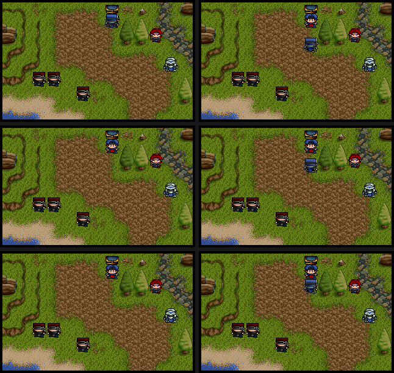

# 99 — 移動確認瞬間的游標與鏡頭（2026-09-09）

使用者回報第 8 項：「戰場上人物被點選後移動時，在移動到地點之前有一段快速
順移動畫殘影，然後人物才移動。」本輪把原版與重製端在確認瞬間的狀態序列都
量到毫秒級，找出兩處明確不一致，但**沒有從狀態層重現那個視覺現象**。

## 收據來源

原版執行器為 dosgolem `apps/fd2/cmd/oracle`（commit `3179a8d`），由
[`tools/dosgolem_oracle.sh`](../../tools/dosgolem_oracle.sh) 驅動。固定
`FD2.EXE`：357074 位元組，MD5 `b97caf2239a27a896069d03549d96e1e`，
SHA-256 `222b7d067ad4450eb9c5f6e6bce1797d54bb050417ba39ced6067f8039f28c4f`。
逐點軌跡見
[fd2-move-confirm-cursor-20260909.json](../data/ui-traces/fd2-move-confirm-cursor-20260909.json)。

入口是標題選單 `right,down,down,enter` 後由隨遊戲附帶的 `FD2.SAV` 進入第一關，
把 index 2 的我方單位從 (8,16) 往上移到 (8,14)。取樣粒度是每格 5 千指令
（虛擬 5 毫秒），遠短於原版一幀，足以分辨「瞬間跳」與「逐幀滑動」。

## 原版在確認那一刻做什麼

| 取樣 | 游標 | 鏡頭 | 單位 index 2 |
|---|---|---|---|
| cp0012（確認前） | (8,14) | (1,13) | (8,16) pose 0 motion 0 |
| cp0071（確認後） | **(8,16)** | (1,13) | (8,16) pose 2 motion 1 |
| cp0228 | (8,15) | (1,13) | (8,15) pose 2 motion 1 |

三項結論：

- **游標由終點回到單位所在格**。走的是 `0x18A26 → 0x12CEA`：先 X 後 Y 逐格移動，
  每一格都呼叫鍵盤游標處理器。本輪的取樣落在控制序列邊界，中間那一格剛好沒被
  抓到（見 [doc108 §2](108-terrain-cost-and-move-confirm-20260911.md)）。
- **整段移動期間鏡頭完全不動**。
- 游標接著逐格跟著單位走：單位提交 (8,15) 的同一格取樣，游標也變成 (8,15)。

cp0071 的 cursor 是 (8,16)、camera 是 (1,13)，`visible` 是 (7,2) 而不是 (7,3)：
那是取樣落在走行步進中途。`0x13185` 在函式開頭扣可見游標（`0x13205`）、在結尾
才扣游標（`0x1330A`），中間隔著六張動畫幀。把那一格算回去，`visible` 與
`cursor − camera` 仍然相等——三組全域的每個執行期寫入端都成對搬動。寫入端與
完整推導見 [doc108 §2](108-terrain-cost-and-move-confirm-20260911.md)。

## 畫面上看到什麼

狀態層看不出「多畫了什麼」，所以同一段也用逐幀擷取取了一次（取樣 2000 指令、
穩定閘門 4，見 [96](96-parity-toolchain-20260909.md) 的逐幀擷取一節）。移動
視窗共 15 張，間隔約 13 萬指令，正好對上每格六個 `motion` 加抵達：

| 幀 | 內容 |
|---|---|
| 0–1（確認前） | 終點有白色游標框，左下有 `A-05 D+10` 的 HUD 面板 |
| 2–13（走行中） | **白框與 HUD 面板都不見了**，只有單位逐格移動 |
| 14（抵達） | 仍然沒有白框與面板 |

也就是說，原版在整段移動動畫期間**不畫游標白框，也不畫左下 HUD 面板**。
`cursor` 全域確實跟著單位走，但那個值在這段期間沒有被畫出來。

## 重製端的同一段

以完整戰役路徑跑到第一關，選同一個單位、走兩格，逐幀記錄：

- 走行本身與原版一致：每格七拍、raw `+3` 是移動方向、`+4` 由 1 數到 6，
  抵達時兩者回到 0。位移 `OffX`／`OffY` 連續，沒有跳格。
- **游標全程停在終點**，既不回到單位，也不跟著單位走；原生整幀在整段移動
  期間都成立（`nativeMapFrameAdmission` 全程為真），所以畫面上這個位置畫的是
  原生整幀自己的內容。
- 跨格那一幀會多發佈一次 `motion = 0`：單位剛好落在新格、姿態仍是上一段的
  方向、`+4` 為 0，下一幀才開始新一段的 `motion = 1`。原版的軌跡在 5 毫秒
  粒度下沒有出現過移動中的 `motion = 0`。

## 逐幀對照

重製端也用生產端的 `composeNativeMapFrame` 落地同格式的 320×200 索引畫面
（`TestDumpChapterOneMoveFrames`，需要 `FD2_FRAME_DUMP`）。同一段移動兩側逐張
比對，收據見
[fd2-move-frame-compare-20260909.json](../data/ui-traces/fd2-move-frame-compare-20260909.json)：

| | 確認前 | 走行中 |
|---|---|---|
| 原版 | 終點有游標白框，左下有 HUD 面板 | **兩者都不畫** |
| 重製端 | 終點有游標白框，左下有 HUD 面板 | **兩者都還在** |

所以重製端在整段移動動畫期間，把一個白框留在終點——人物還沒走到，終點已經
有東西。

**這個差異在狀態層看不出來。** 原版的 overlay selector `[0x51A83]` 整段維持
1，重製端的 `NativeMapRangeMode` 也是 1；兩側狀態相同，畫面不同。原因是原版
的移動動畫走的是另一條繪圖路徑——以 `0x11CAC` 為邊界取樣時，最後一張停在
189650367，而移動一直跑到 191400000 之後——那條路徑不呼叫 `0x122DC`，所以
selector 的值再怎麼對，白框也不會被畫出來。

## 走行時到底是誰在畫

oracle 的 `-eip-watch` 對幾個繪圖位址計次，每一幀記錄累計值。逐幀差值：

| 位址 | 角色 | 確認前每幀 | 走行中每幀 |
|---|---|---|---|
| `0x11CAC` | 整幀排程 | 1 | **0** |
| `0x122DC` | 範圍／游標圖示 | 1 | **0** |
| `0x1AD72` | HUD 組裝 | 1 | **0** |
| `0x11EEE` | 地形 | 1 | 1 |
| `0x127E0` | 單位繪製公式 | 11 | 11 |
| `0x127A9` | 前景 | 1 | 1 |

`0x13185`（往上一格的 step）在兩個格界各進入一次，`0x13488`（路徑走位原語）
在確認那一幀進入一次。

所以**走行重繪是獨立的一條路徑，層集合是地形＋單位＋前景**——不是整幀排程
關掉幾層，而是根本沒有經過它。這也解釋了為什麼 selector 是 1 卻沒有白框：
畫白框的 `0x122DC` 只掛在整幀排程底下。

## 重製端的修正

`indexedmap` 多一個 `ComposeNativeStepFrame`：地形 → 單位 → 前景 → 312×192
視窗複製，沒有範圍層也沒有 HUD。`composeNativeMapFrameAt` 在 `g.walk != nil`
時改用它。回歸 `TestComposeNativeStepFrameOmitsRangeAndHUD` 對 range mode
0／1／3／5 各驗一次：走行重繪的結果必須等於「range mode 0 ＋ 空 HUD」的整幀
排程，與輸入的 RangeMode 無關。

重跑重製端的逐幀擷取，走行中的畫面已經沒有游標白框與左下 HUD 面板。

視窗複製與章節輔助表面沒有單獨量到位址，沿用整幀排程的作法：走行期間畫面
確實在更新，所以複製一定發生。

## 這對引擎形狀的意思

原版的地圖重繪不是一個函式，而是**依當下在做什麼挑不同的層集合**：

| 路徑 | 層集合 |
|---|---|
| `0x11CAC` 一般重繪 | 章節輔助＋地形＋範圍／游標＋單位＋前景＋HUD＋視窗複製 |
| step 家族走行重繪 | 地形＋單位＋前景＋視窗複製 |
| `0x24618` 轉場 | 地形＋LUT＋單位／前景＋LUT＋矩形 LUT＋視窗複製 |

層的原語與順序是共用的，重製端本來就把它們拆成獨立的 blit，這個形狀是對的；
`ComposeNativeTransitionFrame` 也早就是第二個組幀入口。錯的是**少了一個組幀
入口**，於是走行時借用了一般重繪。這是缺一條路徑，不是架構選錯。

同樣的形狀預期也適用於第 7 項：對話出現時原版八成也是換一條重繪路徑，而不是
在同一條裡加減層。那一項可以用同一套 `-eip-watch` 直接問。

## 跨格那一幀

原版跨格時 raw 座標換成新格、`+4` 同一幀就重設為 1，中間沒有 `+4 = 0`；只有
整段抵達才是 pose 0／`+4` 0。收據
[fd2-map-walk-pose-20260909.json](../data/ui-traces/fd2-map-walk-pose-20260909.json)
的 10 萬指令取樣把兩格都拍全了：

| 取樣 | raw (x,y) | pose | `+4` |
|---|---|---|---|
| 15–22 | (8,16) | 2 | 1,1,2,3,4,4,5,6 |
| 23–30 | **(8,15)** | 2 | **1**,1,2,3,4,4,5,6 |
| 31 起 | **(8,14)** | **0** | **0** |

所以每格是六幀，24 px 的格子等於每幀 4 px，跨格提交與下一段的第一拍同幀。
`stepBattleWalk` 現在照這個契約走：`nativeMapGridMotionFrames = 6`，位移分母
改為 6，第七次呼叫提交新格之後在同一幀直接接上下一段的第一拍。

## 順帶抓到的一個位移錯誤

同一條線往下對，`fdicon.NativePlacementOffset` 的上下方向位移寫成
`NativeSize * NativeMapStride`（24×456 = 0x2AC0），但已閉合的 byte equation 是

```
0x75d8 + (Y-cameraY)*24*0x1c8 + (X-cameraX)*24 + unit[+4]*d
d = +0x720 / -4 / -0x720 / +4   （pose 下／左／上／右）
```

`0x720` 是 456-byte stride 的**四列**，也就是每拍四像素；左右那兩個 `±4` 是
同一件事的水平版本。寫成一整格的高度會讓垂直移動每拍跳一整格，六拍走六格。
出處：`SESSION-HANDOFF-2026-07-06.md` 的 2026-07-26 FDICON placement closure、
[47](47-intro-handler-full-transcript.md) 的方向表、[91](91-worklist.md) 的
FDICON native placement primitive 條目，三處數值一致。

四像素乘六拍剛好一格，與上一節量到的每格六幀互相印證。回歸
`TestNativePlacementOffsetMatches127E0` 改用原始數值 `0x720` 釘死，不再複述
實作那條算式。

## 修正後的重製端逐幀

同一段移動（單位由 (8,16) 先左一格再上一格到 (7,15)）用
`TestDumpChapterOneMoveFrames` 重跑，raw 序列與原版一致：seg 0 的 `+4` 走
1..6，接著同一幀就是 (7,16) pose 2 `+4` = 1，最後 (7,15) pose 0 `+4` 0。
移動畫面 13 張，與原版逐幀擷取數到的 13 張相同。



左欄修正前、右欄修正後，由上而下是 `+4` = 2／4／6。修正前單位被畫到自己格子
上方 2／4／6 格，整個離開可見範圍，抵達才回到終點格——看起來就是「順移」；
左右移動每拍只差 4 px，所以先前的橫向樣本看不出來。

收據見
[fd2-walk-frames-and-placement-20260909.json](../data/ui-traces/fd2-walk-frames-and-placement-20260909.json)。

## `visible` 游標：寫入端只有八處

`[0x53AB9]`／`[0x53ABD]` 的完整寫入端由 IDA 9.4 data xref 列出（第二套
Capstone 的 LE fixup 清單一致），證據檔
[fd2_visible_cursor_writers_ida.txt](../data/ida/fd2_visible_cursor_writers_ida.txt)：

| 家族 | 邊界 | 絕對游標 | 鏡頭 | 可見游標 |
|---|---|---|---|---|
| 鍵盤游標 上／下／右／左 | `0x11B48`／`0x11B9B`／`0x11BFA`／`0x11C59` | ±1 | ±1 或不動 | 不動 或 ±1 |
| 走行步進 下／左／上／右 | `0x12EAA`／`0x1300D`／`0x13185`／`0x13315` | ±1 | `add` 或不動 | 不動 或 ±1 |
| 劇情捲動 | `0x135DD` | ±1 | ±1 | **不寫**（與鏡頭同步，差值不變） |
| 沿線收集單位 | `0x149F8..0x14B16` | 暫設後**還原**（`0x14AFE`） | 不寫 | 不寫 |
| 章節重設 | `0x205DA`、`0x233C6`、`0x235F9`、`0x23E74`、`0x25757` | 設值 | 設值 | 歸零 |
| 開機初始化 | `0x10010..0x10620` | 設值 | 設值 | 設值 |

**沒有一處由 `cursor - camera` 重算**，但每一處都成對搬動，所以差值不變。
上面那個 (7,2) 是取樣落在走行步進中途：可見游標在函式開頭扣、游標在結尾扣。
確認移動走的是 `0x18A26 → 0x12CEA`（逐格呼叫鍵盤處理器），不是 `0x149F8`；
`0x149F8` 是沿直線收集單位、結尾還原游標的 helper。見
[doc108 §2](108-terrain-cost-and-move-confirm-20260911.md)。

安全帶規則兩個家族相同——上 `>= 2`、下 `<= 5`、左 `>= 2`、右 `<= 0x0A`，
超出就改捲鏡頭——但**判準的來源不同**：鍵盤處理器讀已存的可見游標
（`0x11B5B cmp dword_53ABD, 2`），走行步進算的是單位自己的相對列
（`0x131DE` 的 `unitY - [0x53AAD]`）。可見游標是舊值時兩者會不一樣。

消費端也確認了語意：`0x1741C` 在 `0x1743F..0x1746A` 用
`visible_x * 24 + visible_y * 24 * 0x1C8` 算指令環的畫面位址，也就是
「視窗內的格座標」。

### 重製端接線

- `validateNativeMapView` 不再強制 `visible == cursor - camera`，改成檢查
  13×8 視窗界線。強制恆等式會讓原版真的走得到的狀態表達不出來。
- 新增 `FocusNativeMapCursor`（`0x12CEA`：先 X 後 Y 逐格走鍵盤處理器）與
  `AdvanceNativeMapWalkStepView`（走行步進在格邊界的效果，判準是單位相對列）。
- 確認移動時游標逐格回到單位所在格；走行每提交一格，視圖跟著走一格。
- 回歸 `TestFocusNativeMapCursorStepsThroughKeyboardHandlers`、
  `TestFocusNativeMapCursorScrollsCameraAtSafeBand`、
  `TestAdvanceNativeMapWalkStepViewUsesUnitRelativeBand`、
  `TestNativeMapViewKeepsVisibleCursorPairedWithCamera`。

## 劇情走位的每格幀數

`0x13185` 的迴圈直接給出答案：計數器在 `0x1320B` 設成 1，條件在 `0x13274`
是 `cmp [esp], 7 ; jge 離開`，遞增在迴圈尾端 `0x13271`，所以主體跑 1..6，
`unit+4` 也寫 1..6；單位座標、絕對游標與鏡頭在 `0x132F5` 之後才提交。

劇情走位（beat `scroll_step`）呼叫的就是同一支 `0x13185`，所以每格同樣是
六幀。`handler_compile.go` 的幀預算由 `repeat * 7` 改成
`repeat * nativeGridStepFrames`（6）。

## 尚未涵蓋

- 走行重繪的進入點位址本身。只證明它不經過 `0x11CAC`，並量出它實際呼叫的
  三個繪圖層。
- 抵達之後何時交還 `0x11CAC`。取樣視窗內原版一直沒有再進入它。
- 兩側逐像素比對。這一輪比的是「有沒有畫」、raw 序列與單位位置。
- `0x53B0B`／`0x53AF1`／`0x53AF5` 在走行步進裡的角色。只確認它們與捲動有關，
  沒有解出語意，也沒有接進重製端。
- 節點常數該不該同時涵蓋 START 與 CONTINUE 兩條入口的視圖，見
  [104](104-regression-baseline-review-20260909.md)。
